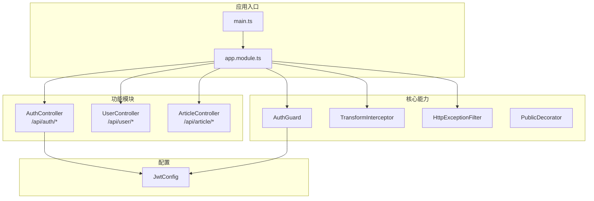
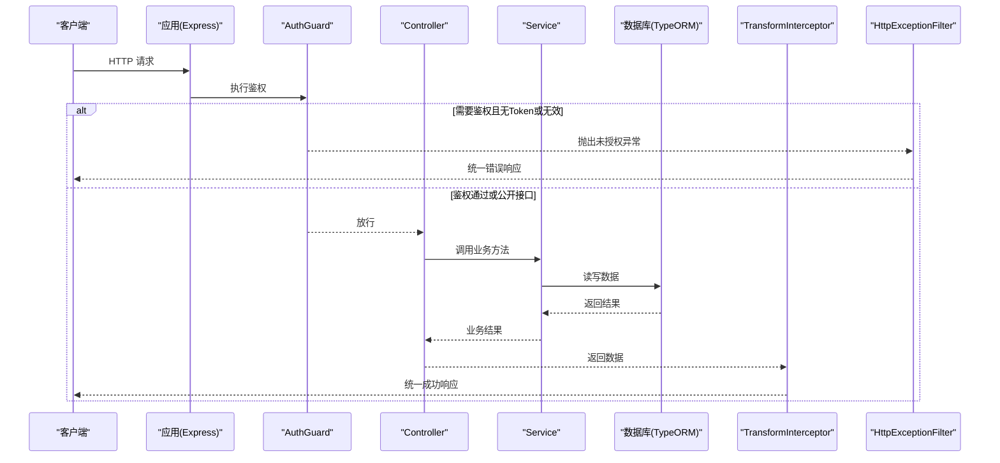
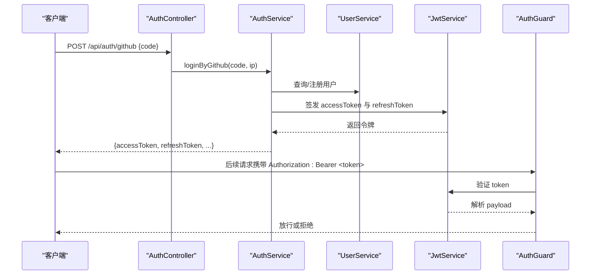
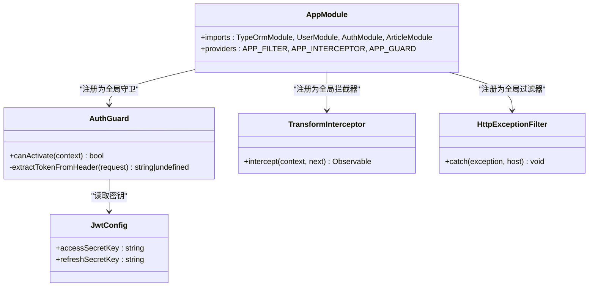

# API 接口参考

<cite>
**本文引用的文件**   
- [main.ts](file://src/main.ts)
- [app.module.ts](file://src/app.module.ts)
- [auth.controller.ts](file://src/api/auth/auth.controller.ts)
- [auth.service.ts](file://src/api/auth/auth.service.ts)
- [user.controller.ts](file://src/api/user/user.controller.ts)
- [user.service.ts](file://src/api/user/user.service.ts)
- [article.controller.ts](file://src/api/article/article.controller.ts)
- [article.service.ts](file://src/api/article/article.service.ts)
- [auth.dto.ts](file://src/api/auth/dto/auth.dto.ts)
- [user.dto.ts](file://src/api/user/dto/user.dto.ts)
- [article.dto.ts](file://src/api/article/dto/article.dto.ts)
- [pagination.dto.ts](file://src/common/dto/pagination.dto.ts)
- [auth.guard.ts](file://src/core/guard/auth.guard.ts)
- [public.decorator.ts](file://src/core/guard/public.decorator.ts)
- [http-exception.filter.ts](file://src/core/filter/http-exception.filter.ts)
- [transform.interceptor.ts](file://src/core/interceptor/transform.interceptor.ts)
- [jwt.config.ts](file://src/config/jwt.config.ts)
</cite>

## 目录
1. [简介](#简介)
2. [项目结构](#项目结构)
3. [核心组件](#核心组件)
4. [架构总览](#架构总览)
5. [详细接口说明](#详细接口说明)
6. [依赖分析](#依赖分析)
7. [性能考虑](#性能考虑)
8. [故障排查指南](#故障排查指南)
9. [结论](#结论)
10. [附录](#附录)

## 简介
本文件为博客系统的 RESTful API 接口参考，覆盖以下模块：
- 用户管理接口：/api/user/*
- 认证授权接口：/api/auth/*
- 文章管理接口：/api/article/*

同时包含：
- JWT 认证机制说明（获取、刷新、传递）
- 请求与响应示例（成功与错误）
- 统一响应格式与错误码规范
- Swagger 文档使用与在线调试方法

## 项目结构
系统基于 NestJS 构建，采用模块化分层组织：
- 控制器层：定义路由与参数绑定
- 服务层：业务逻辑与数据访问
- DTO：请求体校验与类型转换
- 全局拦截器与过滤器：统一响应包装与异常处理
- 认证守卫：JWT 鉴权与公开接口豁免
- 配置：数据库、JWT 密钥等

图表来源
- [main.ts:1-46](file://src/main.ts#L1-L46)
- [app.module.ts:1-35](file://src/app.module.ts#L1-L35)
- [auth.controller.ts:1-29](file://src/api/auth/auth.controller.ts#L1-L29)
- [user.controller.ts:1-28](file://src/api/user/user.controller.ts#L1-L28)
- [article.controller.ts:1-51](file://src/api/article/article.controller.ts#L1-L51)
- [auth.guard.ts:1-53](file://src/core/guard/auth.guard.ts#L1-L53)
- [transform.interceptor.ts:1-24](file://src/core/interceptor/transform.interceptor.ts#L1-L24)
- [http-exception.filter.ts:1-37](file://src/core/filter/http-exception.filter.ts#L1-L37)
- [jwt.config.ts:1-5](file://src/config/jwt.config.ts#L1-L5)

章节来源
- [main.ts:1-46](file://src/main.ts#L1-L46)
- [app.module.ts:1-35](file://src/app.module.ts#L1-L35)

## 核心组件
- 统一响应包装：所有成功响应被 TransformInterceptor 包装为 { code, data, message }。
- 全局异常过滤：HttpExceptionFilter 将 HttpException 转换为统一 JSON 结构，便于前端处理。
- 认证守卫：AuthGuard 默认要求 Bearer Token；通过 Public 装饰器的接口可跳过鉴权。
- 分页 DTO：PaginationDto 提供 page、pageSize 的通用校验与默认值。

章节来源
- [transform.interceptor.ts:1-24](file://src/core/interceptor/transform.interceptor.ts#L1-L24)
- [http-exception.filter.ts:1-37](file://src/core/filter/http-exception.filter.ts#L1-L37)
- [auth.guard.ts:1-53](file://src/core/guard/auth.guard.ts#L1-L53)
- [pagination.dto.ts:1-17](file://src/common/dto/pagination.dto.ts#L1-L17)

## 架构总览
下图展示了典型请求在系统中的流转路径，包括鉴权、校验、业务处理与响应包装。

图表来源
- [auth.guard.ts:1-53](file://src/core/guard/auth.guard.ts#L1-L53)
- [transform.interceptor.ts:1-24](file://src/core/interceptor/transform.interceptor.ts#L1-L24)
- [http-exception.filter.ts:1-37](file://src/core/filter/http-exception.filter.ts#L1-L37)

## 详细接口说明

### 通用约定
- 基础路径
  - 用户：/api/user
  - 认证：/api/auth
  - 文章：/api/article
- 请求头
  - 认证接口：无需额外头
  - 受保护接口：Authorization: Bearer <token>
- 统一响应结构
  - 成功：{ code: 200, data: ..., message: "success" }
  - 异常：{ code: 状态码, message: 错误信息, data: 请求详情 }
- 分页参数
  - page: 页码，默认 1，最小 1
  - pageSize: 每页条数，默认 20，最小 1

章节来源
- [transform.interceptor.ts:1-24](file://src/core/interceptor/transform.interceptor.ts#L1-L24)
- [http-exception.filter.ts:1-37](file://src/core/filter/http-exception.filter.ts#L1-L37)
- [pagination.dto.ts:1-17](file://src/common/dto/pagination.dto.ts#L1-L17)

### 认证授权 /api/auth/*

#### POST /api/auth/github
- 描述：第三方 GitHub 登录，成功后返回 accessToken 与 refreshToken
- 鉴权：无需（公开接口）
- 请求头：Content-Type: application/json
- 请求体
  - code: string，必填
- 响应体
  - avatar: string
  - username: string
  - accessToken: string
  - refreshToken: string
- 错误响应
  - 当缺少 code 或第三方服务异常时，返回统一错误结构

章节来源
- [auth.controller.ts:1-29](file://src/api/auth/auth.controller.ts#L1-29)
- [auth.service.ts:1-123](file://src/api/auth/auth.service.ts#L1-123)

#### GET /api/auth/refresh
- 描述：刷新令牌，根据当前已登录用户上下文生成新的 accessToken 与 refreshToken
- 鉴权：需要（Bearer Token），但使用 refreshSecretKey 验证
- 请求头：Authorization: Bearer <refreshToken>
- 响应体
  - accessToken: string
  - refreshToken: string
- 错误响应
  - 未携带或无效 Token 时返回未授权错误

章节来源
- [auth.controller.ts:1-29](file://src/api/auth/auth.controller.ts#L1-29)
- [auth.service.ts:1-123](file://src/api/auth/auth.service.ts#L1-123)
- [auth.guard.ts:1-53](file://src/core/guard/auth.guard.ts#L1-L53)
- [jwt.config.ts:1-5](file://src/config/jwt.config.ts#L1-L5)

### 用户管理 /api/user/*

#### GET /api/user
- 描述：分页查询用户列表
- 鉴权：需要（Bearer Token）
- 查询参数
  - page: number，默认 1
  - pageSize: number，默认 20
  - username: string，可选，模糊匹配
  - email: string，可选，模糊匹配
- 响应体
  - userList: User[]
  - total: number
- 错误响应
  - 鉴权失败或参数校验失败时返回统一错误结构

章节来源
- [user.controller.ts:1-28](file://src/api/user/user.controller.ts#L1-28)
- [user.service.ts:1-66](file://src/api/user/user.service.ts#L1-66)
- [user.dto.ts:1-75](file://src/api/user/dto/user.dto.ts#L1-75)
- [pagination.dto.ts:1-17](file://src/common/dto/pagination.dto.ts#L1-L17)

#### PUT /api/user
- 描述：更新用户信息
- 鉴权：需要（Bearer Token）
- 请求体
  - id: string，必填
  - username: string，必填，最大长度 25
  - role: number，必填
  - avatar: string，必填，最大长度 255
  - ip: string，必填
  - ipAddress: string，必填
  - githubId: string，可选
  - email: string，必填，邮箱格式，最大长度 45
- 响应体
  - 成功：{ code: 200, data: null, message: "success" }
- 错误响应
  - 用户不存在或参数校验失败时返回统一错误结构

章节来源
- [user.controller.ts:1-28](file://src/api/user/user.controller.ts#L1-28)
- [user.service.ts:1-66](file://src/api/user/user.service.ts#L1-66)
- [user.dto.ts:1-75](file://src/api/user/dto/user.dto.ts#L1-75)

### 文章管理 /api/article/*

#### GET /api/article
- 描述：分页查询文章列表，支持按标题模糊搜索与状态筛选；若传入 id 则返回单篇文章及其标签
- 鉴权：无需（公开接口）
- 查询参数
  - page: number，默认 1
  - pageSize: number，默认 20
  - status: number，默认 0
  - title: string，默认空串
  - id: number，可选
- 响应体
  - 列表模式：{ articleList: Article[], total: number }
  - 单篇模式：Article 对象，并附带 tags 数组
- 错误响应
  - 参数校验失败时返回统一错误结构

章节来源
- [article.controller.ts:1-51](file://src/api/article/article.controller.ts#L1-51)
- [article.service.ts:1-103](file://src/api/article/article.service.ts#L1-L103)
- [article.dto.ts:1-63](file://src/api/article/dto/article.dto.ts#L1-L63)
- [pagination.dto.ts:1-17](file://src/common/dto/pagination.dto.ts#L1-L17)

#### POST /api/article
- 描述：创建文章
- 鉴权：需要（Bearer Token）
- 请求体
  - title: string，必填
  - description: string，必填
  - content: string，必填
  - tagIds: number[]，必填
  - isTop: number，可选
  - status: number，必填
- 响应体
  - 成功：{ code: 200, data: null, message: "success" }
- 错误响应
  - 参数校验失败时返回统一错误结构

章节来源
- [article.controller.ts:1-51](file://src/api/article/article.controller.ts#L1-51)
- [article.service.ts:1-103](file://src/api/article/article.service.ts#L1-L103)
- [article.dto.ts:1-63](file://src/api/article/dto/article.dto.ts#L1-L63)

#### PUT /api/article/status
- 描述：切换文章状态（草稿/发布）
- 鉴权：需要（Bearer Token）
- 请求体
  - id: number，必填
- 响应体
  - 成功：{ code: 200, data: null, message: "success" }
- 错误响应
  - 文章不存在或操作失败时返回统一错误结构

章节来源
- [article.controller.ts:1-51](file://src/api/article/article.controller.ts#L1-51)
- [article.service.ts:1-103](file://src/api/article/article.service.ts#L1-L103)
- [article.dto.ts:1-63](file://src/api/article/dto/article.dto.ts#L1-L63)

#### PUT /api/article
- 描述：更新文章
- 鉴权：需要（Bearer Token）
- 请求体
  - id: number，必填
  - title: string，必填
  - description: string，必填
  - content: string，必填
  - tagIds: number[]，必填
  - isTop: number，可选
  - status: number，必填
- 响应体
  - 成功：{ code: 200, data: null, message: "success" }
- 错误响应
  - 文章不存在或参数校验失败时返回统一错误结构

章节来源
- [article.controller.ts:1-51](file://src/api/article/article.controller.ts#L1-51)
- [article.service.ts:1-103](file://src/api/article/article.service.ts#L1-L103)
- [article.dto.ts:1-63](file://src/api/article/dto/article.dto.ts#L1-L63)

#### DELETE /api/article
- 描述：删除文章（软删除）
- 鉴权：需要（Bearer Token）
- 请求体
  - id: number，必填
- 响应体
  - 成功：{ code: 200, data: null, message: "success" }
- 错误响应
  - 删除失败时返回统一错误结构

章节来源
- [article.controller.ts:1-51](file://src/api/article/article.controller.ts#L1-51)
- [article.service.ts:1-103](file://src/api/article/article.service.ts#L1-L103)
- [article.dto.ts:1-63](file://src/api/article/dto/article.dto.ts#L1-L63)

### 认证流程时序图

图表来源
- [auth.controller.ts:1-29](file://src/api/auth/auth.controller.ts#L1-29)
- [auth.service.ts:1-123](file://src/api/auth/auth.service.ts#L1-123)
- [user.service.ts:1-66](file://src/api/user/user.service.ts#L1-66)
- [auth.guard.ts:1-53](file://src/core/guard/auth.guard.ts#L1-L53)

## 依赖分析
- 模块装配
  - AppModule 注册 TypeORM、各业务模块，并注入全局过滤器、拦截器与守卫
- 鉴权链路
  - 全局 AuthGuard 对所有 Controller 生效，除非使用 Public 装饰器标记为公开
  - 对 /auth/refresh 使用 refreshSecretKey 进行验证，其余接口使用 accessSecretKey
- 响应与异常
  - TransformInterceptor 统一包装成功响应
  - HttpExceptionFilter 统一捕获并格式化异常响应

图表来源
- [app.module.ts:1-35](file://src/app.module.ts#L1-L35)
- [auth.guard.ts:1-53](file://src/core/guard/auth.guard.ts#L1-L53)
- [transform.interceptor.ts:1-24](file://src/core/interceptor/transform.interceptor.ts#L1-L24)
- [http-exception.filter.ts:1-37](file://src/core/filter/http-exception.filter.ts#L1-L37)
- [jwt.config.ts:1-5](file://src/config/jwt.config.ts#L1-L5)

章节来源
- [app.module.ts:1-35](file://src/app.module.ts#L1-L35)
- [auth.guard.ts:1-53](file://src/core/guard/auth.guard.ts#L1-L53)
- [transform.interceptor.ts:1-24](file://src/core/interceptor/transform.interceptor.ts#L1-L24)
- [http-exception.filter.ts:1-37](file://src/core/filter/http-exception.filter.ts#L1-L37)
- [jwt.config.ts:1-5](file://src/config/jwt.config.ts#L1-L5)

## 性能考虑
- 分页查询：使用 skip/take 控制数据量，避免一次性加载过多记录
- 模糊查询：title、username、email 使用 LIKE 前缀匹配，注意索引策略
- 批量关联：文章列表返回标签时，按需查询，避免 N+1 问题
- 缓存建议：热点文章与标签可引入缓存层降低数据库压力
- 连接池：合理配置 TypeORM 连接池大小以应对并发

[本节为通用指导，不直接分析具体文件]

## 故障排查指南
- 常见错误
  - 未携带或无效 Token：检查 Authorization 头是否为 Bearer 格式，确认是否过期
  - 参数校验失败：检查字段类型、长度、必填项是否符合 DTO 约束
  - 资源不存在：如文章或用户不存在，检查 ID 是否正确
- 定位步骤
  - 查看统一错误响应中的 message 与 data（包含请求详情）
  - 核对 Swagger 文档中对应接口的参数与示例
  - 开启服务端日志，结合请求 URL、方法与参数快速定位

章节来源
- [http-exception.filter.ts:1-37](file://src/core/filter/http-exception.filter.ts#L1-L37)
- [auth.guard.ts:1-53](file://src/core/guard/auth.guard.ts#L1-L53)

## 结论
本 API 参考覆盖了用户、认证与文章三大模块的核心接口，明确了鉴权方式、参数校验规则与统一响应格式。配合 Swagger 文档可快速上手联调。建议在集成过程中严格遵循统一响应与错误处理规范，以提升前后端协作效率。

[本节为总结性内容，不直接分析具体文件]

## 附录

### 统一响应与错误码
- 成功响应
  - code: 200
  - data: 业务数据或 null
  - message: "success"
- 异常响应
  - code: 原始 HTTP 状态码（400、401 等）
  - message: 错误信息
  - data: 请求详情（query、body、params、method、url）

章节来源
- [transform.interceptor.ts:1-24](file://src/core/interceptor/transform.interceptor.ts#L1-L24)
- [http-exception.filter.ts:1-37](file://src/core/filter/http-exception.filter.ts#L1-L37)

### Swagger 文档使用与在线调试
- 文档地址：/api-docs
- 使用方法
  - 启动服务后访问 http://localhost:3001/api-docs
  - 在“认证”区域配置 Bearer Token，选择“Authorize”，输入 token 后点击“Authorize”
  - 在任意接口页面点击“Try it out”，填写参数并执行
- 注意事项
  - 受保护接口需先通过 /api/auth/github 获取令牌，或在已有会话下使用 /api/auth/refresh 刷新令牌
  - 公共接口（如 /api/article、/api/auth/github）无需配置 Token

章节来源
- [main.ts:1-46](file://src/main.ts#L1-L46)
- [auth.controller.ts:1-29](file://src/api/auth/auth.controller.ts#L1-29)
- [article.controller.ts:1-51](file://src/api/article/article.controller.ts#L1-51)