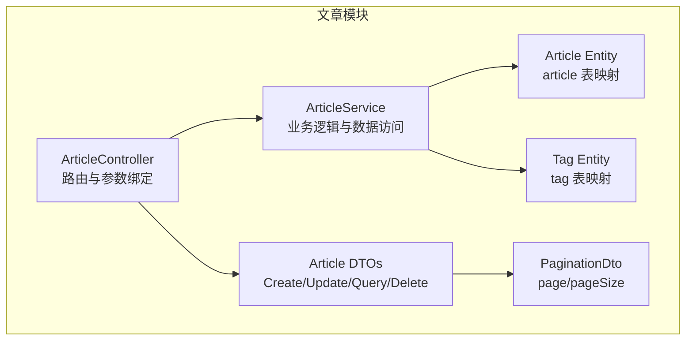
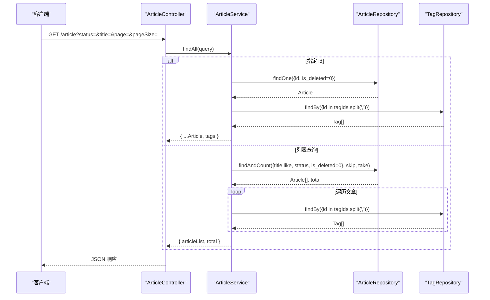
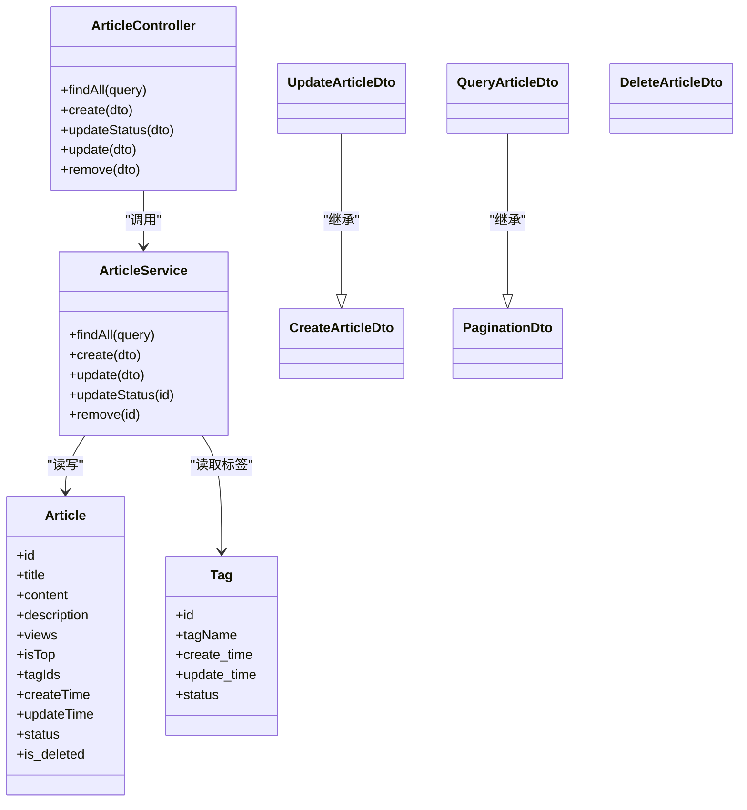

# 文章管理接口

<cite>
**本文引用的文件**
- [src/api/article/article.controller.ts](file://src/api/article/article.controller.ts)
- [src/api/article/article.service.ts](file://src/api/article/article.service.ts)
- [src/api/article/dto/article.dto.ts](file://src/api/article/dto/article.dto.ts)
- [src/api/article/entities/article.entity.ts](file://src/api/article/entities/article.entity.ts)
- [src/api/article/entities/tag.entity.ts](file://src/api/article/entities/tag.entity.ts)
- [src/common/dto/pagination.dto.ts](file://src/common/dto/pagination.dto.ts)
- [sql/init.sql](file://sql/init.sql)
</cite>

## 目录
1. [简介](#简介)
2. [项目结构](#项目结构)
3. [核心组件](#核心组件)
4. [架构总览](#架构总览)
5. [详细接口说明](#详细接口说明)
6. [依赖分析](#依赖分析)
7. [性能与扩展建议](#性能与扩展建议)
8. [故障排查指南](#故障排查指南)
9. [结论](#结论)

## 简介
本文件为“文章管理模块”的 API 接口文档，覆盖文章的创建、更新、删除、查询、状态切换以及标签关联等能力。文档基于现有控制器与服务实现进行整理，包含请求参数校验规则（ArticleDto）、响应数据结构（ArticleEntity、TagEntity）、状态管理机制（草稿/发布/下架）及分页查询方式。同时给出批量操作、条件查询、排序和分页的实现建议与注意事项。

## 项目结构
文章模块采用典型的 NestJS 分层结构：Controller 负责路由与入参解析，Service 负责业务逻辑与数据访问，DTO 负责请求体校验，Entity 映射数据库表结构。

图表来源
- [src/api/article/article.controller.ts:1-52](file://src/api/article/article.controller.ts#L1-L52)
- [src/api/article/article.service.ts:1-104](file://src/api/article/article.service.ts#L1-L104)
- [src/api/article/dto/article.dto.ts:1-64](file://src/api/article/dto/article.dto.ts#L1-L64)
- [src/api/article/entities/article.entity.ts:1-44](file://src/api/article/entities/article.entity.ts#L1-L44)
- [src/api/article/entities/tag.entity.ts:1-26](file://src/api/article/entities/tag.entity.ts#L1-L26)
- [src/common/dto/pagination.dto.ts:1-17](file://src/common/dto/pagination.dto.ts#L1-L17)

章节来源
- [src/api/article/article.controller.ts:1-52](file://src/api/article/article.controller.ts#L1-L52)
- [src/api/article/article.service.ts:1-104](file://src/api/article/article.service.ts#L1-L104)
- [src/api/article/dto/article.dto.ts:1-64](file://src/api/article/dto/article.dto.ts#L1-L64)
- [src/api/article/entities/article.entity.ts:1-44](file://src/api/article/entities/article.entity.ts#L1-L44)
- [src/api/article/entities/tag.entity.ts:1-26](file://src/api/article/entities/tag.entity.ts#L1-L26)
- [src/common/dto/pagination.dto.ts:1-17](file://src/common/dto/pagination.dto.ts#L1-L17)

## 核心组件
- 控制器层：定义 RESTful 路由，接收并校验请求参数，调用服务层处理业务。
- 服务层：封装文章与标签的数据访问逻辑，包括分页查询、软删除、状态切换、标签关联组装。
- DTO 层：使用 class-validator 对请求体进行强校验，确保字段类型、长度、必填等约束。
- 实体层：TypeORM 实体映射 article 与 tag 表结构，提供 ORM 操作基础。

章节来源
- [src/api/article/article.controller.ts:1-52](file://src/api/article/article.controller.ts#L1-L52)
- [src/api/article/article.service.ts:1-104](file://src/api/article/article.service.ts#L1-L104)
- [src/api/article/dto/article.dto.ts:1-64](file://src/api/article/dto/article.dto.ts#L1-L64)
- [src/api/article/entities/article.entity.ts:1-44](file://src/api/article/entities/article.entity.ts#L1-L44)
- [src/api/article/entities/tag.entity.ts:1-26](file://src/api/article/entities/tag.entity.ts#L1-L26)

## 架构总览
文章模块通过 TypeORM 访问 MySQL 数据库，文章与标签的关系以逗号分隔字符串存储于 article.tagIds 字段中，查询时再根据 tagIds 反查 tag 表返回 tags 列表。

图表来源
- [src/api/article/article.controller.ts:22-30](file://src/api/article/article.controller.ts#L22-L30)
- [src/api/article/article.service.ts:21-58](file://src/api/article/article.service.ts#L21-L58)

## 详细接口说明

### 通用约定
- 基础路径：/article
- 认证：除明确标注外，接口默认受鉴权守卫保护；其中列表查询接口标记为公开。
- 分页：统一使用 page、pageSize 参数，默认值分别为 1、20。
- 状态枚举：status 取值参考数据库注释（0-草稿，1-已发布，2-下架）。当前实现中状态切换在 0 与 1 之间翻转。
- 标签关联：tagIds 为数字数组，服务端将其拼接为逗号分隔字符串存储；查询时按 tagIds 反查 tag 表返回 tags 列表。

章节来源
- [src/api/article/article.controller.ts:22-30](file://src/api/article/article.controller.ts#L22-L30)
- [src/api/article/article.service.ts:21-58](file://src/api/article/article.service.ts#L21-L58)
- [sql/init.sql:74-76](file://sql/init.sql#L74-L76)

### 1) 获取文章列表或详情
- 方法：GET
- URL：/article
- 公开：是
- 查询参数（QueryArticleDto + PaginationDto）
  - id: number，可选。若传入则返回单篇文章详情并附带 tags。
  - title: string，可选，最大长度 45，模糊匹配。
  - status: number，可选，默认 0。
  - page: number，可选，最小 1，默认 1。
  - pageSize: number，可选，最小 1，默认 20。
- 成功响应
  - 当 id 存在：返回文章对象，并附加 tags 数组。
  - 否则：返回 { articleList: Article[], total: number }。
- 错误码
  - 400：参数校验失败或业务异常（如不存在）。

示例
- 列表查询
  - 请求：GET /article?status=0&title=Nest&page=1&pageSize=10
  - 响应：{ articleList: [...], total: 123 }
- 详情查询
  - 请求：GET /article?id=1
  - 响应：{ id, title, content, description, views, isTop, tagIds, createTime, updateTime, status, isDeleted, tags: [...] }

章节来源
- [src/api/article/article.controller.ts:26-30](file://src/api/article/article.controller.ts#L26-L30)
- [src/api/article/article.service.ts:21-58](file://src/api/article/article.service.ts#L21-L58)
- [src/api/article/dto/article.dto.ts:43-56](file://src/api/article/dto/article.dto.ts#L43-L56)
- [src/common/dto/pagination.dto.ts:4-16](file://src/common/dto/pagination.dto.ts#L4-L16)

### 2) 创建文章
- 方法：POST
- URL：/article
- 认证：需要
- 请求体（CreateArticleDto）
  - title: string，必填
  - description: string，必填
  - content: string，必填
  - tagIds: number[]，必填
  - isTop: number，可选
  - status: number，必填
- 成功响应：无内容（空体）
- 错误码
  - 400：参数校验失败或业务异常

示例
- 请求体
  - { "title": "NestJS 入门", "description": "快速上手指南", "content": "# 正文...", "tagIds": [1, 2], "isTop": 0, "status": 0 }
- 响应：空体（200）

章节来源
- [src/api/article/article.controller.ts:32-35](file://src/api/article/article.controller.ts#L32-L35)
- [src/api/article/article.service.ts:60-68](file://src/api/article/article.service.ts#L60-L68)
- [src/api/article/dto/article.dto.ts:12-36](file://src/api/article/dto/article.dto.ts#L12-L36)

### 3) 更新文章
- 方法：PUT
- URL：/article
- 认证：需要
- 请求体（UpdateArticleDto）
  - id: number，必填
  - 其余字段同 CreateArticleDto（均为可选，未传不覆盖）
- 成功响应：无内容（空体）
- 错误码
  - 400：文章不存在或参数校验失败

示例
- 请求体
  - { "id": 1, "title": "更新后的标题", "tagIds": [1, 3] }
- 响应：空体（200）

章节来源
- [src/api/article/article.controller.ts:42-45](file://src/api/article/article.controller.ts#L42-L45)
- [src/api/article/article.service.ts:70-82](file://src/api/article/article.service.ts#L70-L82)
- [src/api/article/dto/article.dto.ts:38-42](file://src/api/article/dto/article.dto.ts#L38-L42)

### 4) 切换文章状态
- 方法：PUT
- URL：/article/status
- 认证：需要
- 请求体（DeleteArticleDto）
  - id: number，必填
- 行为：将 status 在 0 与 1 之间翻转（当前实现）
- 成功响应：无内容（空体）
- 错误码
  - 400：文章不存在

示例
- 请求体
  - { "id": 1 }
- 响应：空体（200）

章节来源
- [src/api/article/article.controller.ts:37-40](file://src/api/article/article.controller.ts#L37-L40)
- [src/api/article/article.service.ts:84-94](file://src/api/article/article.service.ts#L84-L94)
- [src/api/article/dto/article.dto.ts:58-63](file://src/api/article/dto/article.dto.ts#L58-L63)

### 5) 删除文章（软删除）
- 方法：DELETE
- URL：/article
- 认证：需要
- 请求体（DeleteArticleDto）
  - id: number，必填
- 行为：将 is_deleted 置为 1
- 成功响应：无内容（空体）
- 错误码
  - 400：删除失败（受影响行数为 0）

示例
- 请求体
  - { "id": 1 }
- 响应：空体（200）

章节来源
- [src/api/article/article.controller.ts:47-50](file://src/api/article/article.controller.ts#L47-L50)
- [src/api/article/article.service.ts:96-102](file://src/api/article/article.service.ts#L96-L102)
- [src/api/article/dto/article.dto.ts:58-63](file://src/api/article/dto/article.dto.ts#L58-L63)

### 6) 标签系统
- 数据模型
  - TagEntity：包含 id、tagName、create_time、update_time、status。
- 关联关系
  - 文章与标签为多对多关系，但当前实现以逗号分隔字符串存储在 article.tagIds 字段中。
  - 查询文章时会按 tagIds 反查 tag 表，返回 tags 列表。
- 注意
  - 当前模块未提供独立的标签增删改查接口。如需完善，可在后续新增标签管理端点。

章节来源
- [src/api/article/entities/tag.entity.ts:1-26](file://src/api/article/entities/tag.entity.ts#L1-L26)
- [src/api/article/article.service.ts:27-33](file://src/api/article/article.service.ts#L27-L33)
- [src/api/article/article.service.ts:48-54](file://src/api/article/article.service.ts#L48-L54)

### 7) 数据模型与字段说明

#### ArticleEntity（文章实体）
- 字段
  - id: number（自增主键）
  - title: string
  - content: string
  - description: string
  - views: number
  - isTop: number（是否置顶）
  - tagIds: string（逗号分隔的标签 ID 集合）
  - createTime: Date
  - updateTime: Date
  - status: number（0-草稿，1-已发布，2-下架）
  - is_deleted: number（软删除标志）

章节来源
- [src/api/article/entities/article.entity.ts:1-44](file://src/api/article/entities/article.entity.ts#L1-L44)
- [sql/init.sql:64-92](file://sql/init.sql#L64-L92)

#### TagEntity（标签实体）
- 字段
  - id: number（自增主键）
  - tagName: string
  - create_time: Date
  - update_time: Date
  - status: string（当前实体定义为 string，数据库脚本为 TINYINT）

章节来源
- [src/api/article/entities/tag.entity.ts:1-26](file://src/api/article/entities/tag.entity.ts#L1-L26)
- [sql/init.sql:98-108](file://sql/init.sql#L98-L108)

#### 请求体校验（ArticleDto）
- CreateArticleDto
  - 必填：title、description、content、tagIds、status
  - 可选：isTop
- UpdateArticleDto
  - 继承 CreateArticleDto，并增加必填 id
- QueryArticleDto
  - 继承 PaginationDto，并支持 status、title、id 过滤
- DeleteArticleDto
  - 必填 id

章节来源
- [src/api/article/dto/article.dto.ts:12-63](file://src/api/article/dto/article.dto.ts#L12-L63)
- [src/common/dto/pagination.dto.ts:4-16](file://src/common/dto/pagination.dto.ts#L4-L16)

### 8) 状态管理机制
- 状态含义
  - 0：草稿
  - 1：已发布
  - 2：下架
- 当前实现
  - 切换接口会将 status 在 0 与 1 之间翻转，未涉及 2（下架）的处理。
- 建议
  - 若需支持“下架”，可新增专用状态切换接口或扩展当前接口的入参以显式设置目标状态。

章节来源
- [src/api/article/article.service.ts:84-94](file://src/api/article/article.service.ts#L84-L94)
- [sql/init.sql:74-76](file://sql/init.sql#L74-L76)

### 9) 批量操作、条件查询、排序与分页
- 批量操作
  - 当前未提供批量创建/更新/删除接口。可通过多次调用单个接口实现，或在服务层新增批量方法。
- 条件查询
  - 支持按 status、title（模糊）、id（精确）过滤。
- 排序
  - 当前未实现排序参数。可在 QueryArticleDto 中新增排序字段并在服务层构建 order by。
- 分页
  - 使用 page、pageSize 控制分页，默认值分别为 1、20。

章节来源
- [src/api/article/article.service.ts:21-58](file://src/api/article/article.service.ts#L21-L58)
- [src/api/article/dto/article.dto.ts:43-56](file://src/api/article/dto/article.dto.ts#L43-L56)
- [src/common/dto/pagination.dto.ts:4-16](file://src/common/dto/pagination.dto.ts#L4-L16)

### 10) 文件上传、内容格式化、SEO 优化
- 文件上传
  - 当前文章接口未包含文件上传端点。可在 Controller 中引入文件上传中间件或服务，并将文件 URL 写入文章实体相关字段。
- 内容格式化
  - 数据库设计支持 Markdown 内容（LONGTEXT），可在服务层或前端渲染阶段进行 Markdown 转 HTML。
- SEO 优化
  - 可在文章实体中新增 seoTitle、seoDescription、seoKeywords 等字段，并在创建/更新接口中支持这些字段的输入与输出。

[本节为概念性建议，不涉及具体代码文件]

## 依赖分析
- 控制器依赖服务层完成业务处理。
- 服务层依赖 TypeORM Repository 访问 article 与 tag 表。
- DTO 依赖 class-validator 与 class-transformer 进行参数校验与类型转换。
- 分页能力由公共 PaginationDto 提供。

图表来源
- [src/api/article/article.controller.ts:1-52](file://src/api/article/article.controller.ts#L1-L52)
- [src/api/article/article.service.ts:1-104](file://src/api/article/article.service.ts#L1-L104)
- [src/api/article/entities/article.entity.ts:1-44](file://src/api/article/entities/article.entity.ts#L1-L44)
- [src/api/article/entities/tag.entity.ts:1-26](file://src/api/article/entities/tag.entity.ts#L1-L26)
- [src/api/article/dto/article.dto.ts:1-64](file://src/api/article/dto/article.dto.ts#L1-L64)
- [src/common/dto/pagination.dto.ts:1-17](file://src/common/dto/pagination.dto.ts#L1-L17)

章节来源
- [src/api/article/article.module.ts:1-14](file://src/api/article/article.module.ts#L1-L14)

## 性能与扩展建议
- 标签反查优化
  - 当前对每篇文章都会执行一次标签反查，建议在批量查询时使用 IN 聚合查询以减少 N+1 问题。
- 索引优化
  - 针对常用查询字段（status、title、is_top、create_time）建立索引已在数据库脚本中体现。
- 分页深度
  - 避免过深的分页（极大 page），必要时可使用游标分页或基于时间戳的分页策略。
- 缓存
  - 对热点文章列表或详情可引入缓存层（如 Redis）以提升吞吐。

[本节为通用建议，不涉及具体代码文件]

## 故障排查指南
- 400 参数校验失败
  - 检查请求体字段是否符合 DTO 校验规则（类型、长度、必填）。
- 400 文章不存在
  - 确认 id 是否存在且未被软删除。
- 400 删除失败
  - 检查受影响行数是否为 0，可能因 id 不存在或已被软删除。
- 标签为空
  - 确认 tagIds 中的标签是否存在于 tag 表。

章节来源
- [src/api/article/article.service.ts:70-82](file://src/api/article/article.service.ts#L70-L82)
- [src/api/article/article.service.ts:84-94](file://src/api/article/article.service.ts#L84-L94)
- [src/api/article/article.service.ts:96-102](file://src/api/article/article.service.ts#L96-L102)

## 结论
本文档基于现有代码梳理了文章管理的 RESTful 接口规范，涵盖 CRUD、状态切换、标签关联、分页与条件查询等核心能力。针对批量操作、排序、文件上传、SEO 等扩展点提供了实现建议。后续可根据业务需求进一步完善标签管理、状态机与查询能力，并对性能瓶颈进行针对性优化。