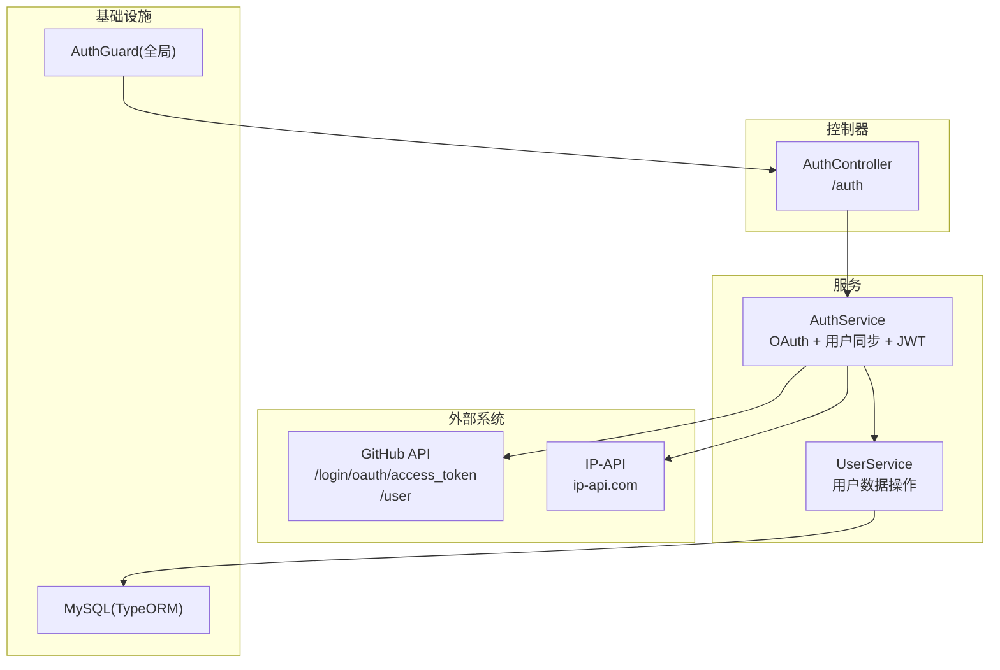
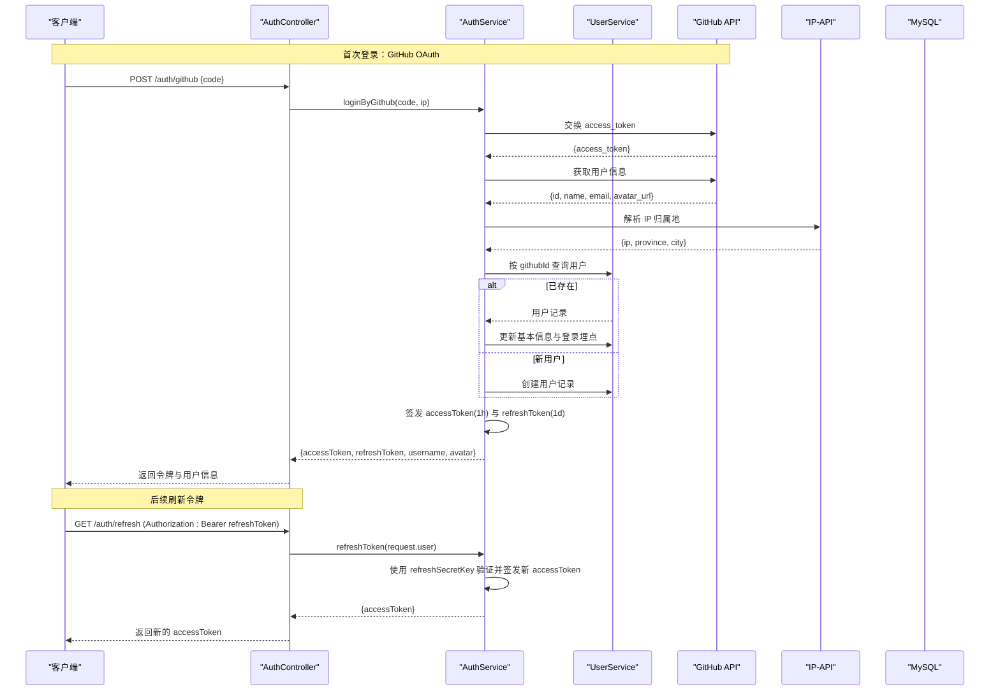
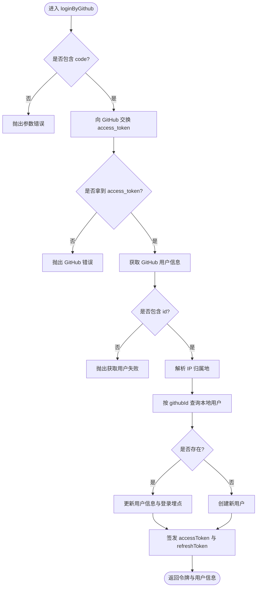
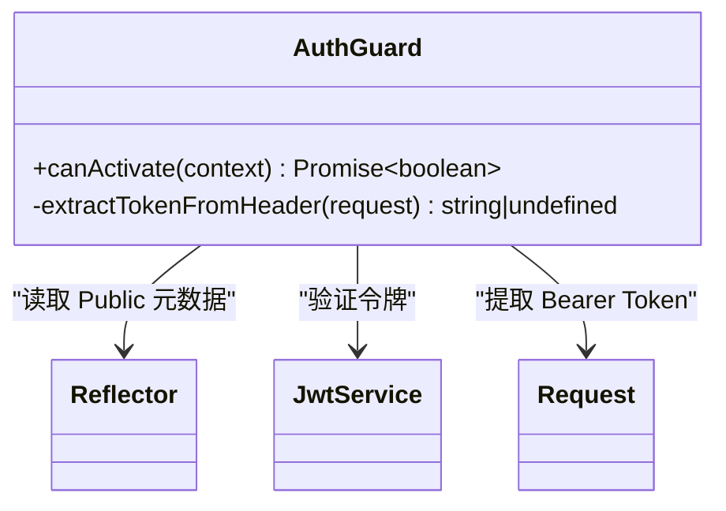
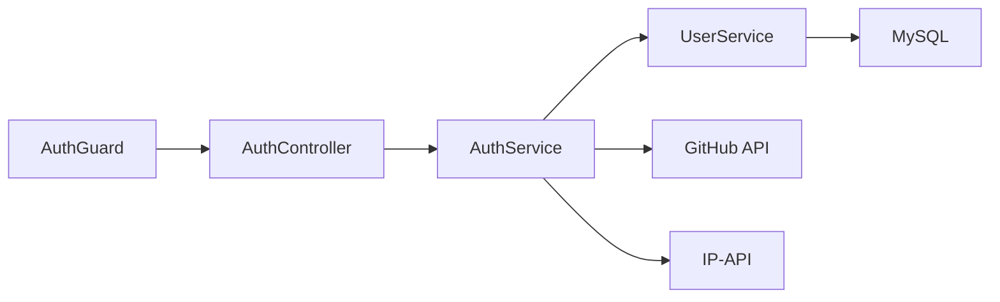

# 认证授权接口

<cite>
**本文引用的文件**   
- [auth.controller.ts](file://src/api/auth/auth.controller.ts)
- [auth.service.ts](file://src/api/auth/auth.service.ts)
- [auth.dto.ts](file://src/api/auth/dto/auth.dto.ts)
- [email-code.entity.ts](file://src/api/auth/entities/email-code.entity.ts)
- [user.service.ts](file://src/api/user/user.service.ts)
- [user.entity.ts](file://src/api/user/entities/user.entity.ts)
- [auth.guard.ts](file://src/core/guard/auth.guard.ts)
- [public.decorator.ts](file://src/core/guard/public.decorator.ts)
- [github.config.ts](file://src/config/github.config.ts)
- [jwt.config.ts](file://src/config/jwt.config.ts)
- [mysql.config.ts](file://src/config/mysql.config.ts)
- [ip-address.ts](file://src/utils/ip-address.ts)
- [app.module.ts](file://src/app.module.ts)
</cite>

## 目录
1. [简介](#简介)
2. [项目结构](#项目结构)
3. [核心组件](#核心组件)
4. [架构总览](#架构总览)
5. [详细组件分析](#详细组件分析)
6. [依赖关系分析](#依赖关系分析)
7. [性能与可用性考虑](#性能与可用性考虑)
8. [故障排查指南](#故障排查指南)
9. [结论](#结论)
10. [附录：API 规范与安全最佳实践](#附录api-规范与安全最佳实践)

## 简介
本文件为认证授权模块的完整 API 接口文档，覆盖以下能力：
- GitHub OAuth 第三方登录流程（授权码换取访问令牌、获取用户信息、本地用户同步、签发双令牌）
- JWT 双令牌机制（访问令牌与刷新令牌）的获取、传递、刷新与失效处理
- 认证守卫的使用方法与受保护资源的访问控制
- 请求/响应示例、错误码说明与安全最佳实践

## 项目结构
认证相关代码主要分布在以下位置：
- 控制器层：定义 RESTful 端点
- 服务层：实现业务逻辑（OAuth 交互、用户同步、JWT 签发）
- 守卫层：全局鉴权拦截器，基于 JWT 校验
- 配置层：GitHub 应用凭据、JWT 密钥、数据库连接等
- 工具层：IP 地址解析

图表来源
- [auth.controller.ts:14-28](file://src/api/auth/auth.controller.ts#L14-L28)
- [auth.service.ts:23-109](file://src/api/auth/auth.service.ts#L23-L109)
- [user.service.ts:14-64](file://src/api/user/user.service.ts#L14-L64)
- [auth.guard.ts:14-52](file://src/core/guard/auth.guard.ts#L14-L52)

章节来源
- [auth.controller.ts:14-28](file://src/api/auth/auth.controller.ts#L14-L28)
- [auth.service.ts:11-122](file://src/api/auth/auth.service.ts#L11-L122)
- [auth.guard.ts:14-52](file://src/core/guard/auth.guard.ts#L14-L52)
- [app.module.ts:11-34](file://src/app.module.ts#L11-L34)

## 核心组件
- AuthController：暴露 /auth 命名空间下的认证端点
- AuthService：封装 GitHub OAuth 登录、用户同步、JWT 双令牌生成与刷新
- AuthGuard：全局鉴权守卫，支持公共路由豁免与 Bearer Token 校验
- UserService：用户数据的查询、新增与登录埋点更新
- 配置与工具：GitHub 客户端凭据、JWT 密钥、IP 地址解析

章节来源
- [auth.controller.ts:14-28](file://src/api/auth/auth.controller.ts#L14-L28)
- [auth.service.ts:11-122](file://src/api/auth/auth.service.ts#L11-L122)
- [auth.guard.ts:14-52](file://src/core/guard/auth.guard.ts#L14-L52)
- [user.service.ts:14-64](file://src/api/user/user.service.ts#L14-L64)
- [github.config.ts:1-6](file://src/config/github.config.ts#L1-6)
- [jwt.config.ts:1-5](file://src/config/jwt.config.ts#L1-5)
- [ip-address.ts:10-38](file://src/utils/ip-address.ts#L10-L38)

## 架构总览
下图展示了从浏览器到后端各层的调用链路，以及外部系统的交互。

图表来源
- [auth.controller.ts:18-27](file://src/api/auth/auth.controller.ts#L18-L27)
- [auth.service.ts:23-121](file://src/api/auth/auth.service.ts#L23-L121)
- [user.service.ts:14-64](file://src/api/user/user.service.ts#L14-L64)
- [ip-address.ts:10-38](file://src/utils/ip-address.ts#L10-L38)

## 详细组件分析

### 认证控制器（AuthController）
- 路由前缀：/auth
- 公开端点：POST /auth/github（用于 GitHub 回调）
- 受保护端点：GET /auth/refresh（需要携带有效的刷新令牌）

关键职责
- 接收前端传入的授权码并转发给服务层
- 将请求上下文中的用户信息传递给刷新令牌逻辑

章节来源
- [auth.controller.ts:14-28](file://src/api/auth/auth.controller.ts#L14-L28)

### 认证服务（AuthService）
核心能力
- GitHub OAuth 登录：通过授权码换取 access_token，拉取用户信息，完成本地用户同步，签发双令牌
- 刷新令牌：基于当前已认证用户上下文，重新签发访问令牌
- 令牌签发：分别使用不同的密钥和过期时间签发访问令牌与刷新令牌

流程图（GitHub 登录）

图表来源
- [auth.service.ts:23-109](file://src/api/auth/auth.service.ts#L23-L109)

章节来源
- [auth.service.ts:11-122](file://src/api/auth/auth.service.ts#L11-L122)

### 认证守卫（AuthGuard）
功能要点
- 全局启用：在应用模块中注册为全局守卫
- 公共路由豁免：被 Public 装饰器标记的路由无需鉴权
- 令牌提取：从请求头 Authorization 字段中提取 Bearer Token
- 双令牌校验：根据 URL 是否为 /auth/refresh 选择对应密钥进行验证
- 注入用户信息：校验成功后将 payload 挂载到 request.user

图表来源
- [auth.guard.ts:14-52](file://src/core/guard/auth.guard.ts#L14-L52)
- [public.decorator.ts:1-5](file://src/core/guard/public.decorator.ts#L1-5)
- [app.module.ts:28-31](file://src/app.module.ts#L28-L31)

章节来源
- [auth.guard.ts:14-52](file://src/core/guard/auth.guard.ts#L14-L52)
- [public.decorator.ts:1-5](file://src/core/guard/public.decorator.ts#L1-5)
- [app.module.ts:28-31](file://src/app.module.ts#L28-L31)

### 用户服务（UserService）
- 查询：支持按 email、id、githubId 查询
- 新增：第三方登录时创建用户
- 更新：更新用户基本信息与登录埋点（最近登录时间、IP、地址、登录次数）

章节来源
- [user.service.ts:14-64](file://src/api/user/user.service.ts#L14-L64)
- [user.entity.ts:9-56](file://src/api/user/entities/user.entity.ts#L9-L56)

### 配置与工具
- GitHub 配置：client_id、client_secret
- JWT 配置：accessSecretKey、refreshSecretKey
- MySQL 配置：TypeORM 连接参数
- IP 地址解析：调用 ip-api.com 解析国家/省份/城市

章节来源
- [github.config.ts:1-6](file://src/config/github.config.ts#L1-6)
- [jwt.config.ts:1-5](file://src/config/jwt.config.ts#L1-5)
- [mysql.config.ts:1-15](file://src/config/mysql.config.ts#L1-L15)
- [ip-address.ts:10-38](file://src/utils/ip-address.ts#L10-L38)

## 依赖关系分析
- 控制器依赖服务：AuthController -> AuthService
- 服务依赖外部系统与数据层：AuthService -> UserService、GitHub API、IP-API
- 全局守卫统一鉴权：AuthGuard 作用于所有非 Public 路由
- 配置集中管理：GitHub 与 JWT 密钥、数据库连接

图表来源
- [auth.controller.ts:14-28](file://src/api/auth/auth.controller.ts#L14-L28)
- [auth.service.ts:23-121](file://src/api/auth/auth.service.ts#L23-L121)
- [user.service.ts:14-64](file://src/api/user/user.service.ts#L14-L64)
- [auth.guard.ts:14-52](file://src/core/guard/auth.guard.ts#L14-L52)

章节来源
- [auth.controller.ts:14-28](file://src/api/auth/auth.controller.ts#L14-L28)
- [auth.service.ts:23-121](file://src/api/auth/auth.service.ts#L23-L121)
- [user.service.ts:14-64](file://src/api/user/user.service.ts#L14-L64)
- [auth.guard.ts:14-52](file://src/core/guard/auth.guard.ts#L14-L52)

## 性能与可用性考虑
- 外部网络调用：GitHub API 与 IP-API 均为外部依赖，建议增加超时与重试策略，避免阻塞主线程
- 并发安全：用户首次登录时的“查-插”路径需保证幂等性，防止重复注册
- 令牌大小：JWT 负载仅包含必要字段，减少传输开销
- 缓存策略：可考虑对频繁访问的用户信息进行短期缓存，降低数据库压力
- 限流与风控：对 /auth/github 与 /auth/refresh 实施速率限制，防范暴力刷新与滥用

[本节为通用指导，不直接分析具体文件]

## 故障排查指南
常见问题与定位思路
- 未携带或携带错误的 Authorization 头：检查请求头格式是否为 Bearer <token>
- 令牌过期：访问令牌默认有效期较短，应使用刷新令牌续期；刷新令牌同样有有效期
- 刷新失败：确认请求的是 /auth/refresh 且携带的是刷新令牌；该端点会按刷新密钥校验
- GitHub 回调失败：检查 client_id/client_secret 是否正确、授权码是否有效且未被复用
- 用户信息缺失：确认 GitHub 返回的 user 信息中包含 id 等关键字段
- 数据库异常：检查 TypeORM 连接配置与表结构是否一致

章节来源
- [auth.guard.ts:34-44](file://src/core/guard/auth.guard.ts#L34-L44)
- [auth.service.ts:23-109](file://src/api/auth/auth.service.ts#L23-L109)
- [mysql.config.ts:1-15](file://src/config/mysql.config.ts#L1-L15)

## 结论
本认证模块以简洁清晰的职责划分实现了 GitHub OAuth 登录与 JWT 双令牌的签发与刷新。通过全局守卫与 Public 装饰器，既保证了安全性又兼顾了灵活性。建议在后续迭代中完善外部依赖的容错与监控，并引入更完善的令牌黑名单与审计日志。

[本节为总结性内容，不直接分析具体文件]

## 附录：API 规范与安全最佳实践

### 端点清单
- POST /auth/github
  - 用途：GitHub 回调，使用授权码换取令牌
  - 鉴权：无需鉴权（Public）
  - 请求体：{ code: string }
  - 成功响应：包含 accessToken、refreshToken、username、avatar
  - 失败响应：当缺少 code、GitHub 返回错误或无法获取用户信息时，返回相应错误

- GET /auth/refresh
  - 用途：使用刷新令牌获取新的访问令牌
  - 鉴权：需要携带有效的刷新令牌（Authorization: Bearer <refreshToken>）
  - 成功响应：包含新的 accessToken
  - 失败响应：令牌无效或过期时返回未授权错误

章节来源
- [auth.controller.ts:18-27](file://src/api/auth/auth.controller.ts#L18-L27)
- [auth.service.ts:18-21](file://src/api/auth/auth.service.ts#L18-L21)

### 请求/响应示例（示意）
- 登录回调
  - 请求
    - 方法：POST
    - 路径：/auth/github
    - 头部：Content-Type: application/json
    - 主体：{ "code": "<GitHub 授权码>" }
  - 成功响应
    - 状态码：200
    - 主体：{ "accessToken": "...", "refreshToken": "...", "username": "...", "avatar": "..." }
  - 失败响应
    - 状态码：400
    - 主体：包含错误描述

- 刷新令牌
  - 请求
    - 方法：GET
    - 路径：/auth/refresh
    - 头部：Authorization: Bearer <refreshToken>
  - 成功响应
    - 状态码：200
    - 主体：{ "accessToken": "..." }
  - 失败响应
    - 状态码：401
    - 主体：未授权错误

章节来源
- [auth.controller.ts:18-27](file://src/api/auth/auth.controller.ts#L18-L27)
- [auth.service.ts:18-21](file://src/api/auth/auth.service.ts#L18-L21)

### 令牌格式与有效期
- 访问令牌（accessToken）
  - 算法：HS256（基于配置的 accessSecretKey）
  - 载荷：包含用户标识与用户名
  - 有效期：1 小时
- 刷新令牌（refreshToken）
  - 算法：HS256（基于配置的 refreshSecretKey）
  - 载荷：包含用户标识与用户名
  - 有效期：1 天

章节来源
- [auth.service.ts:111-121](file://src/api/auth/auth.service.ts#L111-L121)
- [jwt.config.ts:1-5](file://src/config/jwt.config.ts#L1-5)

### 认证守卫与受保护资源
- 全局生效：应用启动时注册全局守卫
- 公共路由：使用 Public 装饰器标记的端点跳过鉴权
- 令牌传递：所有受保护端点需在请求头携带 Authorization: Bearer <token>
- 刷新端点特殊处理：/auth/refresh 使用刷新密钥校验令牌

章节来源
- [app.module.ts:28-31](file://src/app.module.ts#L28-L31)
- [public.decorator.ts:1-5](file://src/core/guard/public.decorator.ts#L1-5)
- [auth.guard.ts:20-46](file://src/core/guard/auth.guard.ts#L20-L46)

### 安全最佳实践
- 密钥管理：生产环境务必使用环境变量或密钥管理服务存储 accessSecretKey 与 refreshSecretKey，避免硬编码
- HTTPS：全站强制 HTTPS，防止中间人攻击
- 最小载荷：JWT 载荷仅包含必要字段，避免泄露敏感信息
- 速率限制：对登录与刷新接口实施严格的速率限制
- 令牌轮换：定期轮换密钥，并在必要时支持旧版本令牌的宽限期
- 审计日志：记录登录事件、失败尝试与异常，便于追踪与风控
- 跨域与 Cookie：如需使用 HttpOnly Cookie 存储刷新令牌，请配合 SameSite 与 Secure 属性

[本节为通用指导，不直接分析具体文件]