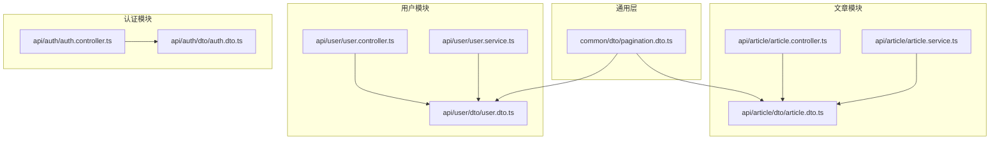
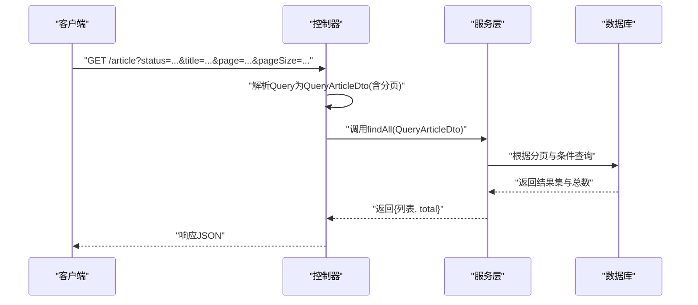
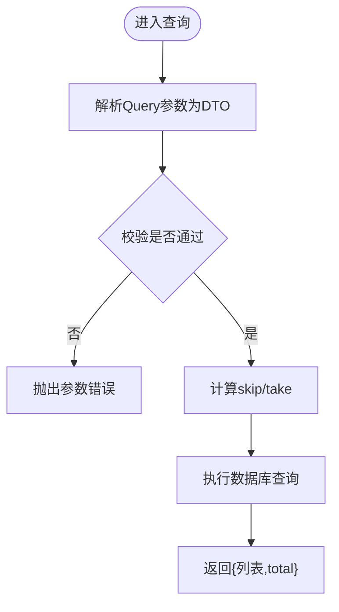
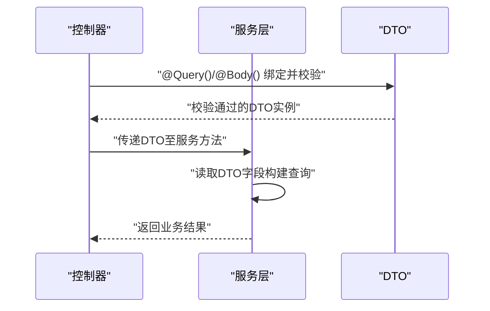
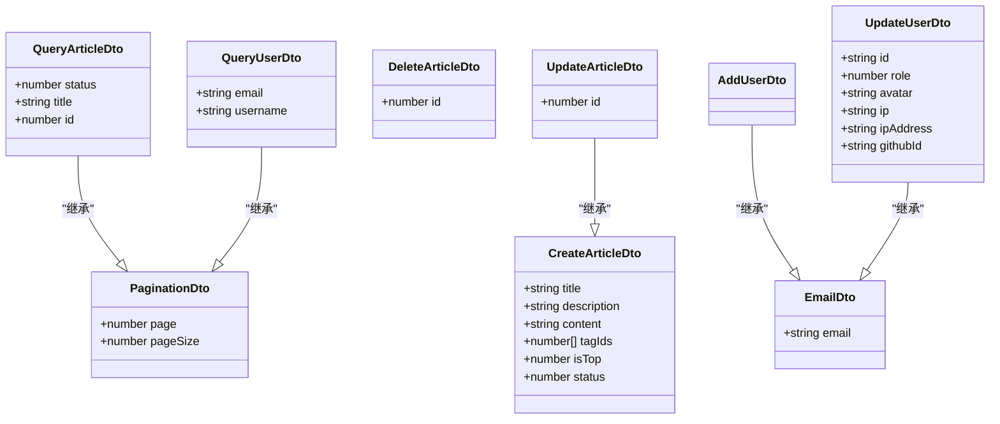

# 公共数据传输对象

<cite>
**本文引用的文件**   
- [src/common/dto/pagination.dto.ts](file://src/common/dto/pagination.dto.ts)
- [src/api/article/dto/article.dto.ts](file://src/api/article/dto/article.dto.ts)
- [src/api/user/dto/user.dto.ts](file://src/api/user/dto/user.dto.ts)
- [src/api/auth/dto/auth.dto.ts](file://src/api/auth/dto/auth.dto.ts)
- [src/api/article/article.controller.ts](file://src/api/article/article.controller.ts)
- [src/api/user/user.controller.ts](file://src/api/user/user.controller.ts)
- [src/api/auth/auth.controller.ts](file://src/api/auth/auth.controller.ts)
- [src/api/article/article.service.ts](file://src/api/article/article.service.ts)
- [src/api/user/user.service.ts](file://src/api/user/user.service.ts)
</cite>

## 目录
1. [简介](#简介)
2. [项目结构](#项目结构)
3. [核心组件](#核心组件)
4. [架构总览](#架构总览)
5. [详细组件分析](#详细组件分析)
6. [依赖关系分析](#依赖关系分析)
7. [性能与可扩展性](#性能与可扩展性)
8. [故障排查指南](#故障排查指南)
9. [结论](#结论)
10. [附录：版本管理与向后兼容](#附录：版本管理与向后兼容)

## 简介
本设计文档聚焦于博客系统的“公共数据传输对象（DTO）”体系，围绕分页查询 DTO 的设计模式与参数规范、自定义 DTO 的开发指南（数据验证规则、类型定义、文档注解）、在控制器与服务层的正确使用方式、以及 DTO 的版本管理与向后兼容性策略展开。目标是让前后端协作更稳定、接口契约清晰、扩展成本低。

## 项目结构
本项目采用按领域划分的模块组织方式，DTO 位于各业务模块的 dto 目录下，同时提供通用分页 DTO 置于 common/dto 下供多模块复用。

图表来源
- [src/common/dto/pagination.dto.ts:1-17](file://src/common/dto/pagination.dto.ts#L1-L17)
- [src/api/article/dto/article.dto.ts:1-64](file://src/api/article/dto/article.dto.ts#L1-L64)
- [src/api/user/dto/user.dto.ts:1-75](file://src/api/user/dto/user.dto.ts#L1-L75)
- [src/api/auth/dto/auth.dto.ts:1-9](file://src/api/auth/dto/auth.dto.ts#L1-L9)
- [src/api/article/article.controller.ts:1-52](file://src/api/article/article.controller.ts#L1-L52)
- [src/api/user/user.controller.ts:1-28](file://src/api/user/user.controller.ts#L1-L28)
- [src/api/auth/auth.controller.ts:1-29](file://src/api/auth/auth.controller.ts#L1-L29)
- [src/api/article/article.service.ts:1-104](file://src/api/article/article.service.ts#L1-L104)
- [src/api/user/user.service.ts:1-66](file://src/api/user/user.service.ts#L1-L66)

章节来源
- [src/common/dto/pagination.dto.ts:1-17](file://src/common/dto/pagination.dto.ts#L1-L17)
- [src/api/article/dto/article.dto.ts:1-64](file://src/api/article/dto/article.dto.ts#L1-L64)
- [src/api/user/dto/user.dto.ts:1-75](file://src/api/user/dto/user.dto.ts#L1-L75)
- [src/api/auth/dto/auth.dto.ts:1-9](file://src/api/auth/dto/auth.dto.ts#L1-L9)
- [src/api/article/article.controller.ts:1-52](file://src/api/article/article.controller.ts#L1-L52)
- [src/api/user/user.controller.ts:1-28](file://src/api/user/user.controller.ts#L1-L28)
- [src/api/auth/auth.controller.ts:1-29](file://src/api/auth/auth.controller.ts#L1-L29)
- [src/api/article/article.service.ts:1-104](file://src/api/article/article.service.ts#L1-L104)
- [src/api/user/user.service.ts:1-66](file://src/api/user/user.service.ts#L1-L66)

## 核心组件
本节梳理公共 DTO 的核心构成与职责边界。

- 分页查询 DTO（PaginationDto）
  - 职责：统一分页入参，提供默认值与基础校验。
  - 字段：
    - page：页码，整数，最小值为 1，可选，默认 1。
    - pageSize：每页数量，整数，最小值为 1，可选，默认 20。
  - 转换与校验：使用 class-transformer 将字符串转为数字；class-validator 进行非空、范围校验。
  - 扩展点：可在此基类中增加排序、过滤等通用字段，供各业务 DTO 继承。

- 文章模块 DTO
  - CreateArticleDto：创建文章请求体，包含标题、描述、内容、标签 ID 数组、置顶标记、状态等字段，均含必填与类型约束。
  - UpdateArticleDto：继承创建 DTO，并新增 id 用于更新定位。
  - QueryArticleDto：继承分页 DTO，并补充 status、title、id 等查询条件。
  - DeleteArticleDto：删除操作所需的主键 id。

- 用户模块 DTO
  - EmailDto：邮箱校验片段，被多处复用。
  - AddUserDto：新增用户，包含用户名、头像、GitHub ID 等。
  - QueryUserDto：继承分页 DTO，支持按用户名、邮箱模糊查询。
  - UpdateUserDto：基于 EmailDto 扩展，包含用户标识、角色、头像、登录信息等。

- 认证模块 DTO
  - EmailDto：仅用于认证场景的邮箱校验片段。

章节来源
- [src/common/dto/pagination.dto.ts:1-17](file://src/common/dto/pagination.dto.ts#L1-L17)
- [src/api/article/dto/article.dto.ts:1-64](file://src/api/article/dto/article.dto.ts#L1-L64)
- [src/api/user/dto/user.dto.ts:1-75](file://src/api/user/dto/user.dto.ts#L1-L75)
- [src/api/auth/dto/auth.dto.ts:1-9](file://src/api/auth/dto/auth.dto.ts#L1-L9)

## 架构总览
下图展示从 HTTP 请求到服务层的 DTO 流转路径，体现控制器接收 DTO、服务层消费 DTO 的典型流程。

图表来源
- [src/api/article/article.controller.ts:22-30](file://src/api/article/article.controller.ts#L22-L30)
- [src/api/article/article.service.ts:21-58](file://src/api/article/article.service.ts#L21-L58)
- [src/api/article/dto/article.dto.ts:43-56](file://src/api/article/dto/article.dto.ts#L43-L56)
- [src/common/dto/pagination.dto.ts:4-16](file://src/common/dto/pagination.dto.ts#L4-L16)

章节来源
- [src/api/article/article.controller.ts:22-30](file://src/api/article/article.controller.ts#L22-L30)
- [src/api/article/article.service.ts:21-58](file://src/api/article/article.service.ts#L21-L58)
- [src/api/article/dto/article.dto.ts:43-56](file://src/api/article/dto/article.dto.ts#L43-L56)
- [src/common/dto/pagination.dto.ts:4-16](file://src/common/dto/pagination.dto.ts#L4-L16)

## 详细组件分析

### 分页查询 DTO 设计与参数规范
- 字段定义与默认值
  - page：默认 1，表示第一页。
  - pageSize：默认 20，表示每页条数。
- 校验与转换
  - 使用 class-transformer 将字符串参数转换为 Number。
  - 使用 class-validator 确保为正整数且不小于 1。
- 排序规则建议
  - 当前分页 DTO 未内置排序字段。建议在 QueryArticleDto/QueryUserDto 中按需扩展排序字段（如 sortBy、order），并在服务层实现对应 order 映射。
- 分页计算
  - 服务层通过 skip=(page-1)*pageSize、take=pageSize 实现分页。

图表来源
- [src/common/dto/pagination.dto.ts:4-16](file://src/common/dto/pagination.dto.ts#L4-L16)
- [src/api/article/article.service.ts:35-43](file://src/api/article/article.service.ts#L35-L43)
- [src/api/user/user.service.ts:21-31](file://src/api/user/user.service.ts#L21-L31)

章节来源
- [src/common/dto/pagination.dto.ts:1-17](file://src/common/dto/pagination.dto.ts#L1-L17)
- [src/api/article/article.service.ts:35-43](file://src/api/article/article.service.ts#L35-L43)
- [src/api/user/user.service.ts:21-31](file://src/api/user/user.service.ts#L21-L31)

### 自定义 DTO 开发指南
- 数据验证规则
  - 必填：使用 IsNotEmpty 或显式默认值。
  - 类型：IsString、IsInt、IsEmail、IsArray 等。
  - 长度：MaxLength 限制最大长度。
  - 可选：IsOptional 配合默认值。
- 类型转换
  - 对来自 URL 查询参数的数值型字段，使用 Type(() => Number) 进行自动转换。
- 文档注解
  - 可在 DTO 字段上添加 Swagger/NestJS 文档注解以生成 API 文档（例如 @ApiProperty）。
- 组合与复用
  - 将通用校验片段抽取为独立类（如 EmailDto），通过继承复用，减少重复代码。

章节来源
- [src/api/article/dto/article.dto.ts:12-36](file://src/api/article/dto/article.dto.ts#L12-L36)
- [src/api/article/dto/article.dto.ts:43-56](file://src/api/article/dto/article.dto.ts#L43-L56)
- [src/api/user/dto/user.dto.ts:12-44](file://src/api/user/dto/user.dto.ts#L12-L44)
- [src/api/auth/dto/auth.dto.ts:3-8](file://src/api/auth/dto/auth.dto.ts#L3-L8)

### 在控制器与服务层中的正确使用
- 控制器层
  - 使用 @Query() 将查询参数绑定为 DTO，触发 class-transformer/class-validator 校验。
  - 使用 @Body() 将请求体绑定为 DTO，进行结构化校验。
- 服务层
  - 直接消费已校验的 DTO 实例，避免重复校验逻辑。
  - 将 DTO 字段映射为数据库查询条件，注意分页 skip/take 的计算。

图表来源
- [src/api/article/article.controller.ts:27-30](file://src/api/article/article.controller.ts#L27-L30)
- [src/api/user/user.controller.ts:18-21](file://src/api/user/user.controller.ts#L18-L21)
- [src/api/article/article.service.ts:21-58](file://src/api/article/article.service.ts#L21-L58)
- [src/api/user/user.service.ts:21-31](file://src/api/user/user.service.ts#L21-L31)

章节来源
- [src/api/article/article.controller.ts:27-30](file://src/api/article/article.controller.ts#L27-L30)
- [src/api/user/user.controller.ts:18-21](file://src/api/user/user.controller.ts#L18-L21)
- [src/api/article/article.service.ts:21-58](file://src/api/article/article.service.ts#L21-L58)
- [src/api/user/user.service.ts:21-31](file://src/api/user/user.service.ts#L21-L31)

### 常见业务场景的 DTO 设计示例与最佳实践
- 列表分页查询
  - 使用 QueryXxxDto 继承 PaginationDto，并追加业务筛选字段（如 status、title、username、email）。
  - 在服务层实现 like 模糊匹配与分页计算。
- 新增/更新资源
  - 使用 CreateXxxDto/UpdateXxxDto 分离写入语义，UpdateXxxDto 通常继承 CreateXxxDto 并增加主键 id。
- 删除资源
  - 使用 DeleteXxxDto 仅携带必要主键信息，保持接口简洁与安全。
- 复用校验片段
  - 将跨模块复用的校验片段（如邮箱）抽离为独立 DTO 并通过继承复用。

章节来源
- [src/api/article/dto/article.dto.ts:12-63](file://src/api/article/dto/article.dto.ts#L12-L63)
- [src/api/user/dto/user.dto.ts:19-74](file://src/api/user/dto/user.dto.ts#L19-L74)
- [src/api/user/user.service.ts:21-31](file://src/api/user/user.service.ts#L21-L31)

## 依赖关系分析
DTO 之间的继承与复用关系如下：

图表来源
- [src/common/dto/pagination.dto.ts:4-16](file://src/common/dto/pagination.dto.ts#L4-L16)
- [src/api/article/dto/article.dto.ts:12-63](file://src/api/article/dto/article.dto.ts#L12-L63)
- [src/api/user/dto/user.dto.ts:12-74](file://src/api/user/dto/user.dto.ts#L12-L74)

章节来源
- [src/common/dto/pagination.dto.ts:1-17](file://src/common/dto/pagination.dto.ts#L1-L17)
- [src/api/article/dto/article.dto.ts:1-64](file://src/api/article/dto/article.dto.ts#L1-L64)
- [src/api/user/dto/user.dto.ts:1-75](file://src/api/user/dto/user.dto.ts#L1-L75)

## 性能与可扩展性
- 分页性能
  - 合理设置 pageSize 上限，避免一次性加载过多数据导致内存与网络压力。
  - 对于大数据量场景，建议使用游标分页或基于索引的 keyset 分页替代 offset/skip。
- 查询优化
  - 模糊查询尽量结合索引；避免对大文本字段频繁使用 like。
  - 关联数据按需加载，避免 N+1 问题（当前文章与标签存在多次查询，可考虑批量加载或预加载）。
- DTO 扩展
  - 在 PaginationDto 中集中管理通用分页与排序字段，便于统一治理。
  - 将校验规则与业务无关的片段抽离为独立 DTO，提升复用度。

[本节为通用指导，不直接分析具体文件]

## 故障排查指南
- 参数类型错误
  - 现象：前端传入的数值型参数为字符串，导致校验失败。
  - 处理：确保在 DTO 中使用 Type(() => Number) 进行转换，并在控制器使用 @Query()/@Body() 绑定 DTO。
- 必填字段缺失
  - 现象：缺少必填字段时抛出参数校验异常。
  - 处理：检查 DTO 上的 IsNotEmpty 等校验注解，确认前端传参与默认值策略。
- 分页越界
  - 现象：page 或 pageSize 小于 1 时报错。
  - 处理：在 DTO 中设置 Min(1) 校验，并在前端做输入限制。
- 业务异常
  - 现象：服务层抛出的业务异常（如记录不存在）。
  - 处理：在过滤器中统一捕获并返回标准错误格式。

章节来源
- [src/common/dto/pagination.dto.ts:4-16](file://src/common/dto/pagination.dto.ts#L4-L16)
- [src/api/article/article.service.ts:70-82](file://src/api/article/article.service.ts#L70-L82)
- [src/api/user/user.service.ts:39-48](file://src/api/user/user.service.ts#L39-L48)

## 结论
通过将分页能力抽象为公共 DTO，并在各业务 DTO 中继承复用，系统实现了统一的查询契约与一致的校验行为。结合控制器与服务层的清晰分工，既保证了接口的稳定性，也提升了可维护性与扩展性。后续可在 PaginationDto 中进一步引入排序、过滤等通用能力，完善整体 DTO 体系。

[本节为总结性内容，不直接分析具体文件]

## 附录：版本管理与向后兼容
- 版本化策略
  - 在路由或请求头中引入版本标识（如 /v1/article），不同版本的控制器分别处理各自的 DTO 定义。
  - 对破坏性变更（如字段重命名、移除、类型变更）应升级版本号，旧版本继续保留一段时间。
- 向后兼容
  - 新增字段优先设为可选并提供默认值，避免影响现有客户端。
  - 废弃字段保留但标记为弃用，逐步迁移后再移除。
- 文档同步
  - 每次 DTO 变更需同步更新 API 文档，标注变更说明与迁移指引。
- 测试保障
  - 针对关键 DTO 编写单元测试，覆盖校验与转换逻辑，确保变更不会引入回归。

[本节为通用指导，不直接分析具体文件]