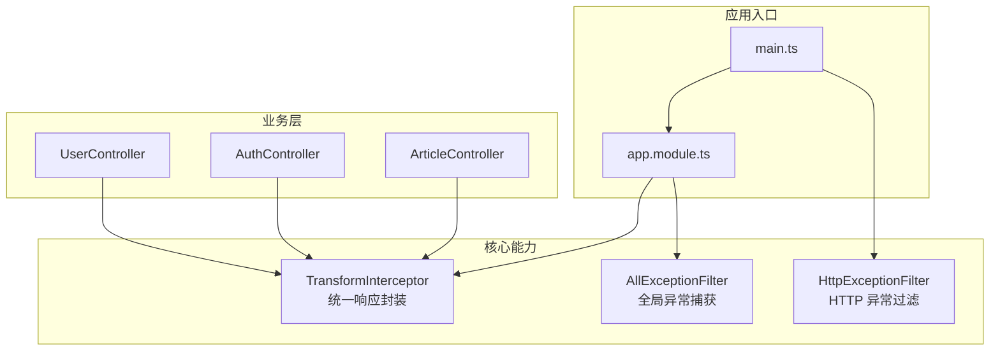
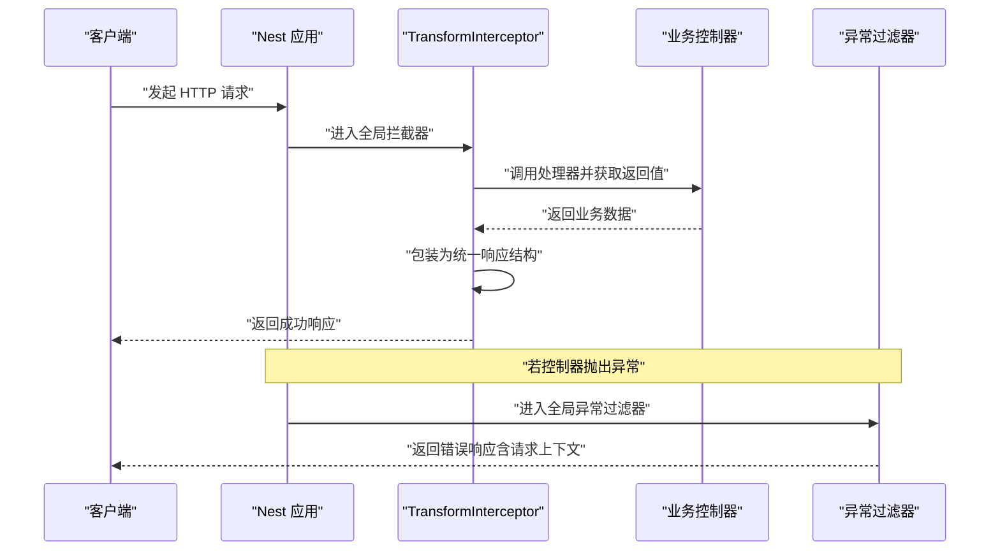
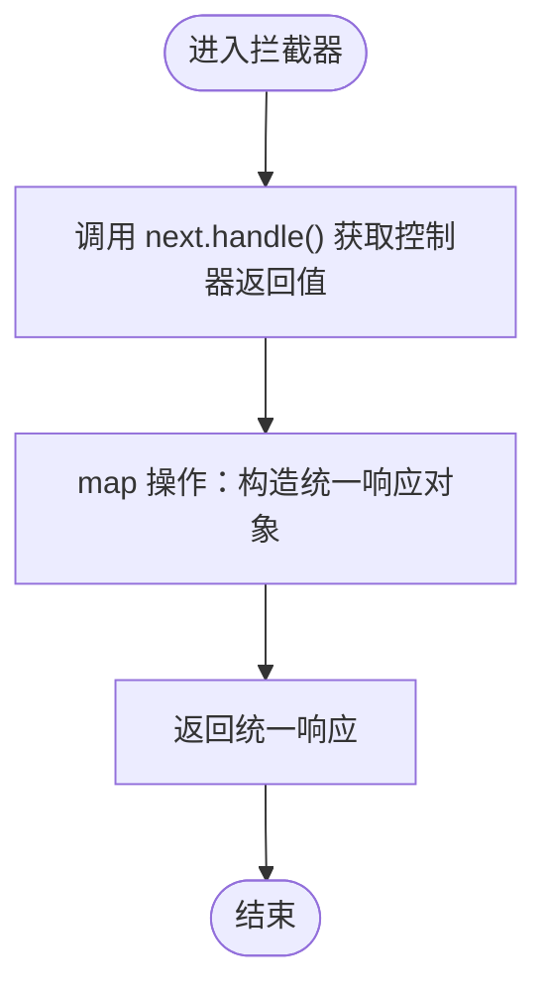
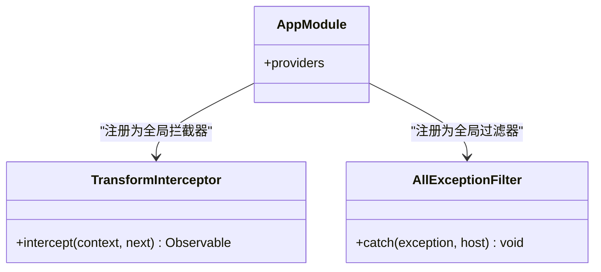
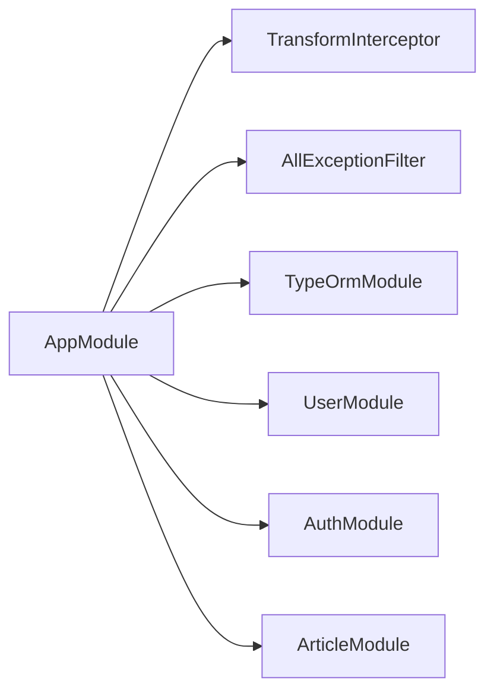
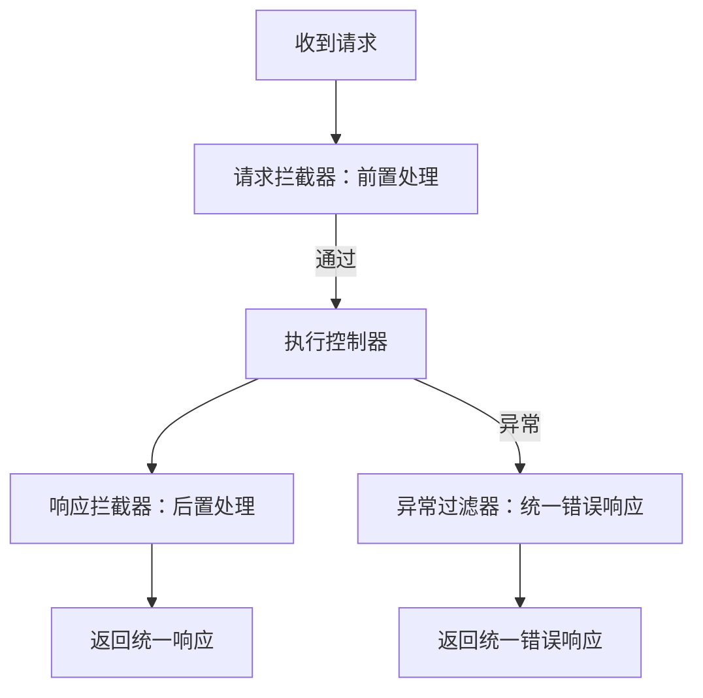

# 响应转换拦截器

<cite>
**本文引用的文件**   
- [src/core/interceptor/transform.interceptor.ts](file://src/core/interceptor/transform.interceptor.ts)
- [src/app.module.ts](file://src/app.module.ts)
- [src/main.ts](file://src/main.ts)
- [src/core/filter/all-exception.filter.ts](file://src/core/filter/all-exception.filter.ts)
- [src/core/filter/http-exception.filter.ts](file://src/core/filter/http-exception.filter.ts)
- [src/api/user/user.controller.ts](file://src/api/user/user.controller.ts)
- [src/api/auth/auth.controller.ts](file://src/api/auth/auth.controller.ts)
- [src/api/article/article.controller.ts](file://src/api/article/article.controller.ts)
</cite>

## 目录
1. [简介](#简介)
2. [项目结构](#项目结构)
3. [核心组件](#核心组件)
4. [架构总览](#架构总览)
5. [详细组件分析](#详细组件分析)
6. [依赖关系分析](#依赖关系分析)
7. [性能与可观测性建议](#性能与可观测性建议)
8. [故障排查指南](#故障排查指南)
9. [结论](#结论)
10. [附录：自定义拦截器开发指南](#附录自定义拦截器开发指南)

## 简介
本技术文档围绕博客系统的“响应转换拦截器”展开，重点解释统一响应格式封装的实现原理、拦截器的执行时机与数据转换流程、日志记录机制的扩展点，并给出自定义请求/响应拦截器的开发指南。同时提供与异常处理机制集成的一致性 API 响应格式方案，以及性能监控、请求追踪和缓存策略的实践示例（概念性说明）。

## 项目结构
本项目基于 NestJS 构建，采用模块化组织方式。与响应转换相关的核心位置如下：
- 全局响应转换拦截器：位于 core/interceptor
- 全局异常过滤器：位于 core/filter
- 应用启动与全局配置：main.ts 与 app.module.ts
- 业务控制器：api 下各模块 controller

图表来源
- [src/main.ts:1-46](file://src/main.ts#L1-L46)
- [src/app.module.ts:1-35](file://src/app.module.ts#L1-L35)
- [src/core/interceptor/transform.interceptor.ts:1-24](file://src/core/interceptor/transform.interceptor.ts#L1-L24)
- [src/core/filter/all-exception.filter.ts:1-43](file://src/core/filter/all-exception.filter.ts#L1-L43)
- [src/core/filter/http-exception.filter.ts:1-37](file://src/core/filter/http-exception.filter.ts#L1-L37)
- [src/api/user/user.controller.ts:1-28](file://src/api/user/user.controller.ts#L1-L28)
- [src/api/auth/auth.controller.ts:1-29](file://src/api/auth/auth.controller.ts#L1-L29)
- [src/api/article/article.controller.ts:1-52](file://src/api/article/article.controller.ts#L1-L52)

章节来源
- [src/main.ts:1-46](file://src/main.ts#L1-L46)
- [src/app.module.ts:1-35](file://src/app.module.ts#L1-L35)

## 核心组件
- 统一响应转换拦截器：负责将控制器返回的数据包装为统一的响应结构，包含状态码、消息和数据体字段。
- 全局异常过滤器：在发生异常时捕获错误，并以一致的响应结构返回，便于前端统一处理。
- 应用注册：通过全局提供者将拦截器和过滤器注册到整个应用中，确保所有路由均受其影响。

章节来源
- [src/core/interceptor/transform.interceptor.ts:1-24](file://src/core/interceptor/transform.interceptor.ts#L1-L24)
- [src/core/filter/all-exception.filter.ts:1-43](file://src/core/filter/all-exception.filter.ts#L1-L43)
- [src/app.module.ts:19-32](file://src/app.module.ts#L19-L32)

## 架构总览
下图展示了从请求进入至响应返回的关键路径，包括拦截器与过滤器的协作关系。

图表来源
- [src/core/interceptor/transform.interceptor.ts:10-23](file://src/core/interceptor/transform.interceptor.ts#L10-L23)
- [src/core/filter/all-exception.filter.ts:10-42](file://src/core/filter/all-exception.filter.ts#L10-L42)
- [src/api/user/user.controller.ts:18-26](file://src/api/user/user.controller.ts#L18-L26)
- [src/api/auth/auth.controller.ts:18-27](file://src/api/auth/auth.controller.ts#L18-L27)
- [src/api/article/article.controller.ts:26-50](file://src/api/article/article.controller.ts#L26-L50)

## 详细组件分析

### 统一响应转换拦截器
- 职责
  - 在控制器返回后对数据进行统一封装，形成一致的成功响应结构。
  - 保证 data 字段始终存在，当无数据时以空值占位，避免前端判空逻辑复杂化。
- 执行时机
  - 作为全局拦截器，在所有控制器方法执行之后、响应发送之前运行。
- 数据转换流程
  - 接收控制器返回值
  - 构造统一对象，包含状态码、消息和数据体
  - 将统一对象作为最终响应返回
- 可扩展点
  - 可在 map 操作前记录请求上下文信息（如耗时、用户标识），用于后续日志或追踪。
  - 可按业务需要调整默认消息文案或状态码映射。

图表来源
- [src/core/interceptor/transform.interceptor.ts:10-23](file://src/core/interceptor/transform.interceptor.ts#L10-L23)

章节来源
- [src/core/interceptor/transform.interceptor.ts:1-24](file://src/core/interceptor/transform.interceptor.ts#L1-L24)

### 全局异常过滤器
- 职责
  - 捕获未处理的异常，并将错误信息以统一结构返回，附带请求上下文以便定位问题。
- 执行时机
  - 在拦截器之后、响应发送之前；若控制器抛出异常，则进入过滤器。
- 错误响应结构
  - 包含状态码、错误消息以及请求上下文（查询参数、请求体、路由参数、方法与 URL）。
- 与拦截器协作
  - 正常路径由拦截器包装成功响应；异常路径由过滤器输出错误响应，前后端均可据此进行统一处理。

图表来源
- [src/core/filter/all-exception.filter.ts:10-42](file://src/core/filter/all-exception.filter.ts#L10-L42)
- [src/core/interceptor/transform.interceptor.ts:10-23](file://src/core/interceptor/transform.interceptor.ts#L10-L23)
- [src/app.module.ts:19-32](file://src/app.module.ts#L19-L32)

章节来源
- [src/core/filter/all-exception.filter.ts:1-43](file://src/core/filter/all-exception.filter.ts#L1-L43)
- [src/app.module.ts:19-32](file://src/app.module.ts#L19-L32)

### 应用启动与全局配置
- main.ts
  - 创建应用实例
  - 启用信任代理
  - 注册全局异常过滤器（用于特定场景的 HTTP 异常处理）
  - 注册验证管道（自动类型转换、白名单等）
  - 初始化 Swagger 文档
- app.module.ts
  - 通过 APP_INTERCEPTOR 注册 TransformInterceptor，使其成为全局响应转换器
  - 通过 APP_FILTER 注册 AllExceptionFilter，使其成为全局异常捕获器
  - 通过 APP_GUARD 注册鉴权守卫（与本主题相关但不展开）

章节来源
- [src/main.ts:10-43](file://src/main.ts#L10-L43)
- [src/app.module.ts:19-32](file://src/app.module.ts#L19-L32)

### 业务控制器示例
- 控制器仅返回业务数据，不关心响应包装细节
- 统一响应由全局拦截器完成，异常由全局过滤器处理
- 典型控制器：用户、认证、文章模块

章节来源
- [src/api/user/user.controller.ts:18-26](file://src/api/user/user.controller.ts#L18-L26)
- [src/api/auth/auth.controller.ts:18-27](file://src/api/auth/auth.controller.ts#L18-L27)
- [src/api/article/article.controller.ts:26-50](file://src/api/article/article.controller.ts#L26-L50)

## 依赖关系分析
- 模块级依赖
  - AppModule 引入 TypeORM 与各业务模块
  - 通过 providers 注入全局拦截器与过滤器
- 运行时依赖
  - TransformInterceptor 依赖 RxJS 的 map 操作符对响应流进行处理
  - AllExceptionFilter 依赖 HttpAdapterHost 以直接写入响应

图表来源
- [src/app.module.ts:1-35](file://src/app.module.ts#L1-L35)

章节来源
- [src/app.module.ts:1-35](file://src/app.module.ts#L1-L35)

## 性能与可观测性建议
以下为通用实践建议，便于在不侵入业务代码的前提下提升系统可观测性与稳定性：
- 性能监控
  - 在拦截器中记录请求开始时间，计算处理耗时，并在日志中输出
  - 对慢请求设置阈值告警
- 请求追踪
  - 为每个请求生成唯一追踪 ID，贯穿拦截器、服务与数据库访问链路
  - 在日志中携带追踪 ID，便于跨服务关联
- 缓存策略
  - 针对幂等的 GET 请求，结合 Redis 实现接口级缓存
  - 在拦截器中根据路由与查询参数生成缓存键，命中则直接返回，未命中再执行业务逻辑并回填缓存
- 限流与熔断
  - 在网关或中间件层实施限流，保护后端资源
  - 对不稳定依赖使用熔断器，快速失败并降级

[本节为通用指导，不涉及具体源码]

## 故障排查指南
- 现象：前端收到的响应缺少 data 字段
  - 检查是否启用了全局响应转换拦截器
  - 确认控制器返回值是否为 undefined/null，拦截器会将其置为空值
- 现象：异常响应结构与预期不一致
  - 核对全局异常过滤器是否被正确注册
  - 检查控制器抛出的异常类型及状态码
- 现象：日志缺失关键上下文
  - 在拦截器中补充请求上下文（URL、方法、参数、IP 等）的记录
  - 结合追踪 ID 完善链路日志

章节来源
- [src/core/interceptor/transform.interceptor.ts:10-23](file://src/core/interceptor/transform.interceptor.ts#L10-L23)
- [src/core/filter/all-exception.filter.ts:14-41](file://src/core/filter/all-exception.filter.ts#L14-L41)

## 结论
通过全局响应转换拦截器与全局异常过滤器的配合，系统实现了统一的 API 响应格式：成功路径由拦截器包装标准结构，异常路径由过滤器输出带上下文的错误结构。该设计降低了业务层的样板代码，提升了前后端交互的一致性与可维护性。在此基础上，可通过扩展拦截器增加日志、追踪、缓存与限流等横切关注点，进一步增强系统的可观测性与健壮性。

## 附录：自定义拦截器开发指南

### 请求拦截器 vs 响应拦截器
- 请求拦截器
  - 作用点：在控制器执行之前，适合做参数校验、权限校验、请求头改写、埋点统计等
  - 典型实现：读取/修改 request 对象，决定是否继续调用下一个处理器
- 响应拦截器
  - 作用点：在控制器执行之后，适合做响应包装、脱敏、缓存、耗时统计等
  - 典型实现：对 next.handle() 返回的可观察流进行 map 操作，包装响应结构

### 开发步骤
- 定义拦截器类，实现对应接口
- 在 intercept 方法中编写前置/后置逻辑
- 在模块中通过 APP_INTERCEPTOR 注册为全局，或在控制器/方法级别局部注册
- 与异常过滤器协同，确保异常路径也遵循统一响应约定

### 与异常处理集成
- 成功路径：由响应拦截器包装统一结构
- 异常路径：由异常过滤器捕获并输出统一错误结构
- 建议在拦截器中记录请求上下文与耗时，在过滤器中记录异常堆栈与请求详情，便于排障

### 示例流程图（概念）

[本节为通用指导，不涉及具体源码]