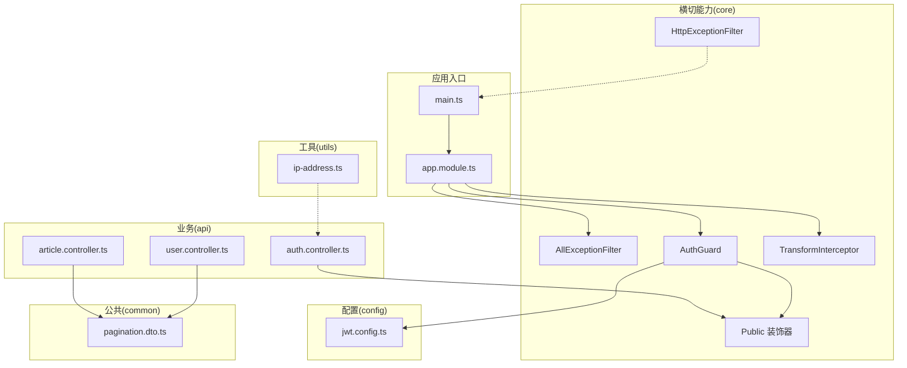
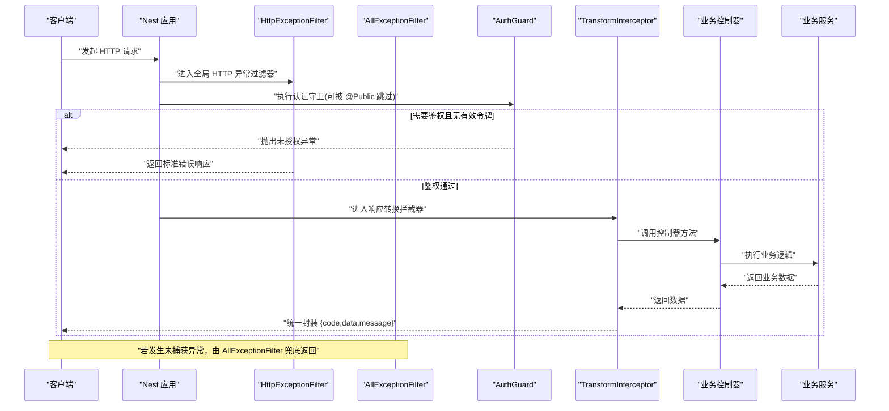
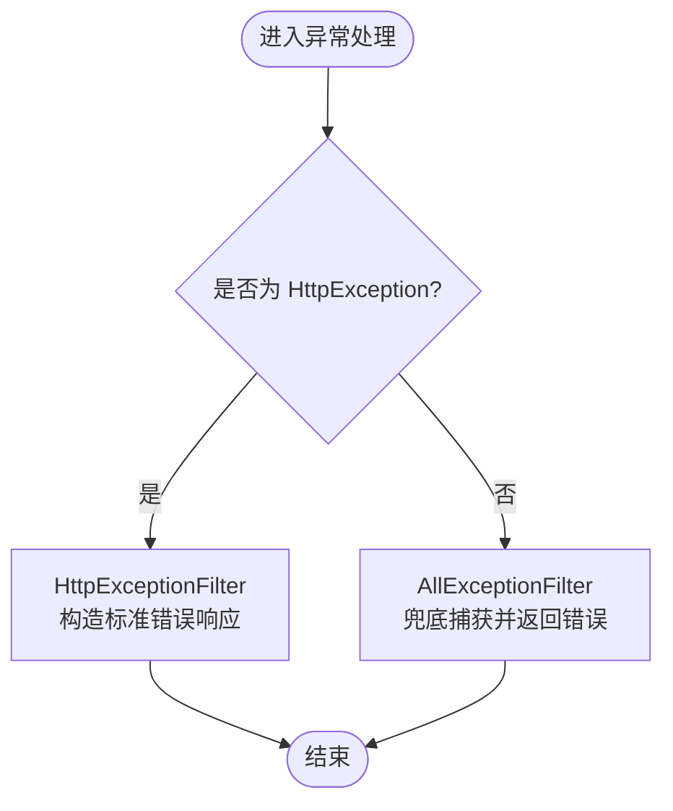
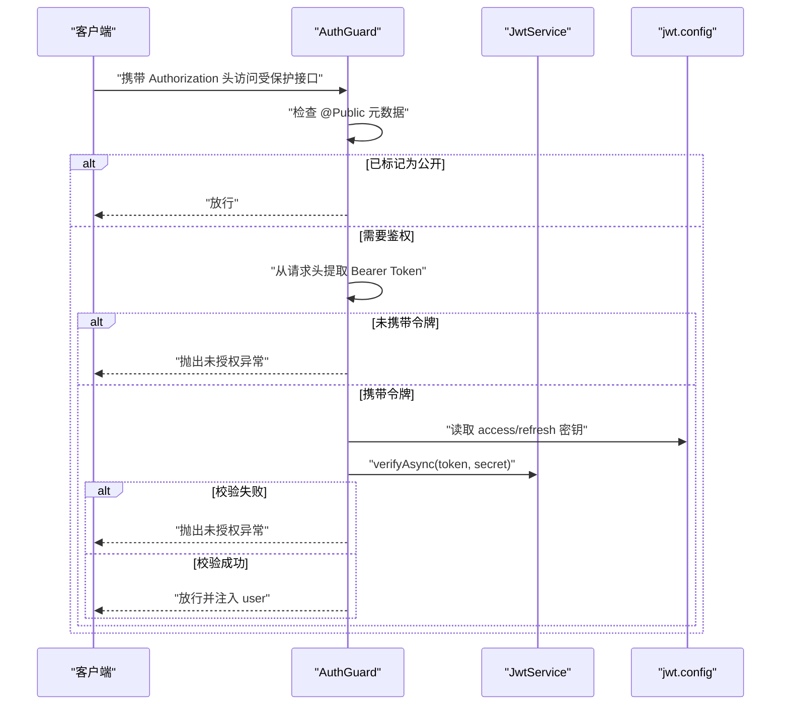
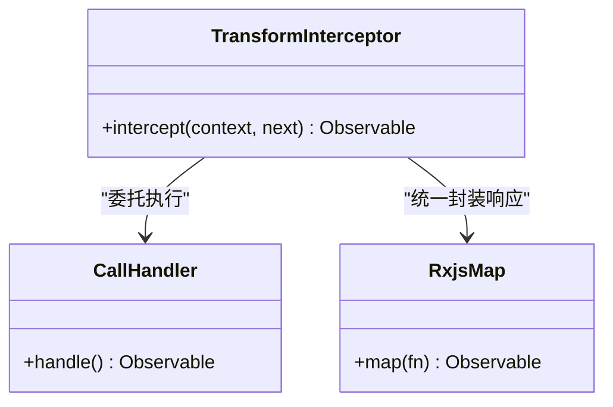
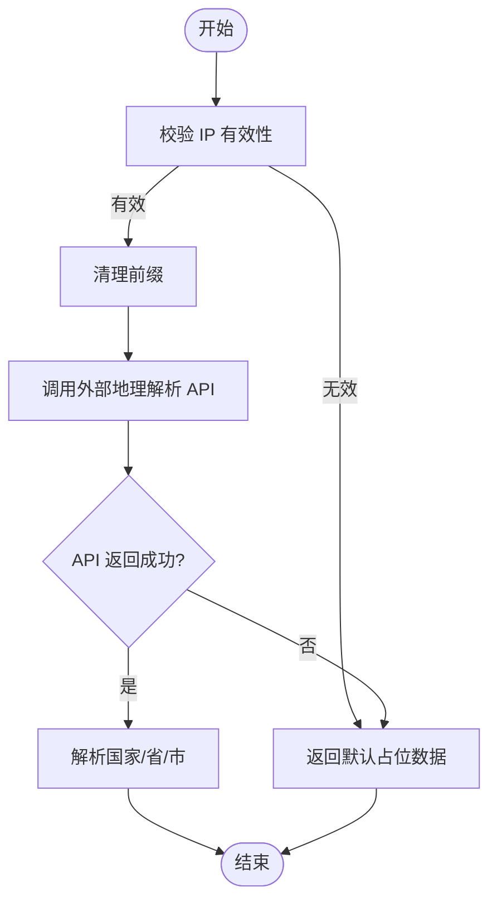
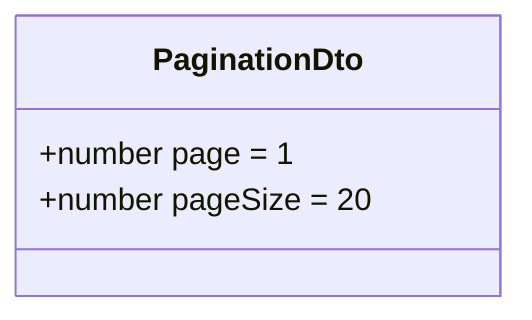
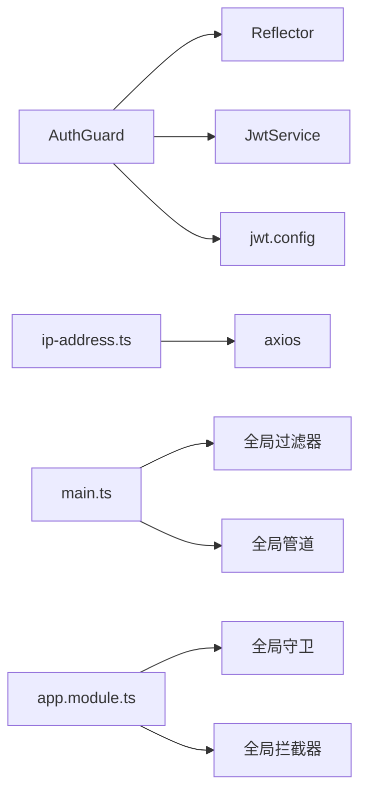

# 基础设施

<cite>
**本文引用的文件**   
- [src/main.ts](file://src/main.ts)
- [src/app.module.ts](file://src/app.module.ts)
- [src/core/filter/all-exception.filter.ts](file://src/core/filter/all-exception.filter.ts)
- [src/core/filter/http-exception.filter.ts](file://src/core/filter/http-exception.filter.ts)
- [src/core/guard/auth.guard.ts](file://src/core/guard/auth.guard.ts)
- [src/core/guard/public.decorator.ts](file://src/core/guard/public.decorator.ts)
- [src/core/interceptor/transform.interceptor.ts](file://src/core/interceptor/transform.interceptor.ts)
- [src/utils/ip-address.ts](file://src/utils/ip-address.ts)
- [src/common/dto/pagination.dto.ts](file://src/common/dto/pagination.dto.ts)
- [src/config/jwt.config.ts](file://src/config/jwt.config.ts)
- [src/api/auth/auth.controller.ts](file://src/api/auth/auth.controller.ts)
- [src/api/user/user.controller.ts](file://src/api/user/user.controller.ts)
- [src/api/article/article.controller.ts](file://src/api/article/article.controller.ts)
</cite>

## 目录
1. [简介](#简介)
2. [项目结构](#项目结构)
3. [核心组件](#核心组件)
4. [架构总览](#架构总览)
5. [详细组件分析](#详细组件分析)
6. [依赖关系分析](#依赖关系分析)
7. [性能考量](#性能考量)
8. [故障排查指南](#故障排查指南)
9. [结论](#结论)
10. [附录](#附录)

## 简介
本技术文档聚焦博客系统的基础设施层，围绕以下目标展开：
- 全局异常处理机制：HTTP 异常过滤器与通用异常过滤器的区别、优先级与使用场景
- 认证守卫：JWT 验证流程、权限装饰器与白名单路由配置
- 响应转换拦截器：统一响应格式封装、错误码标准化与日志记录机制
- 工具函数：IP 地址解析工具的使用说明
- 公共 DTO：分页查询参数的统一处理
- 扩展指南：自定义装饰器、中间件与拦截器的接入方式

## 项目结构
本项目采用分层与横切关注点分离的组织方式：
- core：横切能力（过滤器、守卫、拦截器）
- common：跨模块复用数据模型（如分页 DTO）
- utils：通用工具函数（如 IP 解析）
- config：配置项（如 JWT 密钥）
- api：业务模块（用户、文章、认证）
- main/app.module：应用启动与全局装配

图表来源
- [src/main.ts:1-46](file://src/main.ts#L1-L46)
- [src/app.module.ts:1-35](file://src/app.module.ts#L1-L35)
- [src/core/filter/all-exception.filter.ts:1-43](file://src/core/filter/all-exception.filter.ts#L1-L43)
- [src/core/filter/http-exception.filter.ts:1-37](file://src/core/filter/http-exception.filter.ts#L1-L37)
- [src/core/guard/auth.guard.ts:1-53](file://src/core/guard/auth.guard.ts#L1-L53)
- [src/core/guard/public.decorator.ts:1-5](file://src/core/guard/public.decorator.ts#L1-L5)
- [src/core/interceptor/transform.interceptor.ts:1-24](file://src/core/interceptor/transform.interceptor.ts#L1-L24)
- [src/config/jwt.config.ts:1-5](file://src/config/jwt.config.ts#L1-L5)
- [src/utils/ip-address.ts:1-39](file://src/utils/ip-address.ts#L1-L39)
- [src/common/dto/pagination.dto.ts:1-17](file://src/common/dto/pagination.dto.ts#L1-L17)
- [src/api/auth/auth.controller.ts:1-29](file://src/api/auth/auth.controller.ts#L1-L29)
- [src/api/user/user.controller.ts:1-28](file://src/api/user/user.controller.ts#L1-L28)
- [src/api/article/article.controller.ts:1-52](file://src/api/article/article.controller.ts#L1-L52)

章节来源
- [src/main.ts:1-46](file://src/main.ts#L1-L46)
- [src/app.module.ts:1-35](file://src/app.module.ts#L1-L35)

## 核心组件
本节概述各基础设施组件的职责与协作关系。

- 全局异常处理
  - HTTP 异常过滤器：捕获并格式化 HttpException，用于对已知 HTTP 状态码进行统一包装与返回
  - 通用异常过滤器：捕获所有未预期异常，作为兜底策略，确保服务稳定输出一致的错误结构
- 认证守卫
  - 基于 Reflector 读取 Public 装饰器元数据，实现白名单跳过鉴权
  - 从请求头提取 Bearer Token，按访问令牌或刷新令牌分别校验，并将载荷挂载到请求上下文
- 响应转换拦截器
  - 将控制器返回值统一封装为包含 code、data、message 的标准结构
- 工具函数
  - IP 地址解析：通过外部 API 获取地理位置信息，并对无效输入做容错处理
- 公共 DTO
  - 分页参数：提供 page/pageSize 的可选校验与默认值，配合 ValidationPipe 自动类型转换与白名单过滤

章节来源
- [src/core/filter/http-exception.filter.ts:1-37](file://src/core/filter/http-exception.filter.ts#L1-L37)
- [src/core/filter/all-exception.filter.ts:1-43](file://src/core/filter/all-exception.filter.ts#L1-L43)
- [src/core/guard/auth.guard.ts:1-53](file://src/core/guard/auth.guard.ts#L1-L53)
- [src/core/guard/public.decorator.ts:1-5](file://src/core/guard/public.decorator.ts#L1-L5)
- [src/core/interceptor/transform.interceptor.ts:1-24](file://src/core/interceptor/transform.interceptor.ts#L1-L24)
- [src/utils/ip-address.ts:1-39](file://src/utils/ip-address.ts#L1-L39)
- [src/common/dto/pagination.dto.ts:1-17](file://src/common/dto/pagination.dto.ts#L1-L17)

## 架构总览
下图展示了请求在 NestJS 管道中的关键阶段：全局过滤器、守卫、拦截器、控制器与响应封装。

图表来源
- [src/main.ts:1-46](file://src/main.ts#L1-L46)
- [src/app.module.ts:1-35](file://src/app.module.ts#L1-L35)
- [src/core/filter/http-exception.filter.ts:1-37](file://src/core/filter/http-exception.filter.ts#L1-L37)
- [src/core/filter/all-exception.filter.ts:1-43](file://src/core/filter/all-exception.filter.ts#L1-L43)
- [src/core/guard/auth.guard.ts:1-53](file://src/core/guard/auth.guard.ts#L1-L53)
- [src/core/interceptor/transform.interceptor.ts:1-24](file://src/core/interceptor/transform.interceptor.ts#L1-L24)

## 详细组件分析

### 全局异常处理机制
- 设计要点
  - 优先级：HttpExceptionFilter 优先于 AllExceptionFilter；前者仅处理 HttpException，后者捕获其余所有异常
  - 统一结构：两者均返回包含 code、message、data 的结构体，便于前端统一处理
  - 调试友好：data 中附带请求上下文（query/body/params/method/url），便于问题定位
- 差异与使用场景
  - HTTP 异常过滤器：适用于业务主动抛出的 HttpException（如参数校验失败、资源不存在等），可按状态码区分语义
  - 通用异常过滤器：作为兜底，防止未知异常导致 500 裸错误，保证对外一致性
- 注意
  - 在启动文件中注册了全局 HTTP 异常过滤器；在全局模块中注册了通用异常过滤器，二者共同生效
  - 当业务返回成功数据时，将由 TransformInterceptor 统一封装为 code=200 的响应

图表来源
- [src/core/filter/http-exception.filter.ts:1-37](file://src/core/filter/http-exception.filter.ts#L1-L37)
- [src/core/filter/all-exception.filter.ts:1-43](file://src/core/filter/all-exception.filter.ts#L1-L43)
- [src/main.ts:1-46](file://src/main.ts#L1-L46)
- [src/app.module.ts:1-35](file://src/app.module.ts#L1-L35)

章节来源
- [src/core/filter/http-exception.filter.ts:1-37](file://src/core/filter/http-exception.filter.ts#L1-L37)
- [src/core/filter/all-exception.filter.ts:1-43](file://src/core/filter/all-exception.filter.ts#L1-L43)
- [src/main.ts:1-46](file://src/main.ts#L1-L46)
- [src/app.module.ts:1-35](file://src/app.module.ts#L1-L35)

### 认证守卫与白名单路由
- 工作原理
  - 通过 Reflector 读取方法或类上的 Public 装饰器元数据，若标记为公开则直接放行
  - 否则从 Authorization 头提取 Bearer Token，根据 URL 判断是否刷新接口，选择对应密钥进行验证
  - 验证成功后将 payload 注入到 request.user，供后续控制器或服务使用
- 白名单配置
  - 在需要公开的接口上添加 Public 装饰器即可，例如登录、第三方授权回调等
- 刷新令牌特殊处理
  - 针对 /auth/refresh 路径，使用独立密钥校验，避免混淆访问令牌与刷新令牌

图表来源
- [src/core/guard/auth.guard.ts:1-53](file://src/core/guard/auth.guard.ts#L1-L53)
- [src/core/guard/public.decorator.ts:1-5](file://src/core/guard/public.decorator.ts#L1-L5)
- [src/config/jwt.config.ts:1-5](file://src/config/jwt.config.ts#L1-L5)
- [src/api/auth/auth.controller.ts:1-29](file://src/api/auth/auth.controller.ts#L1-L29)

章节来源
- [src/core/guard/auth.guard.ts:1-53](file://src/core/guard/auth.guard.ts#L1-L53)
- [src/core/guard/public.decorator.ts:1-5](file://src/core/guard/public.decorator.ts#L1-L5)
- [src/config/jwt.config.ts:1-5](file://src/config/jwt.config.ts#L1-L5)
- [src/api/auth/auth.controller.ts:1-29](file://src/api/auth/auth.controller.ts#L1-L29)

### 响应转换拦截器
- 作用
  - 将控制器返回的数据统一封装为标准响应结构，包含 code、data、message
  - 对空结果进行 null 处理，保持数据结构一致
- 错误码标准化
  - 成功路径固定返回 code=200；错误路径由异常过滤器负责返回具体状态码
- 日志记录机制
  - 当前实现未内置日志记录；可在 map 操作前后增加日志打印以记录入参与出参

图表来源
- [src/core/interceptor/transform.interceptor.ts:1-24](file://src/core/interceptor/transform.interceptor.ts#L1-L24)

章节来源
- [src/core/interceptor/transform.interceptor.ts:1-24](file://src/core/interceptor/transform.interceptor.ts#L1-L24)

### 工具函数：IP 地址解析
- 功能说明
  - 接收原始 IP 字符串，清理前缀后调用外部 API 获取国家、省份、城市信息
  - 对非法或缺失的 IP 返回占位符，避免下游报错
- 使用建议
  - 在登录、敏感操作审计等场景中记录用户真实地理位置
  - 注意网络超时与外部服务可用性，建议在调用处增加重试或降级策略

图表来源
- [src/utils/ip-address.ts:1-39](file://src/utils/ip-address.ts#L1-L39)

章节来源
- [src/utils/ip-address.ts:1-39](file://src/utils/ip-address.ts#L1-L39)

### 公共 DTO：分页查询参数
- 设计模式
  - 使用 class-validator 与 class-transformer 提供可选字段、类型转换与最小值约束
  - 默认 page=1、pageSize=20，减少控制器层的重复处理
- 适用场景
  - 列表查询接口统一传入分页参数，结合数据库层实现分页

图表来源
- [src/common/dto/pagination.dto.ts:1-17](file://src/common/dto/pagination.dto.ts#L1-L17)

章节来源
- [src/common/dto/pagination.dto.ts:1-17](file://src/common/dto/pagination.dto.ts#L1-L17)

### 扩展指南：自定义装饰器、中间件与拦截器
- 自定义装饰器
  - 参考 Public 装饰器，使用 SetMetadata 设置元数据，并通过 Reflector 在守卫或拦截器中读取
- 自定义中间件
  - 在应用启动阶段使用 app.use 注册，适合处理跨域、CORS、请求日志、限流等横切逻辑
- 自定义拦截器
  - 实现 NestInterceptor 接口，在 intercept 中通过 next.handle().pipe(map(...)) 包装响应
  - 可结合日志库记录入参与出参，或统一添加 traceId 等链路标识
- 全局装配
  - 在 AppModule 中使用 APP_FILTER、APP_INTERCEPTOR、APP_GUARD 提供者进行全局注册
  - 在 main.ts 中使用 useGlobalFilters/useGlobalPipes 注册更早期的全局行为

章节来源
- [src/core/guard/public.decorator.ts:1-5](file://src/core/guard/public.decorator.ts#L1-L5)
- [src/app.module.ts:1-35](file://src/app.module.ts#L1-L35)
- [src/main.ts:1-46](file://src/main.ts#L1-L46)

## 依赖关系分析
- 组件耦合
  - AuthGuard 依赖 Reflector、JwtService 与 jwt.config，职责单一且内聚度高
  - 过滤器与拦截器通过全局提供者解耦，不侵入业务代码
- 外部依赖
  - IP 解析依赖 axios 与外部 API，需考虑网络异常与延迟
- 潜在循环依赖
  - 当前未发现循环引用；新增模块时应避免在构造函数中引入自身模块

图表来源
- [src/core/guard/auth.guard.ts:1-53](file://src/core/guard/auth.guard.ts#L1-L53)
- [src/utils/ip-address.ts:1-39](file://src/utils/ip-address.ts#L1-L39)
- [src/main.ts:1-46](file://src/main.ts#L1-L46)
- [src/app.module.ts:1-35](file://src/app.module.ts#L1-L35)

章节来源
- [src/core/guard/auth.guard.ts:1-53](file://src/core/guard/auth.guard.ts#L1-L53)
- [src/utils/ip-address.ts:1-39](file://src/utils/ip-address.ts#L1-L39)
- [src/main.ts:1-46](file://src/main.ts#L1-L46)
- [src/app.module.ts:1-35](file://src/app.module.ts#L1-L35)

## 性能考量
- 异常过滤器与拦截器均为轻量级，开销较小；但应避免在拦截器中进行重型计算
- IP 解析涉及外部网络请求，建议：
  - 增加缓存策略（如本地内存缓存或 Redis）
  - 设置合理的超时与重试上限
  - 在高频调用场景下考虑异步化或批量处理
- 分页 DTO 的校验在 ValidationPipe 中完成，默认 stopAtFirstError=true，可减少不必要的校验开销

[本节为通用指导，无需源码引用]

## 故障排查指南
- 常见问题
  - 未携带或携带错误的 Authorization 头：将被 AuthGuard 拒绝，返回未授权异常
  - 刷新接口误用访问令牌：需确认 /auth/refresh 使用 refreshSecretKey 对应的令牌
  - 外部 IP 解析失败：工具函数会返回占位数据，不影响主流程，但需在日志中记录
  - 分页参数类型错误：ValidationPipe 会进行类型转换与校验，错误将触发 HttpException
- 定位步骤
  - 查看统一错误响应的 data 字段，核对请求上下文
  - 在拦截器中增加日志，记录入参与出参
  - 检查全局过滤器与拦截器的注册顺序与覆盖范围

章节来源
- [src/core/filter/http-exception.filter.ts:1-37](file://src/core/filter/http-exception.filter.ts#L1-L37)
- [src/core/filter/all-exception.filter.ts:1-43](file://src/core/filter/all-exception.filter.ts#L1-L43)
- [src/core/guard/auth.guard.ts:1-53](file://src/core/guard/auth.guard.ts#L1-L53)
- [src/core/interceptor/transform.interceptor.ts:1-24](file://src/core/interceptor/transform.interceptor.ts#L1-L24)
- [src/common/dto/pagination.dto.ts:1-17](file://src/common/dto/pagination.dto.ts#L1-L17)

## 结论
本基础设施通过统一的异常处理、认证守卫与响应转换，构建了稳定、一致的 API 契约。借助装饰器、中间件与拦截器的扩展能力，开发者可以低成本地增强系统横切能力。建议在后续迭代中完善日志体系与外部依赖的容错策略，进一步提升系统的可观测性与健壮性。

[本节为总结，无需源码引用]

## 附录
- 示例控制器中对装饰器与 DTO 的使用
  - 公开接口示例：参见认证控制器与文章控制器的公开方法
  - 分页参数示例：参见用户与文章控制器对 Query 参数的使用

章节来源
- [src/api/auth/auth.controller.ts:1-29](file://src/api/auth/auth.controller.ts#L1-29)
- [src/api/article/article.controller.ts:1-52](file://src/api/article/article.controller.ts#L1-52)
- [src/api/user/user.controller.ts:1-28](file://src/api/user/user.controller.ts#L1-28)