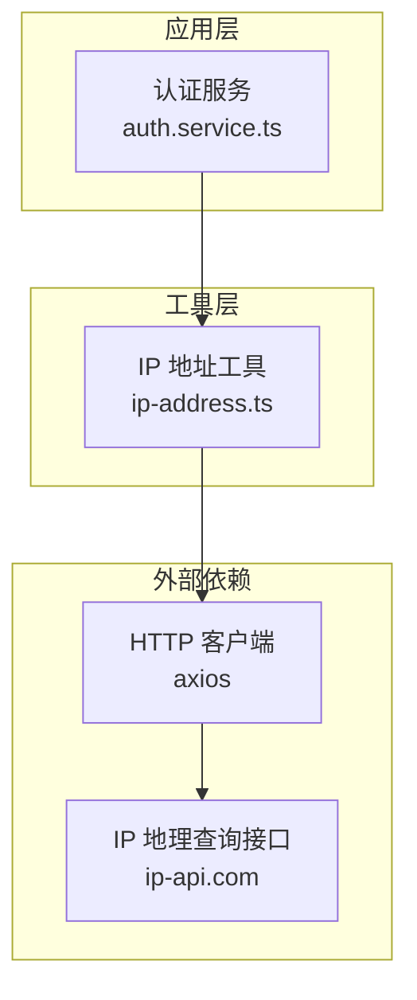
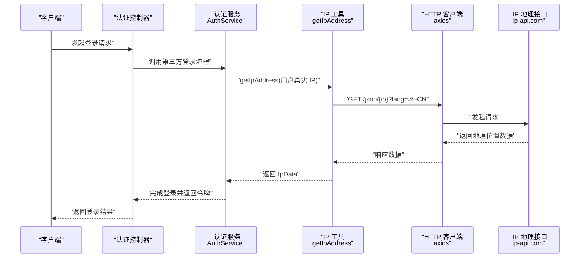
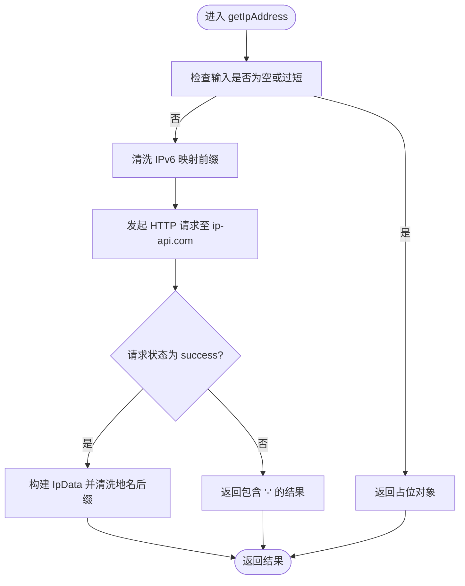
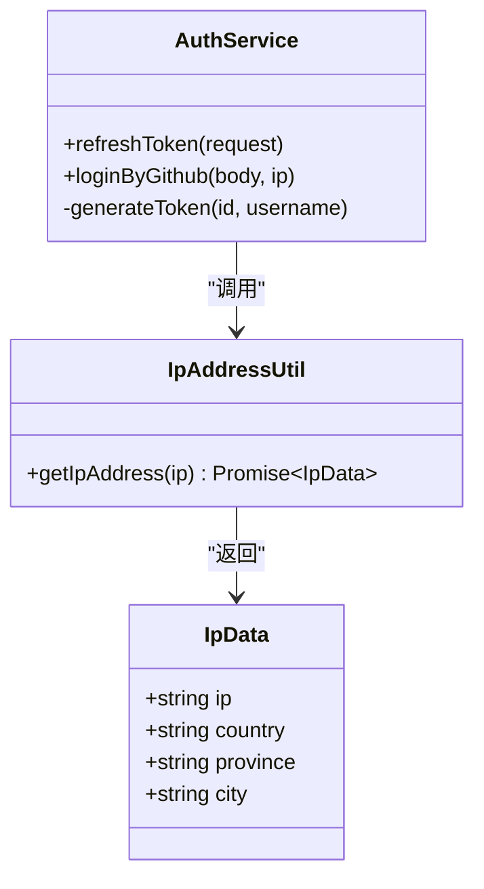
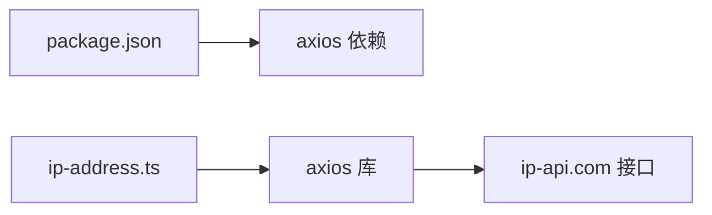

# 工具函数库

<cite>
**本文引用的文件**   
- [src/utils/ip-address.ts](file://src/utils/ip-address.ts)
- [src/api/auth/auth.service.ts](file://src/api/auth/auth.service.ts)
- [package.json](file://package.json)
</cite>

## 目录
1. [简介](#简介)
2. [项目结构](#项目结构)
3. [核心组件](#核心组件)
4. [架构总览](#架构总览)
5. [详细组件分析](#详细组件分析)
6. [依赖分析](#依赖分析)
7. [性能考虑](#性能考虑)
8. [故障排查指南](#故障排查指南)
9. [结论](#结论)
10. [附录](#附录)

## 简介
本文件为博客系统的“工具函数库”使用文档，聚焦于 IP 地址解析工具函数的功能与使用方法，包括地理位置查询、IP 地址校验与网络信息获取。同时提供通用工具函数的扩展指南、单元测试示例与最佳实践，并展示如何在业务模块中正确引入和使用这些工具函数。最后给出自定义工具函数的开发规范与命名约定，帮助团队统一风格、提升可维护性。

## 项目结构
当前仓库采用 NestJS 模块化组织方式，工具函数集中在 src/utils 目录下，其中已实现的 IP 地址解析工具位于 ip-address.ts；在认证服务中已有实际调用示例。

图表来源
- [src/api/auth/auth.service.ts:1-123](file://src/api/auth/auth.service.ts#L1-L123)
- [src/utils/ip-address.ts:1-39](file://src/utils/ip-address.ts#L1-L39)

章节来源
- [src/utils/ip-address.ts:1-39](file://src/utils/ip-address.ts#L1-L39)
- [src/api/auth/auth.service.ts:1-123](file://src/api/auth/auth.service.ts#L1-L123)

## 核心组件
本节重点介绍 IP 地址解析工具的核心能力与数据结构。

- 数据模型：IpData
  - 字段说明
    - ip：原始或清洗后的 IP 字符串
    - country：国家名称
    - province：省份（去除“市”后缀）
    - city：城市（去除“市”后缀）
- 主要函数：getIpAddress(ip)
  - 输入：可选的 IP 字符串
  - 输出：Promise<IpData>
  - 行为要点
    - 若传入为空或长度不足，返回占位值（全部为“-”）
    - 对 IPv6 映射的 IPv4 进行清洗，仅保留冒号后的 IPv4 部分
    - 通过 HTTP 请求查询 ip-api.com 中文接口，成功时填充国家/省/市，失败时填充占位值
    - 内部对地区名进行“市”后缀清理，保证结果简洁一致

章节来源
- [src/utils/ip-address.ts:3-8](file://src/utils/ip-address.ts#L3-L8)
- [src/utils/ip-address.ts:10-28](file://src/utils/ip-address.ts#L10-L28)
- [src/utils/ip-address.ts:30-36](file://src/utils/ip-address.ts#L30-L36)

## 架构总览
下图展示了从业务层到工具层再到外部服务的完整调用链路。

图表来源
- [src/api/auth/auth.service.ts:23-109](file://src/api/auth/auth.service.ts#L23-L109)
- [src/utils/ip-address.ts:10-28](file://src/utils/ip-address.ts#L10-L28)

## 详细组件分析

### IP 地址解析工具（ip-address.ts）
该工具对外暴露一个默认导出函数 getIpAddress，用于将任意来源的 IP 字符串转换为标准化的地理位置信息对象。

- 关键实现点
  - 参数校验与快速返回：当输入为空或长度小于阈值时直接返回占位对象，避免无效请求
  - IPv6 兼容处理：通过正则表达式移除前缀，提取 IPv4 地址
  - 外部查询：调用 ip-api.com 中文接口，根据 status 判断是否成功
  - 文本清洗：对 regionName 和 city 字段执行“市”后缀去除，保持显示一致性
- 复杂度与健壮性
  - 时间复杂度：O(1)，主要为字符串操作与一次网络请求
  - 空间复杂度：O(1)，仅保存少量中间变量
  - 健壮性：对空值、非法长度、网络异常等场景均做了降级处理（返回占位值）

图表来源
- [src/utils/ip-address.ts:10-28](file://src/utils/ip-address.ts#L10-L28)
- [src/utils/ip-address.ts:30-36](file://src/utils/ip-address.ts#L30-L36)

章节来源
- [src/utils/ip-address.ts:1-39](file://src/utils/ip-address.ts#L1-L39)

### 在业务模块中的使用示例（auth.service.ts）
认证服务在 GitHub 第三方登录流程中，利用 IP 工具记录用户的登录来源地信息，用于后续的用户画像与安全审计。

- 使用位置
  - 在第三方登录成功后，调用 getIpAddress 获取地理位置
  - 将 ip、province 写入用户信息与登录埋点
- 注意事项
  - 确保传入的 IP 来自可信来源（如 Nginx/X-Forwarded-For 解析后的真实 IP）
  - 对网络异常与第三方接口不可用做容错处理（工具内部已返回占位值）

图表来源
- [src/api/auth/auth.service.ts:1-123](file://src/api/auth/auth.service.ts#L1-L123)
- [src/utils/ip-address.ts:3-8](file://src/utils/ip-address.ts#L3-L8)
- [src/utils/ip-address.ts:10-28](file://src/utils/ip-address.ts#L10-L28)

章节来源
- [src/api/auth/auth.service.ts:23-109](file://src/api/auth/auth.service.ts#L23-L109)
- [src/utils/ip-address.ts:10-28](file://src/utils/ip-address.ts#L10-L28)

## 依赖分析
- 运行时依赖
  - axios：用于发起 HTTP 请求访问 ip-api.com
- 包管理
  - package.json 中声明了 axios 作为生产依赖，确保运行环境可用

图表来源
- [package.json:22-45](file://package.json#L22-L45)
- [src/utils/ip-address.ts:1-2](file://src/utils/ip-address.ts#L1-L2)

章节来源
- [package.json:22-45](file://package.json#L22-L45)
- [src/utils/ip-address.ts:1-2](file://src/utils/ip-address.ts#L1-L2)

## 性能考虑
- 网络开销
  - 每次调用都会发起一次外部 HTTP 请求，建议在高频场景中增加本地缓存（如 Redis），以 IP 为键存储最近查询结果，设置合理过期时间
- 并发控制
  - 对于同一 IP 的高并发请求，可通过去重队列或锁机制减少重复请求
- 超时与重试
  - 建议为 axios 配置合理的超时时间与重试策略，避免因外部接口抖动导致整体请求耗时过长
- 降级策略
  - 工具已对异常返回进行降级处理，可在上层进一步记录日志与监控指标

[本节为通用指导，不直接分析具体文件]

## 故障排查指南
- 常见问题
  - 输入为空或长度不足：会返回占位对象，检查上游是否正确传递真实 IP
  - IPv6 映射问题：确认传入的 IP 格式，工具会自动清洗前缀，但仍需确保最终为有效 IPv4
  - 外部接口不可用：ip-api.com 可能受限或超时，工具会返回占位值，建议在上层记录告警
- 定位方法
  - 在调用处打印传入的 ip 参数与返回的 IpData，确认清洗逻辑是否符合预期
  - 检查网络连通性与代理配置，确保能访问 ip-api.com
  - 结合业务日志追踪请求链路，定位异常来源

章节来源
- [src/utils/ip-address.ts:10-28](file://src/utils/ip-address.ts#L10-L28)
- [src/utils/ip-address.ts:30-36](file://src/utils/ip-address.ts#L30-L36)

## 结论
IP 地址解析工具提供了简洁稳定的地理位置查询能力，已在认证流程中落地使用。通过统一的工具封装，业务层无需关心外部接口细节与数据清洗逻辑，提升了代码复用性与可维护性。建议在后续迭代中补充缓存、监控与更完善的错误处理，进一步提升系统稳定性与性能。

[本节为总结性内容，不直接分析具体文件]

## 附录

### 使用示例与最佳实践
- 基本用法
  - 在需要获取地理位置的地方导入并调用 getIpAddress，传入可信来源的 IP 字符串
  - 接收返回的 IpData，按需使用 country、province、city 字段
- 最佳实践
  - 始终从可信来源获取 IP（如网关层解析后的 X-Forwarded-For）
  - 对工具返回值进行非空与有效性校验后再入库
  - 对频繁查询的 IP 增加缓存层，降低外部接口压力
  - 记录关键日志与指标，便于问题定位与容量规划

[本节为通用指导，不直接分析具体文件]

### 单元测试示例（思路与覆盖点）
- 测试目标
  - 验证 getIpAddress 在不同输入下的行为：空值、过短、IPv6 映射、正常 IPv4
  - 验证外部接口成功与失败两种分支
  - 验证地名后缀“市”的清洗逻辑
- 测试设计
  - 使用 Jest 与 ts-jest 环境（参考 package.json 配置）
  - 使用 Mock 替换 axios 的 GET 请求，分别返回成功与失败的数据
  - 断言返回的 IpData 字段符合预期
- 覆盖范围
  - 边界条件：undefined、null、空串、长度不足
  - 正常路径：status 为 success 时的字段填充
  - 异常路径：status 不为 success 时的占位值
  - 文本清洗：regionName 与 city 的“市”后缀去除

[本节为通用指导，不直接分析具体文件]

### 扩展指南与开发规范
- 扩展方向
  - 新增其他通用工具函数（如日期格式化、字符串处理、加密解密等），统一放置在 src/utils 下
  - 每个工具文件只关注单一职责，导出清晰的函数或类
- 命名约定
  - 文件名使用小写加连字符或下划线（如 ip-address.ts、date-formatter.ts）
  - 函数名使用动词短语，语义明确（如 getIpAddress、formatDate）
  - 类型定义放在同文件或独立 types 文件，统一导出
- 代码质量
  - 遵循 ESLint 与 Prettier 规则（参考 package.json scripts）
  - 添加必要的注释与 JSDoc，描述入参、出参与异常
  - 编写单测用例，覆盖正常与异常路径

[本节为通用指导，不直接分析具体文件]