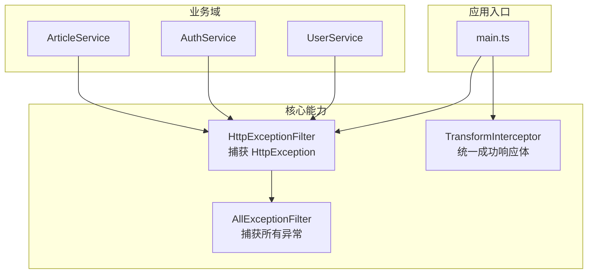
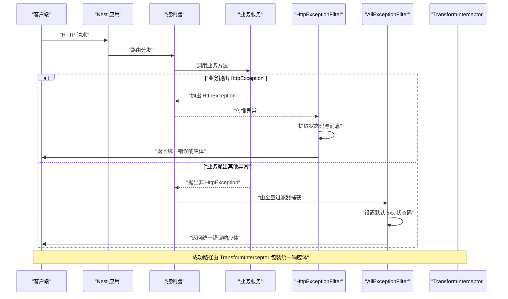
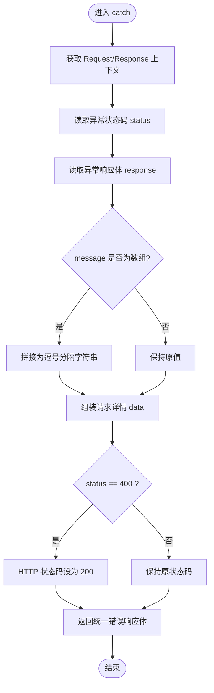
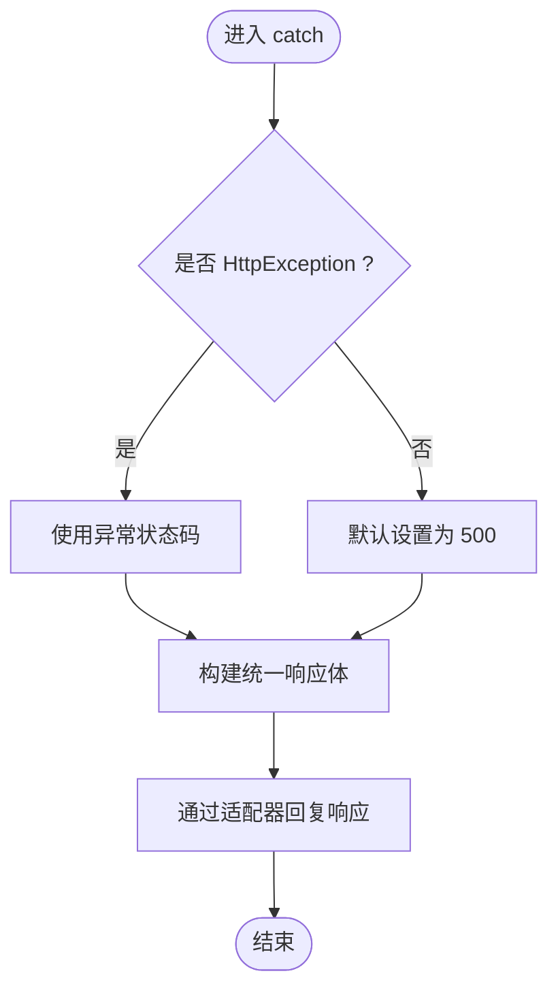
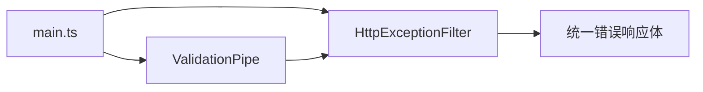

# 异常处理机制

<cite>
**本文引用的文件**
- [src/core/filter/all-exception.filter.ts](file://src/core/filter/all-exception.filter.ts)
- [src/core/filter/http-exception.filter.ts](file://src/core/filter/http-exception.filter.ts)
- [src/main.ts](file://src/main.ts)
- [src/api/article/article.service.ts](file://src/api/article/article.service.ts)
- [src/api/auth/auth.service.ts](file://src/api/auth/auth.service.ts)
- [src/api/user/user.service.ts](file://src/api/user/user.service.ts)
- [src/core/interceptor/transform.interceptor.ts](file://src/core/interceptor/transform.interceptor.ts)
</cite>

## 目录
1. [简介](#简介)
2. [项目结构](#项目结构)
3. [核心组件](#核心组件)
4. [架构总览](#架构总览)
5. [详细组件分析](#详细组件分析)
6. [依赖关系分析](#依赖关系分析)
7. [性能与可观测性](#性能与可观测性)
8. [故障排查指南](#故障排查指南)
9. [结论](#结论)
10. [附录：最佳实践清单](#附录最佳实践清单)

## 简介
本文件面向博客系统的后端异常处理机制，聚焦全局异常过滤器的实现原理、HTTP 状态码映射规则、错误响应格式标准化、自定义异常创建指南、日志记录与安全考虑，以及业务层如何正确抛出异常和处理第三方库异常。文档以源码为依据，提供可视化流程图与时序图，帮助读者快速理解并落地生产级异常处理方案。

## 项目结构
本项目基于 NestJS，采用分层组织方式：控制器、服务、过滤器、拦截器、配置等模块清晰分离。异常处理相关代码集中在 core/filter 目录下，并在应用启动时通过 main.ts 注册为全局过滤器。

图表来源
- [src/main.ts:1-46](file://src/main.ts#L1-L46)
- [src/core/filter/http-exception.filter.ts:1-37](file://src/core/filter/http-exception.filter.ts#L1-L37)
- [src/core/filter/all-exception.filter.ts:1-43](file://src/core/filter/all-exception.filter.ts#L1-L43)
- [src/core/interceptor/transform.interceptor.ts:1-23](file://src/core/interceptor/transform.interceptor.ts#L1-L23)
- [src/api/article/article.service.ts:1-104](file://src/api/article/article.service.ts#L1-L104)
- [src/api/auth/auth.service.ts:1-123](file://src/api/auth/auth.service.ts#L1-L123)
- [src/api/user/user.service.ts:1-66](file://src/api/user/user.service.ts#L1-L66)

章节来源
- [src/main.ts:1-46](file://src/main.ts#L1-L46)

## 核心组件
- 全局 HTTP 异常过滤器（HttpExceptionFilter）
  - 职责：仅捕获 HttpException 及其子类，将异常信息标准化为统一响应体；对 400 状态码进行特殊处理，返回 HTTP 200，但响应体内保留原始 code 字段用于前端区分。
  - 适用场景：业务校验失败、参数不合法、认证授权失败等“客户端错误”或“业务错误”。
- 全量异常过滤器（AllExceptionFilter）
  - 职责：捕获所有未处理的异常（包括非 HttpException），提供兜底保护；若异常不是 HttpException，则默认使用内部服务器错误状态码。
  - 适用场景：未知异常、系统级异常、第三方库抛出的非 HTTP 异常。
- 统一成功响应拦截器（TransformInterceptor）
  - 职责：将正常返回的数据包装为统一的成功响应体，便于前后端一致交互。
- 应用启动注册（main.ts）
  - 职责：在应用初始化阶段注册全局过滤器和管道，确保所有请求均受统一异常处理约束。

章节来源
- [src/core/filter/http-exception.filter.ts:1-37](file://src/core/filter/http-exception.filter.ts#L1-L37)
- [src/core/filter/all-exception.filter.ts:1-43](file://src/core/filter/all-exception.filter.ts#L1-L43)
- [src/core/interceptor/transform.interceptor.ts:1-23](file://src/core/interceptor/transform.interceptor.ts#L1-L23)
- [src/main.ts:1-46](file://src/main.ts#L1-L46)

## 架构总览
下图展示了从请求进入、业务处理、异常抛出到过滤器响应的完整流程。

图表来源
- [src/main.ts:1-46](file://src/main.ts#L1-L46)
- [src/core/filter/http-exception.filter.ts:1-37](file://src/core/filter/http-exception.filter.ts#L1-L37)
- [src/core/filter/all-exception.filter.ts:1-43](file://src/core/filter/all-exception.filter.ts#L1-L43)
- [src/core/interceptor/transform.interceptor.ts:1-23](file://src/core/interceptor/transform.interceptor.ts#L1-L23)

## 详细组件分析

### 全局 HTTP 异常过滤器（HttpExceptionFilter）
- 捕获范围：仅 @Catch(HttpException)，即只处理 HTTP 异常。
- 状态码映射规则：
  - 若异常状态码为 400，则实际 HTTP 状态码改为 200，但响应体中的 code 仍为 400，以便前端按业务语义判断。
  - 其他状态码保持原样。
- 响应体结构：
  - code：原始 HTTP 状态码（如 400、401、403、404、500 等）。
  - message：来自异常响应体的 message，支持字符串或数组（数组会被拼接为逗号分隔的字符串）。
  - data：包含请求上下文信息（query、body、params、method、url）。
- 设计要点：
  - 通过 exception.getResponse() 获取异常携带的响应数据，兼容 ValidationPipe 等内置异常的消息格式。
  - 使用 Express Response 直接写入 JSON，避免额外序列化开销。

图表来源
- [src/core/filter/http-exception.filter.ts:1-37](file://src/core/filter/http-exception.filter.ts#L1-L37)

章节来源
- [src/core/filter/http-exception.filter.ts:1-37](file://src/core/filter/http-exception.filter.ts#L1-L37)

### 全量异常过滤器（AllExceptionFilter）
- 捕获范围：@Catch()，捕获所有异常，作为兜底策略。
- 状态码映射规则：
  - 若异常是 HttpException，则使用其状态码。
  - 否则默认使用内部服务器错误状态码（500）。
- 响应体结构：
  - code：最终 HTTP 状态码。
  - message：异常对象的 message 属性。
  - data：包含请求上下文信息（query、body、params、method、url）。
- 设计要点：
  - 通过 HttpAdapterHost 获取底层适配器，统一通过 httpAdapter.reply 发送响应，增强跨平台适配能力。
  - 适用于未知异常、系统异常、第三方库抛出的非 HTTP 异常。

图表来源
- [src/core/filter/all-exception.filter.ts:1-43](file://src/core/filter/all-exception.filter.ts#L1-L43)

章节来源
- [src/core/filter/all-exception.filter.ts:1-43](file://src/core/filter/all-exception.filter.ts#L1-L43)

### 统一成功响应拦截器（TransformInterceptor）
- 职责：将正常返回的数据包装为统一的成功响应体，包含 code、data、message 字段。
- 与异常处理的关系：
  - 成功路径由该拦截器负责统一封装。
  - 异常路径由过滤器负责统一封装，二者共同保证前后端一致的响应格式。

章节来源
- [src/core/interceptor/transform.interceptor.ts:1-23](file://src/core/interceptor/transform.interceptor.ts#L1-L23)

### 应用启动与全局注册（main.ts）
- 关键行为：
  - 启用信任代理。
  - 注册全局过滤器：HttpExceptionFilter。
  - 注册全局验证管道：ValidationPipe（开启类型转换、白名单、首个错误停止）。
  - 初始化 Swagger 文档。
- 注意：
  - 当前仅注册了 HttpExceptionFilter，未注册 AllExceptionFilter。这意味着非 HttpException 的异常不会被该过滤器捕获，可能回退至框架默认处理逻辑。建议在生产环境同时注册 AllExceptionFilter 作为兜底。

章节来源
- [src/main.ts:1-46](file://src/main.ts#L1-L46)

### 业务层异常抛出示例与模式
- 文章服务（ArticleService）
  - 当更新或删除操作发现目标不存在或影响行数为 0 时，抛出 BadRequestException，表示资源不存在或操作失败。
- 用户服务（UserService）
  - 当根据 ID 查询不到用户时，抛出 BadRequestException，表示用户不存在。
- 认证服务（AuthService）
  - 登录失败、验证码错误、第三方接口返回错误等场景，抛出 BadRequestException，并将第三方错误信息透传至响应体。

这些示例体现了“在业务层明确抛出合适的异常类型”，并由全局过滤器统一转换为标准响应体。

章节来源
- [src/api/article/article.service.ts:70-102](file://src/api/article/article.service.ts#L70-L102)
- [src/api/user/user.service.ts:39-64](file://src/api/user/user.service.ts#L39-L64)
- [src/api/auth/auth.service.ts:23-109](file://src/api/auth/auth.service.ts#L23-L109)

## 依赖关系分析
- 过滤器与应用的耦合点：
  - main.ts 通过 useGlobalFilters 注册 HttpExceptionFilter，使其成为全局异常处理入口。
- 过滤器之间的优先级：
  - 由于仅注册了 HttpExceptionFilter，HttpException 会优先被其捕获；非 HttpException 未被 AllExceptionFilter 捕获，可能走框架默认处理。
- 与验证管道的协作：
  - ValidationPipe 在第一个错误时停止，并抛出 HttpException 子类（如 BadRequestException），由 HttpExceptionFilter 统一处理。

图表来源
- [src/main.ts:1-46](file://src/main.ts#L1-L46)
- [src/core/filter/http-exception.filter.ts:1-37](file://src/core/filter/http-exception.filter.ts#L1-L37)

章节来源
- [src/main.ts:1-46](file://src/main.ts#L1-L46)

## 性能与可观测性
- 性能考量
  - 过滤器仅在异常路径执行，对正常路径无额外开销。
  - 统一响应体构造轻量，避免复杂计算。
- 可观测性建议
  - 建议在过滤器中增加结构化日志记录（请求 ID、时间戳、IP、URL、状态码、错误堆栈摘要），便于问题定位。
  - 生产环境避免在响应体中暴露敏感信息（如数据库连接串、密钥等），当前 data 字段仅包含请求上下文，风险较低。

[本节为通用指导，无需特定文件引用]

## 故障排查指南
- 常见问题
  - 400 状态码返回 200：这是预期行为，前端应依据响应体中的 code 字段判断业务错误。
  - 非 HttpException 异常未统一处理：当前未注册 AllExceptionFilter，需在全局注册以确保兜底。
  - 第三方库异常未捕获：建议使用 try/catch 包裹外部调用，并将其转换为业务异常（如 BadRequestException），再由过滤器统一处理。
- 调试技巧
  - 在过滤器中打印请求上下文与异常信息，确认 message 与 code 是否符合预期。
  - 检查 ValidationPipe 的配置，确保错误消息能正确传递到过滤器。

章节来源
- [src/core/filter/http-exception.filter.ts:1-37](file://src/core/filter/http-exception.filter.ts#L1-L37)
- [src/core/filter/all-exception.filter.ts:1-43](file://src/core/filter/all-exception.filter.ts#L1-L43)
- [src/main.ts:1-46](file://src/main.ts#L1-L46)

## 结论
本项目通过全局 HTTP 异常过滤器实现了统一的错误响应格式，并对 400 状态码进行了友好化处理。结合统一成功响应拦截器，前后端交互具备良好的一致性。为确保生产环境的健壮性，建议补充全量异常过滤器作为兜底，完善日志记录与安全策略，规范业务层异常抛出与第三方异常转换。

[本节为总结，无需特定文件引用]

## 附录：最佳实践清单
- 自定义异常类
  - 继承 HttpException，定义清晰的错误码与消息，便于过滤器统一处理。
  - 在构造函数中传入业务友好的 message，必要时附带附加数据（如字段列表）。
- 业务层抛出异常
  - 使用明确的异常类型（如 BadRequestException、UnauthorizedException、ForbiddenException、NotFoundException）。
  - 在第三方调用处使用 try/catch 捕获并转换为业务异常，避免泄露底层细节。
- 过滤器与拦截器协作
  - 成功路径由拦截器统一封装，异常路径由过滤器统一封装，保持一致的响应体结构。
- 安全与合规
  - 不在错误响应体中输出敏感信息（密钥、内部地址、堆栈）。
  - 生产环境关闭详细调试信息，仅保留必要上下文。
- 日志与监控
  - 记录结构化日志（请求 ID、时间、IP、URL、状态码、错误摘要）。
  - 接入 APM 或日志聚合平台，建立告警规则。

[本节为通用指导，无需特定文件引用]