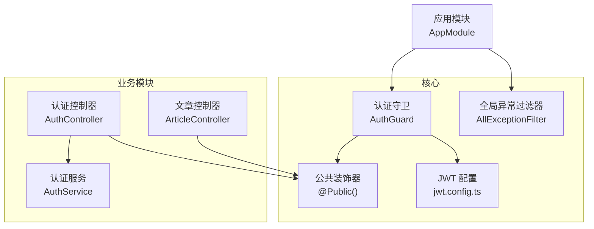
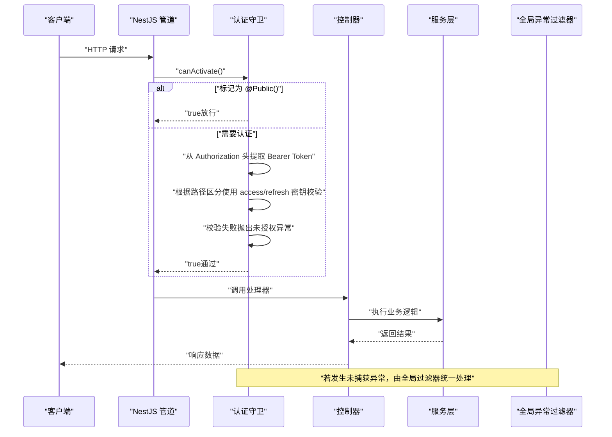
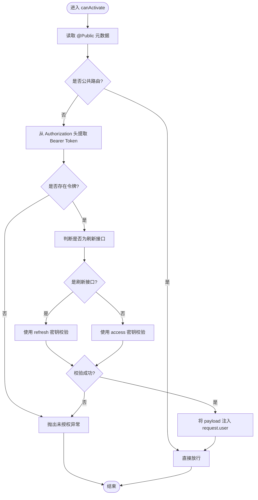
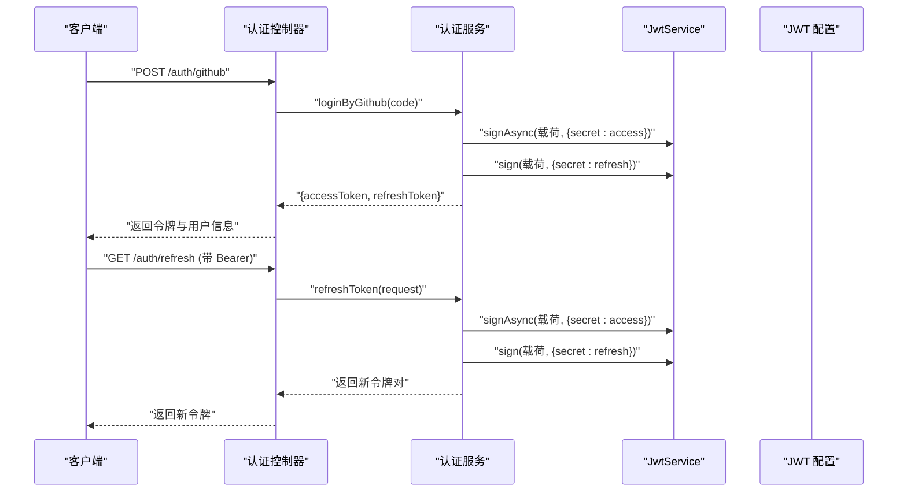
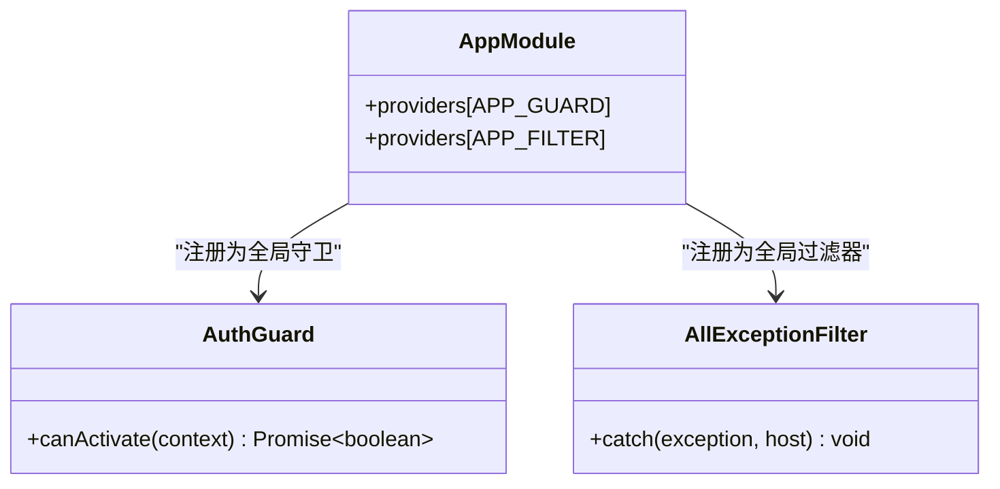
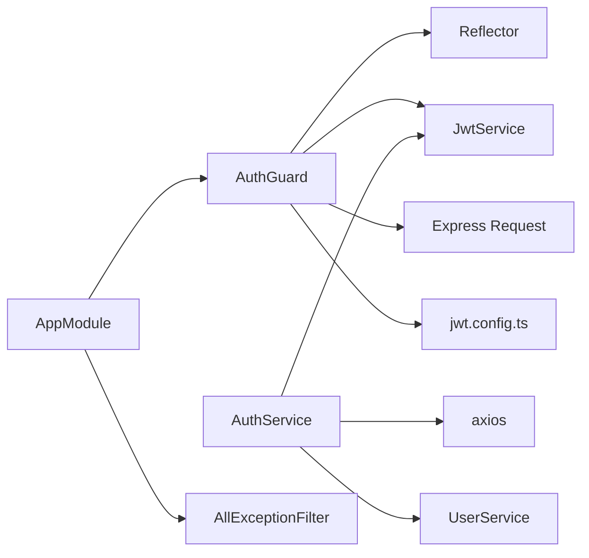

# 认证守卫系统

<cite>
**本文引用的文件**
- [auth.guard.ts](file://src/core/guard/auth.guard.ts)
- [public.decorator.ts](file://src/core/guard/public.decorator.ts)
- [jwt.config.ts](file://src/config/jwt.config.ts)
- [app.module.ts](file://src/app.module.ts)
- [auth.controller.ts](file://src/api/auth/auth.controller.ts)
- [auth.service.ts](file://src/api/auth/auth.service.ts)
- [all-exception.filter.ts](file://src/core/filter/all-exception.filter.ts)
- [article.controller.ts](file://src/api/article/article.controller.ts)
</cite>

## 目录
1. [简介](#简介)
2. [项目结构](#项目结构)
3. [核心组件](#核心组件)
4. [架构总览](#架构总览)
5. [详细组件分析](#详细组件分析)
6. [依赖关系分析](#依赖关系分析)
7. [性能考虑](#性能考虑)
8. [故障排查指南](#故障排查指南)
9. [结论](#结论)
10. [附录](#附录)

## 简介
本技术文档围绕博客系统的认证守卫系统，系统性阐述基于 JWT 的认证流程、令牌验证与用户信息注入机制、公共路由白名单配置、自定义守卫扩展模式、执行顺序与性能优化策略、错误处理规范，以及如何在控制器与方法级别应用不同认证策略并实现基于角色的访问控制（RBAC）。

## 项目结构
认证相关代码主要分布在以下位置：
- 全局守卫与装饰器：core/guard
- JWT 密钥配置：config
- 认证模块：api/auth
- 全局异常过滤器：core/filter
- 全局模块装配：app.module.ts

图表来源
- [app.module.ts:1-35](file://src/app.module.ts#L1-L35)
- [auth.guard.ts:1-53](file://src/core/guard/auth.guard.ts#L1-L53)
- [public.decorator.ts:1-5](file://src/core/guard/public.decorator.ts#L1-L5)
- [jwt.config.ts:1-5](file://src/config/jwt.config.ts#L1-L5)
- [auth.controller.ts:1-29](file://src/api/auth/auth.controller.ts#L1-L29)
- [auth.service.ts:1-123](file://src/api/auth/auth.service.ts#L1-L123)
- [article.controller.ts:1-52](file://src/api/article/article.controller.ts#L1-L52)
- [all-exception.filter.ts:1-43](file://src/core/filter/all-exception.filter.ts#L1-L43)

章节来源
- [app.module.ts:1-35](file://src/app.module.ts#L1-L35)

## 核心组件
- 认证守卫（AuthGuard）：全局启用，负责跳过公共路由、从请求头提取 Bearer Token、校验 Access/Refresh Token，并将载荷挂载到请求对象。
- 公共装饰器（@Public）：用于将方法或类标记为“公开”，使守卫直接放行。
- JWT 配置（jwt.config.ts）：提供 access 与 refresh 两套密钥，分别用于签发和校验两类令牌。
- 全局异常过滤器（AllExceptionFilter）：统一捕获未处理异常，返回标准响应体。
- 认证控制器与服务（AuthController/AuthService）：提供 GitHub 第三方登录与刷新令牌接口，生成并返回双令牌。

章节来源
- [auth.guard.ts:1-53](file://src/core/guard/auth.guard.ts#L1-L53)
- [public.decorator.ts:1-5](file://src/core/guard/public.decorator.ts#L1-L5)
- [jwt.config.ts:1-5](file://src/config/jwt.config.ts#L1-L5)
- [all-exception.filter.ts:1-43](file://src/core/filter/all-exception.filter.ts#L1-L43)
- [auth.controller.ts:1-29](file://src/api/auth/auth.controller.ts#L1-L29)
- [auth.service.ts:1-123](file://src/api/auth/auth.service.ts#L1-L123)

## 架构总览
下图展示了请求进入后的整体处理链路：全局守卫拦截 -> 判断是否公共路由 -> 解析并校验 JWT -> 注入用户信息 -> 业务处理器 -> 异常过滤器兜底。

图表来源
- [auth.guard.ts:1-53](file://src/core/guard/auth.guard.ts#L1-L53)
- [auth.controller.ts:1-29](file://src/api/auth/auth.controller.ts#L1-L29)
- [auth.service.ts:1-123](file://src/api/auth/auth.service.ts#L1-L123)
- [all-exception.filter.ts:1-43](file://src/core/filter/all-exception.filter.ts#L1-L43)

## 详细组件分析

### 认证守卫（AuthGuard）工作原理
- 白名单判定：通过 Reflector 读取方法或类上的元数据 IS_PUBLIC_KEY，若为 true 则直接放行。
- 令牌提取：从请求头的 Authorization 字段中按空格分割，仅接受 Bearer 类型。
- 差异化校验：当请求路径为 /auth/refresh 时，使用 refreshSecretKey 校验；否则使用 accessSecretKey。
- 用户信息注入：校验成功后将 payload 挂载到 request.user，供后续控制器或服务使用。
- 异常处理：缺失令牌或校验失败均抛出未授权异常，交由全局异常过滤器统一返回。

图表来源
- [auth.guard.ts:1-53](file://src/core/guard/auth.guard.ts#L1-L53)
- [public.decorator.ts:1-5](file://src/core/guard/public.decorator.ts#L1-L5)
- [jwt.config.ts:1-5](file://src/config/jwt.config.ts#L1-L5)

章节来源
- [auth.guard.ts:1-53](file://src/core/guard/auth.guard.ts#L1-L53)

### 公共装饰器 @Public() 的实现与用法
- 实现要点：定义元数据键 IS_PUBLIC_KEY，并通过 SetMetadata 设置值为 true。
- 作用范围：可标注在方法或类上，优先级为方法 > 类。
- 典型用法：
  - 在认证入口（如 GitHub 回调）上使用，避免被全局守卫拦截。
  - 在只读列表接口上使用，降低鉴权开销。

章节来源
- [public.decorator.ts:1-5](file://src/core/guard/public.decorator.ts#L1-L5)
- [auth.controller.ts:1-29](file://src/api/auth/auth.controller.ts#L1-L29)
- [article.controller.ts:1-52](file://src/api/article/article.controller.ts#L1-L52)

### 令牌签发与刷新流程（AuthService）
- 双令牌策略：access 令牌短期有效，refresh 令牌长期有效，分别使用不同密钥签名。
- 刷新接口：/auth/refresh 使用 refresh 密钥校验，成功后重新签发一对新令牌。
- 第三方登录：GitHub 回调获取用户信息后，自动注册或更新用户，并签发双令牌。

图表来源
- [auth.controller.ts:1-29](file://src/api/auth/auth.controller.ts#L1-L29)
- [auth.service.ts:1-123](file://src/api/auth/auth.service.ts#L1-L123)
- [jwt.config.ts:1-5](file://src/config/jwt.config.ts#L1-L5)

章节来源
- [auth.service.ts:1-123](file://src/api/auth/auth.service.ts#L1-L123)
- [auth.controller.ts:1-29](file://src/api/auth/auth.controller.ts#L1-L29)

### 全局装配与执行顺序
- 全局守卫：在 AppModule 中以 APP_GUARD 形式注册，对所有路由生效。
- 全局异常过滤器：以 APP_FILTER 形式注册，统一捕获未处理异常。
- 执行顺序（简化）：拦截器 -> 守卫 -> 控制器 -> 服务 -> 响应拦截器 -> 异常过滤器（异常发生时）。

图表来源
- [app.module.ts:1-35](file://src/app.module.ts#L1-L35)
- [auth.guard.ts:1-53](file://src/core/guard/auth.guard.ts#L1-L53)
- [all-exception.filter.ts:1-43](file://src/core/filter/all-exception.filter.ts#L1-L43)

章节来源
- [app.module.ts:1-35](file://src/app.module.ts#L1-L35)

### 自定义守卫创建指南与扩展模式
- 基本步骤：
  1) 实现 CanActivate 接口，编写 canActivate 逻辑。
  2) 使用 Reflector 读取自定义元数据（例如角色、权限标识）。
  3) 在控制器或方法上使用装饰器注入元数据。
  4) 按需注册为局部或全局守卫。
- 常见扩展点：
  - 基于角色的访问控制（RBAC）：在元数据中声明所需角色，守卫对比 request.user.role。
  - 基于资源的访问控制（ABAC）：结合资源上下文进行细粒度判断。
  - 多策略组合：在同一控制器内对不同方法应用不同守卫。

章节来源
- [auth.guard.ts:1-53](file://src/core/guard/auth.guard.ts#L1-L53)
- [public.decorator.ts:1-5](file://src/core/guard/public.decorator.ts#L1-L5)

### 控制器与方法级别的认证策略应用
- 方法级白名单：在特定方法上使用 @Public() 跳过鉴权（如文章列表、GitHub 登录）。
- 类级白名单：在控制器类上使用 @Public() 使其所有方法均无需鉴权。
- 默认行为：未显式标记的方法受全局守卫保护，必须携带有效令牌。

章节来源
- [article.controller.ts:1-52](file://src/api/article/article.controller.ts#L1-L52)
- [auth.controller.ts:1-29](file://src/api/auth/auth.controller.ts#L1-L29)

### 基于角色的访问控制（RBAC）设计建议
- 在用户载荷中携带角色信息（例如 role），由登录流程写入。
- 定义角色元数据装饰器（例如 RequireRoles([...])），在方法或类上声明所需角色。
- 在自定义守卫中读取角色元数据并与 request.user.role 比对，不满足则拒绝访问。
- 结合 @Public() 与 RBAC 守卫，可实现“公开 + 受限”的组合策略。

章节来源
- [auth.service.ts:1-123](file://src/api/auth/auth.service.ts#L1-L123)
- [auth.guard.ts:1-53](file://src/core/guard/auth.guard.ts#L1-L53)

## 依赖关系分析
- 组件耦合：
  - AuthGuard 依赖 Reflector、JwtService、Express Request 与 JWT 配置。
  - AuthService 依赖 JwtService、外部 OAuth 服务与用户服务。
  - 全局装配集中在 AppModule。
- 外部依赖：
  - @nestjs/jwt：令牌签发与校验。
  - axios：调用 GitHub OAuth 接口。
  - express：访问请求头与 URL。

图表来源
- [auth.guard.ts:1-53](file://src/core/guard/auth.guard.ts#L1-L53)
- [auth.service.ts:1-123](file://src/api/auth/auth.service.ts#L1-L123)
- [jwt.config.ts:1-5](file://src/config/jwt.config.ts#L1-L5)
- [app.module.ts:1-35](file://src/app.module.ts#L1-L35)
- [all-exception.filter.ts:1-43](file://src/core/filter/all-exception.filter.ts#L1-L43)

章节来源
- [auth.guard.ts:1-53](file://src/core/guard/auth.guard.ts#L1-L53)
- [auth.service.ts:1-123](file://src/api/auth/auth.service.ts#L1-L123)
- [app.module.ts:1-35](file://src/app.module.ts#L1-L35)

## 性能考虑
- 最小化鉴权开销：
  - 对只读接口使用 @Public() 减少不必要的令牌校验。
  - 合理划分公开与私有路由，避免全量保护带来的额外开销。
- 令牌校验优化：
  - 确保密钥配置正确且稳定，避免频繁切换导致缓存失效。
  - 对于高频刷新场景，可在服务端增加刷新令牌的黑名单或滑动窗口策略（需自行扩展）。
- 并发与异步：
  - 使用异步校验与签发，避免阻塞事件循环。
- 日志与监控：
  - 在守卫中记录关键指标（如校验耗时、失败率），便于定位瓶颈。

## 故障排查指南
- 常见错误与定位：
  - 未携带令牌或格式不正确：检查 Authorization 头是否为 Bearer <token>。
  - 令牌过期或签名无效：确认 access/refresh 密钥配置是否正确，核对签发时间与有效期。
  - 刷新接口鉴权失败：确认请求路径为 /auth/refresh 且携带有效的 refresh 令牌。
- 统一异常输出：
  - 未授权异常会被全局异常过滤器捕获，返回包含状态码、消息与请求上下文的响应体，便于前端快速定位问题。

章节来源
- [auth.guard.ts:1-53](file://src/core/guard/auth.guard.ts#L1-L53)
- [all-exception.filter.ts:1-43](file://src/core/filter/all-exception.filter.ts#L1-L43)

## 结论
本系统通过全局认证守卫与公共装饰器实现了灵活的鉴权策略：默认保护所有路由，支持方法/类级白名单，并在刷新接口中采用独立的密钥校验。结合统一的异常过滤器，提供了清晰的可观测性与错误反馈。在此基础上，可通过自定义守卫轻松扩展 RBAC/ABAC 等更细粒度的访问控制策略。

## 附录
- 最佳实践清单：
  - 始终使用 HTTPS 传输令牌。
  - 将敏感密钥置于环境变量或配置中心。
  - 对敏感操作增加二次校验（如密码确认、短信验证码）。
  - 定期轮换密钥并评估令牌有效期。
- 参考路径：
  - 全局守卫与装饰器：[auth.guard.ts](file://src/core/guard/auth.guard.ts), [public.decorator.ts](file://src/core/guard/public.decorator.ts)
  - JWT 配置：[jwt.config.ts](file://src/config/jwt.config.ts)
  - 全局装配：[app.module.ts](file://src/app.module.ts)
  - 认证接口：[auth.controller.ts](file://src/api/auth/auth.controller.ts), [auth.service.ts](file://src/api/auth/auth.service.ts)
  - 示例公开路由：[article.controller.ts](file://src/api/article/article.controller.ts)
  - 统一异常处理：[all-exception.filter.ts](file://src/core/filter/all-exception.filter.ts)