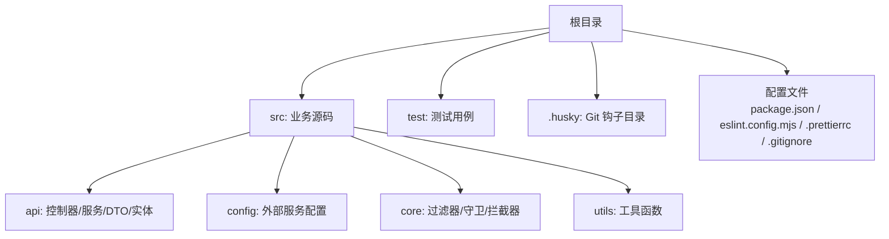
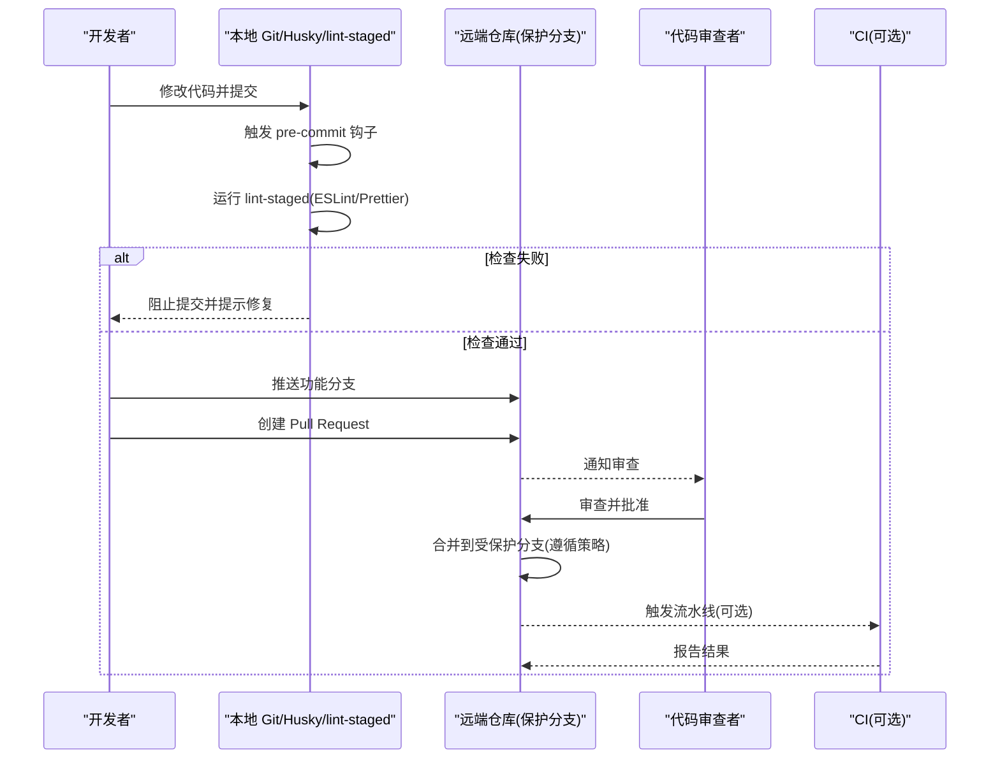
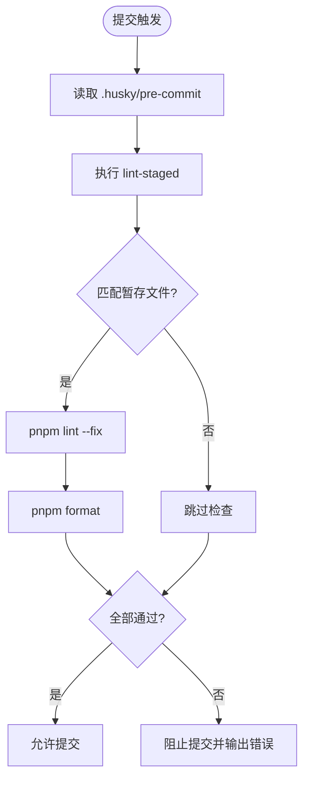
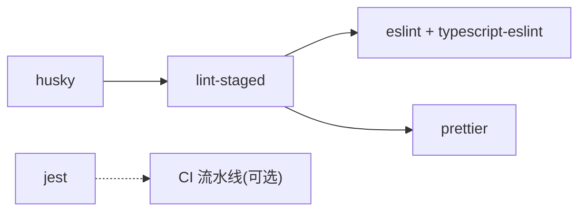

# Git 工作流

<cite>
**本文引用的文件**   
- [package.json](file://package.json)
- [.prettierrc](file://.prettierrc)
- [eslint.config.mjs](file://eslint.config.mjs)
- [.gitignore](file://.gitignore)
</cite>

## 目录
1. [简介](#简介)
2. [项目结构](#项目结构)
3. [核心组件](#核心组件)
4. [架构总览](#架构总览)
5. [详细组件分析](#详细组件分析)
6. [依赖分析](#依赖分析)
7. [性能考虑](#性能考虑)
8. [故障排查指南](#故障排查指南)
9. [结论](#结论)
10. [附录](#附录)

## 简介
本规范为博客系统制定统一的 Git 工作流与协作约定，覆盖分支管理、提交信息规范、代码审查流程、Husky 钩子配置、冲突解决策略、版本发布管理与团队协作最佳实践。目标是降低协作成本、提升代码质量与可追溯性，确保主分支始终处于可发布状态。

## 项目结构
仓库采用 NestJS 标准工程结构，包含 API 模块、通用 DTO/实体、配置、拦截器与守卫等。根目录提供脚本命令与工具链配置（ESLint、Prettier、lint-staged），用于在本地执行格式化、检查与测试。

[本节未直接分析具体文件，故不附“章节来源”]

## 核心组件
围绕 Git 工作流的关键工程化能力如下：
- 脚本命令：构建、格式化、代码检查、测试等，便于统一执行与集成 CI。
- 代码质量工具：ESLint + Prettier + lint-staged，保证提交前代码风格一致与基础错误拦截。
- Husky：Git 钩子框架，用于在 pre-commit 阶段触发 lint-staged 检查。
- 忽略规则：.gitignore 排除构建产物、日志、IDE 配置与环境变量，避免污染仓库。

**章节来源**
- [package.json:8-21](file://package.json#L8-L21)
- [package.json:93-98](file://package.json#L93-L98)
- [eslint.config.mjs:1-68](file://eslint.config.mjs#L1-L68)
- [.prettierrc:1-5](file://.prettierrc#L1-L5)
- [.gitignore:1-57](file://.gitignore#L1-L57)

## 架构总览
下图展示从开发者提交到合并的端到端流程，包括本地钩子检查、远程保护分支与合并策略。

[此图为概念流程图，不映射具体源文件，故不附“图示来源”]

## 详细组件分析

### 分支管理策略
- 主分支
  - main/master：生产可用分支，禁止直接推送；仅允许通过 Pull Request 合并。
  - develop：集成开发分支，日常功能聚合，稳定后打标签或合并至主分支。
- 功能分支
  - 命名规范：feature/<编号>-<简述>，例如 feature/101-user-auth。
  - 生命周期：从 develop 切出，完成后发起 PR 合并回 develop。
- 修复分支
  - 命名规范：fix/<编号>-<简述>，例如 fix/102-login-error。
  - 目标分支：若为线上紧急修复，PR 合并至 main；否则合并至 develop。
- 发布分支
  - 命名规范：release/vX.Y.Z，用于冻结变更、回归测试与打标签。
  - 合并路径：release -> main 与 release -> develop（保持双同步）。
- 热修复分支
  - 命名规范：hotfix/<编号>-<简述>，直接从 main 切出，修复后合并回 main 与 develop。
- 分支保护建议
  - 启用 require pull request reviews（至少 1 人）。
  - 启用 require status checks（如构建/测试通过）。
  - 禁止 force push 与删除受保护分支。

[本节为通用规范说明，不直接分析具体文件，故不附“章节来源”]

### 提交信息规范（Commit Message）
- 格式约定
  - 类型: 描述
  - 类型范围：feat, fix, docs, style, refactor, perf, test, build, ci, chore, revert
  - 描述要求：简洁明确，使用祈使句，首字母小写，末尾不加句号。
  - 可选正文：解释动机、影响面、迁移步骤等。
- 示例模板
  - feat(auth): 新增邮箱验证码登录流程
  - fix(article): 修复分页参数校验缺失问题
  - refactor(core): 抽取公共异常过滤器逻辑
  - chore(deps): 升级 husky 与 lint-staged 版本
- 自动化辅助
  - 可在后续引入 commitlint 对提交信息进行校验（当前仓库未内置）。

[本节为通用规范说明，不直接分析具体文件，故不附“章节来源”]

### 代码审查流程与 Pull Request 模板
- 审查流程
  - 创建 PR：选择目标分支（develop/main），填写变更背景与影响范围。
  - 自动检查：CI 需通过（构建、测试、覆盖率阈值）。
  - 人工审查：至少 1 名 reviewer 批准后方可合并。
  - 合并策略：优先使用 Squash Merge 或 Rebase Merge，保持历史整洁。
- PR 模板要点
  - 变更概述
  - 相关 Issue/任务链接
  - 自测清单（单元测试、E2E、手动验证）
  - 风险与回滚方案
  - 截图/录屏（如涉及 UI）

[本节为通用规范说明，不直接分析具体文件，故不附“章节来源”]

### Husky 钩子与预提交检查
- 现状
  - 仓库已安装 husky 与 lint-staged，但 .husky 目录下尚未发现预定义钩子脚本。
- 建议配置
  - 在 .husky/pre-commit 中调用 lint-staged，使其在提交前对暂存文件执行 ESLint 与 Prettier。
  - 可选：增加 pre-push 钩子以在推送前运行测试。
- 关键脚本与配置
  - package.json 中的 scripts 定义了 format、lint、test 等命令。
  - lint-staged 配置将匹配 ts/js/json 文件，依次执行 lint 与 format。
  - ESLint 与 Prettier 规则位于 eslint.config.mjs 与 .prettierrc。

**图示来源**
- [package.json:8-21](file://package.json#L8-L21)
- [package.json:93-98](file://package.json#L93-L98)
- [eslint.config.mjs:1-68](file://eslint.config.mjs#L1-L68)
- [.prettierrc:1-5](file://.prettierrc#L1-L5)

**章节来源**
- [package.json:8-21](file://package.json#L8-L21)
- [package.json:93-98](file://package.json#L93-L98)
- [eslint.config.mjs:1-68](file://eslint.config.mjs#L1-L68)
- [.prettierrc:1-5](file://.prettierrc#L1-L5)

### 冲突解决策略
- 预防优于解决
  - 频繁从目标分支（develop/main）rebase 到功能分支，减少大冲突。
  - 小步提交，PR 尽量小而精。
- 常见冲突场景
  - 同一文件多处改动：按模块拆分提交，必要时协商重构边界。
  - 合并顺序导致重复逻辑：优先保留最新语义，清理冗余。
- 操作步骤
  - 拉取最新目标分支并 rebase 到功能分支。
  - 逐个文件解决冲突，确保通过 lint/format/test。
  - 更新 PR 并重新触发审查与 CI。

[本节为通用规范说明，不直接分析具体文件，故不附“章节来源”]

### 版本发布管理
- 版本号规范：遵循语义化版本（SemVer）MAJOR.MINOR.PATCH。
- 发布流程
  - 从 develop 或 main 创建 release/vX.Y.Z 分支。
  - 冻结变更，仅允许文档与补丁修复。
  - 运行完整测试套件与构建，确认无告警。
  - 合并至 main 与 develop，并在 main 上打标签 vX.Y.Z。
  - 生成变更日志（Changelog）与发布说明。
- 自动化建议
  - 在 CI 中根据 tag 自动构建制品并发布。

[本节为通用规范说明，不直接分析具体文件，故不附“章节来源”]

### 团队协作最佳实践
- 分支即契约：每个特性一个分支，PR 即契约。
- 小步快跑：短周期提交，清晰描述变更意图。
- 先测试后合并：本地通过测试再提 PR，减少 CI 阻塞。
- 审查即学习：积极评论与建议，关注可读性与可维护性。
- 文档同步：接口/配置变更同步更新 README 或 Wiki。

[本节为通用规范说明，不直接分析具体文件，故不附“章节来源”]

### 常见问题解决方案
- Husky 钩子未生效
  - 确认 .husky 目录存在且包含 pre-commit 脚本。
  - 检查脚本权限与执行环境（Windows 下注意换行符）。
  - 使用 npx husky install 初始化钩子。
- lint-staged 未匹配文件
  - 核对 package.json 中 lint-staged 的 glob 模式是否包含目标扩展名。
- ESLint/Prettier 冲突
  - 确保 eslint-config-prettier 与 prettier 规则一致，避免相互覆盖。
- 提交被阻止
  - 查看终端输出的具体错误信息，逐项修复后再提交。

[本节为通用规范说明，不直接分析具体文件，故不附“章节来源”]

## 依赖分析
以下依赖与工作流密切相关：
- husky：Git 钩子框架，用于在 pre-commit 等阶段执行脚本。
- lint-staged：仅对暂存文件执行检查，提高提交效率。
- eslint 与 @typescript-eslint：静态检查与 TypeScript 支持。
- prettier：统一代码风格。
- jest：单元测试与覆盖率统计。

**图示来源**
- [package.json:22-74](file://package.json#L22-L74)

**章节来源**
- [package.json:22-74](file://package.json#L22-L74)

## 性能考虑
- 缩小检查范围：lint-staged 仅处理暂存文件，避免全量扫描。
- 并行与增量：在 CI 中使用缓存与增量构建，缩短流水线时间。
- 合理配置 ESLint 规则：关闭不必要的严格规则，聚焦关键错误。
- 控制测试规模：按模块拆分测试，按需运行受影响用例。

[本节为通用指导，不直接分析具体文件，故不附“章节来源”]

## 故障排查指南
- 本地无法提交
  - 检查 pre-commit 钩子是否存在与可执行。
  - 查看 lint-staged 输出定位具体文件与错误。
- 提交后仍出现格式不一致
  - 确认编辑器保存时自动格式化开启，并与 Prettier 配置一致。
- CI 失败
  - 对照本地测试结果，复现问题；检查环境变量与依赖版本。

**章节来源**
- [package.json:8-21](file://package.json#L8-L21)
- [package.json:93-98](file://package.json#L93-L98)
- [eslint.config.mjs:1-68](file://eslint.config.mjs#L1-L68)
- [.prettierrc:1-5](file://.prettierrc#L1-L5)

## 结论
通过明确的分支策略、提交规范、审查流程与本地钩子检查，团队可以在保证代码质量的同时提升协作效率。建议在现有工程基础上尽快落地 Husky 预提交钩子，并结合 CI 形成闭环，持续优化发布节奏与稳定性。

[本节为总结性内容，不直接分析具体文件，故不附“章节来源”]

## 附录
- 常用命令参考
  - 安装依赖：pnpm install
  - 构建：pnpm run build
  - 格式化：pnpm run format
  - 检查：pnpm run lint
  - 测试：pnpm run test / pnpm run test:e2e
- 忽略规则
  - .gitignore 已排除 dist、node_modules、日志、IDE 配置与环境变量，避免污染仓库。

**章节来源**
- [package.json:8-21](file://package.json#L8-L21)
- [.gitignore:1-57](file://.gitignore#L1-L57)