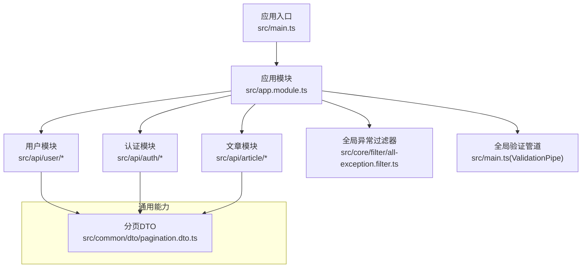
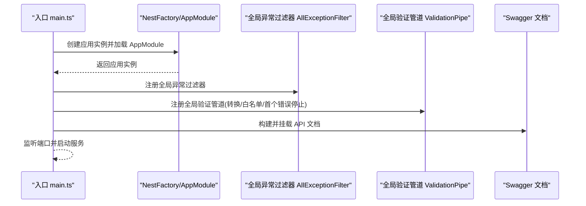
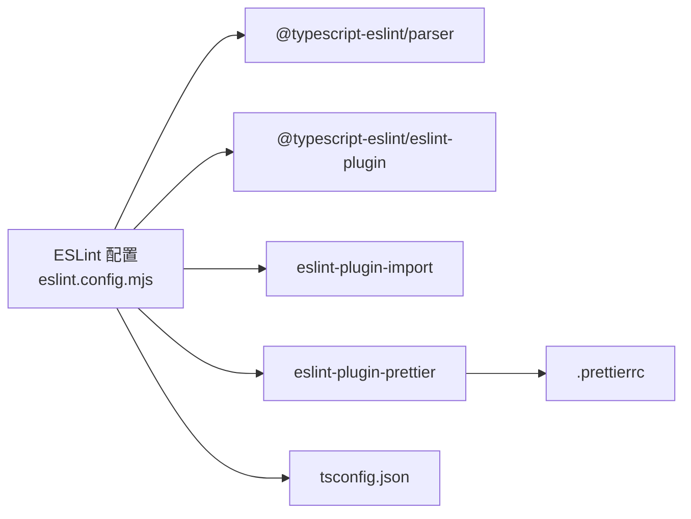

# 代码规范

<cite>
**本文引用的文件**   
- [eslint.config.mjs](file://eslint.config.mjs)
- [.prettierrc](file://.prettierrc)
- [package.json](file://package.json)
- [tsconfig.json](file://tsconfig.json)
- [src/main.ts](file://src/main.ts)
- [src/app.module.ts](file://src/app.module.ts)
- [src/common/dto/pagination.dto.ts](file://src/common/dto/pagination.dto.ts)
- [src/api/article/dto/article.dto.ts](file://src/api/article/dto/article.dto.ts)
- [src/api/user/dto/user.dto.ts](file://src/api/user/dto/user.dto.ts)
- [src/api/auth/dto/auth.dto.ts](file://src/api/auth/dto/auth.dto.ts)
- [src/api/article/entities/article.entity.ts](file://src/api/article/entities/article.entity.ts)
- [src/api/user/entities/user.entity.ts](file://src/api/user/entities/user.entity.ts)
- [src/api/auth/entities/email-code.entity.ts](file://src/api/auth/entities/email-code.entity.ts)
- [src/core/filter/all-exception.filter.ts](file://src/core/filter/all-exception.filter.ts)
</cite>

## 目录
1. [简介](#简介)
2. [项目结构](#项目结构)
3. [核心组件](#核心组件)
4. [架构总览](#架构总览)
5. [详细组件分析](#详细组件分析)
6. [依赖分析](#依赖分析)
7. [性能考虑](#性能考虑)
8. [故障排查指南](#故障排查指南)
9. [结论](#结论)
10. [附录](#附录)

## 简介
本规范面向博客系统（基于 NestJS + TypeScript）的团队协作与工程化质量保障，覆盖以下方面：
- ESLint 规则配置：TypeScript 语法检查、导入排序、语句间距等
- Prettier 格式化：缩进、引号、尾逗号、换行符等
- TypeScript 编码最佳实践：类型定义、接口设计、装饰器使用
- 文件命名约定、目录结构与模块划分原则
- 代码审查清单与常见反模式示例
- IDE 配置建议，确保团队开发环境一致性

## 项目结构
本项目采用按“领域/功能”划分的目录组织方式，结合通用能力层与核心基础设施层：
- src/api：业务域模块（用户、认证、文章），每个模块包含 controller/service/module/dto/entity 等子目录
- src/common：跨模块复用 DTO 或工具（如分页 DTO）
- src/config：外部依赖的配置对象（数据库、JWT、第三方服务）
- src/core：全局过滤器、守卫、拦截器等横切关注点
- src/utils：通用工具函数
- test：端到端测试
- 根级配置文件：ESLint、Prettier、TypeScript、包脚本与 Git Hooks

图示来源
- [src/main.ts:1-46](file://src/main.ts#L1-L46)
- [src/app.module.ts:1-35](file://src/app.module.ts#L1-L35)
- [src/common/dto/pagination.dto.ts:1-17](file://src/common/dto/pagination.dto.ts#L1-L17)

章节来源
- [src/main.ts:1-46](file://src/main.ts#L1-L46)
- [src/app.module.ts:1-35](file://src/app.module.ts#L1-L35)

## 核心组件
本节聚焦与代码规范直接相关的工程化组件与配置。

- ESLint 配置要点
  - 使用 @typescript-eslint/parser 与 plugin，启用 recommended 规则集
  - 集成 eslint-plugin-prettier，将 Prettier 作为 ESLint 规则执行
  - import/order 强制导入分组与空行分隔
  - padding-line-between-statements 统一语句间空行
  - 关闭 no-explicit-any 以兼容现有代码（建议在后续逐步消除 any）

- Prettier 配置要点
  - 单引号、尾逗号全量开启
  - 通过 ESLint 的 prettier/prettier 规则进行校验与自动修复

- TypeScript 编译选项要点
  - 启用装饰器元数据与实验性装饰器
  - 严格 null 检查开启，路径别名 @/* 指向 src/*
  - 输出目录 dist，sourceMap 开启便于调试

- 脚本与 Git Hooks
  - lint/format/start/build/test 等脚本
  - lint-staged 在提交前对 ts/js/json 执行 lint 与 format

章节来源
- [eslint.config.mjs:1-68](file://eslint.config.mjs#L1-L68)
- [.prettierrc:1-5](file://.prettierrc#L1-L5)
- [tsconfig.json:1-25](file://tsconfig.json#L1-L25)
- [package.json:1-100](file://package.json#L1-L100)

## 架构总览
下图展示应用启动时关键横切能力的装配顺序与职责边界，包括全局过滤器、验证管道与 Swagger 文档初始化。

图示来源
- [src/main.ts:1-46](file://src/main.ts#L1-L46)
- [src/app.module.ts:1-35](file://src/app.module.ts#L1-L35)

## 详细组件分析

### ESLint 规则与导入规范
- 语言与解析
  - ECMAScript 2020，ES Module 源类型
  - 使用 typescript-eslint parser 并关联 tsconfig.json 进行类型感知检查
- 插件与推荐规则
  - 启用 @typescript-eslint/recommended 与 prettier/recommended
  - 将 prettier/prettier 设为 error，endOfLine 为 auto
- 导入排序
  - 分组：内置/外部 -> 内部 -> 父/兄弟/index
  - 组间必须有空行
- 语句间距
  - return 前、指令前后、块语句前后、函数前后、变量声明前后等均有明确空行要求
- 类型相关
  - 当前关闭 no-explicit-any，建议后续逐步替换为具体类型或联合类型

章节来源
- [eslint.config.mjs:1-68](file://eslint.config.mjs#L1-L68)

### Prettier 格式标准
- 引号：单引号
- 尾逗号：全部场景
- 与其他工具的协作：通过 eslint-plugin-prettier 在 lint 阶段统一校验与修复

章节来源
- [.prettierrc:1-5](file://.prettierrc#L1-L5)
- [eslint.config.mjs:29-34](file://eslint.config.mjs#L29-L34)

### TypeScript 编码最佳实践
- 类型定义
  - 优先使用具名类型与接口表达数据结构；DTO 中广泛使用 class-validator 与 class-transformer 注解进行输入校验与类型转换
  - 分页参数 page/pageSize 使用 Type(() => Number) 与 IsInt/Min 约束，避免字符串型数字进入业务层
- 接口设计
  - 对外暴露的 DTO 应最小化字段，按需拆分 Create/Update/Query 三类 DTO，减少歧义
  - 查询 DTO 提供默认值与可选标记，提升健壮性
- 装饰器使用
  - 实体类使用 TypeORM 装饰器映射表结构
  - 控制器与服务可使用 NestJS 装饰器进行路由、依赖注入、权限控制等
  - 注意保持装饰器风格一致，避免混用不同风格的装饰器库

章节来源
- [src/common/dto/pagination.dto.ts:1-17](file://src/common/dto/pagination.dto.ts#L1-L17)
- [src/api/article/dto/article.dto.ts:1-64](file://src/api/article/dto/article.dto.ts#L1-L64)
- [src/api/user/dto/user.dto.ts:1-75](file://src/api/user/dto/user.dto.ts#L1-L75)
- [src/api/auth/dto/auth.dto.ts:1-9](file://src/api/auth/dto/auth.dto.ts#L1-L9)
- [src/api/article/entities/article.entity.ts:1-44](file://src/api/article/entities/article.entity.ts#L1-L44)
- [src/api/user/entities/user.entity.ts:1-57](file://src/api/user/entities/user.entity.ts#L1-L57)
- [src/api/auth/entities/email-code.entity.ts:1-22](file://src/api/auth/entities/email-code.entity.ts#L1-L22)

### 文件命名约定
- 模块与类
  - 模块文件：xxx.module.ts
  - 控制器：xxx.controller.ts
  - 服务：xxx.service.ts
  - DTO：xxx.dto.ts
  - 实体：xxx.entity.ts
  - 过滤器/守卫/拦截器：xxx.filter.ts / xxx.guard.ts / xxx.interceptor.ts
- 大小写与分隔
  - 文件名使用小写加连字符或驼峰（与现有保持一致）
  - 类名使用帕斯卡命名法
- 路径别名
  - 使用 @/* 指向 src/*，统一相对路径引用风格

章节来源
- [tsconfig.json:13-15](file://tsconfig.json#L13-L15)
- [src/app.module.ts:1-35](file://src/app.module.ts#L1-L35)

### 目录结构与模块划分原则
- 按领域分模块：api/{user,auth,article}
- 每个模块内分层：controller/service/module/dto/entity
- 公共能力下沉：common/dto、core/filter、core/guard、core/interceptor
- 配置集中管理：config/*.config.ts
- 入口与装配：main.ts 负责应用启动与全局中间件/过滤器/管道注册；app.module.ts 聚合模块与全局提供者

章节来源
- [src/main.ts:1-46](file://src/main.ts#L1-L46)
- [src/app.module.ts:1-35](file://src/app.module.ts#L1-L35)

### 代码审查清单
- 规范与格式
  - 是否通过 pnpm lint 与 pnpm format？
  - 导入顺序是否符合 import/order 分组与空行要求？
  - 语句间距是否符合 padding-line-between-statements？
  - 是否遵循 Prettier 单引号与尾逗号规范？
- TypeScript 与类型
  - 是否存在不必要的 any？能否替换为具体类型或联合类型？
  - DTO 是否正确使用 class-validator/class-transformer 注解？
  - 实体字段是否与数据库列名/类型一致？
- 安全与健壮性
  - 输入是否经过 ValidationPipe 校验与白名单过滤？
  - 敏感信息是否未硬编码到源码（如密钥、口令）？
  - 异常是否被全局过滤器捕获并返回统一结构？
- 可维护性
  - 模块职责是否单一？是否存在循环依赖？
  - 常量、枚举是否从魔法值中抽离？
  - 注释与文档是否清晰且不过度冗余？

[本节为通用指导，不直接分析具体文件]

### 常见反模式示例与建议
- 使用 any 代替具体类型
  - 建议：使用联合类型、字面量类型或泛型替代 any
- 忽略输入校验
  - 建议：在 DTO 上添加必要的 class-validator 注解，配合 ValidationPipe
- 硬编码配置
  - 建议：将配置迁移至 config/*.config.ts 并通过环境变量注入
- 重复逻辑未抽取
  - 建议：将通用逻辑下沉至 common 或 utils 模块
- 过度耦合
  - 建议：通过依赖注入与接口抽象降低模块间耦合

[本节为通用指导，不直接分析具体文件]

### IDE 配置建议
- VS Code 扩展
  - ESLint、Prettier、TypeScript 语言支持
- 保存时动作
  - 保存时运行 Prettier 格式化
  - 保存时运行 ESLint 自动修复（仅当有改动时）
- 编辑器设置
  - 默认格式化程序设置为 Prettier
  - 禁用编辑器自带的格式化冲突
- 终端脚本
  - 使用 package.json 中的 lint/format 命令进行批量处理
  - 利用 lint-staged 在提交前自动执行

章节来源
- [package.json:8-21](file://package.json#L8-L21)
- [package.json:93-98](file://package.json#L93-L98)

## 依赖分析
下图展示与代码规范相关的依赖关系：ESLint 配置引入的插件与规则来源，以及 Prettier 与 ESLint 的集成方式。

图示来源
- [eslint.config.mjs:1-68](file://eslint.config.mjs#L1-L68)
- [.prettierrc:1-5](file://.prettierrc#L1-L5)
- [tsconfig.json:1-25](file://tsconfig.json#L1-L25)

章节来源
- [eslint.config.mjs:1-68](file://eslint.config.mjs#L1-L68)
- [.prettierrc:1-5](file://.prettierrc#L1-L5)
- [tsconfig.json:1-25](file://tsconfig.json#L1-L25)

## 性能考虑
- 在开发阶段启用 watch 与增量编译，缩短反馈周期
- 合理使用 ValidationPipe 的 stopAtFirstError 以减少不必要的校验开销
- 避免在热路径中进行重型同步操作，必要时异步化
- 合理分页与字段选择，减少数据库往返与序列化成本

[本节为通用指导，不直接分析具体文件]

## 故障排查指南
- 常见问题
  - 导入顺序报错：检查 import/order 分组与 newlines-between 配置
  - 语句间距报错：对照 padding-line-between-statements 的规则项调整空行
  - Prettier 与 ESLint 冲突：确认已启用 eslint-plugin-prettier 并使用其推荐规则
  - 类型检查失败：确认 tsconfig.json 的 project 路径正确且与 ESLint 配置一致
- 定位步骤
  - 运行 pnpm lint 查看具体文件与行号
  - 使用 pnpm format 自动修复格式问题
  - 在 IDE 中打开 Problems 面板，结合 ESLint/Prettier 提示快速修正

章节来源
- [eslint.config.mjs:26-65](file://eslint.config.mjs#L26-L65)
- [package.json:8-21](file://package.json#L8-L21)

## 结论
通过统一的 ESLint 与 Prettier 配置、严格的 TypeScript 类型与装饰器规范、清晰的目录与模块划分，以及完善的审查清单与 IDE 工作流，团队可在保证代码质量的同时提升协作效率。建议持续收敛 any 的使用、完善 DTO 校验与错误响应结构，并将配置与常量进一步外置化，以提升系统的可维护性与安全性。

[本节为总结性内容，不直接分析具体文件]

## 附录
- 常用命令
  - 安装依赖：pnpm install
  - 格式化：pnpm format
  - 代码检查：pnpm lint
  - 启动开发：pnpm start:dev
  - 构建：pnpm build
  - 测试：pnpm test / pnpm test:e2e / pnpm test:cov
- 提交前钩子
  - lint-staged 会在提交时对 ts/js/cjs/mjs/json 执行 lint 与 format，确保入库代码符合规范

章节来源
- [package.json:8-21](file://package.json#L8-L21)
- [package.json:93-98](file://package.json#L93-L98)