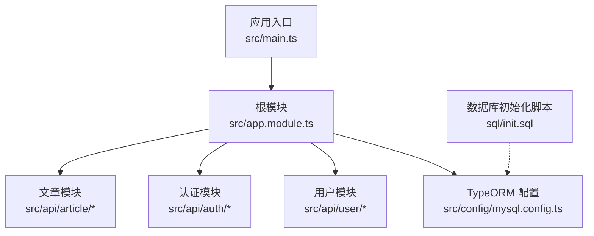
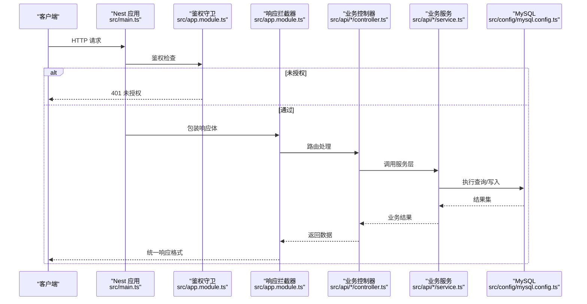
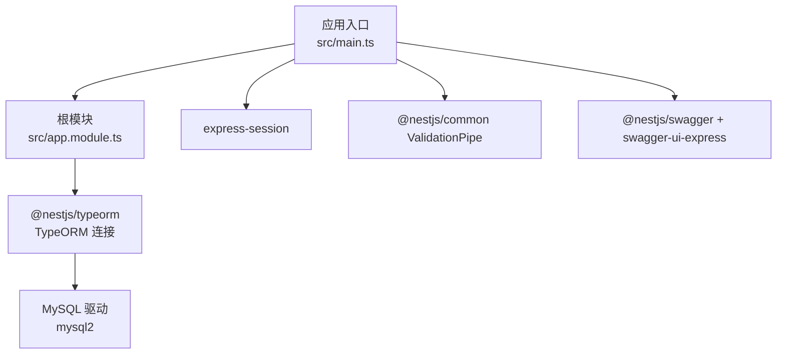

# 开发工具

<cite>
**本文引用的文件**
- [README.md](file://README.md)
- [package.json](file://package.json)
- [nest-cli.json](file://nest-cli.json)
- [src/main.ts](file://src/main.ts)
- [src/app.module.ts](file://src/app.module.ts)
- [src/config/mysql.config.ts](file://src/config/mysql.config.ts)
- [sql/init.sql](file://sql/init.sql)
</cite>

## 目录
1. [简介](#简介)
2. [项目结构](#项目结构)
3. [核心组件](#核心组件)
4. [架构总览](#架构总览)
5. [详细组件分析](#详细组件分析)
6. [依赖分析](#依赖分析)
7. [性能考虑](#性能考虑)
8. [故障排查指南](#故障排查指南)
9. [结论](#结论)
10. [附录](#附录)

## 简介
本章节面向使用 NestJS 构建博客系统的开发者，聚焦“高效的开发工具与调试技巧”。内容涵盖：
- NestJS CLI 的强大能力（模块生成、控制器创建、服务构建等）
- 日志系统配置与使用（不同环境下的级别设置与输出格式定制）
- 性能分析工具（内存泄漏检测、响应时间监控）
- 热重载与开发服务器优化
- 数据库管理工具推荐与 API 调试技巧
- 常用开发脚本与自动化任务配置

## 项目结构
仓库采用典型的 NestJS 分层组织方式：
- src/api：按领域划分模块（用户、认证、文章），每个模块包含 controller、service、dto、entity 等
- src/core：全局过滤器、拦截器、守卫等横切关注点
- src/config：外部依赖的配置（如 TypeORM MySQL 连接）
- sql：数据库初始化脚本
- test：端到端测试用例
- nest-cli.json：NestJS CLI 行为配置
- package.json：脚本命令、依赖与工具链配置

图表来源
- [src/main.ts:1-46](file://src/main.ts#L1-L46)
- [src/app.module.ts:1-35](file://src/app.module.ts#L1-L35)
- [src/config/mysql.config.ts:1-15](file://src/config/mysql.config.ts#L1-L15)
- [sql/init.sql:1-136](file://sql/init.sql#L1-L136)

章节来源
- [README.md:25-72](file://README.md#L25-L72)
- [package.json:8-21](file://package.json#L8-L21)
- [nest-cli.json:1-9](file://nest-cli.json#L1-L9)

## 核心组件
- 应用启动与中间件装配：在入口文件中完成会话、代理信任、全局管道与文档服务的注册。
- 根模块装配：通过 TypeORM 连接数据库，并引入业务模块；同时注册全局异常过滤器、统一响应拦截器与鉴权守卫。
- 数据库配置：集中式 TypeORM 选项，便于在不同环境切换连接参数。
- 数据库初始化：提供 SQL 脚本用于快速建库建表与基础数据准备。

章节来源
- [src/main.ts:1-46](file://src/main.ts#L1-L46)
- [src/app.module.ts:1-35](file://src/app.module.ts#L1-L35)
- [src/config/mysql.config.ts:1-15](file://src/config/mysql.config.ts#L1-L15)
- [sql/init.sql:1-136](file://sql/init.sql#L1-L136)

## 架构总览
下图展示了从请求进入应用到返回响应的关键路径，包括全局过滤器、拦截器、守卫以及 Swagger 文档的挂载位置。

图表来源
- [src/main.ts:1-46](file://src/main.ts#L1-L46)
- [src/app.module.ts:1-35](file://src/app.module.ts#L1-L35)
- [src/config/mysql.config.ts:1-15](file://src/config/mysql.config.ts#L1-L15)

## 详细组件分析

### NestJS CLI 高效开发工作流
- 模块/控制器/服务生成
  - 使用 CLI 快速生成模块、控制器与服务，减少样板代码，保持目录规范一致。
  - 典型命令：
    - 生成模块：nest g module <name>
    - 生成控制器：nest g controller <name>
    - 生成服务：nest g service <name>
- 编译与运行
  - 构建：nest build
  - 开发模式：nest start --watch
  - 调试模式：nest start --debug --watch
- 自定义编译器选项
  - 通过 nest-cli.json 控制编译行为，例如清理输出目录等。

章节来源
- [package.json:8-21](file://package.json#L8-L21)
- [nest-cli.json:1-9](file://nest-cli.json#L1-L9)

### 日志系统配置与使用
- 目标
  - 在不同环境下灵活调整日志级别与输出格式，便于开发与生产排障。
- 建议方案
  - 使用 @nestjs/common 内置 Logger 或第三方适配器（如 winston/pino）。
  - 根据环境变量动态设置日志级别（如 dev 为 debug，prod 为 warn/error）。
  - 将结构化日志输出到文件或标准输出，便于日志采集系统收集。
- 集成要点
  - 在应用启动阶段读取环境变量并初始化日志适配器。
  - 在拦截器/过滤器中记录请求上下文（方法、URL、耗时、状态码等）。
  - 对敏感字段进行脱敏处理。

[本节为通用实践说明，不直接分析具体文件]

### 性能分析与监控
- 内存泄漏检测
  - 使用 Node.js 堆快照与 Chrome DevTools 分析内存增长趋势，定位未释放引用。
  - 在生产环境开启采样式堆快照，结合压测观察峰值与回收情况。
- 响应时间监控
  - 在拦截器中计算请求耗时，记录慢请求并上报指标。
  - 结合 Prometheus/Grafana 或 APM 平台（如 New Relic、Sentry）建立告警。
- 数据库性能
  - 开启 TypeORM 的查询日志（仅开发环境），分析慢查询。
  - 合理设计索引与分页策略，避免 N+1 查询。

[本节为通用实践说明，不直接分析具体文件]

### 热重载与开发服务器优化
- 热重载
  - 使用 nest start --watch 实现源码变更自动重启，提升迭代效率。
- 调试模式
  - 使用 nest start --debug --watch 配合 IDE 断点调试。
- 构建优化
  - 使用 SWC 替代 TSC 加速编译（需安装对应依赖并在构建流程启用）。
- 端口与环境
  - 通过环境变量 PORT 指定监听端口，便于多实例并行开发。

章节来源
- [package.json:8-21](file://package.json#L8-L21)
- [src/main.ts:41-43](file://src/main.ts#L41-L43)

### 数据库管理工具与 API 调试
- 数据库管理
  - 推荐使用可视化工具（如 TablePlus、DBeaver、Navicat）连接 MySQL。
  - 使用提供的初始化脚本快速搭建本地数据库环境。
- API 调试
  - 使用 Swagger UI 在线调试接口，查看请求/响应结构与示例。
  - 使用 Postman/Insomnia 批量调试与自动化回归。
  - 使用 Jest + Supertest 编写 e2e 用例，确保接口契约稳定。

章节来源
- [src/main.ts:29-39](file://src/main.ts#L29-L39)
- [sql/init.sql:1-136](file://sql/init.sql#L1-L136)
- [test/app.e2e-spec.ts:1-25](file://test/app.e2e-spec.ts#L1-L25)

### 常用开发脚本与自动化任务
- 脚本命令
  - 构建：build
  - 格式化：format
  - 代码检查与修复：lint
  - 单元测试与覆盖率：test、test:cov
  - 端到端测试：test:e2e
  - 调试测试：test:debug
- 提交前钩子
  - 使用 husky 与 lint-staged 在提交前执行 lint 与 format，保证代码质量。

章节来源
- [package.json:8-21](file://package.json#L8-L21)
- [package.json:93-98](file://package.json#L93-L98)

## 依赖分析
下图展示应用启动时主要依赖关系与外部集成点。

图表来源
- [src/main.ts:1-46](file://src/main.ts#L1-L46)
- [src/app.module.ts:1-35](file://src/app.module.ts#L1-L35)
- [src/config/mysql.config.ts:1-15](file://src/config/mysql.config.ts#L1-L15)
- [package.json:22-44](file://package.json#L22-L44)

章节来源
- [package.json:22-44](file://package.json#L22-L44)

## 性能考虑
- 在开发环境开启详细日志与查询日志，生产环境关闭以提升吞吐。
- 使用连接池与合理的超时配置，避免数据库成为瓶颈。
- 对热点接口增加缓存层（如 Redis），降低重复计算与 IO 压力。
- 使用压缩与静态资源缓存，减少带宽占用。
- 通过压测发现瓶颈点，针对性优化 CPU/IO/内存使用。

[本节为通用实践说明，不直接分析具体文件]

## 故障排查指南
- 常见问题定位
  - 端口冲突：检查环境变量 PORT 是否被占用。
  - 数据库连接失败：核对 host、port、username、password、database 等配置。
  - 鉴权失败：确认 Token 格式与密钥配置是否正确。
  - 验证错误：检查 DTO 校验规则与管道配置。
- 建议步骤
  - 使用调试模式逐步断点定位问题。
  - 打开详细日志，捕获请求上下文与异常堆栈。
  - 使用 Swagger 与 Postman 复现问题，缩小范围。
  - 针对数据库问题，使用可视化客户端执行最小化 SQL 验证。

章节来源
- [src/main.ts:11-28](file://src/main.ts#L11-L28)
- [src/config/mysql.config.ts:1-15](file://src/config/mysql.config.ts#L1-L15)

## 结论
通过合理使用 NestJS CLI、完善的日志与监控体系、科学的性能分析方法、稳定的数据库管理与 API 调试手段，以及规范的脚本与自动化任务，可以显著提升博客系统的开发效率与交付质量。建议在团队内沉淀最佳实践，持续优化工具链与工作流。

[本节为总结性内容，不直接分析具体文件]

## 附录
- 快速开始
  - 安装依赖：pnpm install
  - 启动开发服务：pnpm run start:dev
  - 构建产物：pnpm run build
  - 运行测试：pnpm run test / pnpm run test:e2e
- 参考文档
  - README 中的运行与部署指引

章节来源
- [README.md:29-72](file://README.md#L29-L72)
- [package.json:8-21](file://package.json#L8-L21)