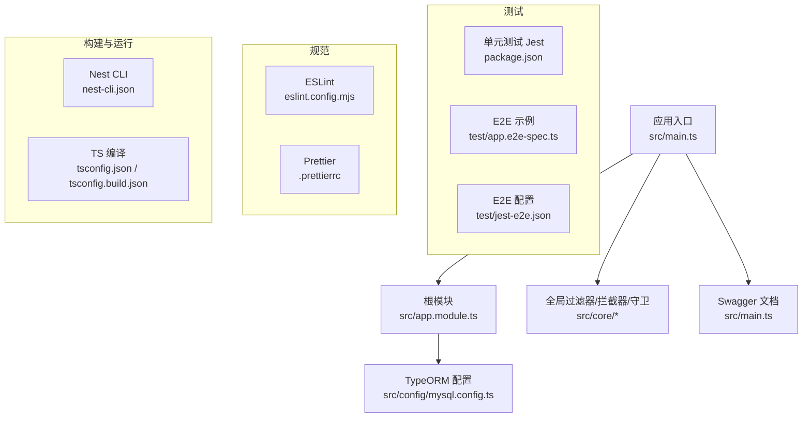
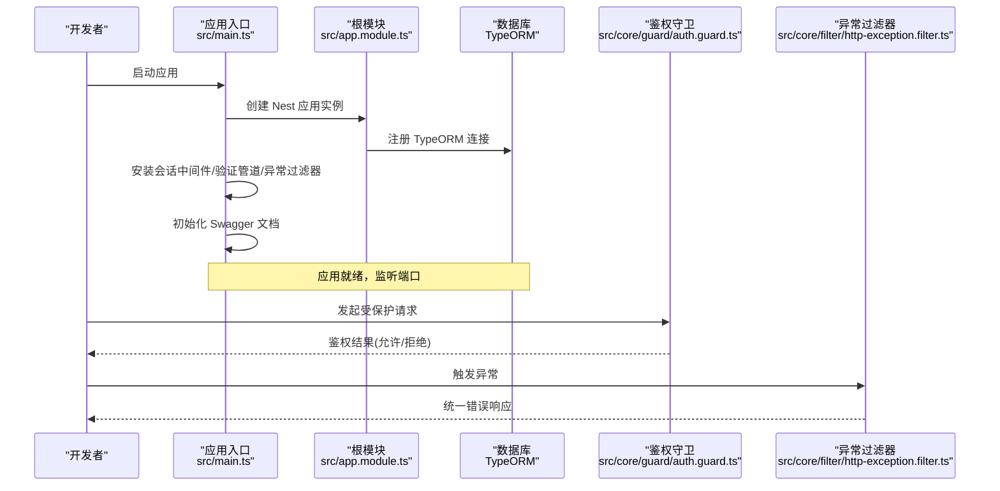
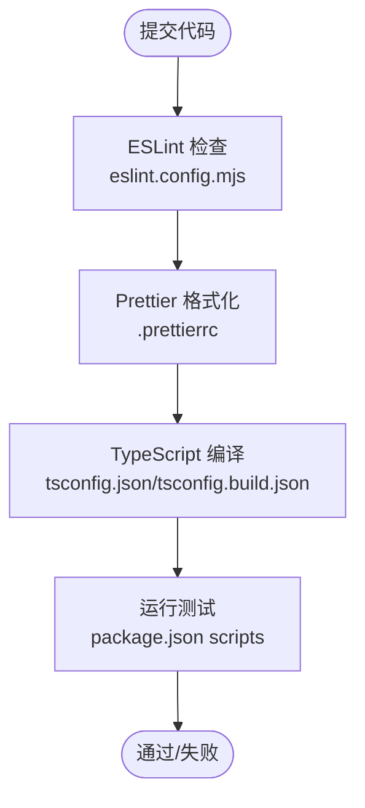
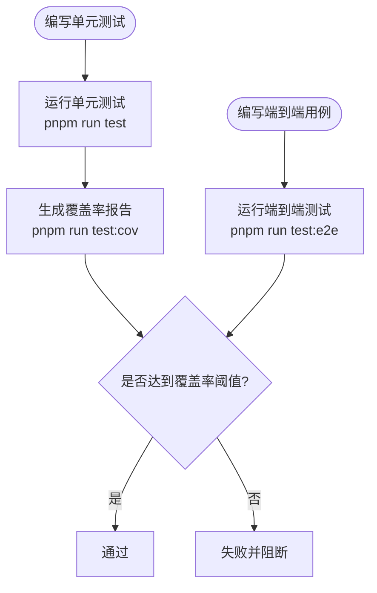
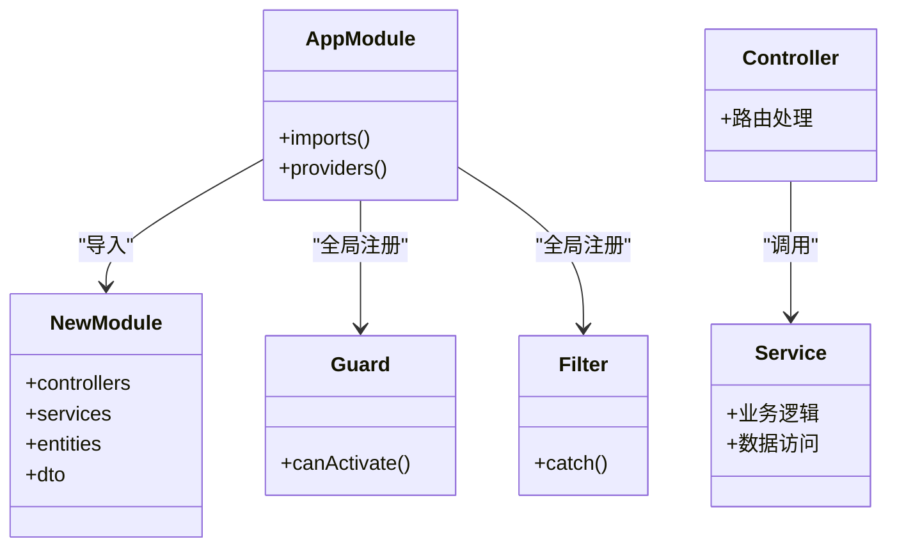
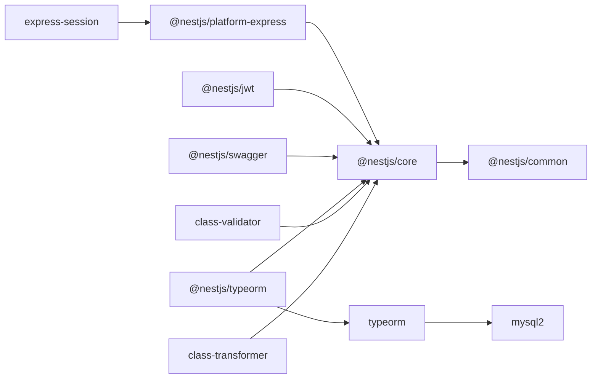

# 开发指南

<cite>
**本文引用的文件**   
- [package.json](file://package.json)
- [README.md](file://README.md)
- [tsconfig.json](file://tsconfig.json)
- [tsconfig.build.json](file://tsconfig.build.json)
- [eslint.config.mjs](file://eslint.config.mjs)
- [.prettierrc](file://.prettierrc)
- [nest-cli.json](file://nest-cli.json)
- [.gitignore](file://.gitignore)
- [src/main.ts](file://src/main.ts)
- [src/app.module.ts](file://src/app.module.ts)
- [src/config/mysql.config.ts](file://src/config/mysql.config.ts)
- [src/core/filter/http-exception.filter.ts](file://src/core/filter/http-exception.filter.ts)
- [src/core/guard/auth.guard.ts](file://src/core/guard/auth.guard.ts)
- [test/app.e2e-spec.ts](file://test/app.e2e-spec.ts)
- [test/jest-e2e.json](file://test/jest-e2e.json)
</cite>

## 目录
1. [简介](#简介)
2. [项目结构](#项目结构)
3. [核心组件](#核心组件)
4. [架构总览](#架构总览)
5. [详细组件分析](#详细组件分析)
6. [依赖分析](#依赖分析)
7. [性能考虑](#性能考虑)
8. [故障排查指南](#故障排查指南)
9. [结论](#结论)
10. [附录](#附录)

## 简介
本指南面向博客系统的后端开发者，目标是帮助团队快速搭建开发环境、统一代码风格与质量门禁、建立完善的测试策略、规范 Git 工作流与分支管理，并提供调试技巧与新模块开发模板。本项目基于 NestJS + TypeORM + MySQL，使用 pnpm 作为包管理器，集成 ESLint 与 Prettier，提供单元测试与端到端测试能力，并内置全局异常处理、鉴权守卫与接口文档。

## 项目结构
- 入口与装配
  - 应用启动入口：[src/main.ts](file://src/main.ts)
  - 根模块装配：[src/app.module.ts](file://src/app.module.ts)
- 配置
  - TypeScript 编译选项：[tsconfig.json](file://tsconfig.json)、[tsconfig.build.json](file://tsconfig.build.json)
  - 数据库连接配置：[src/config/mysql.config.ts](file://src/config/mysql.config.ts)
  - CLI 配置：[nest-cli.json](file://nest-cli.json)
- 代码规范
  - ESLint 规则：[eslint.config.mjs](file://eslint.config.mjs)
  - Prettier 格式化：[.prettierrc](file://.prettierrc)
- 测试
  - 单元测试（Jest）：在 package.json 中定义
  - 端到端测试示例与配置：[test/app.e2e-spec.ts](file://test/app.e2e-spec.ts)、[test/jest-e2e.json](file://test/jest-e2e.json)
- 忽略文件与环境
  - .gitignore：[.gitignore](file://.gitignore)
- 脚本与依赖
  - 脚本与依赖声明：[package.json](file://package.json)
  - 项目说明：[README.md](file://README.md)

**图表来源**
- [src/main.ts:1-46](file://src/main.ts#L1-L46)
- [src/app.module.ts:1-35](file://src/app.module.ts#L1-L35)
- [src/config/mysql.config.ts:1-15](file://src/config/mysql.config.ts#L1-L15)
- [eslint.config.mjs:1-68](file://eslint.config.mjs#L1-L68)
- [.prettierrc:1-5](file://.prettierrc#L1-L5)
- [nest-cli.json:1-9](file://nest-cli.json#L1-L9)
- [tsconfig.json:1-25](file://tsconfig.json#L1-L25)
- [tsconfig.build.json:1-5](file://tsconfig.build.json#L1-L5)
- [test/app.e2e-spec.ts:1-26](file://test/app.e2e-spec.ts#L1-L26)
- [test/jest-e2e.json:1-10](file://test/jest-e2e.json#L1-L10)
- [package.json:1-100](file://package.json#L1-L100)

**章节来源**
- [package.json:1-100](file://package.json#L1-L100)
- [README.md:1-100](file://README.md#L1-L100)
- [tsconfig.json:1-25](file://tsconfig.json#L1-L25)
- [tsconfig.build.json:1-5](file://tsconfig.build.json#L1-L5)
- [eslint.config.mjs:1-68](file://eslint.config.mjs#L1-L68)
- [.prettierrc:1-5](file://.prettierrc#L1-L5)
- [nest-cli.json:1-9](file://nest-cli.json#L1-L9)
- [.gitignore:1-57](file://.gitignore#L1-L57)
- [src/main.ts:1-46](file://src/main.ts#L1-L46)
- [src/app.module.ts:1-35](file://src/app.module.ts#L1-L35)
- [src/config/mysql.config.ts:1-15](file://src/config/mysql.config.ts#L1-L15)
- [test/app.e2e-spec.ts:1-26](file://test/app.e2e-spec.ts#L1-L26)
- [test/jest-e2e.json:1-10](file://test/jest-e2e.json#L1-L10)

## 核心组件
- 应用启动与中间件
  - 会话中间件、信任代理、全局验证管道、全局异常过滤器、Swagger 文档挂载均在入口文件中完成。
- 根模块装配
  - 通过 TypeORM 注册数据库连接，导入业务模块，并在根级别注册全局过滤器、拦截器与守卫。
- 数据库配置
  - 使用 TypeORM 的通用配置对象，启用自动加载实体与日期字符串模式。
- 全局异常过滤器
  - 捕获 HTTP 异常，统一响应格式，并将请求上下文信息附加到返回体中。
- 鉴权守卫
  - 基于 Reflector 的公开路由标记，从请求头提取 Bearer Token，校验 JWT 后将用户载荷注入请求上下文。

**章节来源**
- [src/main.ts:1-46](file://src/main.ts#L1-L46)
- [src/app.module.ts:1-35](file://src/app.module.ts#L1-L35)
- [src/config/mysql.config.ts:1-15](file://src/config/mysql.config.ts#L1-L15)
- [src/core/filter/http-exception.filter.ts:1-37](file://src/core/filter/http-exception.filter.ts#L1-L37)
- [src/core/guard/auth.guard.ts:1-53](file://src/core/guard/auth.guard.ts#L1-L53)

## 架构总览
下图展示了应用启动、全局中间件与核心横切关注点的装配关系。

**图表来源**
- [src/main.ts:1-46](file://src/main.ts#L1-L46)
- [src/app.module.ts:1-35](file://src/app.module.ts#L1-L35)
- [src/core/guard/auth.guard.ts:1-53](file://src/core/guard/auth.guard.ts#L1-L53)
- [src/core/filter/http-exception.filter.ts:1-37](file://src/core/filter/http-exception.filter.ts#L1-L37)

## 详细组件分析

### 开发环境与工具链
- Node.js 与包管理器
  - 推荐使用 pnpm 进行依赖管理与脚本执行。
  - 参考脚本与依赖声明位于 [package.json](file://package.json)。
- IDE 推荐设置
  - 建议开启 ESLint 与 Prettier 插件，保存时自动格式化与修复。
  - 忽略文件已排除常见 IDE 配置与生成目录，见 [.gitignore](file://.gitignore)。
- 常用命令
  - 安装依赖：pnpm install
  - 开发运行：pnpm run start:dev
  - 生产运行：pnpm run start:prod
  - 构建：pnpm run build
  - 格式化：pnpm run format
  - 代码检查：pnpm run lint
  - 单元测试：pnpm run test
  - 端到端测试：pnpm run test:e2e
  - 覆盖率：pnpm run test:cov
  - 调试测试：pnpm run test:debug

**章节来源**
- [package.json:1-100](file://package.json#L1-L100)
- [.gitignore:1-57](file://.gitignore#L1-L57)
- [README.md:1-100](file://README.md#L1-L100)

### 代码规范与风格指南
- ESLint
  - 使用 TypeScript 解析器与插件，集成 import 排序与 Prettier 规则。
  - 强制导入分组与空行分隔，关闭 any 类型告警可按需调整。
  - 配置文件：[eslint.config.mjs](file://eslint.config.mjs)
- Prettier
  - 单引号、尾随逗号等统一风格。
  - 配置文件：[.prettierrc](file://.prettierrc)
- TypeScript 编译选项
  - 目标 ES2021，启用装饰器元数据、路径别名 @/*、严格空指针检查等。
  - 构建配置排除测试与 dist，见 [tsconfig.json](file://tsconfig.json)、[tsconfig.build.json](file://tsconfig.build.json)

**图表来源**
- [eslint.config.mjs:1-68](file://eslint.config.mjs#L1-L68)
- [.prettierrc:1-5](file://.prettierrc#L1-L5)
- [tsconfig.json:1-25](file://tsconfig.json#L1-L25)
- [tsconfig.build.json:1-5](file://tsconfig.build.json#L1-L5)
- [package.json:1-100](file://package.json#L1-L100)

**章节来源**
- [eslint.config.mjs:1-68](file://eslint.config.mjs#L1-L68)
- [.prettierrc:1-5](file://.prettierrc#L1-L5)
- [tsconfig.json:1-25](file://tsconfig.json#L1-L25)
- [tsconfig.build.json:1-5](file://tsconfig.build.json#L1-L5)

### 测试策略
- 单元测试
  - 框架：Jest + ts-jest
  - 匹配规则：*.spec.ts
  - 覆盖率收集范围与输出目录由 package.json 中的 jest 配置控制
- 端到端测试
  - 示例用例：[test/app.e2e-spec.ts](file://test/app.e2e-spec.ts)
  - 独立配置：[test/jest-e2e.json](file://test/jest-e2e.json)
- 覆盖率要求
  - 建议在 CI 中设定最低阈值（如语句/分支/函数/行），未达标则阻断合并。
- 编写规范
  - 每个 Service/Controller 对应 spec 文件；优先对纯逻辑进行隔离测试；对外部依赖使用 Mock。
  - E2E 用例覆盖关键业务流程与边界条件。

**图表来源**
- [package.json:1-100](file://package.json#L1-L100)
- [test/app.e2e-spec.ts:1-26](file://test/app.e2e-spec.ts#L1-L26)
- [test/jest-e2e.json:1-10](file://test/jest-e2e.json#L1-L10)

**章节来源**
- [package.json:1-100](file://package.json#L1-L100)
- [test/app.e2e-spec.ts:1-26](file://test/app.e2e-spec.ts#L1-L26)
- [test/jest-e2e.json:1-10](file://test/jest-e2e.json#L1-L10)

### Git 工作流与分支管理
- 分支模型
  - main：生产可用分支
  - develop：集成开发分支
  - feature/*：功能分支
  - hotfix/*：紧急修复分支
- 提交信息规范
  - 建议使用约定式提交（如 feat/fix/docs/chore 等），便于自动生成变更日志。
- 代码审查流程
  - 所有变更通过 Pull Request 合并至 develop/main，至少一名 Reviewer 批准后方可合并。
- 预提交钩子
  - 项目包含 husky 与 lint-staged，可在提交前自动执行 lint 与 format。
  - 相关脚本与配置参见 [package.json](file://package.json)。

**章节来源**
- [package.json:1-100](file://package.json#L1-L100)

### 调试技巧与常用开发工具
- NestJS CLI
  - 开发模式：pnpm run start:dev
  - 调试模式：pnpm run start:debug
  - 构建：pnpm run build
- 日志查看
  - 控制台输出与应用日志文件（被 .gitignore 忽略）。
- 性能分析
  - 使用 Node 自带的 --inspect 或浏览器 DevTools 进行内存/CPU 分析。
  - 结合 NestJS Devtools 可视化运行时图。
- 接口文档
  - Swagger 文档已在入口中启用，访问路径为 /api-docs。

**章节来源**
- [package.json:1-100](file://package.json#L1-L100)
- [src/main.ts:1-46](file://src/main.ts#L1-L46)
- [.gitignore:1-57](file://.gitignore#L1-L57)

### 新模块开发模板与最佳实践
- 模块组织
  - 按领域划分模块，每个模块包含 controller/service/dto/entity 等子目录。
- 命名与路径
  - 使用小写短横线或驼峰命名保持一致性；路径别名 @/* 简化导入。
- 依赖注入
  - 控制器仅负责请求/响应转换，业务逻辑下沉至服务层。
- 数据校验
  - 使用 DTO + class-validator 进行入参校验，配合全局 ValidationPipe。
- 安全与鉴权
  - 需要保护的控制器方法可移除公开标记，默认由全局守卫校验 JWT。
- 异常与拦截
  - 自定义异常与拦截器遵循全局过滤器/拦截器约定，保持响应结构一致。
- 测试先行
  - 先编写单元测试，再实现业务逻辑；必要时补充 E2E 用例。

**图表来源**
- [src/app.module.ts:1-35](file://src/app.module.ts#L1-L35)
- [src/core/guard/auth.guard.ts:1-53](file://src/core/guard/auth.guard.ts#L1-L53)
- [src/core/filter/http-exception.filter.ts:1-37](file://src/core/filter/http-exception.filter.ts#L1-L37)

**章节来源**
- [src/app.module.ts:1-35](file://src/app.module.ts#L1-L35)
- [src/core/guard/auth.guard.ts:1-53](file://src/core/guard/auth.guard.ts#L1-L53)
- [src/core/filter/http-exception.filter.ts:1-37](file://src/core/filter/http-exception.filter.ts#L1-L37)

## 依赖分析
- 外部依赖
  - 框架与平台：@nestjs/common、@nestjs/core、@nestjs/platform-express
  - 认证与文档：@nestjs/jwt、@nestjs/swagger、swagger-ui-express
  - 数据持久化：@nestjs/typeorm、typeorm、mysql2
  - 工具库：class-transformer、class-validator、bcrypt、nanoid、nodemailer、axios、express-session
- 开发与测试
  - 构建与运行：@nestjs/cli、@nestjs/schematics、ts-node、ts-loader、ts-jest
  - 代码质量：eslint、typescript-eslint、eslint-plugin-import、eslint-plugin-prettier、prettier
  - 测试：jest、supertest、@types/*
- 构建与运行脚本
  - 详见 [package.json](file://package.json)

**图表来源**
- [package.json:1-100](file://package.json#L1-L100)

**章节来源**
- [package.json:1-100](file://package.json#L1-L100)

## 性能考虑
- 数据库
  - 合理设计索引与查询；避免 N+1 查询；分页与字段投影减少传输体积。
- 序列化与校验
  - 合理使用 class-transformer 与 class-validator，避免不必要的转换与校验开销。
- 缓存与会话
  - 热点数据引入缓存；会话存储选择合适后端（如 Redis）以提升扩展性。
- 构建优化
  - 使用 SWC 加速构建（已引入 @swc/core）；按需引入依赖，减小产物体积。
- 监控与分析
  - 接入性能监控与链路追踪；利用 NestJS Devtools 观察运行时状态。

## 故障排查指南
- 常见问题
  - 数据库连接失败：检查 [src/config/mysql.config.ts](file://src/config/mysql.config.ts) 中的主机、端口、用户名、密码与数据库名。
  - 鉴权失败：确认请求头 Authorization 是否为 Bearer Token，以及密钥配置是否正确。
  - 参数校验报错：查看全局异常过滤器返回的请求上下文信息，定位具体字段。
- 日志与调试
  - 开发模式与调试模式命令见 [package.json](file://package.json)。
  - 控制台输出与日志文件路径见 [.gitignore](file://.gitignore)。
- 测试问题
  - 单元测试与 E2E 测试分别使用不同配置，确保路径与正则匹配正确，见 [package.json](file://package.json)、[test/jest-e2e.json](file://test/jest-e2e.json)。

**章节来源**
- [src/config/mysql.config.ts:1-15](file://src/config/mysql.config.ts#L1-L15)
- [src/core/filter/http-exception.filter.ts:1-37](file://src/core/filter/http-exception.filter.ts#L1-L37)
- [src/core/guard/auth.guard.ts:1-53](file://src/core/guard/auth.guard.ts#L1-L53)
- [package.json:1-100](file://package.json#L1-L100)
- [.gitignore:1-57](file://.gitignore#L1-L57)
- [test/jest-e2e.json:1-10](file://test/jest-e2e.json#L1-L10)

## 结论
通过统一的开发环境、严格的代码规范、完善的测试策略与清晰的 Git 工作流，团队可以高效协作并持续交付高质量的后端服务。建议将上述规范纳入 CI 流水线，确保每次提交都经过自动化检查与测试。

## 附录
- 环境变量
  - 端口：PORT（默认 3001）
  - 数据库：host、port、username、password、database（见 [src/config/mysql.config.ts](file://src/config/mysql.config.ts)）
- 常用路径
  - 接口文档：/api-docs
  - 构建产物：dist
  - 测试报告：coverage