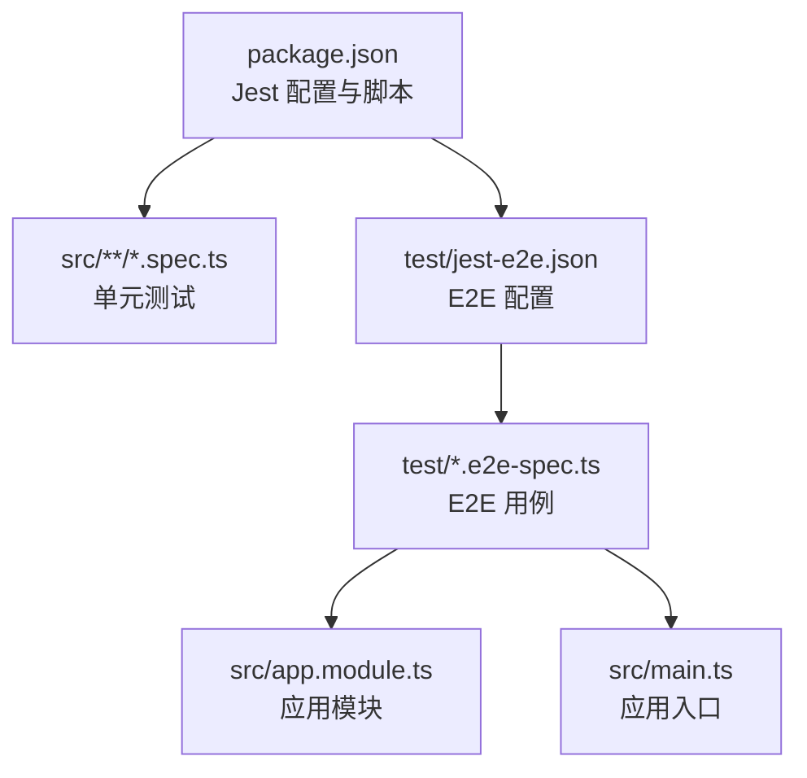
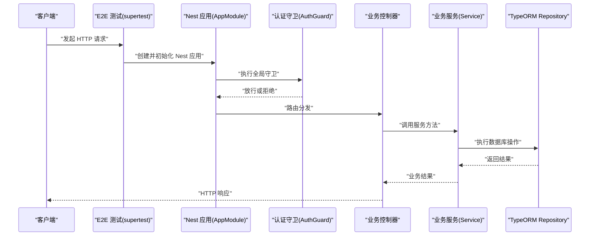
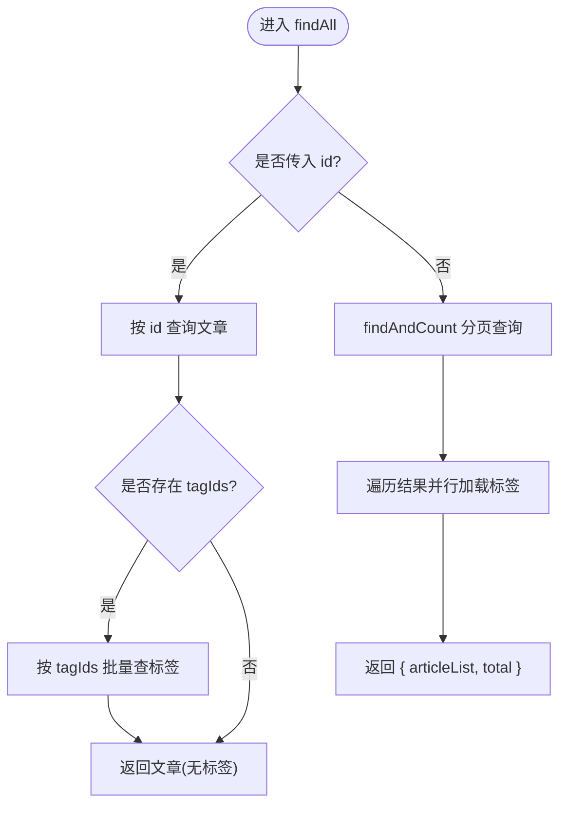
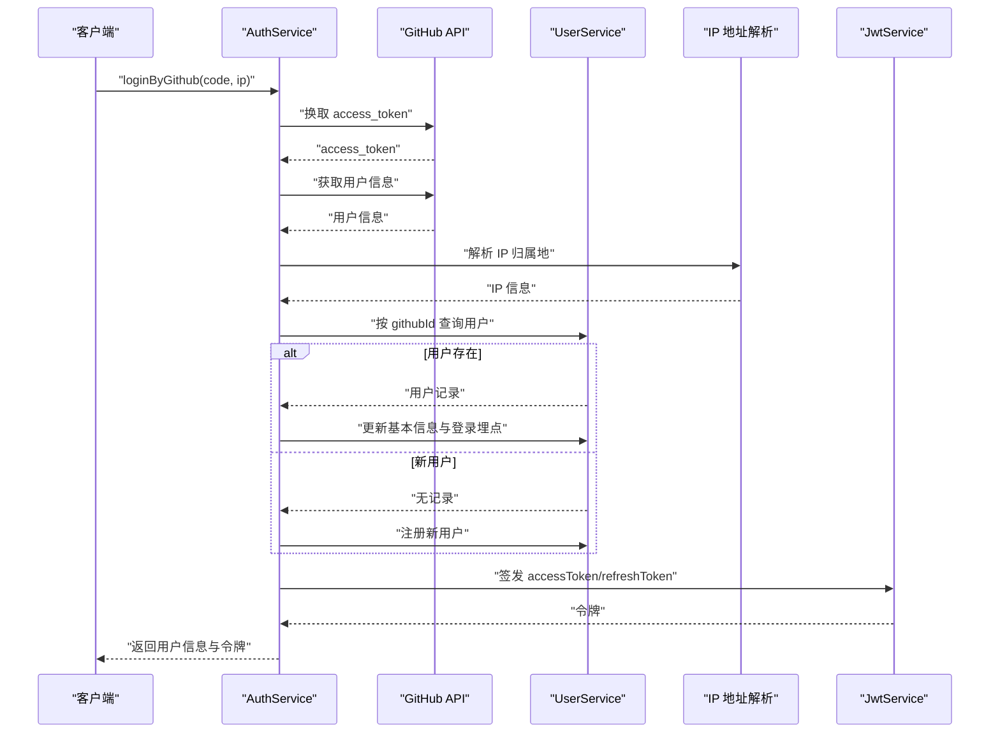
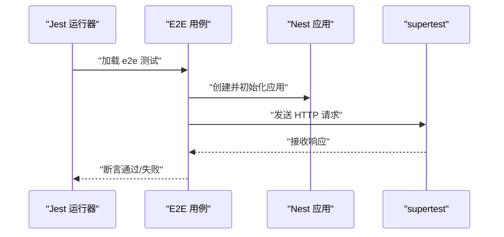
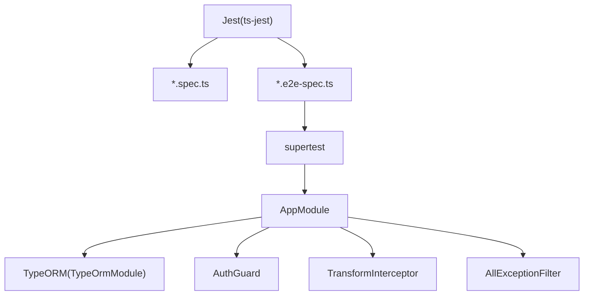

# 测试策略

<cite>
**本文引用的文件**   
- [package.json](file://package.json)
- [jest-e2e.json](file://test/jest-e2e.json)
- [app.e2e-spec.ts](file://test/app.e2e-spec.ts)
- [article.controller.spec.ts](file://src/api/article/article.controller.spec.ts)
- [article.service.spec.ts](file://src/api/article/article.service.spec.ts)
- [auth.controller.spec.ts](file://src/api/auth/auth.controller.spec.ts)
- [user.controller.spec.ts](file://src/api/user/user.controller.spec.ts)
- [article.service.ts](file://src/api/article/article.service.ts)
- [auth.service.ts](file://src/api/auth/auth.service.ts)
- [user.service.ts](file://src/api/user/user.service.ts)
- [app.module.ts](file://src/app.module.ts)
- [main.ts](file://src/main.ts)
- [jwt.config.ts](file://src/config/jwt.config.ts)
- [mysql.config.ts](file://src/config/mysql.config.ts)
</cite>

## 目录
1. [简介](#简介)
2. [项目结构](#项目结构)
3. [核心组件](#核心组件)
4. [架构总览](#架构总览)
5. [详细组件分析](#详细组件分析)
6. [依赖分析](#依赖分析)
7. [性能考虑](#性能考虑)
8. [故障排查指南](#故障排查指南)
9. [结论](#结论)
10. [附录](#附录)

## 简介
本指南面向博客系统的测试体系建设，覆盖单元测试、端到端（E2E）测试、API 与数据库集成测试、第三方服务模拟、覆盖率要求与报告生成、Mock 数据与环境隔离、异步/错误/边界条件测试技巧，以及调试与性能优化建议。目标是建立可维护、可扩展、高可信度的测试策略，确保代码质量与交付稳定性。

## 项目结构
当前仓库已具备基础的 Jest 配置与 E2E 示例：
- 单元测试根目录为 src，匹配 *.spec.ts 文件；E2E 测试位于 test 目录，使用独立配置文件 jest-e2e.json。
- 包脚本提供 test、test:watch、test:cov、test:e2e、test:debug 等常用命令。
- E2E 示例通过 supertest 发起 HTTP 请求，验证应用启动后的行为。

图表来源
- [package.json:76-92](file://package.json#L76-L92)
- [jest-e2e.json:1-10](file://test/jest-e2e.json#L1-L10)
- [app.e2e-spec.ts:1-26](file://test/app.e2e-spec.ts#L1-L26)
- [app.module.ts:1-35](file://src/app.module.ts#L1-L35)
- [main.ts:1-46](file://src/main.ts#L1-L46)

章节来源
- [package.json:8-21](file://package.json#L8-L21)
- [package.json:76-92](file://package.json#L76-L92)
- [jest-e2e.json:1-10](file://test/jest-e2e.json#L1-L10)
- [app.e2e-spec.ts:1-26](file://test/app.e2e-spec.ts#L1-L26)

## 核心组件
- 测试框架与断言
  - 使用 Jest 作为测试运行器与断言库，配合 ts-jest 支持 TypeScript。
  - E2E 使用 supertest 进行 HTTP 层断言。
- 测试组织
  - 单元测试与源码同目录，按 feature 划分，命名 *.spec.ts。
  - E2E 用例集中放在 test 目录，命名 *.e2e-spec.ts。
- 覆盖率
  - 通过 --coverage 收集覆盖率，输出目录 ../coverage。
- 环境
  - 单元测试与 E2E 均使用 node 环境。

章节来源
- [package.json:76-92](file://package.json#L76-L92)
- [package.json:16-20](file://package.json#L16-L20)
- [app.e2e-spec.ts:1-26](file://test/app.e2e-spec.ts#L1-L26)

## 架构总览
下图展示从 E2E 到控制器、服务、数据库的调用链，以及全局过滤器、拦截器与守卫在请求处理中的作用。

图表来源
- [app.e2e-spec.ts:10-17](file://test/app.e2e-spec.ts#L10-L17)
- [app.module.ts:11-32](file://src/app.module.ts#L11-L32)
- [main.ts:20-28](file://src/main.ts#L20-L28)

## 详细组件分析

### 单元测试编写规范与最佳实践
- 命名与位置
  - 与源文件同级放置，命名为 xxx.controller.spec.ts / xxx.service.spec.ts。
- 模块装配
  - 使用 TestingModule 仅引入被测控制器或服务及其必要依赖，避免加载完整 AppModule。
- Mock 策略
  - 对 TypeORM Repository、外部服务（如 JWT、HTTP 客户端）采用替换实现或 jest.fn() 模拟返回值。
- 断言要点
  - 针对输入参数、异常抛出、返回值结构进行断言。
  - 对分页、模糊查询、状态切换等分支路径分别设计用例。
- 参考现有用例
  - 控制器与服务的基础定义断言可作为模板扩展。

章节来源
- [article.controller.spec.ts:1-21](file://src/api/article/article.controller.spec.ts#L1-L21)
- [article.service.spec.ts:1-19](file://src/api/article/article.service.spec.ts#L1-L19)
- [auth.controller.spec.ts:1-21](file://src/api/auth/auth.controller.spec.ts#L1-L21)
- [user.controller.spec.ts:1-21](file://src/api/user/user.controller.spec.ts#L1-L21)

#### 文章服务（ArticleService）测试要点
- 关键流程
  - 列表查询：支持按标题模糊匹配、状态过滤、分页；单条查询时聚合标签。
  - 新增/更新：将 tagIds 数组转为逗号分隔字符串持久化。
  - 状态切换：根据当前状态翻转。
  - 删除：软删除，影响行数为 0 时抛错。
- 推荐测试点
  - 正常路径：分页、模糊匹配、单条+标签聚合。
  - 异常路径：更新/删除不存在的文章应抛出 BadRequestException。
  - 边界条件：空查询、页码越界、tagIds 为空数组。
- 依赖 Mock
  - ArticleRepository、TagRepository 需 mock findAndCount、findOne、save、update、findBy 等方法。

图表来源
- [article.service.ts:21-58](file://src/api/article/article.service.ts#L21-L58)

章节来源
- [article.service.ts:21-102](file://src/api/article/article.service.ts#L21-L102)

#### 认证服务（AuthService）测试要点
- 关键流程
  - GitHub 登录：获取 access_token -> 拉取用户信息 -> 查找/注册用户 -> 更新登录埋点 -> 签发 JWT。
  - 刷新令牌：基于已有用户上下文生成新 token。
- 推荐测试点
  - 成功路径：GitHub 授权码有效、用户存在/不存在、token 签发成功。
  - 异常路径：缺少 code、第三方接口失败、用户信息缺失。
  - 并发与幂等：多次刷新令牌的行为一致性。
- 依赖 Mock
  - JwtService.signAsync/sign、axios、UserService、getIpAddress 均需 mock。

图表来源
- [auth.service.ts:23-109](file://src/api/auth/auth.service.ts#L23-L109)
- [auth.service.ts:111-121](file://src/api/auth/auth.service.ts#L111-L121)

章节来源
- [auth.service.ts:18-121](file://src/api/auth/auth.service.ts#L18-L121)

#### 用户服务（UserService）测试要点
- 关键流程
  - 查询：按 email/id/githubId 精确查询；分页列表支持用户名/邮箱模糊匹配。
  - 注册/更新：新增第三方用户、更新用户资料。
  - 登录埋点：更新最后登录时间/IP/地区与登录次数。
- 推荐测试点
  - 正常路径：分页、模糊匹配、更新成功。
  - 异常路径：更新/埋点时用户不存在抛出 BadRequestException。
- 依赖 Mock
  - UserRepository 的 find、findAndCount、findOne、save 等方法需 mock。

章节来源
- [user.service.ts:14-64](file://src/api/user/user.service.ts#L14-L64)

### 端到端（E2E）测试设计模式
- 应用生命周期
  - 在 beforeEach 中创建 TestingModule、导入 AppModule、初始化应用，并在 afterAll 关闭。
- HTTP 断言
  - 使用 supertest 发起 GET/POST 等请求，断言状态码与响应体。
- 数据库集成
  - 建议使用事务回滚或专用测试库，保证用例前后数据一致。
- 第三方服务模拟
  - 通过替换模块或环境变量注入 Mock 实现，避免真实网络调用。

图表来源
- [app.e2e-spec.ts:10-24](file://test/app.e2e-spec.ts#L10-L24)
- [jest-e2e.json:1-10](file://test/jest-e2e.json#L1-L10)

章节来源
- [app.e2e-spec.ts:1-26](file://test/app.e2e-spec.ts#L1-L26)
- [jest-e2e.json:1-10](file://test/jest-e2e.json#L1-L10)

### API 测试、数据库集成测试与第三方服务模拟
- API 测试
  - 以控制器为边界，结合 supertest 验证路由、校验管道、全局过滤器与拦截器的整体行为。
- 数据库集成测试
  - 使用独立测试数据库或内存数据库；每个用例前准备数据，结束后回滚或清理。
- 第三方服务模拟
  - 对 GitHub OAuth、邮件服务等外部依赖，使用 Mock 模块或本地代理返回固定响应。

章节来源
- [app.e2e-spec.ts:10-24](file://test/app.e2e-spec.ts#L10-L24)
- [auth.service.ts:23-109](file://src/api/auth/auth.service.ts#L23-L109)

### 测试覆盖率要求与报告生成
- 覆盖率开关
  - 使用 test:cov 脚本启用 --coverage，输出至 coverage 目录。
- 采集范围
  - collectCoverageFrom 默认包含所有 (t|j)s 文件，可按需排除测试文件或构建产物。
- 阈值控制
  - 建议在 CI 中设置最小覆盖率阈值，未达标则阻断合并。

章节来源
- [package.json:18](file://package.json#L18)
- [package.json:87-91](file://package.json#L87-L91)

### Mock 数据准备与测试环境隔离
- 数据准备
  - 为每个用例准备最小数据集，避免跨用例耦合；必要时使用工厂函数生成随机但合法的数据。
- 环境隔离
  - 使用不同数据库实例或 schema；通过环境变量区分测试配置（如 MySQL、JWT 密钥）。
- 模块级隔离
  - 单元测试只装配被测模块，避免加载全局守卫、拦截器等副作用。

章节来源
- [mysql.config.ts:1-15](file://src/config/mysql.config.ts#L1-L15)
- [jwt.config.ts:1-5](file://src/config/jwt.config.ts#L1-L5)
- [app.module.ts:11-32](file://src/app.module.ts#L11-L32)

### 异步操作、错误处理与边界条件测试技巧
- 异步操作
  - 对 Promise/async 方法直接 return 或 await，确保断言在异步完成后执行。
- 错误处理
  - 针对业务异常（如“文章不存在”、“用户不存在”）断言抛出类型与消息。
- 边界条件
  - 空输入、极值、重复提交、分页边界、空集合等场景需覆盖。

章节来源
- [article.service.ts:70-102](file://src/api/article/article.service.ts#L70-L102)
- [user.service.ts:39-64](file://src/api/user/user.service.ts#L39-L64)

### 测试调试方法与性能优化建议
- 调试
  - 使用 test:debug 脚本在 Node Inspector 下运行，IDE 断点调试。
  - 针对单个用例使用 --testNamePattern 或 .only 聚焦问题。
- 性能
  - 使用 --runInBand 串行执行减少资源竞争；合理拆分大套件。
  - 避免在测试中发起真实网络请求，统一使用 Mock。
  - 复用共享 Mock 与数据工厂，减少重复构造成本。

章节来源
- [package.json:19](file://package.json#L19)

## 依赖分析
下图展示测试相关依赖关系：Jest 驱动 spec 与 e2e 用例，E2E 通过 supertest 访问 Nest 应用，应用依赖 TypeORM、JWT、全局过滤器/拦截器/守卫。

图表来源
- [package.json:76-92](file://package.json#L76-L92)
- [app.e2e-spec.ts:1-26](file://test/app.e2e-spec.ts#L1-26)
- [app.module.ts:11-32](file://src/app.module.ts#L11-L32)

章节来源
- [package.json:76-92](file://package.json#L76-L92)
- [app.module.ts:11-32](file://src/app.module.ts#L11-L32)

## 性能考虑
- 测试执行
  - 大规模用例集优先并行执行，仅在需要共享资源时使用 --runInBand。
- I/O 与网络
  - 数据库与外部服务一律 Mock，避免磁盘与网络瓶颈。
- 内存与快照
  - 谨慎使用快照测试，避免频繁变更导致大量快照失效。
- 预热与缓存
  - 对复杂模块装配可提取公共 fixture，减少重复编译与初始化开销。

## 故障排查指南
- 常见错误
  - 端口占用：修改 main.ts 监听端口或使用环境变量覆盖。
  - 数据库连接失败：检查 mysql.config.ts 配置与测试库可用性。
  - JWT 签名失败：确认 jwt.config.ts 密钥配置与测试环境注入。
- 定位步骤
  - 缩小范围：先跑最小用例集，逐步扩大。
  - 查看日志：在关键分支打印必要上下文，便于快速定位。
  - 隔离依赖：逐个替换外部依赖为 Mock，判断是否为外部因素导致。

章节来源
- [main.ts:41-43](file://src/main.ts#L41-L43)
- [mysql.config.ts:3-12](file://src/config/mysql.config.ts#L3-L12)
- [jwt.config.ts:1-5](file://src/config/jwt.config.ts#L1-L5)

## 结论
通过分层测试策略（单元、集成、E2E）、严格的 Mock 与环境隔离、完善的覆盖率与报告机制，以及针对异步、错误与边界的系统化用例设计，可以显著提升博客系统的质量与可维护性。建议将测试纳入持续集成流水线，强制覆盖率阈值与回归用例稳定通过后再合并变更。

## 附录
- 常用命令
  - 单元测试：pnpm run test
  - 监听模式：pnpm run test:watch
  - 覆盖率：pnpm run test:cov
  - E2E：pnpm run test:e2e
  - 调试：pnpm run test:debug

章节来源
- [package.json:16-20](file://package.json#L16-L20)