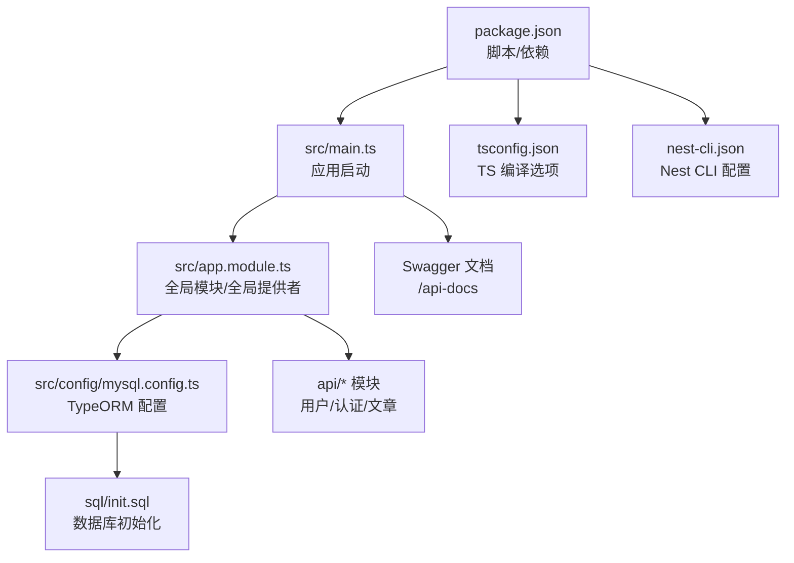
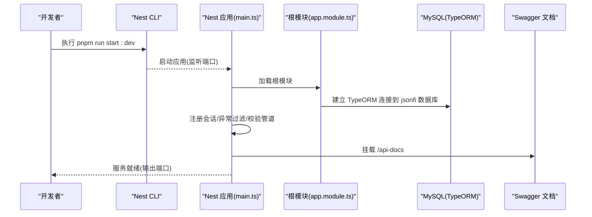
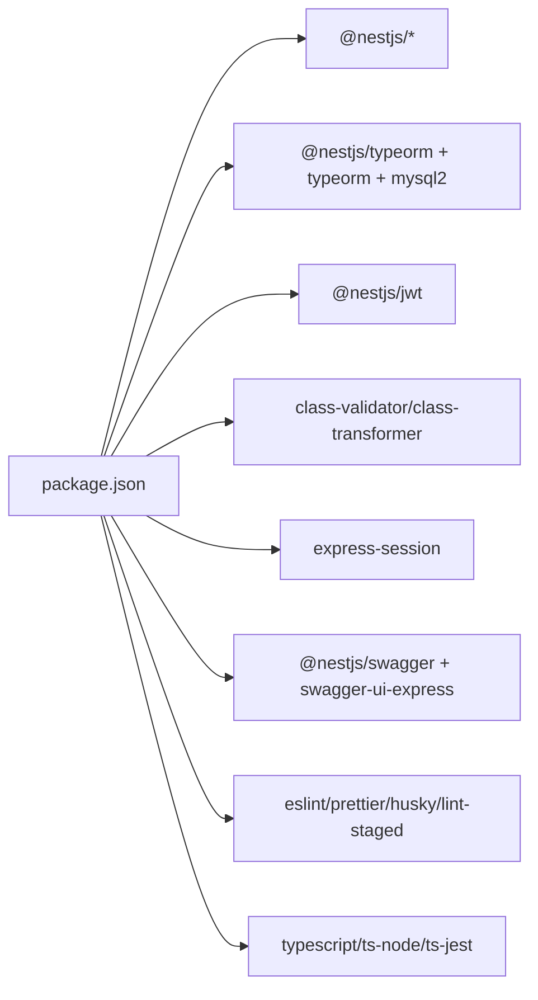

# 环境配置

<cite>
**本文引用的文件**
- [package.json](file://package.json)
- [tsconfig.json](file://tsconfig.json)
- [nest-cli.json](file://nest-cli.json)
- [README.md](file://README.md)
- [src/main.ts](file://src/main.ts)
- [src/app.module.ts](file://src/app.module.ts)
- [src/config/mysql.config.ts](file://src/config/mysql.config.ts)
- [src/config/jwt.config.ts](file://src/config/jwt.config.ts)
- [src/config/github.config.ts](file://src/config/github.config.ts)
- [sql/init.sql](file://sql/init.sql)
</cite>

## 更新摘要
**所做更改**
- 更新了数据库初始化脚本说明，明确数据库名称为 `jsonfi` 而非 `json_server`
- 修正了环境变量配置示例中的数据库名称
- 更新了部署说明以引用正确的数据库名称
- 完善了数据库连接设置指导

## 目录
1. [简介](#简介)
2. [项目结构](#项目结构)
3. [核心组件](#核心组件)
4. [架构总览](#架构总览)
5. [详细组件分析](#详细组件分析)
6. [依赖分析](#依赖分析)
7. [性能考虑](#性能考虑)
8. [故障排查指南](#故障排查指南)
9. [结论](#结论)
10. [附录](#附录)

## 简介
本指南面向博客系统的后端开发环境，聚焦于：
- 最低运行环境与包管理器选择
- 依赖安装与版本管理最佳实践
- TypeScript 编译配置说明（目标、模块、路径映射）
- NestJS CLI 初始化与常用命令
- 环境变量模板与数据库连接设置指导

## 项目结构
本项目为基于 NestJS 的后端服务，采用模块化组织方式。根目录包含构建与脚本配置、源码位于 src 下，按功能域划分 api、config、core、utils 等子目录。

图表来源
- [package.json:1-100](file://package.json#L1-L100)
- [tsconfig.json:1-25](file://tsconfig.json#L1-L25)
- [nest-cli.json:1-9](file://nest-cli.json#L1-L9)
- [src/main.ts:1-46](file://src/main.ts#L1-L46)
- [src/app.module.ts:1-35](file://src/app.module.ts#L1-L35)
- [src/config/mysql.config.ts:1-15](file://src/config/mysql.config.ts#L1-L15)
- [sql/init.sql:1-138](file://sql/init.sql#L1-L138)

章节来源
- [package.json:1-100](file://package.json#L1-L100)
- [tsconfig.json:1-25](file://tsconfig.json#L1-L25)
- [nest-cli.json:1-9](file://nest-cli.json#L1-L9)
- [README.md:29-59](file://README.md#L29-L59)

## 核心组件
- 应用入口与中间件
  - 应用通过 NestFactory 创建 Express 应用实例，启用会话、信任代理、全局异常过滤器、全局校验管道，并挂载 Swagger 文档。
  - 端口从环境变量读取，未设置时回退到默认值。
- 全局模块与 TypeORM
  - 在根模块中注册 TypeORM 连接，导入业务模块，并注册全局异常过滤器、响应转换拦截器、鉴权守卫。
- 配置项
  - 数据库连接配置以独立配置文件提供，便于后续替换为环境变量注入。
  - JWT 密钥与第三方 OAuth 客户端信息以配置对象形式存在，建议迁移至环境变量。

章节来源
- [src/main.ts:1-46](file://src/main.ts#L1-L46)
- [src/app.module.ts:1-35](file://src/app.module.ts#L1-L35)
- [src/config/mysql.config.ts:1-15](file://src/config/mysql.config.ts#L1-L15)
- [src/config/jwt.config.ts:1-5](file://src/config/jwt.config.ts#L1-L5)
- [src/config/github.config.ts:1-6](file://src/config/github.config.ts#L1-L6)

## 架构总览
下图展示了本地开发时的关键流程：Nest 启动、中间件与全局处理链、TypeORM 连接、以及 API 文档的挂载。

图表来源
- [src/main.ts:1-46](file://src/main.ts#L1-L46)
- [src/app.module.ts:1-35](file://src/app.module.ts#L1-L35)
- [src/config/mysql.config.ts:1-15](file://src/config/mysql.config.ts#L1-L15)
- [sql/init.sql:8-12](file://sql/init.sql#L8-L12)

## 详细组件分析

### 开发环境与最低要求
- Node.js 版本
  - 推荐 v18+；当前 devDependencies 中的 @types/node 指向较新版本，建议使用 LTS 且与类型定义兼容的版本。
- 包管理器
  - 推荐使用 pnpm；项目脚本与锁文件均基于 pnpm。
- IDE 与插件（VS Code）
  - 建议安装 TypeScript 语言支持、ESLint、Prettier、NestJS 相关扩展，以获得更好的代码提示与格式化体验。
- 其他工具
  - Git Hooks 使用 husky + lint-staged，提交前自动执行 lint 与格式检查。

章节来源
- [package.json:46-75](file://package.json#L46-L75)
- [package.json:93-98](file://package.json#L93-L98)
- [README.md:29-59](file://README.md#L29-L59)

### 依赖安装与最佳实践
- 安装依赖
  - 在项目根目录执行：pnpm install
- 锁定与一致性
  - 使用 pnpm-lock.yaml 确保团队一致；避免手动修改 lock 文件。
- 更新策略
  - 优先使用 pnpm update 或 pnpm up 进行安全更新；谨慎升级 major 版本。
- 清理与重建
  - 删除 node_modules 后重新安装；必要时清理 pnpm 缓存。
- 脚本参考
  - 开发：pnpm run start:dev
  - 生产：pnpm run start:prod
  - 测试：pnpm run test / pnpm run test:e2e / pnpm run test:cov

章节来源
- [package.json:8-21](file://package.json#L8-L21)
- [package.json:22-75](file://package.json#L22-L75)
- [README.md:29-59](file://README.md#L29-L59)

### TypeScript 编译配置
- 目标与模块
  - target: ES2021
  - module: commonjs
- 装饰器与元数据
  - experimentalDecorators: true
  - emitDecoratorMetadata: true
- 输出与增量
  - outDir: ./dist
  - incremental: true
- 路径映射
  - baseUrl: ./
  - paths: {"@/*": ["./src/*"]}
- 严格性与兼容性
  - strictNullChecks: true
  - skipLibCheck: true
  - noImplicitAny: false
  - forceConsistentCasingInFileNames: true
- 构建产物
  - nest build 将依据 tsconfig.json 生成 dist 目录，并在生产模式直接运行 dist/main。

章节来源
- [tsconfig.json:1-25](file://tsconfig.json#L1-L25)
- [package.json:8-21](file://package.json#L8-L21)

### NestJS CLI 初始化与常用命令
- 初始化
  - 项目已包含 nest-cli.json，指定 collection 与 sourceRoot，并开启构建时删除输出目录。
- 常用命令
  - 构建：pnpm run build
  - 开发：pnpm run start:dev
  - 调试：pnpm run start:debug
  - 生产：pnpm run start:prod
  - 测试：pnpm run test / pnpm run test:e2e / pnpm run test:cov
  - 代码质量：pnpm run lint / pnpm run format

章节来源
- [nest-cli.json:1-9](file://nest-cli.json#L1-L9)
- [package.json:8-21](file://package.json#L8-L21)

### 环境变量与敏感配置
- 端口
  - 应用启动时从环境变量 PORT 读取，未设置则回退到 3001。
- 建议的环境变量清单
  - 数据库：DB_HOST、DB_PORT、DB_USERNAME、DB_PASSWORD、DB_DATABASE（应为 `jsonfi`）
  - JWT：JWT_ACCESS_SECRET、JWT_REFRESH_SECRET
  - GitHub OAuth：GITHUB_CLIENT_ID、GITHUB_CLIENT_SECRET
  - 邮件（可选）：SMTP_HOST、SMTP_PORT、SMTP_USER、SMTP_PASS
- 模板示例
  - 建议在仓库根目录添加 .env.example，列出所有必需与可选变量及注释说明；实际 .env 加入 .gitignore。
- 接入方式
  - 将现有硬编码配置替换为 process.env.XXX 读取，并通过 Nest 配置模块或工厂函数注入。

**更新** 数据库名称应设置为 `jsonfi`，与数据库初始化脚本保持一致。

章节来源
- [src/main.ts:41-43](file://src/main.ts#L41-L43)
- [src/config/mysql.config.ts:1-15](file://src/config/mysql.config.ts#L1-L15)
- [src/config/jwt.config.ts:1-5](file://src/config/jwt.config.ts#L1-L5)
- [src/config/github.config.ts:1-6](file://src/config/github.config.ts#L1-L6)
- [sql/init.sql:8-12](file://sql/init.sql#L8-L12)

### 数据库连接设置（TypeORM + MySQL）
- 当前实现
  - 根模块通过 TypeOrmModule.forRoot 引入 mysqlConfig，其中 type 为 mysql，host/port/username/password/database 为占位值。
- 本地开发建议
  - 准备本地 MySQL 实例，创建数据库 `jsonfi` 与初始表结构（可参考 sql/init.sql）。
  - 将 mysql.config.ts 中的占位值替换为环境变量读取。
- 连接参数要点
  - type: 'mysql'
  - host/port/username/password/database（database 应为 `jsonfi`）
  - autoLoadEntities: true（配合实体扫描）
  - dateStrings: true（日期字段以字符串返回）

**更新** 数据库名称已更新为 `jsonfi`，请确保环境变量和配置文件中使用正确的数据库名称。

章节来源
- [src/app.module.ts:12-17](file://src/app.module.ts#L12-L17)
- [src/config/mysql.config.ts:1-15](file://src/config/mysql.config.ts#L1-L15)
- [sql/init.sql:8-12](file://sql/init.sql#L8-L12)

### 会话与全局处理链
- 会话
  - 使用 express-session，secret/name/cookie.maxAge 等参数可在环境变量中配置。
- 全局过滤器与管道
  - 全局异常过滤器统一错误响应；ValidationPipe 开启 transform、whitelist、stopAtFirstError。
- 文档
  - 通过 @nestjs/swagger 在 /api-docs 暴露接口文档。

章节来源
- [src/main.ts:11-28](file://src/main.ts#L11-L28)
- [src/main.ts:29-39](file://src/main.ts#L29-L39)

## 依赖分析
- 运行时依赖
  - NestJS 核心与平台、TypeORM 与 mysql2、JWT、验证与转换、邮件发送、会话、Swagger 等。
- 开发依赖
  - Nest CLI、Schematics、Jest、ts-jest、ts-node、ts-loader、ESLint、Prettier、SWC 等。
- 脚本与钩子
  - 构建/启动/测试脚本集中在 package.json；lint-staged 在提交前触发 lint 与 format。

图表来源
- [package.json:22-75](file://package.json#L22-L75)
- [package.json:93-98](file://package.json#L93-L98)

章节来源
- [package.json:22-75](file://package.json#L22-L75)
- [package.json:93-98](file://package.json#L93-L98)

## 性能考虑
- 构建优化
  - 使用 incremental 与 SWC 加速编译；生产构建前清理 dist。
- 运行期
  - 合理设置会话过期时间；在生产环境启用 trust proxy 并确保反向代理正确转发协议头。
- 数据库
  - 根据负载调整连接池参数；对慢查询建立索引；避免不必要的 dateStrings 使用场景。

## 故障排查指南
- 无法启动或端口占用
  - 检查 PORT 是否被占用；确认进程未残留。
- 数据库连接失败
  - 核对 host/port/用户名/密码/库名（应为 `jsonfi`）；确认防火墙与网络可达；检查 sql/init.sql 是否已执行。
- 鉴权或令牌问题
  - 检查 JWT 密钥是否与前端一致；刷新令牌逻辑是否正确。
- 会话失效
  - 检查 secret/name/maxAge 配置；确认反向代理是否透传 Cookie。
- 文档不可访问
  - 确认 /api-docs 路由未被中间件拦截；检查 Swagger 初始化参数。

**更新** 数据库连接问题排查时，请特别注意数据库名称应为 `jsonfi`。

章节来源
- [src/main.ts:11-28](file://src/main.ts#L11-L28)
- [src/main.ts:29-39](file://src/main.ts#L29-L39)
- [src/config/mysql.config.ts:1-15](file://src/config/mysql.config.ts#L1-L15)
- [sql/init.sql:8-12](file://sql/init.sql#L8-L12)

## 结论
通过遵循本指南，你可以快速搭建一致的本地开发环境，规范依赖管理与 TypeScript 编译行为，并使用 NestJS CLI 高效迭代。将敏感配置迁移至环境变量后，即可平滑过渡到多环境与生产部署。

## 附录
- 快速开始
  - 安装依赖：pnpm install
  - 初始化数据库：执行 sql/init.sql 创建 `jsonfi` 数据库
  - 启动开发：pnpm run start:dev
  - 打开文档：浏览器访问 http://localhost:3001/api-docs
- 参考脚本
  - 详见 package.json scripts 与 README 中的命令说明。

**更新** 数据库初始化步骤已更新，请使用正确的数据库名称 `jsonfi`。

章节来源
- [README.md:29-59](file://README.md#L29-L59)
- [package.json:8-21](file://package.json#L8-L21)
- [sql/init.sql:8-12](file://sql/init.sql#L8-L12)