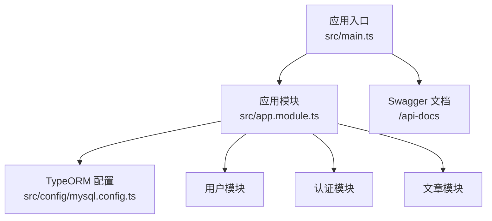
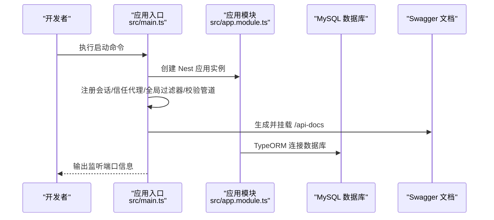
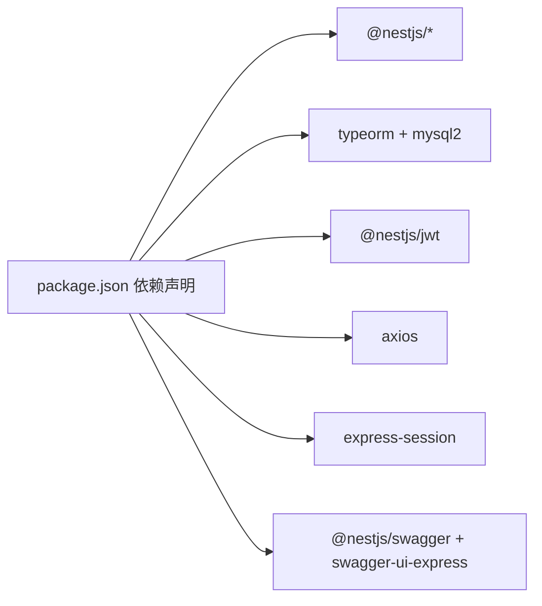

# 快速开始

<cite>
**本文引用的文件**   
- [README.md](file://README.md)
- [package.json](file://package.json)
- [src/main.ts](file://src/main.ts)
- [sql/init.sql](file://sql/init.sql)
- [src/config/mysql.config.ts](file://src/config/mysql.config.ts)
- [src/config/jwt.config.ts](file://src/config/jwt.config.ts)
- [src/config/github.config.ts](file://src/config/github.config.ts)
- [src/app.module.ts](file://src/app.module.ts)
</cite>

## 目录
1. [简介](#简介)
2. [项目结构](#项目结构)
3. [核心组件](#核心组件)
4. [架构总览](#架构总览)
5. [详细组件分析](#详细组件分析)
6. [依赖分析](#依赖分析)
7. [性能考虑](#性能考虑)
8. [故障排除指南](#故障排除指南)
9. [结论](#结论)
10. [附录](#附录)

## 简介
本指南面向新手开发者，帮助你在几分钟内完成博客系统后端服务的本地搭建与运行。你将了解：
- 环境准备（Node.js、pnpm、MySQL）
- 克隆仓库与安装依赖
- 数据库初始化脚本执行
- 环境变量配置（数据库连接、JWT 密钥、GitHub OAuth）
- 启动开发服务器与热重载
- 常见问题排查与解决方案

## 项目结构
本项目基于 NestJS + TypeORM + MySQL，采用模块化组织方式，核心入口在应用主模块中注册全局过滤器、拦截器与守卫，并通过 TypeORM 连接数据库。

图表来源
- [src/main.ts:1-46](file://src/main.ts#L1-L46)
- [src/app.module.ts:1-35](file://src/app.module.ts#L1-L35)
- [src/config/mysql.config.ts:1-15](file://src/config/mysql.config.ts#L1-L15)

章节来源
- [README.md:29-46](file://README.md#L29-L46)
- [package.json:8-21](file://package.json#L8-L21)
- [src/main.ts:1-46](file://src/main.ts#L1-L46)
- [src/app.module.ts:1-35](file://src/app.module.ts#L1-L35)

## 核心组件
- 应用入口与中间件
  - 启用会话、信任代理、全局异常过滤器、全局校验管道、Swagger 文档、监听端口等。
- 应用模块与全局提供者
  - 注册 TypeORM 数据源、业务模块、全局异常过滤器、响应转换拦截器、鉴权守卫。
- 数据库配置
  - TypeORM 的 MySQL 连接参数占位符，需替换为实际值或从环境变量注入。
- JWT 与 GitHub OAuth 配置
  - JWT 访问令牌与刷新令牌的密钥占位符；GitHub OAuth 客户端 ID 与密钥占位符。

章节来源
- [src/main.ts:10-43](file://src/main.ts#L10-L43)
- [src/app.module.ts:11-32](file://src/app.module.ts#L11-L32)
- [src/config/mysql.config.ts:3-12](file://src/config/mysql.config.ts#L3-L12)
- [src/config/jwt.config.ts:1-5](file://src/config/jwt.config.ts#L1-L5)
- [src/config/github.config.ts:1-6](file://src/config/github.config.ts#L1-L6)

## 架构总览
下图展示了服务启动时的关键流程：创建应用实例、挂载会话与中间件、注册全局过滤器/拦截器/守卫、生成并挂载 Swagger 文档、监听端口。

图表来源
- [src/main.ts:10-43](file://src/main.ts#L10-L43)
- [src/app.module.ts:11-17](file://src/app.module.ts#L11-L17)

## 详细组件分析

### 环境与依赖准备
- Node.js
  - 建议版本：Node.js >= 18（参考 pnpm-lock.yaml 中的引擎要求）。
- pnpm
  - 建议使用较新版本以匹配锁文件。
- MySQL
  - 版本建议：8.x（推荐 utf8mb4 字符集与排序规则）。
- 端口
  - 默认监听端口：3001（可通过环境变量覆盖）。

章节来源
- [pnpm-lock.yaml:3290-3298](file://pnpm-lock.yaml#L3290-L3298)
- [src/main.ts:41-43](file://src/main.ts#L41-L43)

### 克隆与安装依赖
- 克隆仓库后进入项目根目录。
- 使用 pnpm 安装依赖。
- 构建与运行命令见下方“启动与热重载”。

章节来源
- [README.md:29-46](file://README.md#L29-L46)
- [package.json:8-21](file://package.json#L8-L21)

### 数据库初始化
- 使用提供的 SQL 脚本创建数据库与表结构，并插入初始标签数据。
- 执行步骤：
  - 登录 MySQL。
  - 执行 sql/init.sql。
  - 确认数据库 json_server 及 user、article、tag、email_code 表已创建。

章节来源
- [sql/init.sql:1-138](file://sql/init.sql#L1-L138)

### 环境变量与配置说明
当前代码中存在多处硬编码占位符，需在部署前替换为真实值或通过环境变量注入。以下为关键配置项与位置：

- 数据库连接（TypeORM）
  - 文件：src/config/mysql.config.ts
  - 字段：host、port、username、password、database
  - 说明：请将占位符替换为实际 MySQL 连接信息。
- JWT 密钥
  - 文件：src/config/jwt.config.ts
  - 字段：accessSecretKey、refreshSecretKey
  - 说明：请替换为安全的随机字符串。
- GitHub OAuth
  - 文件：src/config/github.config.ts
  - 字段：client_id、client_secret
  - 说明：请在 GitHub 开发者平台创建应用并填入对应值。
- 应用端口
  - 文件：src/main.ts
  - 说明：默认 3001，可通过 PORT 环境变量覆盖。

注意：
- 若你希望统一通过环境变量管理配置，可在各配置文件中将占位符改为读取 process.env.XXX，并在项目根目录提供 .env 文件（例如 PORT、DB_HOST、DB_PORT、DB_USERNAME、DB_PASSWORD、DB_DATABASE、JWT_ACCESS_SECRET、JWT_REFRESH_SECRET、GITHUB_CLIENT_ID、GITHUB_CLIENT_SECRET）。
- 当前代码未直接读取 .env 文件，如需自动加载，可引入 dotenv 并在入口处加载。

章节来源
- [src/config/mysql.config.ts:3-12](file://src/config/mysql.config.ts#L3-L12)
- [src/config/jwt.config.ts:1-5](file://src/config/jwt.config.ts#L1-L5)
- [src/config/github.config.ts:1-6](file://src/config/github.config.ts#L1-L6)
- [src/main.ts:41-43](file://src/main.ts#L41-L43)

### 启动与热重载
- 开发模式（带热重载）
  - 命令：pnpm run start:dev
- 调试模式（带断点与热重载）
  - 命令：pnpm run start:debug
- 生产模式
  - 命令：pnpm run start:prod

启动成功后，控制台会输出监听端口信息。默认端口为 3001，可通过环境变量覆盖。

章节来源
- [package.json:8-21](file://package.json#L8-L21)
- [src/main.ts:41-43](file://src/main.ts#L41-L43)

### 接口文档
- 启动后访问：http://localhost:3001/api-docs
- 用于浏览与测试 API。

章节来源
- [src/main.ts:29-39](file://src/main.ts#L29-L39)

## 依赖分析
- 运行时依赖
  - @nestjs/* 系列框架包
  - typeorm 与 mysql2 驱动
  - @nestjs/jwt 用于令牌签发与验证
  - axios 用于外部 HTTP 调用（如 GitHub OAuth）
  - class-validator/class-transformer 用于请求体校验与类型转换
  - express-session 用于会话
  - swagger-ui-express 与 @nestjs/swagger 用于文档
- 开发依赖
  - nest-cli、ts-node、jest、eslint、prettier 等

图表来源
- [package.json:22-45](file://package.json#L22-L45)

章节来源
- [package.json:22-45](file://package.json#L22-L45)

## 性能考虑
- 在生产环境中建议：
  - 关闭不必要的日志与调试输出
  - 合理设置数据库连接池大小
  - 开启进程管理器（如 PM2）进行多实例部署
  - 使用反向代理（Nginx）缓存静态资源与压缩响应
- 开发环境：
  - 使用 start:dev 热重载提升迭代效率
  - 合理使用 Swagger 文档进行联调

[本节为通用指导，不直接分析具体文件]

## 故障排除指南

- 端口冲突
  - 现象：启动时报端口占用错误
  - 处理：修改环境变量 PORT 为其他可用端口，或停止占用该端口的进程
  - 参考：默认端口 3001，可通过环境变量覆盖
  - 章节来源
    - [src/main.ts:41-43](file://src/main.ts#L41-L43)

- 数据库连接失败
  - 现象：启动时报 TypeORM 连接错误
  - 处理：
    - 检查 src/config/mysql.config.ts 中的 host、port、username、password、database 是否正确
    - 确保 MySQL 服务已启动且允许本机连接
    - 确认数据库 json_server 已通过 sql/init.sql 初始化
  - 章节来源
    - [src/config/mysql.config.ts:3-12](file://src/config/mysql.config.ts#L3-L12)
    - [sql/init.sql:1-138](file://sql/init.sql#L1-L138)

- JWT 相关错误
  - 现象：令牌签发或验证失败
  - 处理：检查 src/config/jwt.config.ts 中的 accessSecretKey 与 refreshSecretKey 是否已替换为安全随机值
  - 章节来源
    - [src/config/jwt.config.ts:1-5](file://src/config/jwt.config.ts#L1-L5)

- GitHub OAuth 回调失败
  - 现象：第三方登录回调报错
  - 处理：检查 src/config/github.config.ts 中的 client_id 与 client_secret 是否与 GitHub 应用一致，并确保回调地址配置正确
  - 章节来源
    - [src/config/github.config.ts:1-6](file://src/config/github.config.ts#L1-L6)

- 请求体校验失败
  - 现象：返回 400 或校验错误
  - 处理：检查 DTO 定义与请求体字段是否匹配；确认全局 ValidationPipe 已启用
  - 章节来源
    - [src/main.ts:22-28](file://src/main.ts#L22-L28)

- 会话相关问题
  - 现象：登录后状态丢失
  - 处理：检查会话配置（secret、name、cookie.maxAge），并确保 trust proxy 已启用
  - 章节来源
    - [src/main.ts:11-19](file://src/main.ts#L11-L19)

## 结论
按照本指南完成环境准备、依赖安装、数据库初始化与配置替换后，即可在本地成功启动博客系统后端服务并使用 Swagger 文档进行接口测试。建议在后续开发中逐步将硬编码配置迁移至环境变量管理，以提升安全性与可维护性。

[本节为总结性内容，不直接分析具体文件]

## 附录

### 常用命令速查
- 安装依赖：pnpm install
- 开发模式（热重载）：pnpm run start:dev
- 调试模式（热重载）：pnpm run start:debug
- 生产模式：pnpm run start:prod
- 单元测试：pnpm run test
- 端到端测试：pnpm run test:e2e

章节来源
- [README.md:29-59](file://README.md#L29-L59)
- [package.json:8-21](file://package.json#L8-L21)