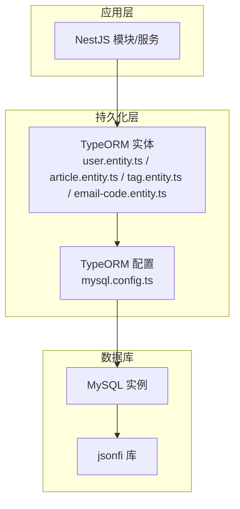
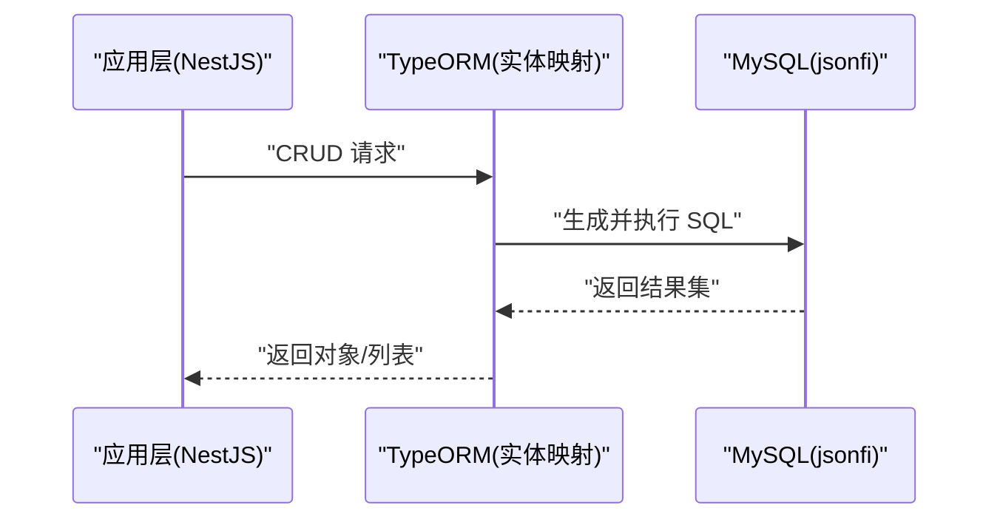
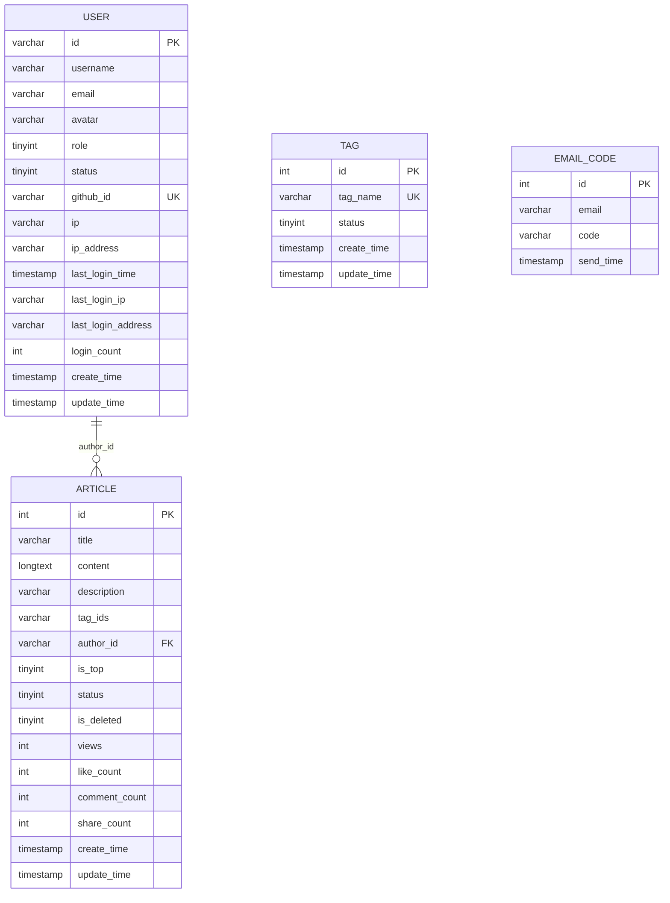
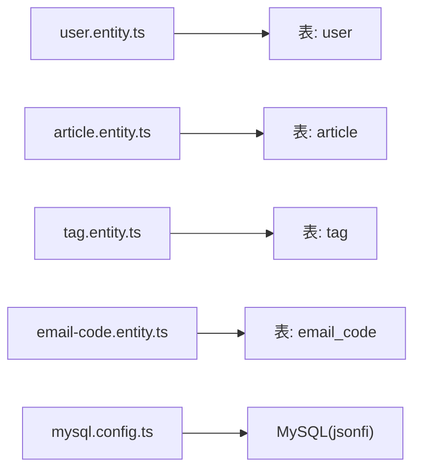

# 数据库设计

<cite>
**本文引用的文件**   
- [sql/init.sql](file://sql/init.sql)
- [src/api/user/entities/user.entity.ts](file://src/api/user/entities/user.entity.ts)
- [src/api/article/entities/article.entity.ts](file://src/api/article/entities/article.entity.ts)
- [src/api/article/entities/tag.entity.ts](file://src/api/article/entities/tag.entity.ts)
- [src/api/auth/entities/email-code.entity.ts](file://src/api/auth/entities/email-code.entity.ts)
- [src/config/mysql.config.ts](file://src/config/mysql.config.ts)
</cite>

## 更新摘要
**所做更改**   
- 将数据库名称从 'json_server' 更新为 'jsonfi'
- 更新了所有相关文档中的数据库名称引用
- 保持了文档的整体结构和一致性

## 目录
1. [引言](#引言)
2. [项目结构](#项目结构)
3. [核心组件](#核心组件)
4. [架构总览](#架构总览)
5. [详细组件分析](#详细组件分析)
6. [依赖关系分析](#依赖关系分析)
7. [性能考虑](#性能考虑)
8. [故障排查指南](#故障排查指南)
9. [结论](#结论)
10. [附录](#附录)

## 引言
本文件为博客系统的数据库设计文档，覆盖实体关系图（ERD）、表结构与字段定义、索引与约束、TypeORM 实体映射配置、SQL 初始化脚本说明、以及性能优化与迁移版本管理建议。目标是帮助读者快速理解数据模型、建立一致的数据库实践，并在后续迭代中保持可维护性与可扩展性。

## 项目结构
本项目采用 NestJS + TypeORM + MySQL 的架构。数据库相关代码集中在以下位置：
- SQL 初始化脚本：sql/init.sql
- TypeORM 实体：src/api/*/entities/*.entity.ts
- TypeORM 连接配置：src/config/mysql.config.ts

**图表来源**
- [src/config/mysql.config.ts:1-15](file://src/config/mysql.config.ts#L1-L15)
- [src/api/user/entities/user.entity.ts:1-57](file://src/api/user/entities/user.entity.ts#L1-L57)
- [src/api/article/entities/article.entity.ts:1-44](file://src/api/article/entities/article.entity.ts#L1-L44)
- [src/api/article/entities/tag.entity.ts:1-26](file://src/api/article/entities/tag.entity.ts#L1-L26)
- [src/api/auth/entities/email-code.entity.ts:1-22](file://src/api/auth/entities/email-code.entity.ts#L1-L22)

**章节来源**
- [sql/init.sql:1-138](file://sql/init.sql#L1-L138)
- [src/config/mysql.config.ts:1-15](file://src/config/mysql.config.ts#L1-L15)

## 核心组件
本节概述四个核心实体及其职责：
- 用户（User）：第三方登录用户信息、角色与状态、登录埋点等
- 文章（Article）：文章内容、状态、软删除、统计指标、标签关联（通过 JSON 数组）
- 标签（Tag）：标签名称与状态
- 邮箱验证码（EmailCode）：用于绑定/换绑邮箱时的验证码记录

**章节来源**
- [src/api/user/entities/user.entity.ts:1-57](file://src/api/user/entities/user.entity.ts#L1-L57)
- [src/api/article/entities/article.entity.ts:1-44](file://src/api/article/entities/article.entity.ts#L1-L44)
- [src/api/article/entities/tag.entity.ts:1-26](file://src/api/article/entities/tag.entity.ts#L1-L26)
- [src/api/auth/entities/email-code.entity.ts:1-22](file://src/api/auth/entities/email-code.entity.ts#L1-L22)

## 架构总览
下图展示系统整体数据流与组件交互：应用层通过 TypeORM 访问数据库；TypeORM 根据实体映射生成或执行 SQL；数据库使用 utf8mb4 字符集与合适的索引策略支撑查询。

**图表来源**
- [src/config/mysql.config.ts:1-15](file://src/config/mysql.config.ts#L1-L15)
- [src/api/user/entities/user.entity.ts:1-57](file://src/api/user/entities/user.entity.ts#L1-L57)
- [src/api/article/entities/article.entity.ts:1-44](file://src/api/article/entities/article.entity.ts#L1-L44)
- [src/api/article/entities/tag.entity.ts:1-26](file://src/api/article/entities/tag.entity.ts#L1-L26)
- [src/api/auth/entities/email-code.entity.ts:1-22](file://src/api/auth/entities/email-code.entity.ts#L1-L22)

## 详细组件分析

### ERD（实体关系图）
当前实现中，文章与标签的关系通过文章表的 JSON 字段存储标签 ID 集合，未使用中间表；用户与文章通过作者 ID 进行一对多关联。

**图表来源**
- [sql/init.sql:23-52](file://sql/init.sql#L23-L52)
- [sql/init.sql:63-92](file://sql/init.sql#L63-L92)
- [sql/init.sql:97-108](file://sql/init.sql#L97-L108)
- [sql/init.sql:115-126](file://sql/init.sql#L115-L126)

#### 用户表（user）
- 主键：id（VARCHAR，由 nanoid 生成）
- 唯一约束：github_id（用于第三方登录去重）
- 常用索引：email、create_time
- 关键字段：username、email、avatar、role、status、ip/ip_address、last_login_*、login_count、create_time/update_time
- 设计要点：不存储密码，仅支持第三方登录；提供登录埋点字段便于追踪

**章节来源**
- [sql/init.sql:23-52](file://sql/init.sql#L23-L52)
- [src/api/user/entities/user.entity.ts:1-57](file://src/api/user/entities/user.entity.ts#L1-L57)

#### 文章表（article）
- 主键：id（INT 自增）
- 作者关联：author_id（VARCHAR，关联 user.id）
- 标签关联：tag_ids（VARCHAR，JSON 数组字符串，如 "[1,2,3]"）
- 状态与软删除：status（草稿/已发布/下架）、is_deleted（软删除标记）
- 置顶与统计：is_top、views、like_count、comment_count、share_count
- 时间戳：create_time、update_time
- 索引：author_id、status、is_top、create_time

**章节来源**
- [sql/init.sql:63-92](file://sql/init.sql#L63-L92)
- [src/api/article/entities/article.entity.ts:1-44](file://src/api/article/entities/article.entity.ts#L1-L44)

#### 标签表（tag）
- 主键：id（INT 自增）
- 唯一约束：tag_name
- 状态：status（正常/禁用）
- 时间戳：create_time、update_time

**章节来源**
- [sql/init.sql:97-108](file://sql/init.sql#L97-L108)
- [src/api/article/entities/tag.entity.ts:1-26](file://src/api/article/entities/tag.entity.ts#L1-L26)

#### 邮箱验证码表（email_code）
- 主键：id（INT 自增）
- 索引：email、send_time
- 用途：若需保留邮箱绑定/换绑场景，可复用此表

**章节来源**
- [sql/init.sql:115-126](file://sql/init.sql#L115-L126)
- [src/api/auth/entities/email-code.entity.ts:1-22](file://src/api/auth/entities/email-code.entity.ts#L1-L22)

### 表间关系设计
- 用户与文章：一对多（一个用户可有多篇文章），通过 article.author_id 外键指向 user.id
- 文章与标签：当前通过 article.tag_ids 的 JSON 数组实现"逻辑上的多对多"，未引入中间表
- 邮箱验证码：独立表，无直接外键关联，按业务需要扩展

**章节来源**
- [sql/init.sql:63-92](file://sql/init.sql#L63-L92)
- [sql/init.sql:97-108](file://sql/init.sql#L97-L108)

### SQL 初始化脚本说明
- 创建数据库：jsonfi，字符集 utf8mb4，排序规则 utf8mb4_unicode_ci
- 建表顺序：user → article → tag → email_code
- 索引策略：
  - user：uk_github_id、idx_email、idx_create_time
  - article：idx_author_id、idx_status、idx_is_top、idx_create_time
  - tag：uk_tag_name
  - email_code：idx_email、idx_send_time
- 初始数据：插入若干默认标签（前端、后端、数据库、DevOps、随笔）

**章节来源**
- [sql/init.sql:1-138](file://sql/init.sql#L1-L138)

### TypeORM 实体映射配置
- 连接配置（mysql.config.ts）：
  - type: mysql
  - autoLoadEntities: true（自动加载实体）
  - dateStrings: true（日期以字符串形式返回，便于兼容）
- 实体映射要点：
  - 主键策略：
    - User：PrimaryGeneratedColumn（类型在数据库中为 VARCHAR，由应用层 nanoid 生成）
    - Article/Tag/EmailCode：PrimaryGeneratedColumn（INT 自增）
  - 列名映射：部分字段使用 name 指定数据库列名（如 ipAddress→ip_address、tagName→tag_name）
  - 级联操作：当前实体未声明 @OneToMany/@ManyToOne 等关系装饰器，未启用级联
  - 软删除：article.is_deleted 作为软删除标志位，未在实体中使用 TypeORM 的 SoftDelete 模块

**章节来源**
- [src/config/mysql.config.ts:1-15](file://src/config/mysql.config.ts#L1-L15)
- [src/api/user/entities/user.entity.ts:1-57](file://src/api/user/entities/user.entity.ts#L1-L57)
- [src/api/article/entities/article.entity.ts:1-44](file://src/api/article/entities/article.entity.ts#L1-L44)
- [src/api/article/entities/tag.entity.ts:1-26](file://src/api/article/entities/tag.entity.ts#L1-L26)
- [src/api/auth/entities/email-code.entity.ts:1-22](file://src/api/auth/entities/email-code.entity.ts#L1-L22)

### 文章与标签的多对多关系说明
- 现状：article.tag_ids 使用 JSON 数组存储标签 ID 集合，避免额外中间表，简化写入与读取
- 优点：结构简单、写入成本低、适合标签数量有限的场景
- 局限：
  - 无法利用数据库外键约束保证一致性
  - 复杂查询（如按标签聚合、反查某标签下所有文章）需解析 JSON，性能受限
- 演进建议：当标签规模增长或查询复杂度提升时，可引入中间表 article_tag（article_id, tag_id）以实现标准多对多关系

**章节来源**
- [sql/init.sql:63-92](file://sql/init.sql#L63-L92)

## 依赖关系分析
- 应用层依赖 TypeORM 实体进行数据访问
- TypeORM 通过 mysql.config.ts 连接 MySQL
- 实体与表结构保持一致（字段名、类型、索引）

**图表来源**
- [src/api/user/entities/user.entity.ts:1-57](file://src/api/user/entities/user.entity.ts#L1-L57)
- [src/api/article/entities/article.entity.ts:1-44](file://src/api/article/entities/article.entity.ts#L1-L44)
- [src/api/article/entities/tag.entity.ts:1-26](file://src/api/article/entities/tag.entity.ts#L1-L26)
- [src/api/auth/entities/email-code.entity.ts:1-22](file://src/api/auth/entities/email-code.entity.ts#L1-L22)
- [src/config/mysql.config.ts:1-15](file://src/config/mysql.config.ts#L1-L15)

**章节来源**
- [src/config/mysql.config.ts:1-15](file://src/config/mysql.config.ts#L1-L15)

## 性能考虑
- 索引设计原则
  - 高频过滤条件加索引：user.email、article.status、article.is_top、article.create_time、article.author_id
  - 唯一性约束：user.github_id、tag.tag_name
  - 日志类表：email_code 的 email、send_time 用于检索与过期清理
- 查询优化技巧
  - 分页查询：结合 create_time 与 limit/offset 或基于游标的分页
  - 避免全表扫描：确保 WHERE 条件命中索引
  - 减少 JSON 解析开销：尽量在应用层缓存标签映射，避免频繁解析 tag_ids
- 缓存策略
  - 热点数据（如首页文章列表、标签字典）可使用 Redis 缓存
  - 统计字段（views、like_count 等）异步更新，降低写放大
- 字符集与排序
  - 统一使用 utf8mb4 与 utf8mb4_unicode_ci，确保中文与表情符号正确存储与比较

[本节为通用指导，无需特定文件引用]

## 故障排查指南
- 连接失败
  - 检查 mysql.config.ts 中的 host、port、username、password、database 是否正确
- 实体与表不一致
  - 确认实体字段与 init.sql 中的列名、类型一致（如 ipAddress→ip_address、tagName→tag_name）
- 软删除未生效
  - 当前使用 is_deleted 标志位，需在 Service 层显式处理软删除逻辑
- 标签查询异常
  - 若 tag_ids 格式不正确（非合法 JSON 数组），可能导致解析失败；建议在写入前校验

**章节来源**
- [src/config/mysql.config.ts:1-15](file://src/config/mysql.config.ts#L1-L15)
- [sql/init.sql:63-92](file://sql/init.sql#L63-L92)

## 结论
本设计以简洁为主，通过 JSON 字段实现文章与标签的弱耦合关联，配合合理的索引与时间戳字段，满足博客系统的基础需求。随着业务增长，可逐步引入中间表与更严格的约束，以提升数据一致性与查询效率。同时，建议完善软删除与级联操作的工程化实现，保障长期可维护性。

[本节为总结性内容，无需特定文件引用]

## 附录

### 完整 SQL 初始化流程
- 创建数据库 jsonfi
- 依次创建 user、article、tag、email_code 表
- 添加必要索引与唯一约束
- 可选：插入默认标签数据

**章节来源**
- [sql/init.sql:1-138](file://sql/init.sql#L1-L138)

### TypeORM 实体映射清单
- User：主键 string（nanoid），用户名、邮箱、头像、角色、状态、IP 与登录埋点、时间戳
- Article：主键 number（自增），标题、正文、摘要、浏览量、置顶、标签 JSON、作者 ID、状态、软删除、时间戳
- Tag：主键 number（自增），标签名称、状态、时间戳
- EmailCode：主键 number（自增），邮箱、验证码、发送时间

**章节来源**
- [src/api/user/entities/user.entity.ts:1-57](file://src/api/user/entities/user.entity.ts#L1-L57)
- [src/api/article/entities/article.entity.ts:1-44](file://src/api/article/entities/article.entity.ts#L1-L44)
- [src/api/article/entities/tag.entity.ts:1-26](file://src/api/article/entities/tag.entity.ts#L1-L26)
- [src/api/auth/entities/email-code.entity.ts:1-22](file://src/api/auth/entities/email-code.entity.ts#L1-L22)

### 数据迁移与版本管理最佳实践
- 使用迁移工具（如 TypeORM migrations）管理 schema 变更，避免直接在生产环境执行手工 SQL
- 每次变更包含：
  - up：增量变更（新增表/列、索引、约束）
  - down：回滚方案（谨慎删除数据）
- 变更评审与灰度：
  - 先在测试/预发验证，再滚动发布
  - 大表变更分阶段执行（先加列/索引，再回填数据）
- 数据一致性：
  - 涉及多表更新的迁移使用事务包裹
  - 对敏感字段变更增加数据校验与补偿脚本

[本节为通用指导，无需特定文件引用]