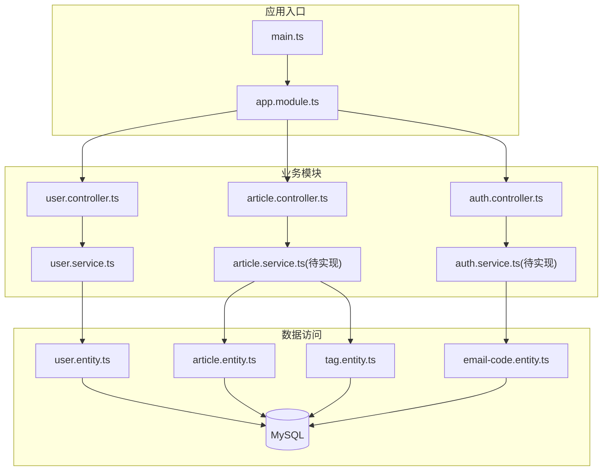
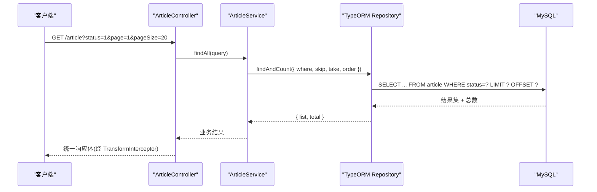
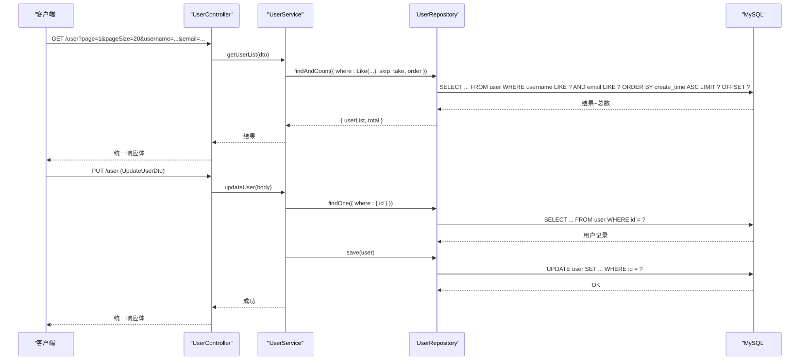
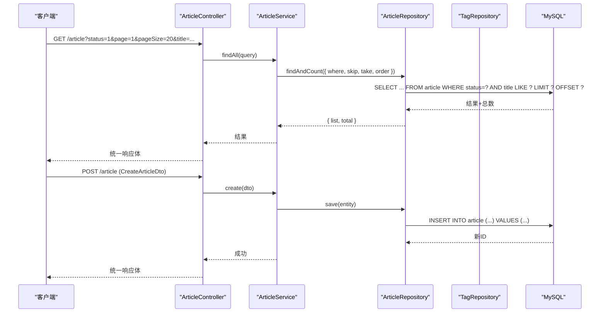
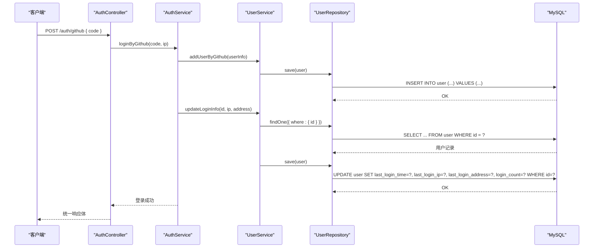
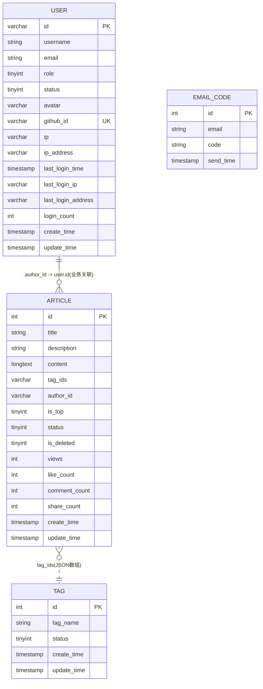
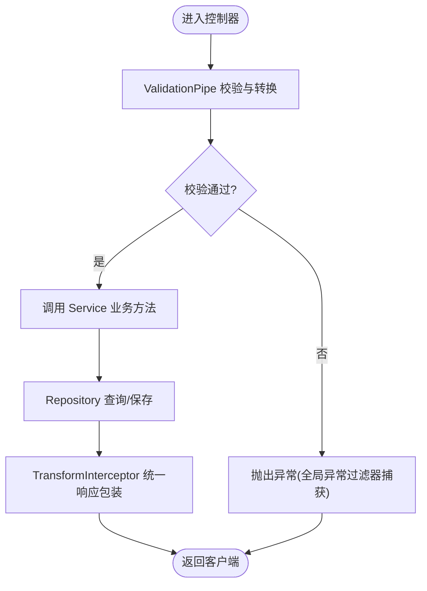
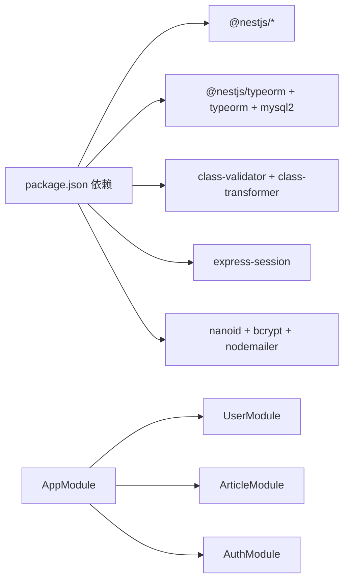

# 数据流设计

<cite>
**本文引用的文件**   
- [main.ts](file://src/main.ts)
- [app.module.ts](file://src/app.module.ts)
- [init.sql](file://sql/init.sql)
- [package.json](file://package.json)
- [user.entity.ts](file://src/api/user/entities/user.entity.ts)
- [article.entity.ts](file://src/api/article/entities/article.entity.ts)
- [tag.entity.ts](file://src/api/article/entities/tag.entity.ts)
- [email-code.entity.ts](file://src/api/auth/entities/email-code.entity.ts)
- [user.dto.ts](file://src/api/user/dto/user.dto.ts)
- [article.dto.ts](file://src/api/article/dto/article.dto.ts)
- [auth.dto.ts](file://src/api/auth/dto/auth.dto.ts)
- [pagination.dto.ts](file://src/common/dto/pagination.dto.ts)
- [user.controller.ts](file://src/api/user/user.controller.ts)
- [article.controller.ts](file://src/api/article/article.controller.ts)
- [auth.controller.ts](file://src/api/auth/auth.controller.ts)
- [user.service.ts](file://src/api/user/user.service.ts)
</cite>

## 目录
1. [简介](#简介)
2. [项目结构](#项目结构)
3. [核心组件](#核心组件)
4. [架构总览](#架构总览)
5. [详细组件分析](#详细组件分析)
6. [依赖关系分析](#依赖关系分析)
7. [性能考虑](#性能考虑)
8. [故障排查指南](#故障排查指南)
9. [结论](#结论)
10. [附录](#附录)

## 简介
本文件面向博客系统的数据流设计，聚焦于 HTTP 请求从控制器到服务层再到数据访问层的完整链路；阐述实体模型（用户、文章、标签等）之间的关系映射与外键约束；说明 TypeORM 的使用模式（实体定义、查询构建器、事务机制）；并解释数据验证与转换流程（DTO 校验规则与类型安全）。文末提供数据流图与实体关系图，帮助读者快速理解数据在各层之间的传递与转换。

## 项目结构
本项目采用 NestJS 模块化组织，按功能域划分模块（用户、认证、文章），并通过全局管道进行参数校验与类型转换，使用 TypeORM 连接 MySQL 数据库。

图表来源
- [main.ts:1-46](file://src/main.ts#L1-L46)
- [app.module.ts:1-35](file://src/app.module.ts#L1-L35)
- [user.controller.ts:1-28](file://src/api/user/user.controller.ts#L1-L28)
- [article.controller.ts:1-52](file://src/api/article/article.controller.ts#L1-L52)
- [auth.controller.ts:1-29](file://src/api/auth/auth.controller.ts#L1-L29)
- [user.service.ts:1-66](file://src/api/user/user.service.ts#L1-L66)
- [user.entity.ts:1-57](file://src/api/user/entities/user.entity.ts#L1-L57)
- [article.entity.ts:1-44](file://src/api/article/entities/article.entity.ts#L1-L44)
- [tag.entity.ts:1-26](file://src/api/article/entities/tag.entity.ts#L1-L26)
- [email-code.entity.ts:1-22](file://src/api/auth/entities/email-code.entity.ts#L1-L22)

章节来源
- [main.ts:1-46](file://src/main.ts#L1-L46)
- [app.module.ts:1-35](file://src/app.module.ts#L1-L35)

## 核心组件
- 应用启动与全局配置
  - 启用会话、全局异常过滤器、全局校验管道（开启 transform 与 whitelist）、Swagger 文档。
- 模块装配
  - 通过 TypeOrmModule.forRoot 注入数据库连接，注册各业务模块与全局守卫/拦截器。
- 领域模块
  - 用户模块：用户列表查询、更新用户信息、第三方登录后的用户创建与登录埋点更新。
  - 文章模块：文章增删改查、状态更新、分页查询。
  - 认证模块：GitHub 第三方登录、Token 刷新。
- 数据访问
  - 基于 TypeORM Repository 的 CRUD 与条件查询、分页与排序。

章节来源
- [main.ts:10-28](file://src/main.ts#L10-L28)
- [app.module.ts:11-32](file://src/app.module.ts#L11-L32)
- [user.controller.ts:14-27](file://src/api/user/user.controller.ts#L14-L27)
- [article.controller.ts:22-51](file://src/api/article/article.controller.ts#L22-L51)
- [auth.controller.ts:14-28](file://src/api/auth/auth.controller.ts#L14-L28)
- [user.service.ts:8-65](file://src/api/user/user.service.ts#L8-L65)

## 架构总览
下图展示一次典型的文章查询请求在系统中的流转路径：客户端发起 HTTP 请求 → 路由匹配 Controller → 调用 Service 业务逻辑 → 通过 TypeORM Repository 执行 SQL → 返回结果经 Interceptor 统一包装后响应给客户端。

图表来源
- [article.controller.ts:22-30](file://src/api/article/article.controller.ts#L22-L30)
- [user.service.ts:21-32](file://src/api/user/user.service.ts#L21-L32)
- [main.ts:22-28](file://src/main.ts#L22-L28)

## 详细组件分析

### 用户模块数据流
- 请求入口
  - GET /user：接收分页与筛选参数（用户名、邮箱），返回用户列表与总数。
  - PUT /user：更新用户信息（包含角色、头像、IP 信息等）。
- 服务处理
  - 使用 Repository 的 findAndCount 完成分页与模糊查询；保存时先 findOne 再 Object.assign 合并字段后 save。
  - 登录埋点更新：维护最后登录时间、IP、地区与登录次数。
- 数据访问
  - 直接操作 user 表，未定义显式外键关联，作者与文章的关联通过业务层维护。

图表来源
- [user.controller.ts:18-26](file://src/api/user/user.controller.ts#L18-L26)
- [user.service.ts:21-48](file://src/api/user/user.service.ts#L21-L48)
- [user.entity.ts:9-56](file://src/api/user/entities/user.entity.ts#L9-L56)

章节来源
- [user.controller.ts:14-27](file://src/api/user/user.controller.ts#L14-L27)
- [user.service.ts:14-65](file://src/api/user/user.service.ts#L14-L65)
- [user.entity.ts:1-57](file://src/api/user/entities/user.entity.ts#L1-L57)

### 文章模块数据流
- 请求入口
  - GET /article：公开接口，支持按状态、标题、ID 筛选与分页。
  - POST /article：创建文章（含 tagIds 数组）。
  - PUT /article：更新文章。
  - PUT /article/status：更新文章状态。
  - DELETE /article：删除文章（软删除）。
- 服务处理
  - 负责将 DTO 转换为实体或查询条件，调用 Repository 完成持久化与查询。
- 数据访问
  - 操作 article 表；标签以 JSON 字符串形式存储于 tag_ids 字段，未建立独立多对多关联表。

图表来源
- [article.controller.ts:26-45](file://src/api/article/article.controller.ts#L26-L45)
- [article.entity.ts:9-43](file://src/api/article/entities/article.entity.ts#L9-L43)

章节来源
- [article.controller.ts:22-51](file://src/api/article/article.controller.ts#L22-L51)
- [article.entity.ts:1-44](file://src/api/article/entities/article.entity.ts#L1-L44)

### 认证模块数据流
- 请求入口
  - POST /auth/github：第三方 GitHub 登录，携带 code 与请求 IP。
  - GET /auth/refresh：刷新 Token。
- 服务处理
  - 根据 code 获取用户信息，若不存在则创建用户；随后更新登录埋点信息（时间、IP、地区、计数）。
- 数据访问
  - 操作 user 表与 email_code 表（预留）。

图表来源
- [auth.controller.ts:23-27](file://src/api/auth/auth.controller.ts#L23-L27)
- [user.service.ts:34-64](file://src/api/user/user.service.ts#L34-L64)
- [user.entity.ts:41-55](file://src/api/user/entities/user.entity.ts#L41-L55)

章节来源
- [auth.controller.ts:14-28](file://src/api/auth/auth.controller.ts#L14-L28)
- [user.service.ts:34-64](file://src/api/user/user.service.ts#L34-L64)

### 实体关系与外键约束
- 用户（user）
  - 主键：id（VARCHAR，由 nanoid 生成）
  - 唯一索引：github_id
  - 普通索引：email、create_time
- 文章（article）
  - 主键：id（INT AUTO_INCREMENT）
  - 作者关联：author_id（VARCHAR）指向 user.id（业务层维护，无数据库级外键）
  - 标签关联：tag_ids（JSON 字符串数组，如 "[1,2,3]"）
  - 索引：author_id、status、is_top、create_time
- 标签（tag）
  - 主键：id（INT AUTO_INCREMENT）
  - 唯一索引：tag_name
- 邮箱验证码（email_code）
  - 主键：id（INT AUTO_INCREMENT）
  - 索引：email、send_time

图表来源
- [init.sql:24-52](file://sql/init.sql#L24-L52)
- [init.sql:64-92](file://sql/init.sql#L64-L92)
- [init.sql:98-108](file://sql/init.sql#L98-L108)
- [init.sql:116-126](file://sql/init.sql#L116-L126)

章节来源
- [init.sql:1-138](file://sql/init.sql#L1-L138)

### TypeORM 使用模式
- 实体定义
  - 使用 @Entity、@Column、@PrimaryGeneratedColumn、@CreateDateColumn、@UpdateDateColumn 等装饰器声明表结构与字段映射。
  - 字段名与列名不一致时使用 name 属性映射（例如 ipAddress 映射为 ip_address）。
- 查询构建器
  - 使用 Repository.find/findOne 进行简单查询；findAndCount 用于分页统计；Like 实现模糊匹配；skip/take/order 控制分页与排序。
- 事务管理
  - 当前代码未显式使用事务；建议在批量写入或跨表一致性操作中引入事务（例如同时更新用户信息与文章统计）。
- 连接配置
  - 通过 TypeOrmModule.forRoot 注入 mysqlConfig，确保连接池、字符集与排序规则正确。

章节来源
- [user.entity.ts:1-57](file://src/api/user/entities/user.entity.ts#L1-L57)
- [article.entity.ts:1-44](file://src/api/article/entities/article.entity.ts#L1-L44)
- [tag.entity.ts:1-26](file://src/api/article/entities/tag.entity.ts#L1-L26)
- [email-code.entity.ts:1-22](file://src/api/auth/entities/email-code.entity.ts#L1-L22)
- [user.service.ts:21-32](file://src/api/user/user.service.ts#L21-L32)
- [app.module.ts:11-17](file://src/app.module.ts#L11-L17)

### 数据验证与转换流程
- 全局校验管道
  - 启用 ValidationPipe，开启 transform（自动类型转换）、whitelist（过滤未定义属性）、stopAtFirstError（首个错误即停止）。
- DTO 校验规则
  - 用户模块：邮箱格式、长度限制、必填校验；分页参数 page/pageSize 默认值与最小值约束。
  - 文章模块：标题、描述、内容必填；tagIds 为数字数组；状态与置顶字段类型与范围约束。
- 类型安全保证
  - 结合 class-transformer 的 @Type 装饰器，将字符串输入转换为 Number/String 等目标类型，避免运行时类型错误。

图表来源
- [main.ts:22-28](file://src/main.ts#L22-L28)
- [user.dto.ts:1-75](file://src/api/user/dto/user.dto.ts#L1-L75)
- [article.dto.ts:1-64](file://src/api/article/dto/article.dto.ts#L1-L64)
- [pagination.dto.ts:1-17](file://src/common/dto/pagination.dto.ts#L1-L17)

章节来源
- [main.ts:22-28](file://src/main.ts#L22-L28)
- [user.dto.ts:1-75](file://src/api/user/dto/user.dto.ts#L1-L75)
- [article.dto.ts:1-64](file://src/api/article/dto/article.dto.ts#L1-L64)
- [auth.dto.ts:1-9](file://src/api/auth/dto/auth.dto.ts#L1-L9)
- [pagination.dto.ts:1-17](file://src/common/dto/pagination.dto.ts#L1-L17)

## 依赖关系分析
- 外部依赖
  - NestJS 核心与平台 Express、TypeORM、mysql2、class-validator、class-transformer、express-session、nanoid、nodemailer、bcrypt 等。
- 模块耦合
  - AppModule 聚合各业务模块与全局提供者（过滤器、拦截器、守卫）。
  - Controller 仅依赖对应 Service，Service 通过 @InjectRepository 注入 TypeORM Repository，降低耦合度。
- 潜在循环依赖
  - 当前未见循环导入；建议保持模块边界清晰，避免跨模块直接引用实体或服务。

图表来源
- [package.json:22-44](file://package.json#L22-L44)
- [app.module.ts:11-17](file://src/app.module.ts#L11-L17)

章节来源
- [package.json:1-100](file://package.json#L1-L100)
- [app.module.ts:11-32](file://src/app.module.ts#L11-L32)

## 性能考虑
- 查询优化
  - 合理使用索引（user.email、user.create_time、article.author_id、article.status、article.is_top、article.create_time）。
  - 分页查询使用 skip/take，避免一次性加载大量数据。
- 连接池
  - 确保 TypeORM 连接池大小与并发量匹配，避免连接耗尽。
- 缓存策略
  - 热点数据（如标签列表、热门文章）可引入 Redis 缓存，减少数据库压力。
- 批量操作
  - 批量写入建议使用事务与批量插入，提升吞吐。

## 故障排查指南
- 常见异常
  - 参数校验失败：检查 DTO 装饰器与前端传参类型是否一致。
  - 用户不存在：更新接口需先 findOne，若为空应抛出明确异常。
  - 数据库连接失败：检查环境变量与 mysqlConfig 配置。
- 日志与监控
  - 利用全局异常过滤器统一捕获并输出结构化日志。
  - 关键路径添加耗时统计（如 Repository 调用耗时）。

章节来源
- [user.service.ts:39-48](file://src/api/user/user.service.ts#L39-L48)
- [user.service.ts:53-64](file://src/api/user/user.service.ts#L53-L64)
- [main.ts:20-28](file://src/main.ts#L20-L28)

## 结论
本设计通过清晰的三层架构（Controller-Service-Repository）与严格的 DTO 校验，实现了稳定可靠的数据流。TypeORM 实体与查询构建器简化了数据访问，但尚未引入事务与显式外键约束，后续可在关键路径补充事务与更严谨的关系建模，以提升一致性与可维护性。

## 附录
- 初始化脚本
  - 数据库与表结构初始化、索引与默认值设置见 init.sql。
- 运行与文档
  - 应用启动端口、Swagger 文档路径见 main.ts。

章节来源
- [init.sql:1-138](file://sql/init.sql#L1-L138)
- [main.ts:41-43](file://src/main.ts#L41-L43)