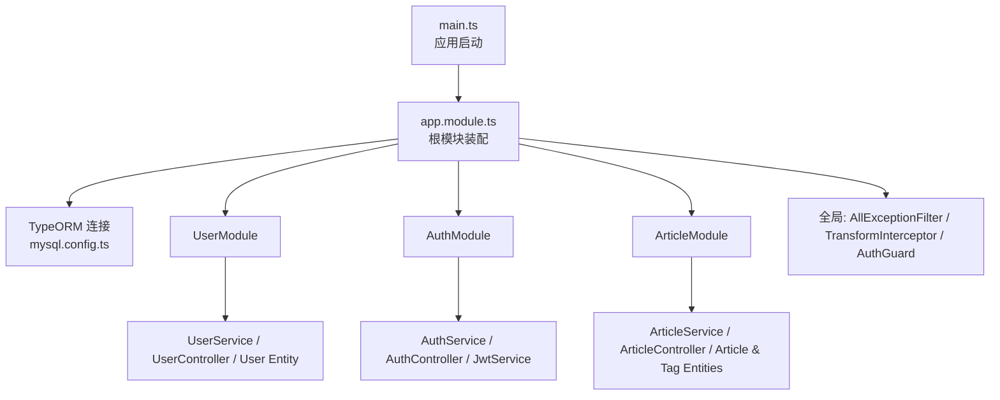
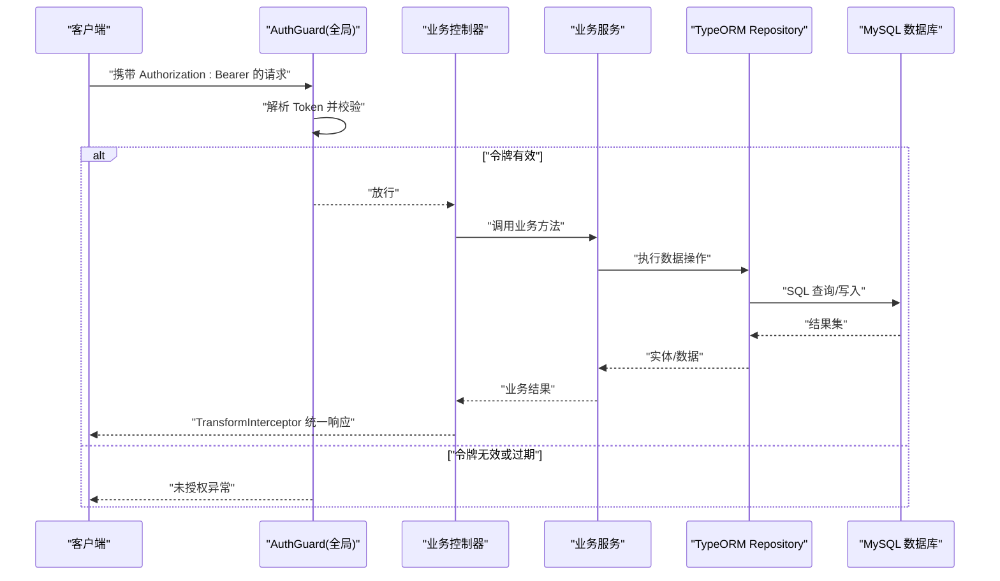
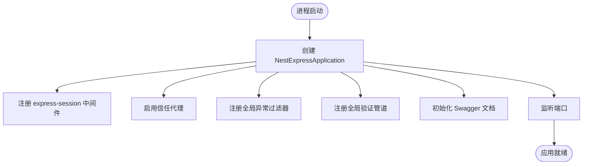
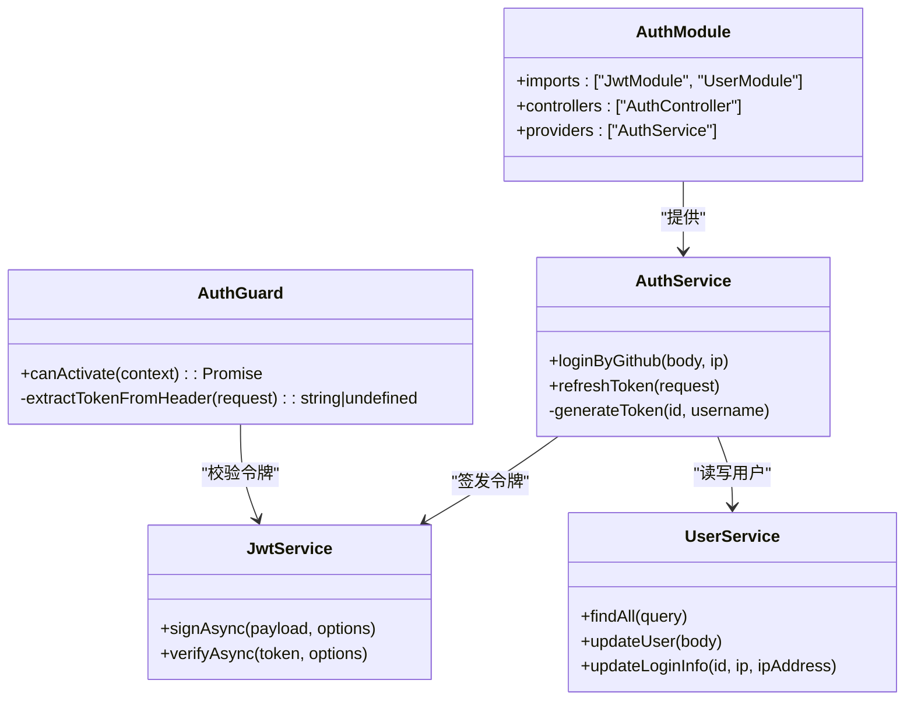
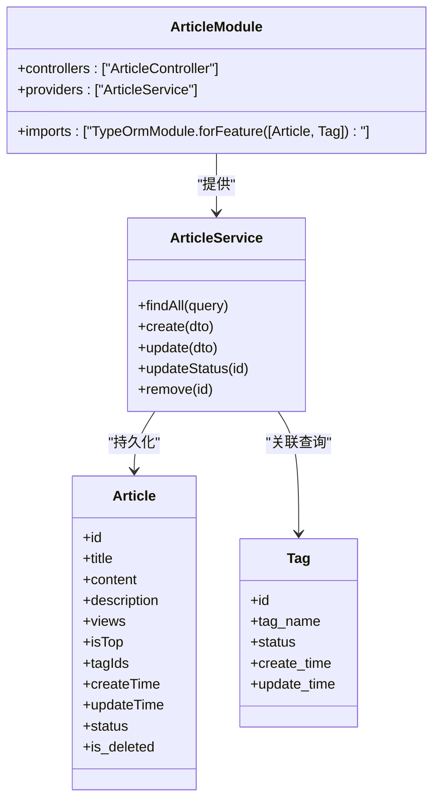
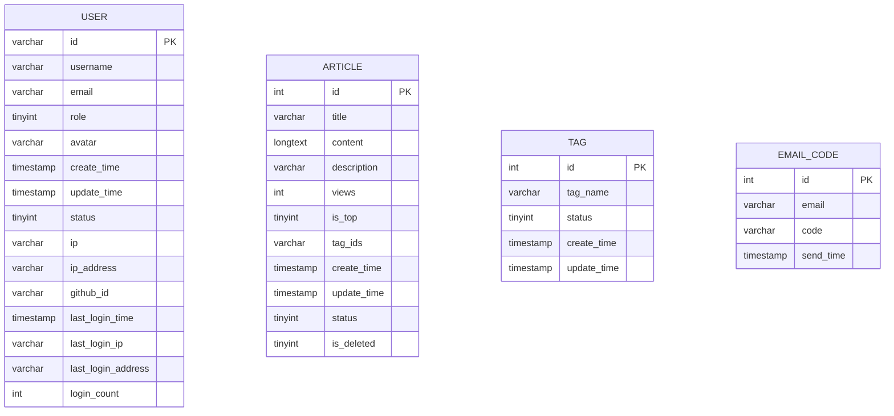
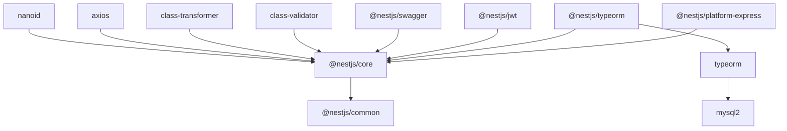

# 整体架构概览

<cite>
**本文引用的文件**   
- [src/main.ts](file://src/main.ts)
- [src/app.module.ts](file://src/app.module.ts)
- [package.json](file://package.json)
- [README.md](file://README.md)
- [src/config/mysql.config.ts](file://src/config/mysql.config.ts)
- [src/config/jwt.config.ts](file://src/config/jwt.config.ts)
- [src/api/user/user.module.ts](file://src/api/user/user.module.ts)
- [src/api/auth/auth.module.ts](file://src/api/auth/auth.module.ts)
- [src/api/article/article.module.ts](file://src/api/article/article.module.ts)
- [src/core/filter/all-exception.filter.ts](file://src/core/filter/all-exception.filter.ts)
- [src/core/interceptor/transform.interceptor.ts](file://src/core/interceptor/transform.interceptor.ts)
- [src/core/guard/auth.guard.ts](file://src/core/guard/auth.guard.ts)
- [src/api/user/entities/user.entity.ts](file://src/api/user/entities/user.entity.ts)
- [src/api/article/entities/article.entity.ts](file://src/api/article/entities/article.entity.ts)
- [src/api/user/user.service.ts](file://src/api/user/user.service.ts)
- [src/api/auth/auth.service.ts](file://src/api/auth/auth.service.ts)
- [src/api/article/article.service.ts](file://src/api/article/article.service.ts)
- [sql/init.sql](file://sql/init.sql)
</cite>

## 目录
1. [简介](#简介)
2. [项目结构](#项目结构)
3. [核心组件](#核心组件)
4. [架构总览](#架构总览)
5. [详细组件分析](#详细组件分析)
6. [依赖关系分析](#依赖关系分析)
7. [性能考量](#性能考量)
8. [故障排查指南](#故障排查指南)
9. [结论](#结论)
10. [附录](#附录)

## 简介
本文件面向博客系统后端服务，提供基于 NestJS 的企业级应用架构概览。文档从 MVC 分层、模块化与依赖注入容器出发，解释应用启动流程（从 main.ts 到 AppModule），并阐述技术栈选型原因（NestJS、TypeORM、MySQL、JWT）。同时给出系统架构图、数据流向说明以及目录组织原则，帮助读者快速理解项目的整体设计与实现思路。

## 项目结构
本项目采用“按功能域划分模块”的组织方式，结合 NestJS 的模块化与依赖注入机制，将控制器、服务、实体、DTO 等按业务域进行封装，并通过根模块统一装配全局能力（异常过滤、拦截器、守卫、数据库连接等）。

- 入口与根模块
  - src/main.ts：应用启动、中间件与全局管道/过滤器注册、Swagger 文档初始化、监听端口。
  - src/app.module.ts：根模块，导入 TypeORM、业务模块，注册全局过滤器、拦截器、守卫。

- 业务模块（api）
  - api/user：用户域，包含控制器、服务、实体、DTO 与模块定义。
  - api/auth：认证域，集成 JWT、第三方登录逻辑、令牌刷新。
  - api/article：文章域，包含文章与标签的 CRUD 与查询聚合。

- 通用能力（core）
  - filter：全局异常过滤器与 HTTP 异常过滤器。
  - guard：鉴权守卫与公开接口装饰器。
  - interceptor：响应体转换拦截器，统一返回格式。

- 配置（config）
  - mysql.config.ts：TypeORM 连接配置。
  - jwt.config.ts：JWT 密钥配置。

- 工具（utils）
  - ip-address.ts：IP 地址解析工具。

- 测试（test）
  - e2e 测试与 Jest 配置。



图表来源
- [src/main.ts:1-46](file://src/main.ts#L1-L46)
- [src/app.module.ts:1-35](file://src/app.module.ts#L1-L35)
- [src/config/mysql.config.ts:1-15](file://src/config/mysql.config.ts#L1-L15)
- [src/api/user/user.module.ts:1-14](file://src/api/user/user.module.ts#L1-L14)
- [src/api/auth/auth.module.ts:1-13](file://src/api/auth/auth.module.ts#L1-L13)
- [src/api/article/article.module.ts:1-14](file://src/api/article/article.module.ts#L1-L14)

章节来源
- [src/main.ts:1-46](file://src/main.ts#L1-L46)
- [src/app.module.ts:1-35](file://src/app.module.ts#L1-L35)
- [package.json:1-100](file://package.json#L1-L100)
- [README.md:1-100](file://README.md#L1-L100)

## 核心组件
- 应用启动与全局装配
  - main.ts 创建 NestExpressApplication，启用信任代理、会话中间件、全局验证管道、全局异常过滤器，并初始化 Swagger 文档后监听端口。
  - app.module.ts 通过 TypeOrmModule.forRoot 建立数据库连接，导入各业务模块，并使用 APP_FILTER、APP_INTERCEPTOR、APP_GUARD 注册全局能力。

- 认证与授权
  - AuthModule 引入 @nestjs/jwt 并全局注册 JwtModule；AuthGuard 作为全局守卫，校验请求头中的 Bearer Token，支持刷新令牌路径的特殊处理。
  - AuthService 负责 GitHub OAuth 登录流程、用户信息同步、登录埋点更新与令牌签发。

- 数据访问层
  - 使用 TypeORM 的 Repository 模式，在 Service 中通过 @InjectRepository 注入对应实体的仓库对象，执行增删改查与分页、模糊匹配等查询。
  - 实体类位于 entities 目录，映射数据库表结构与字段。

- 统一响应与异常
  - TransformInterceptor 将成功响应包装为统一结构（code、message、data）。
  - AllExceptionFilter 捕获所有异常，输出标准化错误响应，包含请求上下文信息。

章节来源
- [src/main.ts:1-46](file://src/main.ts#L1-L46)
- [src/app.module.ts:1-35](file://src/app.module.ts#L1-L35)
- [src/api/auth/auth.module.ts:1-13](file://src/api/auth/auth.module.ts#L1-L13)
- [src/core/guard/auth.guard.ts:1-53](file://src/core/guard/auth.guard.ts#L1-L53)
- [src/api/auth/auth.service.ts:1-123](file://src/api/auth/auth.service.ts#L1-L123)
- [src/api/user/user.service.ts:1-66](file://src/api/user/user.service.ts#L1-L66)
- [src/api/article/article.service.ts:1-104](file://src/api/article/article.service.ts#L1-L104)
- [src/core/interceptor/transform.interceptor.ts:1-24](file://src/core/interceptor/transform.interceptor.ts#L1-L24)
- [src/core/filter/all-exception.filter.ts:1-43](file://src/core/filter/all-exception.filter.ts#L1-L43)

## 架构总览
下图展示了从客户端请求到数据库交互的整体流程，包括认证守卫、控制器、服务、仓储与数据库之间的协作关系。



图表来源
- [src/core/guard/auth.guard.ts:1-53](file://src/core/guard/auth.guard.ts#L1-L53)
- [src/core/interceptor/transform.interceptor.ts:1-24](file://src/core/interceptor/transform.interceptor.ts#L1-L24)
- [src/api/user/user.service.ts:1-66](file://src/api/user/user.service.ts#L1-L66)
- [src/api/article/article.service.ts:1-104](file://src/api/article/article.service.ts#L1-L104)
- [src/config/mysql.config.ts:1-15](file://src/config/mysql.config.ts#L1-L15)

## 详细组件分析

### 应用启动流程（main.ts → AppModule）
- main.ts 创建 NestExpressApplication，注册 express-session、全局验证管道、全局异常过滤器，并初始化 Swagger 文档后启动监听。
- AppModule 通过 TypeOrmModule.forRoot 加载 mysql.config.ts 的配置，导入 UserModule、AuthModule、ArticleModule，并注册全局过滤器、拦截器、守卫。



图表来源
- [src/main.ts:1-46](file://src/main.ts#L1-L46)
- [src/app.module.ts:1-35](file://src/app.module.ts#L1-L35)
- [src/config/mysql.config.ts:1-15](file://src/config/mysql.config.ts#L1-L15)

章节来源
- [src/main.ts:1-46](file://src/main.ts#L1-L46)
- [src/app.module.ts:1-35](file://src/app.module.ts#L1-L35)

### 认证与授权（AuthModule、AuthGuard、AuthService）
- AuthModule 全局注册 JwtModule，并依赖 UserModule 完成用户信息查询与更新。
- AuthGuard 作为全局守卫，优先检查公开接口标记，否则从请求头提取 Bearer Token，并根据 URL 区分 access/refresh 令牌密钥进行校验。
- AuthService 实现 GitHub OAuth 登录流程：获取 access_token、拉取用户信息、落库或更新用户、记录登录埋点、签发 accessToken 与 refreshToken。



图表来源
- [src/api/auth/auth.module.ts:1-13](file://src/api/auth/auth.module.ts#L1-L13)
- [src/core/guard/auth.guard.ts:1-53](file://src/core/guard/auth.guard.ts#L1-L53)
- [src/api/auth/auth.service.ts:1-123](file://src/api/auth/auth.service.ts#L1-L123)
- [src/api/user/user.service.ts:1-66](file://src/api/user/user.service.ts#L1-L66)

章节来源
- [src/api/auth/auth.module.ts:1-13](file://src/api/auth/auth.module.ts#L1-L13)
- [src/core/guard/auth.guard.ts:1-53](file://src/core/guard/auth.guard.ts#L1-L53)
- [src/api/auth/auth.service.ts:1-123](file://src/api/auth/auth.service.ts#L1-L123)

### 用户域（UserModule、UserService、User 实体）
- UserModule 通过 TypeOrmModule.forFeature 注册 User 实体，暴露 UserService 供其他模块使用。
- UserService 提供用户列表分页查询、条件搜索、新增与更新、登录埋点更新等方法。
- User 实体映射 user 表，包含基础信息与登录埋点字段。

```mermaid
classDiagram
class UserModule {
+imports : ["TypeOrmModule.forFeature([User])"]
+controllers : ["UserController"]
+providers : ["UserService"]
+exports : ["UserService"]
}
class UserService {
+findAll(query)
+getUserList({page, pageSize, username, email})
+addUserByGithub(userInfo)
+updateUser(body)
+updateLoginInfo(id, ip, ipAddress)
}
class User {
+id
+username
+email
+role
+avatar
+create_time
+update_time
+status
+ip
+ipAddress
+githubId
+lastLoginTime
+lastLoginIp
+lastLoginAddress
+loginCount
}
UserModule --> UserService : "提供"
UserService --> User : "持久化"
```

图表来源
- [src/api/user/user.module.ts:1-14](file://src/api/user/user.module.ts#L1-L14)
- [src/api/user/user.service.ts:1-66](file://src/api/user/user.service.ts#L1-L66)
- [src/api/user/entities/user.entity.ts:1-57](file://src/api/user/entities/user.entity.ts#L1-L57)

章节来源
- [src/api/user/user.module.ts:1-14](file://src/api/user/user.module.ts#L1-L14)
- [src/api/user/user.service.ts:1-66](file://src/api/user/user.service.ts#L1-L66)
- [src/api/user/entities/user.entity.ts:1-57](file://src/api/user/entities/user.entity.ts#L1-L57)

### 文章域（ArticleModule、ArticleService、Article/Tag 实体）
- ArticleModule 注册 Article 与 Tag 实体，提供 ArticleService 与 ArticleController。
- ArticleService 实现文章的分页查询、详情聚合（含标签）、创建、更新、状态切换与软删除。
- Article 与 Tag 实体分别映射 article 与 tag 表结构。



图表来源
- [src/api/article/article.module.ts:1-14](file://src/api/article/article.module.ts#L1-L14)
- [src/api/article/article.service.ts:1-104](file://src/api/article/article.service.ts#L1-L104)
- [src/api/article/entities/article.entity.ts:1-44](file://src/api/article/entities/article.entity.ts#L1-L44)

章节来源
- [src/api/article/article.module.ts:1-14](file://src/api/article/article.module.ts#L1-L14)
- [src/api/article/article.service.ts:1-104](file://src/api/article/article.service.ts#L1-L104)
- [src/api/article/entities/article.entity.ts:1-44](file://src/api/article/entities/article.entity.ts#L1-L44)

### 数据模型与数据库设计
- 数据库脚本 sql/init.sql 定义了 user、article、tag、email_code 四张表，并提供索引与默认值策略。
- 实体类与表结构保持一致，便于 TypeORM 自动加载与迁移管理。



图表来源
- [sql/init.sql:1-138](file://sql/init.sql#L1-L138)

章节来源
- [sql/init.sql:1-138](file://sql/init.sql#L1-L138)
- [src/api/user/entities/user.entity.ts:1-57](file://src/api/user/entities/user.entity.ts#L1-L57)
- [src/api/article/entities/article.entity.ts:1-44](file://src/api/article/entities/article.entity.ts#L1-L44)

## 依赖关系分析
- 框架与运行时
  - NestJS 核心包（@nestjs/core、@nestjs/common、@nestjs/platform-express）提供 IoC 容器、HTTP 适配与装饰器体系。
  - reflect-metadata 与 rxjs 是框架运行时的关键依赖。
- 数据持久化
  - @nestjs/typeorm 与 typeorm 集成 MySQL 驱动 mysql2，通过 TypeOrmModule.forRoot 建立连接池与实体扫描。
- 认证与安全
  - @nestjs/jwt 提供 JWT 签发与校验能力；bcrypt 用于密码哈希（当前仅第三方登录，未直接使用）。
- 开发体验与文档
  - @nestjs/swagger 与 swagger-ui-express 生成并展示 API 文档。
  - class-validator 与 class-transformer 配合 ValidationPipe 实现参数校验与类型转换。
- 工具与扩展
  - axios 用于外部 API 调用（GitHub OAuth）。
  - nanoid 生成短 ID。
  - nodemailer 可用于邮件验证码（当前未启用）。



图表来源
- [package.json:1-100](file://package.json#L1-L100)

章节来源
- [package.json:1-100](file://package.json#L1-L100)

## 性能考量
- 数据库连接与查询
  - 使用 TypeORM 的连接池与 autoLoadEntities 简化实体加载；建议在生产环境开启连接池大小与超时优化。
  - 分页查询使用 findAndCount，注意避免大偏移量导致的性能问题，必要时考虑游标分页。
- 缓存与并发
  - 对热点数据（如标签列表）可引入 Redis 缓存，减少重复查询。
  - 批量操作与并行查询（Promise.all）已在文章聚合中使用，需关注 N+1 查询风险。
- 鉴权开销
  - JWT 校验轻量高效，但应合理设置过期时间与刷新策略，避免频繁签名与验证。
- 日志与监控
  - 利用全局异常过滤器与拦截器收集请求上下文，结合 APM 工具进行链路追踪与慢查询定位。

[本节为通用指导，不直接分析具体文件]

## 故障排查指南
- 常见异常与统一响应
  - 全局异常过滤器 AllExceptionFilter 会捕获所有异常并返回标准错误结构，包含请求方法与 URL 等信息，便于定位问题。
  - 若出现 500 错误，检查数据库连接配置与服务端日志。
- 认证失败
  - 确认请求头 Authorization 是否携带正确的 Bearer Token。
  - 刷新令牌路径 /auth/refresh 使用 refreshSecretKey，普通接口使用 accessSecretKey，请核对 jwt.config.ts 配置。
- 参数校验失败
  - 全局 ValidationPipe 已启用 transform 与 whitelist，确保 DTO 使用 class-validator 装饰器声明规则。
- 第三方登录失败
  - 检查 GitHub OAuth 的 client_id 与 client_secret 配置是否正确，网络连通性与回调域名是否匹配。

章节来源
- [src/core/filter/all-exception.filter.ts:1-43](file://src/core/filter/all-exception.filter.ts#L1-L43)
- [src/core/guard/auth.guard.ts:1-53](file://src/core/guard/auth.guard.ts#L1-L53)
- [src/config/jwt.config.ts:1-5](file://src/config/jwt.config.ts#L1-L5)
- [src/api/auth/auth.service.ts:1-123](file://src/api/auth/auth.service.ts#L1-L123)

## 结论
本项目以 NestJS 为核心，结合 TypeORM 与 MySQL 构建企业级后端服务。通过模块化与依赖注入实现高内聚低耦合，借助全局过滤器、拦截器与守卫提升一致性与安全性。认证采用 JWT，支持第三方登录与令牌刷新；数据访问遵循 Repository 模式，便于扩展与维护。整体架构清晰、职责明确，适合持续迭代与团队协作。

[本节为总结性内容，不直接分析具体文件]

## 附录
- 技术栈选型理由
  - NestJS：提供企业级工程化能力（模块化、IoC、装饰器、生命周期钩子），生态完善，易于团队规范与扩展。
  - TypeORM：成熟的 ORM 方案，支持实体映射、迁移与复杂查询，降低 SQL 编写成本。
  - MySQL：稳定可靠的开源关系型数据库，社区活跃，运维成熟。
  - JWT：无状态认证，适合分布式与微服务场景，签发与校验成本低。
- 参考文档与资源
  - README.md 提供了项目安装、编译、运行与测试命令，可作为快速上手指引。

章节来源
- [README.md:1-100](file://README.md#L1-L100)