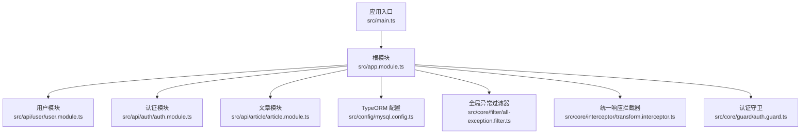
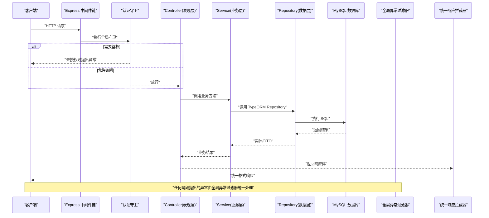
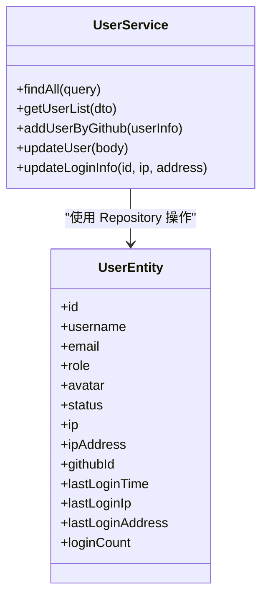
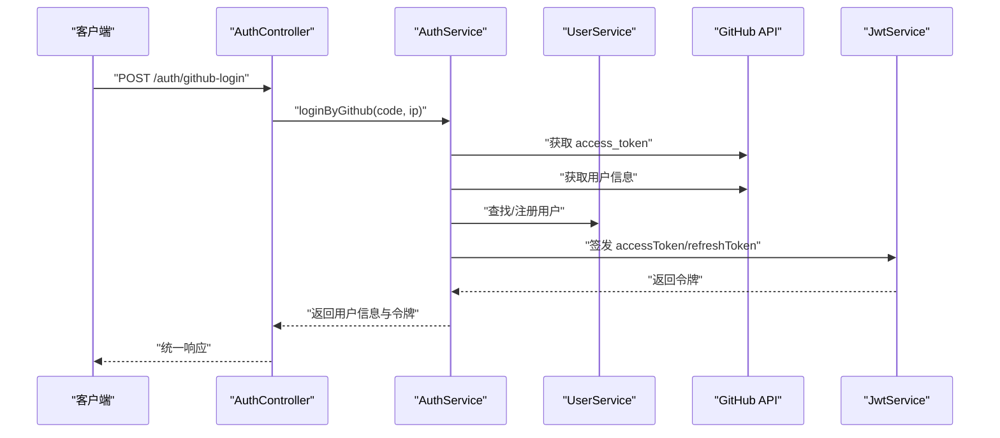
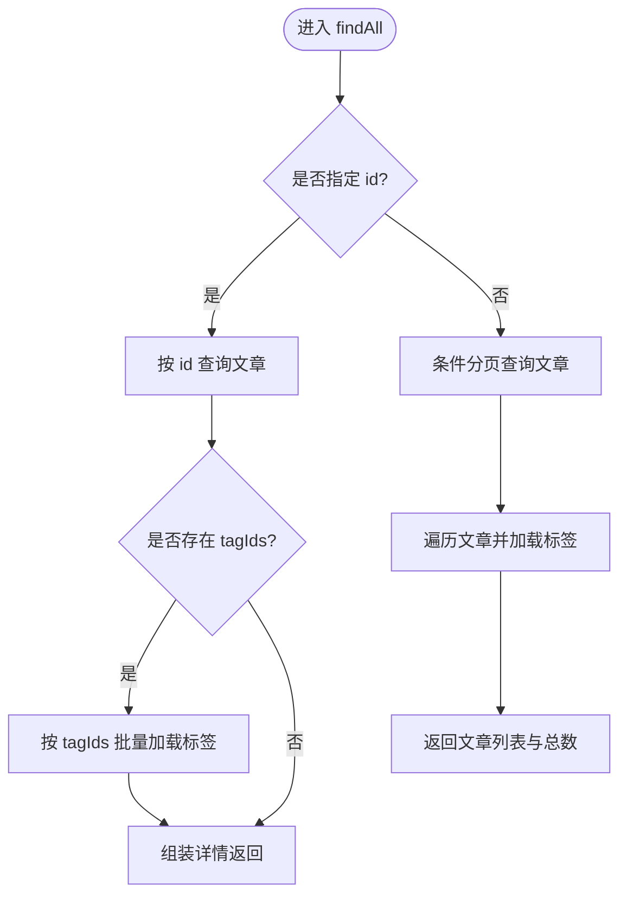
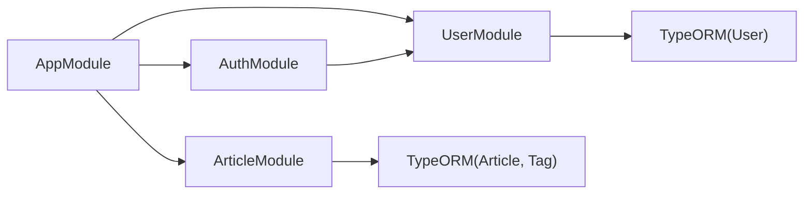

# 架构设计

<cite>
**本文引用的文件**   
- [main.ts](file://src/main.ts)
- [app.module.ts](file://src/app.module.ts)
- [package.json](file://package.json)
- [README.md](file://README.md)
- [user.module.ts](file://src/api/user/user.module.ts)
- [auth.module.ts](file://src/api/auth/auth.module.ts)
- [article.module.ts](file://src/api/article/article.module.ts)
- [all-exception.filter.ts](file://src/core/filter/all-exception.filter.ts)
- [http-exception.filter.ts](file://src/core/filter/http-exception.filter.ts)
- [transform.interceptor.ts](file://src/core/interceptor/transform.interceptor.ts)
- [auth.guard.ts](file://src/core/guard/auth.guard.ts)
- [public.decorator.ts](file://src/core/guard/public.decorator.ts)
- [user.service.ts](file://src/api/user/user.service.ts)
- [auth.service.ts](file://src/api/auth/auth.service.ts)
- [article.service.ts](file://src/api/article/article.service.ts)
- [user.entity.ts](file://src/api/user/entities/user.entity.ts)
- [article.entity.ts](file://src/api/article/entities/article.entity.ts)
- [jwt.config.ts](file://src/config/jwt.config.ts)
- [mysql.config.ts](file://src/config/mysql.config.ts)
</cite>

## 目录
1. [简介](#简介)
2. [项目结构](#项目结构)
3. [核心组件](#核心组件)
4. [架构总览](#架构总览)
5. [详细组件分析](#详细组件分析)
6. [依赖关系分析](#依赖关系分析)
7. [性能考虑](#性能考虑)
8. [故障排查指南](#故障排查指南)
9. [结论](#结论)
10. [附录](#附录)

## 简介
本文件为博客系统后端服务的架构设计文档，基于 NestJS 的分层架构模式，围绕表现层（Controller）、业务逻辑层（Service）、数据访问层（Repository）的职责分离进行阐述。文档同时覆盖模块化设计理念、核心基础设施（全局异常处理、统一响应格式转换、认证守卫机制），并提供系统架构图与数据流图，解释请求处理管道与中间件链的工作流程。文末给出技术选型的原因与权衡，包括 TypeORM、JWT 认证策略与 MySQL 数据库的选择依据。

## 项目结构
本项目采用按领域模块划分的组织方式，核心入口位于应用启动文件，根模块负责装配数据库连接、全局过滤器/拦截器/守卫以及各业务模块的导入。

图表来源
- [main.ts:1-46](file://src/main.ts#L1-L46)
- [app.module.ts:1-35](file://src/app.module.ts#L1-L35)
- [user.module.ts:1-14](file://src/api/user/user.module.ts#L1-L14)
- [auth.module.ts:1-13](file://src/api/auth/auth.module.ts#L1-L13)
- [article.module.ts:1-14](file://src/api/article/article.module.ts#L1-L14)
- [mysql.config.ts:1-15](file://src/config/mysql.config.ts#L1-L15)
- [all-exception.filter.ts:1-43](file://src/core/filter/all-exception.filter.ts#L1-L43)
- [transform.interceptor.ts](file://src/core/interceptor/transform.interceptor.ts)
- [auth.guard.ts:1-53](file://src/core/guard/auth.guard.ts#L1-L53)

章节来源
- [main.ts:1-46](file://src/main.ts#L1-L46)
- [app.module.ts:1-35](file://src/app.module.ts#L1-L35)
- [package.json:1-100](file://package.json#L1-L100)
- [README.md:1-100](file://README.md#L1-L100)

## 核心组件
- 表现层（Controller）：定义 HTTP 路由与参数绑定，调用 Service 完成业务编排。
- 业务逻辑层（Service）：封装领域规则、跨模块协作与事务边界，调用 Repository 进行数据操作。
- 数据访问层（Repository）：通过 TypeORM 的 Repository 抽象对数据库进行增删改查与复杂查询。
- 基础设施：
  - 全局异常过滤器：统一捕获并返回标准错误结构。
  - 统一响应拦截器：将控制器返回值包装为统一的响应体。
  - 认证守卫：基于 JWT 的请求鉴权与公共接口豁免。
  - 验证管道：使用 class-validator/class-transformer 实现请求体验证与类型转换。
  - 会话中间件：启用 express-session 以支持会话能力（当前用于网关或第三方登录流程）。

章节来源
- [user.service.ts:1-66](file://src/api/user/user.service.ts#L1-L66)
- [auth.service.ts:1-123](file://src/api/auth/auth.service.ts#L1-L123)
- [article.service.ts:1-104](file://src/api/article/article.service.ts#L1-L104)
- [all-exception.filter.ts:1-43](file://src/core/filter/all-exception.filter.ts#L1-L43)
- [transform.interceptor.ts](file://src/core/interceptor/transform.interceptor.ts)
- [auth.guard.ts:1-53](file://src/core/guard/auth.guard.ts#L1-L53)
- [main.ts:22-28](file://src/main.ts#L22-L28)

## 架构总览
下图展示了从客户端到数据库的整体请求路径，包含中间件、全局过滤器/拦截器/守卫、模块 Controller/Service/Repository 的交互。

图表来源
- [main.ts:10-28](file://src/main.ts#L10-L28)
- [app.module.ts:11-32](file://src/app.module.ts#L11-L32)
- [auth.guard.ts:14-52](file://src/core/guard/auth.guard.ts#L14-L52)
- [all-exception.filter.ts:10-42](file://src/core/filter/all-exception.filter.ts#L10-L42)
- [transform.interceptor.ts](file://src/core/interceptor/transform.interceptor.ts)
- [mysql.config.ts:1-15](file://src/config/mysql.config.ts#L1-L15)

## 详细组件分析

### 用户模块（User）
- 职责
  - 提供用户信息查询、分页列表、更新基本信息、记录登录埋点等能力。
  - 通过 TypeORM Repository 直接访问 user 表。
- 关键流程
  - 分页查询：根据用户名/邮箱模糊匹配，结合 skip/take 实现分页。
  - 登录埋点：更新最后登录时间、IP、地址与登录次数。
- 数据模型
  - 用户实体包含基础信息、角色、状态、登录追踪字段等。

图表来源
- [user.service.ts:1-66](file://src/api/user/user.service.ts#L1-L66)
- [user.entity.ts:1-57](file://src/api/user/entities/user.entity.ts#L1-L57)

章节来源
- [user.module.ts:1-14](file://src/api/user/user.module.ts#L1-L14)
- [user.service.ts:1-66](file://src/api/user/user.service.ts#L1-L66)
- [user.entity.ts:1-57](file://src/api/user/entities/user.entity.ts#L1-L57)

### 认证模块（Auth）
- 职责
  - 提供 GitHub 第三方登录、刷新令牌、签发 access/refresh token。
  - 与用户模块协作，完成新用户注册与老用户登录埋点更新。
- 关键流程
  - 使用 code 换取 access_token，拉取 GitHub 用户信息，判断是否已存在用户；不存在则自动注册。
  - 生成双令牌（access/refresh），分别设置不同过期时间与密钥。
- 安全要点
  - 令牌校验在守卫中完成，区分刷新接口与普通接口的密钥。

图表来源
- [auth.service.ts:23-121](file://src/api/auth/auth.service.ts#L23-L121)
- [user.service.ts:34-64](file://src/api/user/user.service.ts#L34-L64)
- [auth.module.ts:7-12](file://src/api/auth/auth.module.ts#L7-L12)
- [jwt.config.ts:1-5](file://src/config/jwt.config.ts#L1-L5)

章节来源
- [auth.module.ts:1-13](file://src/api/auth/auth.module.ts#L1-L13)
- [auth.service.ts:1-123](file://src/api/auth/auth.service.ts#L1-L123)
- [jwt.config.ts:1-5](file://src/config/jwt.config.ts#L1-L5)

### 文章模块（Article）
- 职责
  - 提供文章的创建、更新、状态切换、软删除与分页查询。
  - 标签通过逗号分隔的 tagIds 字符串关联，查询时动态加载标签详情。
- 关键流程
  - 列表查询：支持标题模糊匹配、状态过滤、分页。
  - 详情查询：根据 id 获取文章并按 tagIds 批量加载标签。
  - 更新/删除：先校验存在性，再进行持久化。

图表来源
- [article.service.ts:21-58](file://src/api/article/article.service.ts#L21-L58)
- [article.entity.ts:1-44](file://src/api/article/entities/article.entity.ts#L1-L44)

章节来源
- [article.module.ts:1-14](file://src/api/article/article.module.ts#L1-L14)
- [article.service.ts:1-104](file://src/api/article/article.service.ts#L1-L104)
- [article.entity.ts:1-44](file://src/api/article/entities/article.entity.ts#L1-L44)

### 基础设施组件

#### 全局异常过滤器
- 作用：捕获所有未处理异常，输出统一错误结构，包含状态码、消息与请求上下文。
- 行为：若异常非 HttpException，默认返回内部服务器错误状态码。

章节来源
- [all-exception.filter.ts:1-43](file://src/core/filter/all-exception.filter.ts#L1-L43)
- [http-exception.filter.ts](file://src/core/filter/http-exception.filter.ts)

#### 统一响应拦截器
- 作用：在控制器返回后统一包装响应体，确保前端消费一致的结构。
- 位置：作为全局拦截器注入，对所有响应生效。

章节来源
- [transform.interceptor.ts](file://src/core/interceptor/transform.interceptor.ts)

#### 认证守卫与公共接口
- 作用：解析 Authorization 头中的 Bearer Token，校验 JWT 并将用户信息挂载到请求对象。
- 公共接口：通过装饰器标记的接口可跳过鉴权。
- 刷新令牌：针对特定刷新接口使用 refreshSecretKey 校验。

章节来源
- [auth.guard.ts:1-53](file://src/core/guard/auth.guard.ts#L1-L53)
- [public.decorator.ts](file://src/core/guard/public.decorator.ts)
- [jwt.config.ts:1-5](file://src/config/jwt.config.ts#L1-L5)

#### 验证管道与中间件
- 验证管道：启用自动类型转换、白名单过滤、首个错误即停止，提升输入健壮性。
- 会话中间件：启用 express-session，便于后续扩展会话相关能力。

章节来源
- [main.ts:11-28](file://src/main.ts#L11-L28)

## 依赖关系分析
- 模块间依赖
  - 认证模块依赖用户模块（读取/写入用户信息）。
  - 文章模块独立于用户与认证模块，仅依赖 TypeORM。
- 全局装配
  - 根模块集中装配 TypeORM、全局过滤器/拦截器/守卫与各业务模块。
- 外部依赖
  - 使用 @nestjs/jwt 管理令牌，@nestjs/typeorm 与 typeorm 驱动 MySQL。

图表来源
- [app.module.ts:11-17](file://src/app.module.ts#L11-L17)
- [auth.module.ts:7-12](file://src/api/auth/auth.module.ts#L7-L12)
- [user.module.ts:7-12](file://src/api/user/user.module.ts#L7-L12)
- [article.module.ts:8-12](file://src/api/article/article.module.ts#L8-L12)

章节来源
- [app.module.ts:1-35](file://src/app.module.ts#L1-L35)
- [auth.module.ts:1-13](file://src/api/auth/auth.module.ts#L1-L13)
- [user.module.ts:1-14](file://src/api/user/user.module.ts#L1-L14)
- [article.module.ts:1-14](file://src/api/article/article.module.ts#L1-L14)

## 性能考虑
- 分页与索引
  - 列表查询使用 skip/take 分页，建议对常用过滤字段建立索引以提升查询性能。
- N+1 查询优化
  - 文章列表加载标签时使用批量查询减少往返次数。
- 令牌校验
  - 守卫中仅做必要校验，避免重复计算；必要时可引入缓存层降低外部依赖压力。
- 连接池
  - TypeORM 默认连接池适用于多数场景，生产环境需根据并发调整 poolSize 与超时参数。

[本节为通用指导，不直接分析具体文件]

## 故障排查指南
- 常见异常
  - 未授权：检查 Authorization 头是否为 Bearer Token，确认密钥与过期时间。
  - 参数校验失败：查看 ValidationPipe 的错误信息，确认 DTO 约束是否正确。
  - 资源不存在：服务层会抛出业务异常，统一由全局异常过滤器返回。
- 定位步骤
  - 开启日志与调试端口，观察请求链路。
  - 检查全局异常过滤器输出的请求上下文（query/body/params/url/method）。
  - 核对数据库连接配置与实体映射一致性。

章节来源
- [all-exception.filter.ts:14-42](file://src/core/filter/all-exception.filter.ts#L14-L42)
- [main.ts:22-28](file://src/main.ts#L22-L28)

## 结论
本项目采用清晰的 NestJS 分层架构与模块化设计，通过全局异常过滤器、统一响应拦截器与认证守卫构建稳健的基础设施。TypeORM 与 MySQL 的组合提供了稳定的数据访问能力，JWT 方案满足无状态鉴权需求。整体结构易于扩展与维护，适合持续迭代的博客系统后端。

[本节为总结性内容，不直接分析具体文件]

## 附录

### 技术选型与权衡
- TypeORM
  - 优势：面向对象的数据建模、迁移与查询构建器完善，生态成熟。
  - 权衡：相比纯 SQL 方案有一定学习成本，但换来更高的开发效率与可维护性。
- JWT 认证策略
  - 优势：无状态、易水平扩展，适合前后端分离与微服务场景。
  - 权衡：需妥善管理密钥与刷新令牌生命周期，防止泄露与重放攻击。
- MySQL 数据库
  - 优势：广泛使用、工具链丰富、社区活跃，适合结构化数据存储。
  - 权衡：高并发写场景可能需要分库分表或引入其他存储引擎。

章节来源
- [package.json:22-44](file://package.json#L22-L44)
- [mysql.config.ts:1-15](file://src/config/mysql.config.ts#L1-L15)
- [jwt.config.ts:1-5](file://src/config/jwt.config.ts#L1-L5)