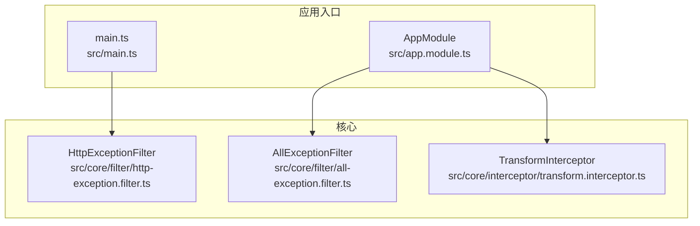
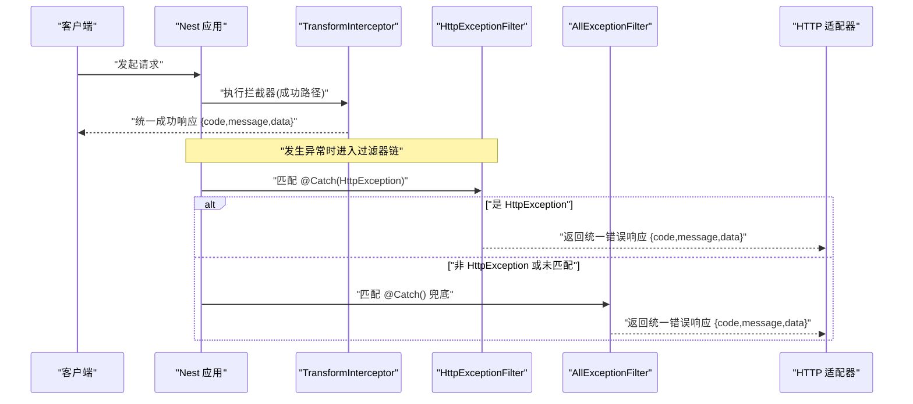
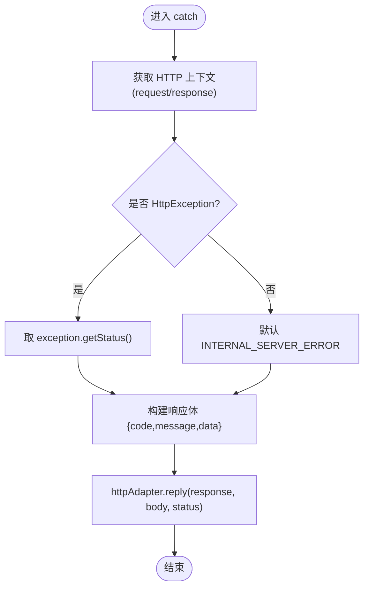
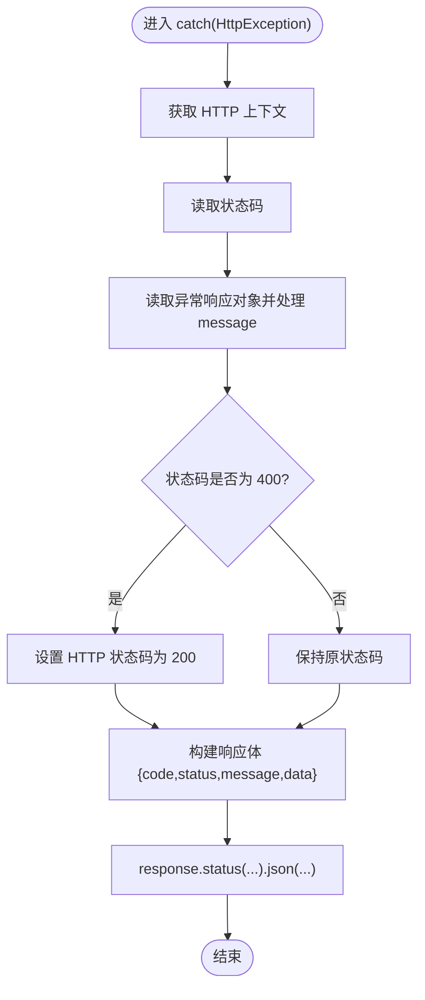
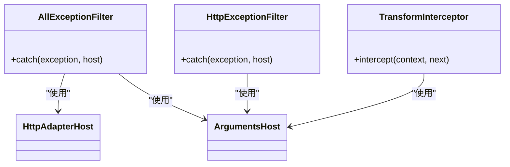

# 全局异常处理

<cite>
**本文引用的文件**   
- [src/core/filter/all-exception.filter.ts](file://src/core/filter/all-exception.filter.ts)
- [src/core/filter/http-exception.filter.ts](file://src/core/filter/http-exception.filter.ts)
- [src/main.ts](file://src/main.ts)
- [src/app.module.ts](file://src/app.module.ts)
- [src/core/interceptor/transform.interceptor.ts](file://src/core/interceptor/transform.interceptor.ts)
</cite>

## 目录
1. [简介](#简介)
2. [项目结构](#项目结构)
3. [核心组件](#核心组件)
4. [架构总览](#架构总览)
5. [详细组件分析](#详细组件分析)
6. [依赖关系分析](#依赖关系分析)
7. [性能与可观测性](#性能与可观测性)
8. [故障排查指南](#故障排查指南)
9. [结论](#结论)
10. [附录：最佳实践与示例](#附录最佳实践与示例)

## 简介
本文件围绕博客系统的全局异常处理机制展开，重点解析 AllExceptionFilter 的设计模式与实现原理，说明 @Catch() 装饰器的使用、HttpException 的捕获与处理流程。文档还阐述错误分类策略（业务异常、系统异常、未知异常）、统一错误响应格式（code、message、data）的设计，以及请求上下文信息（query、body、params、method、url）的自动收集机制。最后提供自定义异常类的创建指南与常见异常处理场景的实践建议。

## 项目结构
全局异常处理相关代码集中在 core/filter 目录下，并通过应用启动或模块注册的方式生效。

图表来源
- [src/core/filter/all-exception.filter.ts:1-43](file://src/core/filter/all-exception.filter.ts#L1-L43)
- [src/core/filter/http-exception.filter.ts:1-37](file://src/core/filter/http-exception.filter.ts#L1-L37)
- [src/core/interceptor/transform.interceptor.ts:1-23](file://src/core/interceptor/transform.interceptor.ts#L1-L23)
- [src/main.ts:1-46](file://src/main.ts#L1-L46)
- [src/app.module.ts:1-35](file://src/app.module.ts#L1-L35)

章节来源
- [src/core/filter/all-exception.filter.ts:1-43](file://src/core/filter/all-exception.filter.ts#L1-L43)
- [src/core/filter/http-exception.filter.ts:1-37](file://src/core/filter/http-exception.filter.ts#L1-L37)
- [src/main.ts:1-46](file://src/main.ts#L1-L46)
- [src/app.module.ts:1-35](file://src/app.module.ts#L1-L35)
- [src/core/interceptor/transform.interceptor.ts:1-23](file://src/core/interceptor/transform.interceptor.ts#L1-L23)

## 核心组件
- AllExceptionFilter：全局兜底过滤器，捕获所有未处理的异常，输出统一错误响应并附带请求上下文。
- HttpExceptionFilter：针对 HTTP 异常的专用过滤器，用于格式化消息、调整状态码并返回统一结构。
- TransformInterceptor：成功响应的统一包装器，保证正常路径也返回一致的 code/message/data 结构。

章节来源
- [src/core/filter/all-exception.filter.ts:1-43](file://src/core/filter/all-exception.filter.ts#L1-L43)
- [src/core/filter/http-exception.filter.ts:1-37](file://src/core/filter/http-exception.filter.ts#L1-L37)
- [src/core/interceptor/transform.interceptor.ts:1-23](file://src/core/interceptor/transform.interceptor.ts#L1-L23)

## 架构总览
下图展示了请求进入后的异常处理链路：全局拦截器先对成功响应进行统一封装；若发生异常，则根据异常类型由不同过滤器处理，最终通过统一的响应结构返回客户端。

图表来源
- [src/core/interceptor/transform.interceptor.ts:1-23](file://src/core/interceptor/transform.interceptor.ts#L1-L23)
- [src/core/filter/http-exception.filter.ts:1-37](file://src/core/filter/http-exception.filter.ts#L1-L37)
- [src/core/filter/all-exception.filter.ts:1-43](file://src/core/filter/all-exception.filter.ts#L1-L43)

## 详细组件分析

### AllExceptionFilter 设计与实现
- 设计模式
  - 全局兜底：@Catch() 无参数表示捕获所有异常，作为最后一道防线。
  - 适配器抽象：通过 HttpAdapterHost 获取底层 HTTP 适配器，屏蔽平台差异。
- 关键流程
  - 从 ArgumentsHost 切换至 HTTP 上下文，获取 request/response。
  - 判断是否为 HttpException：若是，取其状态码；否则默认 500。
  - 组装统一响应体：包含 code、message、data（data 中记录 query、body、params、method、url）。
  - 通过 httpAdapter.reply 写出响应。
- 适用场景
  - 未被其他过滤器捕获的异常（如数据库连接失败、第三方调用异常等）。
  - 需要保留完整调试信息的“未知异常”场景。

图表来源
- [src/core/filter/all-exception.filter.ts:1-43](file://src/core/filter/all-exception.filter.ts#L1-L43)

章节来源
- [src/core/filter/all-exception.filter.ts:1-43](file://src/core/filter/all-exception.filter.ts#L1-L43)

### HttpExceptionFilter 设计与实现
- 设计要点
  - 仅捕获 HttpException，优先于 AllExceptionFilter 执行。
  - 将 message 为数组的情况拼接为字符串，提升可读性。
  - 特殊处理：当状态码为 400 时，将 HTTP 状态码调整为 200，但响应体中的 code 仍保留原始状态码，便于前端按业务语义处理。
  - 同样收集请求上下文到 data 字段。
- 适用场景
  - 控制器或服务层抛出的标准 HTTP 异常（如参数校验失败、业务规则不满足等）。

图表来源
- [src/core/filter/http-exception.filter.ts:1-37](file://src/core/filter/http-exception.filter.ts#L1-L37)

章节来源
- [src/core/filter/http-exception.filter.ts:1-37](file://src/core/filter/http-exception.filter.ts#L1-L37)

### 统一响应格式
- 成功路径
  - 由 TransformInterceptor 统一包装，返回 {code: 200, message: 'success', data: ...}。
- 失败路径
  - 由过滤器统一返回 {code, message, data}，其中 data 包含请求上下文信息，便于定位问题。
- 字段约定
  - code：业务状态码（通常与 HTTP 状态码一致，或在特定策略下调整）。
  - message：面向用户的可读错误信息。
  - data：数据载荷或调试上下文（异常时为请求上下文）。

章节来源
- [src/core/interceptor/transform.interceptor.ts:1-23](file://src/core/interceptor/transform.interceptor.ts#L1-L23)
- [src/core/filter/all-exception.filter.ts:1-43](file://src/core/filter/all-exception.filter.ts#L1-L43)
- [src/core/filter/http-exception.filter.ts:1-37](file://src/core/filter/http-exception.filter.ts#L1-L37)

### 请求上下文信息收集
- 收集内容：query、body、params、method、url。
- 收集位置：在过滤器中直接从 request 对象提取，放入 data 字段。
- 用途：快速复现问题、辅助日志与监控。

章节来源
- [src/core/filter/all-exception.filter.ts:1-43](file://src/core/filter/all-exception.filter.ts#L1-L43)
- [src/core/filter/http-exception.filter.ts:1-37](file://src/core/filter/http-exception.filter.ts#L1-L37)

### 过滤器注册与生效范围
- 全局注册方式一（推荐用于生产兜底）：在 AppModule 中通过 APP_FILTER 注入 AllExceptionFilter，确保所有异常均被捕获。
- 全局注册方式二（开发/调试）：在 main.ts 中使用 useGlobalFilters 注册 HttpExceptionFilter，便于在本地调试时获得更友好的错误提示。
- 注意：两种注册方式可同时存在，优先级遵循 Nest 过滤器链规则。

章节来源
- [src/app.module.ts:1-35](file://src/app.module.ts#L1-L35)
- [src/main.ts:1-46](file://src/main.ts#L1-L46)

## 依赖关系分析
- 过滤器与适配器
  - AllExceptionFilter 依赖 HttpAdapterHost 以适配不同的 HTTP 平台。
- 过滤器与上下文
  - 两个过滤器都依赖 ArgumentsHost 切换至 HTTP 上下文，访问 request/response。
- 过滤器与拦截器
  - TransformInterceptor 负责成功路径的统一封装；过滤器负责失败路径的统一封装，二者共同保障接口响应一致性。

图表来源
- [src/core/filter/all-exception.filter.ts:1-43](file://src/core/filter/all-exception.filter.ts#L1-L43)
- [src/core/filter/http-exception.filter.ts:1-37](file://src/core/filter/http-exception.filter.ts#L1-L37)
- [src/core/interceptor/transform.interceptor.ts:1-23](file://src/core/interceptor/transform.interceptor.ts#L1-L23)

章节来源
- [src/core/filter/all-exception.filter.ts:1-43](file://src/core/filter/all-exception.filter.ts#L1-L43)
- [src/core/filter/http-exception.filter.ts:1-37](file://src/core/filter/http-exception.filter.ts#L1-L37)
- [src/core/interceptor/transform.interceptor.ts:1-23](file://src/core/interceptor/transform.interceptor.ts#L1-L23)

## 性能与可观测性
- 性能影响
  - 过滤器仅在异常路径执行，开销较小。
  - 避免在 data 中序列化超大请求体，必要时可对 body 做裁剪或脱敏。
- 可观测性建议
  - 在过滤器中增加结构化日志（traceId、用户标识、耗时等），结合 data 字段快速定位问题。
  - 对敏感字段（如密码、token）进行脱敏后再写入日志或响应。

[本节为通用指导，不涉及具体文件分析]

## 故障排查指南
- 现象：客户端收到 400 但 HTTP 状态码为 200
  - 原因：HttpExceptionFilter 对 400 做了特殊处理，将 HTTP 状态码改为 200，但响应体 code 仍为 400。
  - 处理：前端应依据响应体 code 字段进行分支处理。
- 现象：未捕获异常导致 500
  - 原因：未抛出 HttpException 或未被任何过滤器捕获。
  - 处理：检查服务层是否正确抛出业务异常；确认 AllExceptionFilter 已全局注册。
- 现象：缺少请求上下文信息
  - 原因：过滤器未正确切换到 HTTP 上下文或未启用相应过滤器。
  - 处理：确认过滤器注册方式与顺序，确保 switchToHttp() 可用。

章节来源
- [src/core/filter/http-exception.filter.ts:1-37](file://src/core/filter/http-exception.filter.ts#L1-L37)
- [src/core/filter/all-exception.filter.ts:1-43](file://src/core/filter/all-exception.filter.ts#L1-L43)
- [src/app.module.ts:1-35](file://src/app.module.ts#L1-L35)
- [src/main.ts:1-46](file://src/main.ts#L1-L46)

## 结论
本项目通过 AllExceptionFilter 与 HttpExceptionFilter 的组合，实现了覆盖全量的异常捕获与统一响应格式。配合 TransformInterceptor，成功与失败路径均具备一致的 code/message/data 结构，且异常路径附带请求上下文，极大提升了排障效率。建议在后续迭代中引入自定义异常类与错误码规范，进一步细化错误分类与对外语义。

[本节为总结性内容，不涉及具体文件分析]

## 附录：最佳实践与示例

### 错误分类策略
- 业务异常
  - 使用 HttpException 或其子类（如 BadRequestException）抛出，携带明确的用户可读 message。
  - 适用于参数校验失败、资源不存在、权限不足等可预期错误。
- 系统异常
  - 数据库连接失败、外部依赖不可用等，建议转换为合适的 HTTP 状态码并给出友好提示。
- 未知异常
  - 由 AllExceptionFilter 兜底，记录完整上下文，便于线上定位。

章节来源
- [src/core/filter/http-exception.filter.ts:1-37](file://src/core/filter/http-exception.filter.ts#L1-L37)
- [src/core/filter/all-exception.filter.ts:1-43](file://src/core/filter/all-exception.filter.ts#L1-L43)

### 统一错误响应格式
- 成功：{code: 200, message: 'success', data: ...}
- 失败：{code: <状态码>, message: '<用户可读信息>', data: {请求上下文}}
- 注意：对于 400 场景，HTTP 状态码可能被调整为 200，但 code 字段仍反映真实状态码。

章节来源
- [src/core/interceptor/transform.interceptor.ts:1-23](file://src/core/interceptor/transform.interceptor.ts#L1-L23)
- [src/core/filter/http-exception.filter.ts:1-37](file://src/core/filter/http-exception.filter.ts#L1-L37)
- [src/core/filter/all-exception.filter.ts:1-43](file://src/core/filter/all-exception.filter.ts#L1-L43)

### 自定义异常类与错误码规范
- 建议做法
  - 定义业务异常基类，继承自 HttpException，统一错误码前缀与 message 模板。
  - 按领域划分异常子类（如 AuthException、ArticleException），提高可读性与可维护性。
  - 建立错误码字典，集中管理 code 与 message 映射，避免硬编码。
- 使用建议
  - 在服务层抛出自定义异常，由过滤器统一处理，保持控制器简洁。
  - 对敏感信息进行脱敏，避免泄露隐私。

[本节为通用指导，不涉及具体文件分析]

### 常见异常处理场景
- 参数校验失败
  - 抛出 HttpException/BadRequestException，message 可为数组，过滤器会拼接为字符串。
- 资源不存在
  - 抛出对应业务异常，返回 404 或业务约定的状态码。
- 第三方调用失败
  - 捕获底层异常，转换为业务异常或系统异常，确保对外响应一致。

章节来源
- [src/core/filter/http-exception.filter.ts:1-37](file://src/core/filter/http-exception.filter.ts#L1-L37)
- [src/core/filter/all-exception.filter.ts:1-43](file://src/core/filter/all-exception.filter.ts#L1-L43)