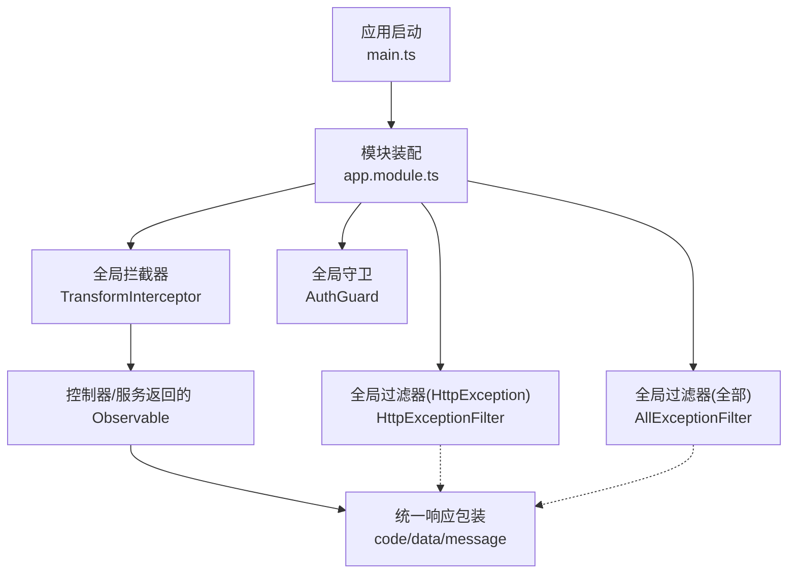
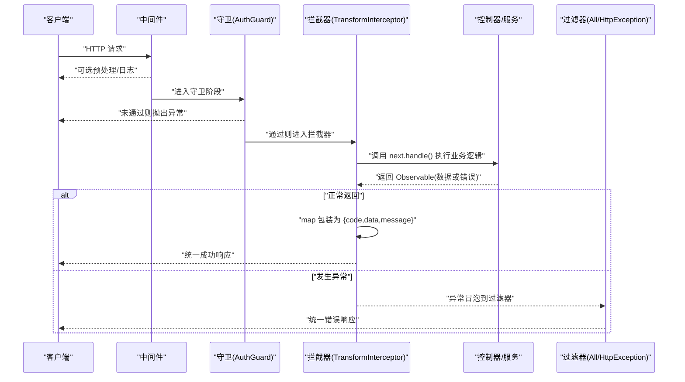
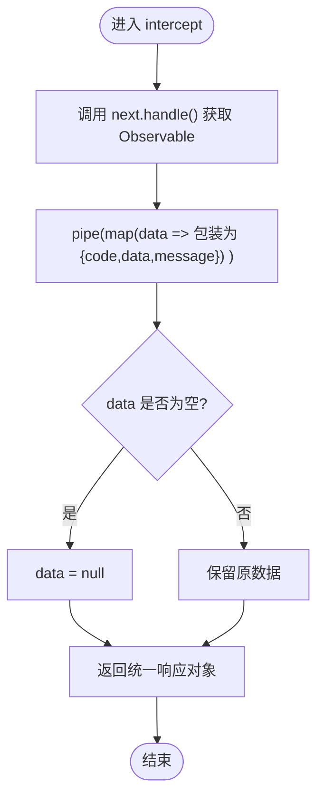
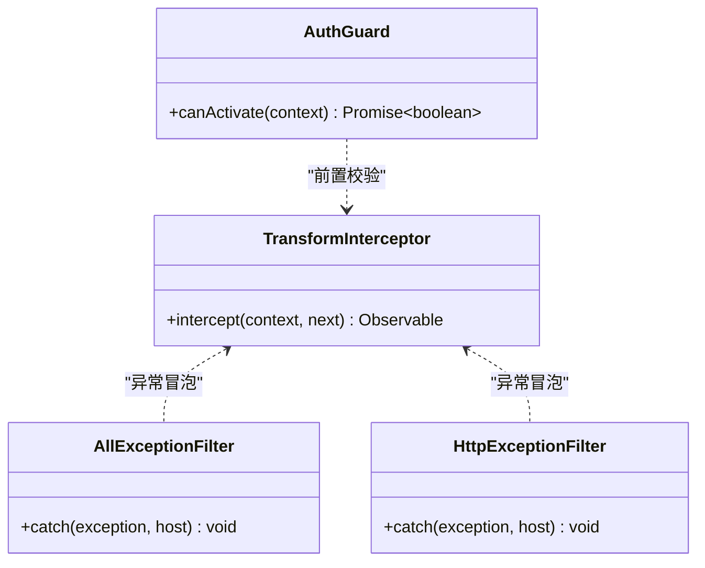
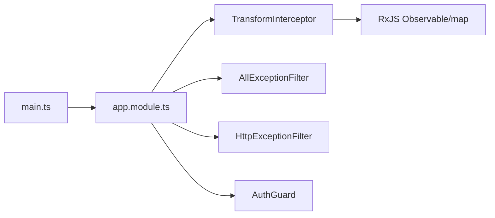

# 响应格式转换

<cite>
**本文引用的文件**
- [src/core/interceptor/transform.interceptor.ts](file://src/core/interceptor/transform.interceptor.ts)
- [src/app.module.ts](file://src/app.module.ts)
- [src/main.ts](file://src/main.ts)
- [src/core/filter/all-exception.filter.ts](file://src/core/filter/all-exception.filter.ts)
- [src/core/filter/http-exception.filter.ts](file://src/core/filter/http-exception.filter.ts)
- [src/core/guard/auth.guard.ts](file://src/core/guard/auth.guard.ts)
</cite>

## 目录
1. [简介](#简介)
2. [项目结构](#项目结构)
3. [核心组件](#核心组件)
4. [架构总览](#架构总览)
5. [详细组件分析](#详细组件分析)
6. [依赖关系分析](#依赖关系分析)
7. [性能与优化](#性能与优化)
8. [故障排查指南](#故障排查指南)
9. [结论](#结论)
10. [附录：配置与使用示例](#附录配置与使用示例)

## 简介
本文件围绕博客系统的统一响应格式转换拦截器展开，重点解析 TransformInterceptor 的工作原理、NestJS 拦截器机制与执行顺序，并说明成功/错误响应的标准化策略、空数据默认值处理、业务状态码映射方式以及最佳实践。文档同时提供可操作的配置与使用示例，帮助读者快速落地统一的 API 响应规范。

## 项目结构
本项目采用分层组织方式，核心能力集中在 core 目录：
- interceptor：统一响应格式转换拦截器
- filter：全局异常过滤器（捕获所有异常或仅 HttpException）
- guard：鉴权守卫（结合装饰器实现公开接口豁免）
- app.module：注册全局拦截器、过滤器、守卫
- main：应用启动入口，注册全局管道、Swagger 等

图表来源
- [src/main.ts:1-46](file://src/main.ts#L1-L46)
- [src/app.module.ts:1-35](file://src/app.module.ts#L1-L35)
- [src/core/interceptor/transform.interceptor.ts:1-24](file://src/core/interceptor/transform.interceptor.ts#L1-L24)
- [src/core/filter/all-exception.filter.ts:1-43](file://src/core/filter/all-exception.filter.ts#L1-L43)
- [src/core/filter/http-exception.filter.ts:1-36](file://src/core/filter/http-exception.filter.ts#L1-L36)

章节来源
- [src/main.ts:1-46](file://src/main.ts#L1-L46)
- [src/app.module.ts:1-35](file://src/app.module.ts#L1-L35)

## 核心组件
- TransformInterceptor：实现 NestInterceptor 接口，在响应发出前将控制器返回值包装为统一结构 { code, data, message }，并对空数据进行默认处理。
- AllExceptionFilter：全局异常捕获，统一输出错误响应体，包含请求上下文信息。
- HttpExceptionFilter：针对 HttpException 的专用过滤器，用于特定场景的错误格式化。
- AuthGuard：基于 JWT 的鉴权守卫，配合公开接口装饰器控制访问权限。

章节来源
- [src/core/interceptor/transform.interceptor.ts:1-24](file://src/core/interceptor/transform.interceptor.ts#L1-L24)
- [src/core/filter/all-exception.filter.ts:1-43](file://src/core/filter/all-exception.filter.ts#L1-L43)
- [src/core/filter/http-exception.filter.ts:1-36](file://src/core/filter/http-exception.filter.ts#L1-L36)
- [src/core/guard/auth.guard.ts:1-53](file://src/core/guard/auth.guard.ts#L1-L53)

## 架构总览
下图展示了 NestJS 请求生命周期中各组件的执行顺序与交互关系，突出拦截器在响应阶段的介入点。

图表来源
- [src/app.module.ts:19-32](file://src/app.module.ts#L19-L32)
- [src/core/interceptor/transform.interceptor.ts:11-22](file://src/core/interceptor/transform.interceptor.ts#L11-L22)
- [src/core/filter/all-exception.filter.ts:10-42](file://src/core/filter/all-exception.filter.ts#L10-L42)
- [src/core/filter/http-exception.filter.ts:9-35](file://src/core/filter/http-exception.filter.ts#L9-L35)
- [src/core/guard/auth.guard.ts:14-46](file://src/core/guard/auth.guard.ts#L14-L46)

## 详细组件分析

### TransformInterceptor 工作原理
- 实现 NestInterceptor 接口，重写 intercept(context, next)。
- 通过 next.handle() 获取控制器返回的 Observable，并在其后链式调用 pipe(map(...)) 对响应进行包装。
- 成功路径：将任意返回值封装为 { code: 200, data: 原始值或 null, message: 'success' }。
- 空数据处理：当返回值为 undefined/null 时，data 字段设置为 null，确保前端稳定消费。
- 错误路径：若控制器或服务抛出异常，异常会跳过 map 分支，直接冒泡至全局过滤器处理。

图表来源
- [src/core/interceptor/transform.interceptor.ts:11-22](file://src/core/interceptor/transform.interceptor.ts#L11-L22)

章节来源
- [src/core/interceptor/transform.interceptor.ts:1-24](file://src/core/interceptor/transform.interceptor.ts#L1-L24)

### 全局异常过滤器与错误响应
- AllExceptionFilter：捕获所有异常，构造统一错误响应体，包含 code、message 与请求上下文（query/body/params/method/url）。
- HttpExceptionFilter：专门处理 HttpException，支持将消息数组拼接为字符串，并对特定状态码做特殊处理（例如 400 映射为 200 的业务态）。
- 注意：由于 TransformInterceptor 仅作用于“成功返回”的数据流，异常不会经过其 map 包装，而是由过滤器直接写出响应。

图表来源
- [src/core/interceptor/transform.interceptor.ts:11-22](file://src/core/interceptor/transform.interceptor.ts#L11-L22)
- [src/core/filter/all-exception.filter.ts:10-42](file://src/core/filter/all-exception.filter.ts#L10-L42)
- [src/core/filter/http-exception.filter.ts:9-35](file://src/core/filter/http-exception.filter.ts#L9-L35)
- [src/core/guard/auth.guard.ts:14-46](file://src/core/guard/auth.guard.ts#L14-L46)

章节来源
- [src/core/filter/all-exception.filter.ts:1-43](file://src/core/filter/all-exception.filter.ts#L1-L43)
- [src/core/filter/http-exception.filter.ts:1-36](file://src/core/filter/http-exception.filter.ts#L1-L36)

### 拦截器管道执行顺序
NestJS 的请求处理管线大致顺序如下：
1. 中间件（如 session）
2. 全局守卫（AuthGuard）
3. 全局拦截器（TransformInterceptor）
4. 控制器与服务（业务逻辑）
5. 全局过滤器（AllExceptionFilter / HttpExceptionFilter）

该顺序由模块级提供者与启动脚本中的全局注册决定。

章节来源
- [src/main.ts:10-28](file://src/main.ts#L10-L28)
- [src/app.module.ts:19-32](file://src/app.module.ts#L19-L32)

### 自定义响应格式与业务状态码映射
- 统一成功响应：TransformInterceptor 将返回值包装为 { code, data, message }，其中 code 固定为 200，message 固定为 success。
- 业务状态码映射：可在 TransformInterceptor 的 map 中根据业务结果动态设置 code；或在过滤器中按 HTTP 状态码映射为业务码。
- 空数据默认值：当返回值为空时，data 设为 null，避免前端出现 undefined。
- 错误响应：由过滤器负责输出，保持与成功响应一致的字段结构，便于前端统一处理。

章节来源
- [src/core/interceptor/transform.interceptor.ts:14-20](file://src/core/interceptor/transform.interceptor.ts#L14-L20)
- [src/core/filter/all-exception.filter.ts:28-40](file://src/core/filter/all-exception.filter.ts#L28-L40)
- [src/core/filter/http-exception.filter.ts:29-34](file://src/core/filter/http-exception.filter.ts#L29-L34)

## 依赖关系分析
- TransformInterceptor 依赖 RxJS 的 Observable 与 map 操作符，用于响应数据的流式转换。
- 全局注册位置：
  - APP_INTERCEPTOR：TransformInterceptor
  - APP_FILTER：AllExceptionFilter（也可选择 HttpExceptionFilter）
  - APP_GUARD：AuthGuard
- 启动入口 main.ts 还注册了全局验证管道 ValidationPipe 与 Swagger 文档。

图表来源
- [src/main.ts:10-28](file://src/main.ts#L10-L28)
- [src/app.module.ts:19-32](file://src/app.module.ts#L19-L32)
- [src/core/interceptor/transform.interceptor.ts:1-8](file://src/core/interceptor/transform.interceptor.ts#L1-L8)

章节来源
- [src/app.module.ts:1-35](file://src/app.module.ts#L1-L35)
- [src/main.ts:1-46](file://src/main.ts#L1-L46)

## 性能与优化
- 轻量转换：TransformInterceptor 仅做简单的对象包装，开销极低，适合全局启用。
- 避免重复序列化：尽量在拦截器之前完成数据组装，减少后续转换成本。
- 缓存策略：对于热点读接口，可在服务层引入缓存（如 Redis），拦截器不感知缓存细节，仍返回统一结构。
- 大对象传输：对大数据响应建议分页与字段裁剪，降低网络负载。
- 监控与日志：在中间件或拦截器前后记录耗时，定位慢接口。

[本节为通用指导，无需源码引用]

## 故障排查指南
- 现象：返回 data 为 undefined
  - 原因：控制器返回 undefined 或未显式返回
  - 解决：TransformInterceptor 已将空值转为 null，前端需兼容 null 情况；如需区分“无数据”与“失败”，可通过 code 字段判断
- 现象：错误响应结构与成功不一致
  - 原因：不同过滤器输出的结构可能略有差异
  - 解决：统一在过滤器中输出一致结构，确保前端只依赖 code 与 message
- 现象：鉴权失败但状态码不符合预期
  - 原因：Http 状态码与业务码映射策略不同
  - 解决：在过滤器中明确映射规则，保证对外一致性

章节来源
- [src/core/interceptor/transform.interceptor.ts:14-20](file://src/core/interceptor/transform.interceptor.ts#L14-L20)
- [src/core/filter/all-exception.filter.ts:28-40](file://src/core/filter/all-exception.filter.ts#L28-L40)
- [src/core/filter/http-exception.filter.ts:29-34](file://src/core/filter/http-exception.filter.ts#L29-L34)

## 结论
TransformInterceptor 以极小的侵入性实现了响应结构的统一，结合全局异常过滤器，形成“成功走拦截器、失败走过滤器”的清晰分工。通过合理的业务状态码映射与空值处理，前端可获得稳定一致的响应模型。建议在业务复杂场景中按需扩展拦截器逻辑，并结合缓存与监控提升整体性能与可观测性。

[本节为总结，无需源码引用]

## 附录：配置与使用示例

### 全局启用拦截器
- 在模块中通过 APP_INTERCEPTOR 注册 TransformInterceptor，使所有控制器生效。

章节来源
- [src/app.module.ts:24-27](file://src/app.module.ts#L24-L27)

### 统一成功响应示例
- 控制器返回任意数据后，将被包装为 { code: 200, data: ..., message: 'success' }。
- 若返回为空，data 将为 null。

章节来源
- [src/core/interceptor/transform.interceptor.ts:14-20](file://src/core/interceptor/transform.interceptor.ts#L14-L20)

### 统一错误响应示例
- 抛出异常时，由过滤器输出错误结构，包含 code、message 与请求上下文。
- 可根据需要调整状态码映射策略。

章节来源
- [src/core/filter/all-exception.filter.ts:28-40](file://src/core/filter/all-exception.filter.ts#L28-L40)
- [src/core/filter/http-exception.filter.ts:29-34](file://src/core/filter/http-exception.filter.ts#L29-L34)

### 鉴权与公开接口
- 全局启用 AuthGuard，结合公开接口装饰器可豁免部分接口鉴权。

章节来源
- [src/app.module.ts:29-31](file://src/app.module.ts#L29-L31)
- [src/core/guard/auth.guard.ts:14-46](file://src/core/guard/auth.guard.ts#L14-L46)

### 启动与全局管道
- 启动脚本中启用全局验证管道与 Swagger 文档，便于开发与联调。

章节来源
- [src/main.ts:22-28](file://src/main.ts#L22-L28)
- [src/main.ts:29-39](file://src/main.ts#L29-L39)