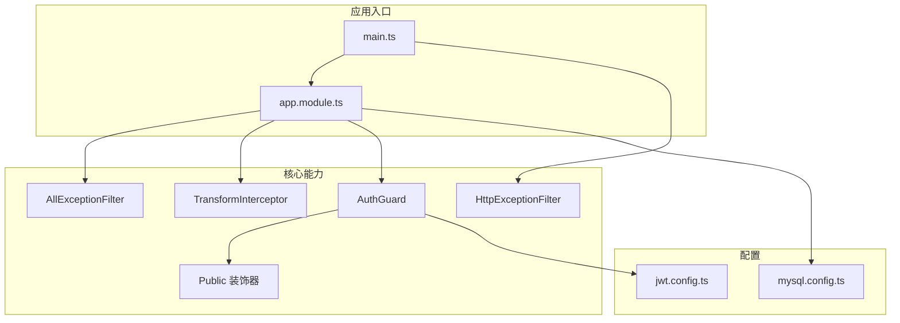
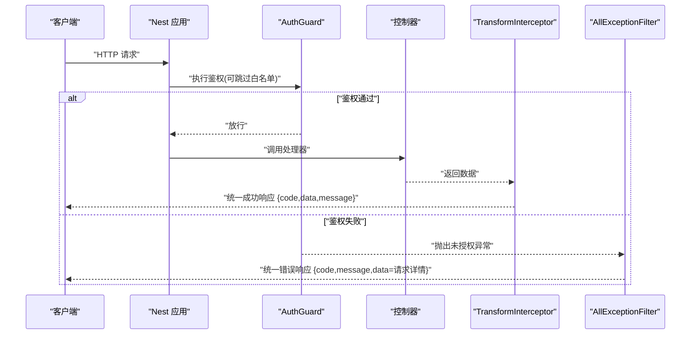
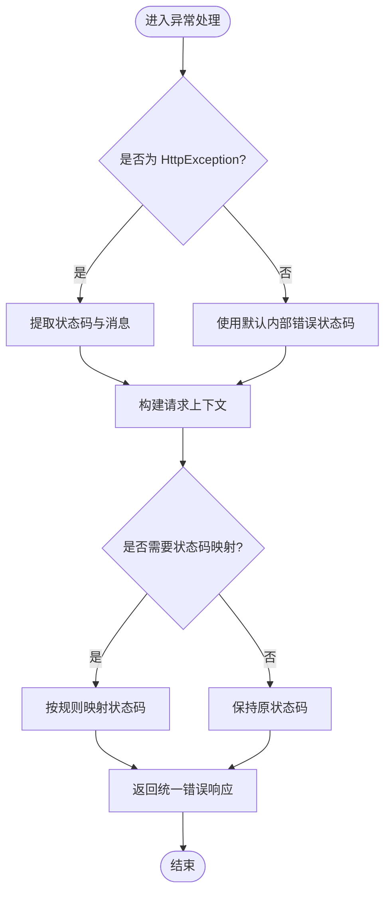
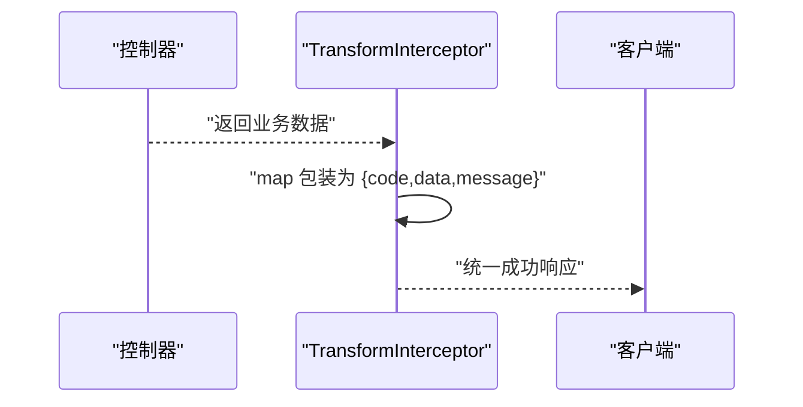
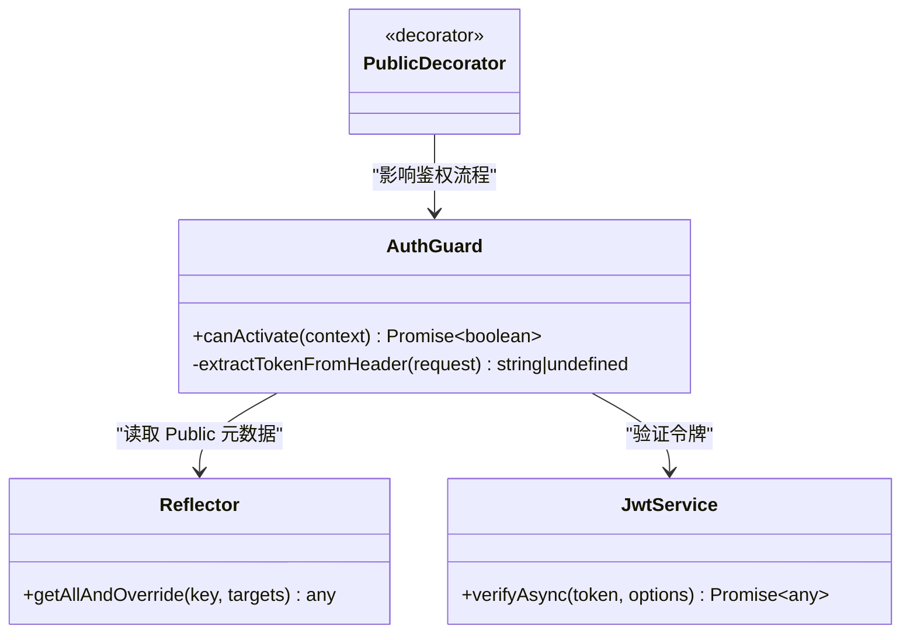
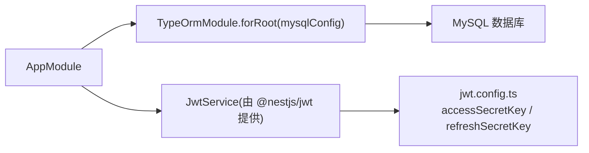
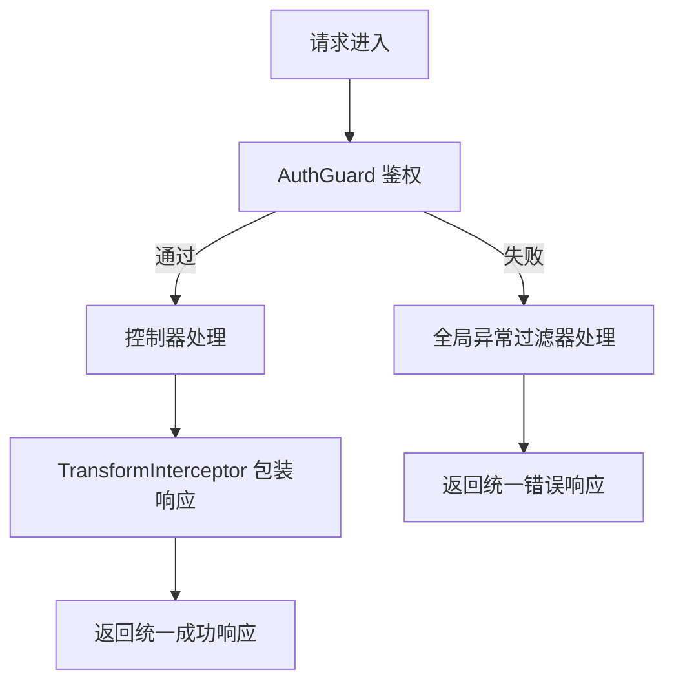
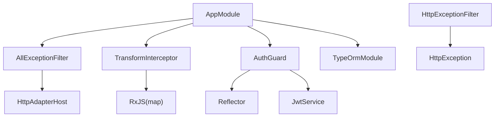

# 核心基础设施

<cite>
**本文引用的文件**   
- [src/main.ts](file://src/main.ts)
- [src/app.module.ts](file://src/app.module.ts)
- [src/core/filter/all-exception.filter.ts](file://src/core/filter/all-exception.filter.ts)
- [src/core/filter/http-exception.filter.ts](file://src/core/filter/http-exception.filter.ts)
- [src/core/interceptor/transform.interceptor.ts](file://src/core/interceptor/transform.interceptor.ts)
- [src/core/guard/auth.guard.ts](file://src/core/guard/auth.guard.ts)
- [src/core/guard/public.decorator.ts](file://src/core/guard/public.decorator.ts)
- [src/config/mysql.config.ts](file://src/config/mysql.config.ts)
- [src/config/jwt.config.ts](file://src/config/jwt.config.ts)
</cite>

## 目录
1. [简介](#简介)
2. [项目结构](#项目结构)
3. [核心组件](#核心组件)
4. [架构总览](#架构总览)
5. [详细组件分析](#详细组件分析)
6. [依赖关系分析](#依赖关系分析)
7. [性能与可扩展性](#性能与可扩展性)
8. [故障排查指南](#故障排查指南)
9. [结论](#结论)

## 简介
本文件聚焦博客系统的“核心基础设施”，围绕以下关键能力进行系统化说明：
- 全局异常处理机制：AllExceptionFilter 的设计模式、错误分类策略与统一响应体。
- 统一响应格式转换拦截器：TransformInterceptor 如何标准化 API 成功响应结构。
- 认证守卫 AuthGuard：JWT 令牌校验、权限控制与白名单路由（Public）处理。
- 配置管理：数据库连接配置、JWT 密钥配置与环境变量使用方式。
- 中间件管道执行顺序与请求处理流程，帮助读者建立从入口到业务处理的完整认知。

## 项目结构
核心基础设施位于 src/core 与 src/config 下，并通过 AppModule 和 main.ts 注册为全局组件。整体组织遵循分层与职责单一原则：
- core/filter：异常过滤器，负责捕获并规范化错误响应。
- core/interceptor：拦截器，负责在控制器返回后对响应进行统一包装。
- core/guard：守卫与装饰器，负责鉴权与公开路由标记。
- config：集中式配置，包括数据库与 JWT 相关参数。
- app.module.ts：将全局过滤器、拦截器、守卫以 APP_* 注入点注册。
- main.ts：应用启动、全局管道与文档初始化等。

图表来源
- [src/main.ts:10-46](file://src/main.ts#L10-L46)
- [src/app.module.ts:11-34](file://src/app.module.ts#L11-L34)
- [src/core/filter/all-exception.filter.ts:10-42](file://src/core/filter/all-exception.filter.ts#L10-L42)
- [src/core/filter/http-exception.filter.ts:9-36](file://src/core/filter/http-exception.filter.ts#L9-L36)
- [src/core/interceptor/transform.interceptor.ts:10-23](file://src/core/interceptor/transform.interceptor.ts#L10-L23)
- [src/core/guard/auth.guard.ts:13-52](file://src/core/guard/auth.guard.ts#L13-L52)
- [src/core/guard/public.decorator.ts:1-5](file://src/core/guard/public.decorator.ts#L1-L5)
- [src/config/mysql.config.ts:1-15](file://src/config/mysql.config.ts#L1-L15)
- [src/config/jwt.config.ts:1-5](file://src/config/jwt.config.ts#L1-L5)

章节来源
- [src/main.ts:10-46](file://src/main.ts#L10-L46)
- [src/app.module.ts:11-34](file://src/app.module.ts#L11-L34)

## 核心组件
本节概述各核心组件的职责与交互关系，后续章节将深入实现细节。

- AllExceptionFilter：全局异常捕获，统一错误响应结构，附带请求上下文信息。
- HttpExceptionFilter：针对 HTTP 异常的细粒度处理，用于特定状态码或消息的定制。
- TransformInterceptor：成功路径的统一响应包装，确保客户端拿到一致的 code/data/message 结构。
- AuthGuard：基于 JWT 的认证守卫，支持刷新令牌与访问令牌区分，结合 Public 装饰器实现白名单。
- 配置模块：TypeORM 数据库连接配置与 JWT 密钥配置，便于多环境切换。

章节来源
- [src/core/filter/all-exception.filter.ts:10-42](file://src/core/filter/all-exception.filter.ts#L10-L42)
- [src/core/filter/http-exception.filter.ts:9-36](file://src/core/filter/http-exception.filter.ts#L9-L36)
- [src/core/interceptor/transform.interceptor.ts:10-23](file://src/core/interceptor/transform.interceptor.ts#L10-L23)
- [src/core/guard/auth.guard.ts:13-52](file://src/core/guard/auth.guard.ts#L13-L52)
- [src/core/guard/public.decorator.ts:1-5](file://src/core/guard/public.decorator.ts#L1-L5)
- [src/config/mysql.config.ts:1-15](file://src/config/mysql.config.ts#L1-L15)
- [src/config/jwt.config.ts:1-5](file://src/config/jwt.config.ts#L1-L5)

## 架构总览
下图展示了请求进入后的主要处理阶段：全局管道与过滤器、守卫、控制器、拦截器以及异常捕获。

图表来源
- [src/app.module.ts:19-32](file://src/app.module.ts#L19-L32)
- [src/core/guard/auth.guard.ts:20-46](file://src/core/guard/auth.guard.ts#L20-L46)
- [src/core/interceptor/transform.interceptor.ts:12-22](file://src/core/interceptor/transform.interceptor.ts#L12-L22)
- [src/core/filter/all-exception.filter.ts:14-41](file://src/core/filter/all-exception.filter.ts#L14-L41)

## 详细组件分析

### 全局异常处理：AllExceptionFilter 与 HttpExceptionFilter
- 设计模式
  - 全局异常过滤器：通过 APP_FILTER 注入，保证所有未被局部过滤器捕获的异常都能被统一处理。
  - 细粒度过滤器：HttpExceptionFilter 专门处理 HttpException，可在需要时覆盖默认行为。
- 错误分类与处理策略
  - 非 HttpException：按内部服务器错误处理，返回标准错误结构。
  - HttpException：提取状态码与消息，附加请求上下文（query/body/params/method/url），便于问题定位。
  - 特殊状态码处理：例如 400 在某些场景下可能被映射为业务成功码，由具体过滤器决定。
- 统一响应结构
  - 成功：{ code, data, message }
  - 失败：{ code, message, data: 请求上下文 }
- 注意事项
  - 若同时注册多个过滤器，优先级取决于注册顺序；建议将通用过滤器放在最外层，特定过滤器按需挂载。

图表来源
- [src/core/filter/all-exception.filter.ts:14-41](file://src/core/filter/all-exception.filter.ts#L14-L41)
- [src/core/filter/http-exception.filter.ts:11-35](file://src/core/filter/http-exception.filter.ts#L11-L35)

章节来源
- [src/core/filter/all-exception.filter.ts:10-42](file://src/core/filter/all-exception.filter.ts#L10-L42)
- [src/core/filter/http-exception.filter.ts:9-36](file://src/core/filter/http-exception.filter.ts#L9-L36)
- [src/app.module.ts:20-23](file://src/app.module.ts#L20-L23)

### 统一响应格式转换：TransformInterceptor
- 作用
  - 在控制器返回成功后，将任意返回值包装为标准结构 { code: 200, data, message: 'success' }。
- 工作流程
  - 拦截 CallHandler 返回的 Observable。
  - 使用 map 操作符对数据进行包装。
  - 空值处理：data 为空时返回 null，避免 undefined。
- 适用场景
  - 前后端约定统一的响应结构，简化前端解析逻辑。
  - 与全局异常过滤器配合，形成“成功/失败”两套一致的结构。

图表来源
- [src/core/interceptor/transform.interceptor.ts:12-22](file://src/core/interceptor/transform.interceptor.ts#L12-L22)

章节来源
- [src/core/interceptor/transform.interceptor.ts:10-23](file://src/core/interceptor/transform.interceptor.ts#L10-L23)
- [src/app.module.ts:24-27](file://src/app.module.ts#L24-L27)

### 认证守卫：AuthGuard 与 Public 装饰器
- 功能要点
  - 白名单路由：通过 Public 装饰器标记的路由无需鉴权。
  - 令牌提取：从 Authorization 头中解析 Bearer Token。
  - 双令牌支持：根据 URL 判断是否刷新接口，分别使用 accessSecretKey 与 refreshSecretKey 验证。
  - 用户上下文：校验通过后，将 payload 注入 request.user，供后续控制器使用。
- 安全考虑
  - 校验失败统一抛出未授权异常，交由全局异常过滤器处理。
  - 建议在生产环境使用环境变量管理密钥，避免硬编码。

图表来源
- [src/core/guard/auth.guard.ts:13-52](file://src/core/guard/auth.guard.ts#L13-L52)
- [src/core/guard/public.decorator.ts:1-5](file://src/core/guard/public.decorator.ts#L1-L5)
- [src/config/jwt.config.ts:1-5](file://src/config/jwt.config.ts#L1-L5)

章节来源
- [src/core/guard/auth.guard.ts:13-52](file://src/core/guard/auth.guard.ts#L13-L52)
- [src/core/guard/public.decorator.ts:1-5](file://src/core/guard/public.decorator.ts#L1-L5)
- [src/config/jwt.config.ts:1-5](file://src/config/jwt.config.ts#L1-L5)

### 配置管理系统：数据库与 JWT
- 数据库连接配置
  - 通过 TypeOrmModule.forRoot 注入 mysqlConfig，启用自动加载实体与日期字符串选项。
  - 当前配置为占位值，实际部署时应替换为真实连接信息或使用环境变量。
- JWT 密钥配置
  - 提供 accessSecretKey 与 refreshSecretKey，分别用于访问令牌与刷新令牌的签名与校验。
  - 建议迁移至环境变量，避免将敏感信息提交到代码仓库。
- 多环境支持建议
  - 使用 .env 文件与 process.env 读取不同环境的配置。
  - 在配置文件中使用条件分支或工厂函数，根据 NODE_ENV 选择对应配置。

图表来源
- [src/app.module.ts:12-16](file://src/app.module.ts#L12-L16)
- [src/config/mysql.config.ts:1-15](file://src/config/mysql.config.ts#L1-L15)
- [src/config/jwt.config.ts:1-5](file://src/config/jwt.config.ts#L1-L5)

章节来源
- [src/app.module.ts:12-16](file://src/app.module.ts#L12-L16)
- [src/config/mysql.config.ts:1-15](file://src/config/mysql.config.ts#L1-L15)
- [src/config/jwt.config.ts:1-5](file://src/config/jwt.config.ts#L1-L5)

### 中间件管道执行顺序图与请求处理流程图
- 执行顺序（简化）
  - 应用启动：注册全局过滤器、拦截器、守卫、管道。
  - 请求到达：先经过守卫（鉴权），再进入控制器，最后经拦截器包装响应。
  - 异常路径：任何阶段抛出的异常最终由全局异常过滤器捕获并返回统一结构。
- 注意
  - 当前 main.ts 注册了 HttpExceptionFilter，而 AppModule 也注册了 AllExceptionFilter。请确认期望的异常处理优先级与覆盖范围，必要时移除重复注册。

图表来源
- [src/app.module.ts:19-32](file://src/app.module.ts#L19-L32)
- [src/main.ts:20-28](file://src/main.ts#L20-L28)
- [src/core/guard/auth.guard.ts:20-46](file://src/core/guard/auth.guard.ts#L20-L46)
- [src/core/interceptor/transform.interceptor.ts:12-22](file://src/core/interceptor/transform.interceptor.ts#L12-L22)
- [src/core/filter/all-exception.filter.ts:14-41](file://src/core/filter/all-exception.filter.ts#L14-L41)
- [src/core/filter/http-exception.filter.ts:11-35](file://src/core/filter/http-exception.filter.ts#L11-L35)

章节来源
- [src/app.module.ts:19-32](file://src/app.module.ts#L19-L32)
- [src/main.ts:20-28](file://src/main.ts#L20-L28)

## 依赖关系分析
- 组件耦合
  - AuthGuard 依赖 Reflector 与 JwtService，并通过公共装饰器控制白名单。
  - TransformInterceptor 仅依赖 RxJS 操作符，无外部服务耦合，内聚度高。
  - 异常过滤器之间可能存在覆盖关系，需明确优先级。
- 外部依赖
  - @nestjs/jwt 提供令牌校验能力。
  - @nestjs/typeorm 提供数据库连接与实体加载。
- 潜在循环依赖
  - 当前未发现循环引用；建议在新增模块时谨慎引入跨层依赖。

图表来源
- [src/core/guard/auth.guard.ts:13-52](file://src/core/guard/auth.guard.ts#L13-L52)
- [src/core/interceptor/transform.interceptor.ts:10-23](file://src/core/interceptor/transform.interceptor.ts#L10-L23)
- [src/core/filter/all-exception.filter.ts:10-42](file://src/core/filter/all-exception.filter.ts#L10-L42)
- [src/core/filter/http-exception.filter.ts:9-36](file://src/core/filter/http-exception.filter.ts#L9-L36)
- [src/app.module.ts:11-34](file://src/app.module.ts#L11-L34)

章节来源
- [src/app.module.ts:11-34](file://src/app.module.ts#L11-L34)

## 性能与可扩展性
- 拦截器开销极低，仅在成功路径进行对象包装，适合全局启用。
- 异常过滤器应尽量避免在 catch 中进行昂贵操作，保持快速返回。
- 鉴权守卫建议缓存已验证的 token 元信息（如用户角色），减少重复计算。
- 配置管理建议引入环境变量与配置中心，支持热更新与多环境隔离。

[本节为通用指导，不直接分析具体文件]

## 故障排查指南
- 统一响应结构不一致
  - 检查是否启用了 TransformInterceptor，并确保控制器返回的是数据而非自定义结构。
  - 参考路径：[src/core/interceptor/transform.interceptor.ts:12-22](file://src/core/interceptor/transform.interceptor.ts#L12-L22)
- 鉴权失败或白名单无效
  - 确认路由是否使用了 Public 装饰器，且装饰器位置正确（类或方法级）。
  - 检查 Authorization 头格式是否为 Bearer Token。
  - 参考路径：[src/core/guard/auth.guard.ts:20-46](file://src/core/guard/auth.guard.ts#L20-L46)、[src/core/guard/public.decorator.ts:1-5](file://src/core/guard/public.decorator.ts#L1-L5)
- 异常响应缺少请求上下文
  - 确认全局异常过滤器是否正确注册，且未被其他过滤器提前消费。
  - 参考路径：[src/core/filter/all-exception.filter.ts:14-41](file://src/core/filter/all-exception.filter.ts#L14-L41)
- 数据库连接失败
  - 核对 mysql.config.ts 中的 host、port、username、password、database 等字段。
  - 参考路径：[src/config/mysql.config.ts:1-15](file://src/config/mysql.config.ts#L1-L15)
- JWT 校验失败
  - 检查 accessSecretKey 与 refreshSecretKey 是否与签发端一致。
  - 参考路径：[src/config/jwt.config.ts:1-5](file://src/config/jwt.config.ts#L1-L5)

章节来源
- [src/core/interceptor/transform.interceptor.ts:12-22](file://src/core/interceptor/transform.interceptor.ts#L12-L22)
- [src/core/guard/auth.guard.ts:20-46](file://src/core/guard/auth.guard.ts#L20-L46)
- [src/core/guard/public.decorator.ts:1-5](file://src/core/guard/public.decorator.ts#L1-L5)
- [src/core/filter/all-exception.filter.ts:14-41](file://src/core/filter/all-exception.filter.ts#L14-L41)
- [src/config/mysql.config.ts:1-15](file://src/config/mysql.config.ts#L1-L15)
- [src/config/jwt.config.ts:1-5](file://src/config/jwt.config.ts#L1-L5)

## 结论
本基础设施通过“统一异常处理 + 统一响应包装 + 全局鉴权守卫 + 集中配置”的组合，构建了稳定、可维护、易扩展的后端基础能力。建议在生产环境中完善环境变量管理、细化异常分类与日志记录，并结合监控告警提升可观测性与稳定性。