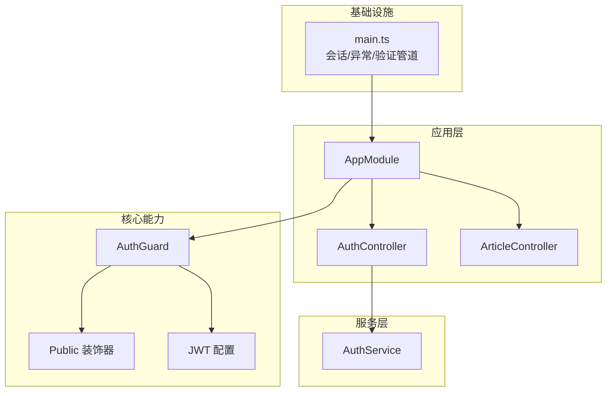
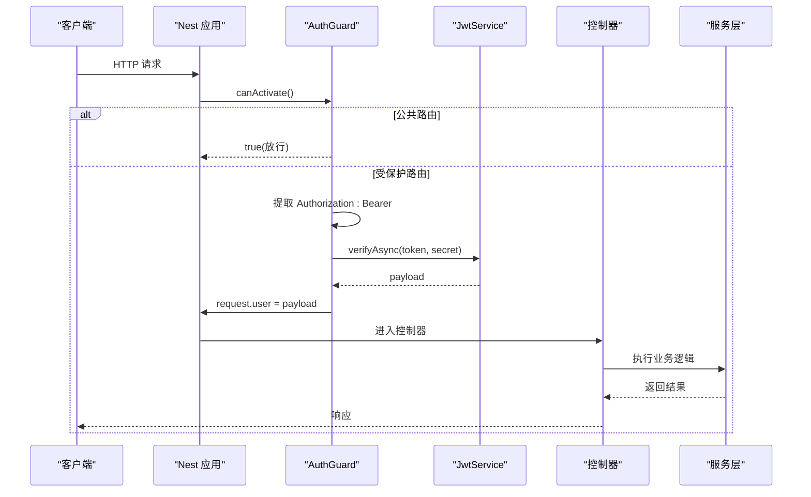
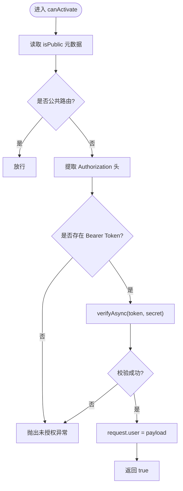
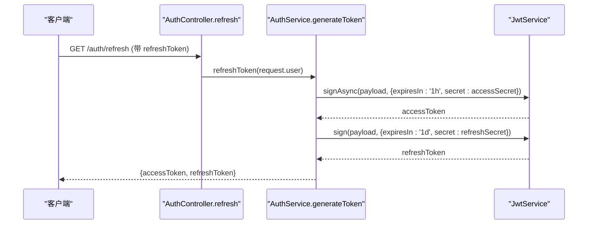
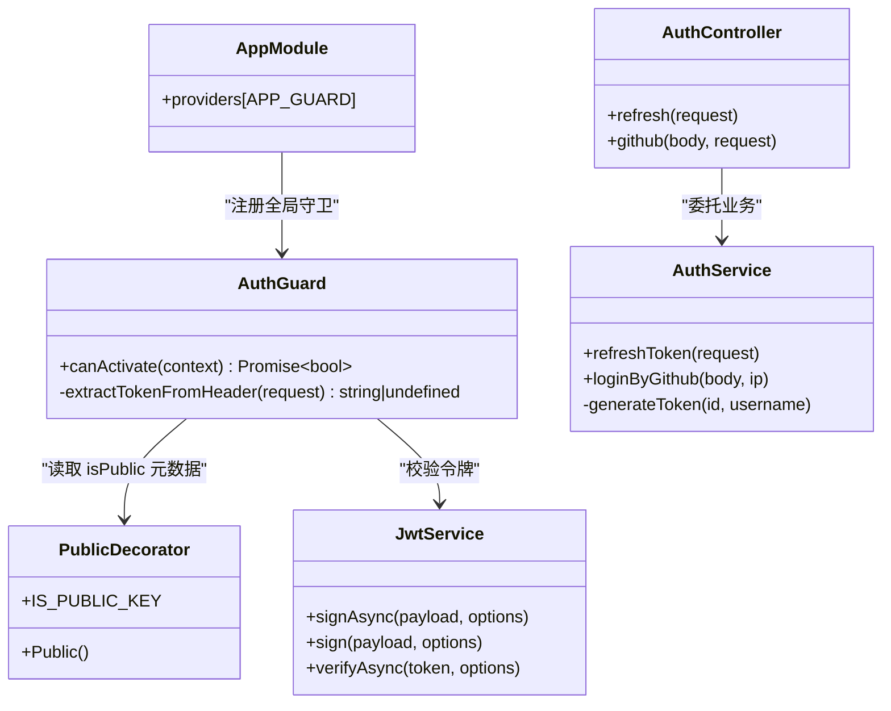

# 认证授权守卫

<cite>
**本文引用的文件**   
- [src/core/guard/auth.guard.ts](file://src/core/guard/auth.guard.ts)
- [src/core/guard/public.decorator.ts](file://src/core/guard/public.decorator.ts)
- [src/config/jwt.config.ts](file://src/config/jwt.config.ts)
- [src/api/auth/auth.controller.ts](file://src/api/auth/auth.controller.ts)
- [src/api/auth/auth.service.ts](file://src/api/auth/auth.service.ts)
- [src/app.module.ts](file://src/app.module.ts)
- [src/main.ts](file://src/main.ts)
- [src/api/article/article.controller.ts](file://src/api/article/article.controller.ts)
- [src/api/user/entities/user.entity.ts](file://src/api/user/entities/user.entity.ts)
</cite>

## 目录
1. [简介](#简介)
2. [项目结构](#项目结构)
3. [核心组件](#核心组件)
4. [架构总览](#架构总览)
5. [详细组件分析](#详细组件分析)
6. [依赖关系分析](#依赖关系分析)
7. [性能与扩展性](#性能与扩展性)
8. [故障排查指南](#故障排查指南)
9. [结论](#结论)
10. [附录：最佳实践与扩展方案](#附录最佳实践与扩展方案)

## 简介
本文件围绕博客系统的认证与授权机制，系统性阐述基于 JWT 的认证守卫实现、路由级权限控制、公共接口白名单、令牌过期处理与会话管理策略，并给出多角色访问控制（RBAC）的扩展方案、自定义守卫创建指南以及完整的认证流程图和错误处理策略。目标是帮助开发者快速理解现有实现，并在不破坏既有设计的前提下进行安全、可维护的扩展。

## 项目结构
认证相关代码主要分布在以下位置：
- 全局守卫与装饰器：core/guard
- JWT 配置：config
- 认证控制器与服务：api/auth
- 应用模块注册：app.module.ts
- 启动入口与中间件：main.ts
- 示例受保护/公开路由：api/article、api/user

图表来源
- [src/app.module.ts:1-35](file://src/app.module.ts#L1-L35)
- [src/core/guard/auth.guard.ts:1-53](file://src/core/guard/auth.guard.ts#L1-L53)
- [src/core/guard/public.decorator.ts:1-5](file://src/core/guard/public.decorator.ts#L1-L5)
- [src/config/jwt.config.ts:1-5](file://src/config/jwt.config.ts#L1-L5)
- [src/api/auth/auth.controller.ts:1-29](file://src/api/auth/auth.controller.ts#L1-L29)
- [src/api/auth/auth.service.ts:1-123](file://src/api/auth/auth.service.ts#L1-L123)
- [src/main.ts:1-46](file://src/main.ts#L1-L46)

章节来源
- [src/app.module.ts:1-35](file://src/app.module.ts#L1-L35)
- [src/main.ts:1-46](file://src/main.ts#L1-L46)

## 核心组件
- AuthGuard：全局认证守卫，负责跳过公共路由、解析 Bearer Token、校验 JWT、将用户信息注入请求上下文。
- Public 装饰器：用于标记不需要认证的接口，配合 Reflector 在守卫中读取元数据以放行。
- JWT 配置：定义 access token 与 refresh token 的签名密钥。
- AuthService：提供登录流程（GitHub OAuth）、签发与刷新令牌。
- 应用模块：通过 APP_GUARD 注册全局守卫；main.ts 启用 express-session、全局异常过滤器与验证管道。

章节来源
- [src/core/guard/auth.guard.ts:1-53](file://src/core/guard/auth.guard.ts#L1-L53)
- [src/core/guard/public.decorator.ts:1-5](file://src/core/guard/public.decorator.ts#L1-L5)
- [src/config/jwt.config.ts:1-5](file://src/config/jwt.config.ts#L1-L5)
- [src/api/auth/auth.service.ts:1-123](file://src/api/auth/auth.service.ts#L1-L123)
- [src/app.module.ts:1-35](file://src/app.module.ts#L1-L35)
- [src/main.ts:1-46](file://src/main.ts#L1-L46)

## 架构总览
下图展示了从客户端发起请求到鉴权通过的完整调用链，包括公共接口放行、Bearer Token 提取、JWT 校验、用户信息注入等关键步骤。

图表来源
- [src/core/guard/auth.guard.ts:1-53](file://src/core/guard/auth.guard.ts#L1-L53)
- [src/api/auth/auth.controller.ts:1-29](file://src/api/auth/auth.controller.ts#L1-L29)
- [src/api/auth/auth.service.ts:1-123](file://src/api/auth/auth.service.ts#L1-L123)

## 详细组件分析

### AuthGuard 实现机制
- 公共路由判断：使用 Reflector 读取处理器或类级别的 isPublic 元数据，若为真则直接放行。
- 令牌提取：从请求头 Authorization 字段按空格分割，仅接受 Bearer 类型。
- 令牌校验：根据请求路径是否为 /auth/refresh 选择不同密钥进行 verifyAsync 校验。
- 用户注入：校验成功后将 payload 写入 request.user，供后续控制器或服务使用。
- 异常处理：未携带令牌或校验失败时抛出未授权异常。

图表来源
- [src/core/guard/auth.guard.ts:1-53](file://src/core/guard/auth.guard.ts#L1-L53)
- [src/core/guard/public.decorator.ts:1-5](file://src/core/guard/public.decorator.ts#L1-L5)
- [src/config/jwt.config.ts:1-5](file://src/config/jwt.config.ts#L1-L5)

章节来源
- [src/core/guard/auth.guard.ts:1-53](file://src/core/guard/auth.guard.ts#L1-L53)

### Public 装饰器与白名单机制
- 设计模式：基于 SetMetadata 的装饰器模式，将“是否公共”的元数据附加到处理器或类上。
- 白名单语义：默认所有路由受保护；仅在方法或类上标注 @Public() 才视为白名单放行。
- 使用方式：在需要公开的接口上方添加 @Public()，例如 GitHub 回调与文章列表查询。

章节来源
- [src/core/guard/public.decorator.ts:1-5](file://src/core/guard/public.decorator.ts#L1-L5)
- [src/api/auth/auth.controller.ts:1-29](file://src/api/auth/auth.controller.ts#L1-L29)
- [src/api/article/article.controller.ts:1-52](file://src/api/article/article.controller.ts#L1-L52)

### JWT 令牌签发与刷新
- 令牌签发：access token 有效期较短，refresh token 有效期较长，分别使用不同密钥签名。
- 刷新流程：/auth/refresh 使用 refresh token 重新签发一对新令牌，同时支持在守卫中识别该路径以选用对应密钥。
- 用户上下文：登录成功后，payload 包含用户标识与用户名，便于后续业务使用。

图表来源
- [src/api/auth/auth.controller.ts:1-29](file://src/api/auth/auth.controller.ts#L1-L29)
- [src/api/auth/auth.service.ts:1-123](file://src/api/auth/auth.service.ts#L1-L123)
- [src/config/jwt.config.ts:1-5](file://src/config/jwt.config.ts#L1-L5)

章节来源
- [src/api/auth/auth.service.ts:1-123](file://src/api/auth/auth.service.ts#L1-L123)
- [src/config/jwt.config.ts:1-5](file://src/config/jwt.config.ts#L1-L5)

### 路由级权限控制与受保护路由
- 全局守卫：在应用模块中通过 APP_GUARD 注册 AuthGuard，使所有路由默认受保护。
- 受保护路由：未标注 @Public() 的路由均需携带有效 Bearer Token。
- 公开路由：在控制器方法或类上标注 @Public() 即可绕过认证，适合对外暴露的只读接口或第三方回调。

章节来源
- [src/app.module.ts:1-35](file://src/app.module.ts#L1-L35)
- [src/api/article/article.controller.ts:1-52](file://src/api/article/article.controller.ts#L1-L52)

### 令牌过期处理与用户会话管理
- 令牌过期：当 access token 过期时，客户端应使用 refresh token 调用刷新接口获取新的令牌对。
- 刷新路径特殊处理：守卫针对 /auth/refresh 使用 refreshSecretKey 校验，避免误用 access token 刷新。
- 会话管理：应用启用了 express-session，但当前认证流程采用无状态 JWT，会话主要用于其他用途（如日志、统计等）。建议将敏感状态迁移至服务端存储或黑名单机制以实现更严格的失效控制。

章节来源
- [src/core/guard/auth.guard.ts:1-53](file://src/core/guard/auth.guard.ts#L1-L53)
- [src/api/auth/auth.service.ts:1-123](file://src/api/auth/auth.service.ts#L1-L123)
- [src/main.ts:1-46](file://src/main.ts#L1-L46)

### 多角色权限系统（RBAC）扩展方案
- 现状：用户实体包含 role 字段，可用于表示角色等级。
- 扩展思路：
  - 在 payload 中携带角色信息，或在守卫中根据 user.id 查询用户角色。
  - 新增 RoleGuard 或装饰器 @Roles(...)，结合 Reflector 读取期望角色集合，与当前用户角色比对。
  - 在控制器或方法上使用 @Roles(['admin','editor']) 声明所需角色，守卫拒绝无权限访问。
- 注意事项：
  - 角色变更需考虑缓存一致性。
  - 高频权限检查可引入本地缓存或 Redis 缓存减少数据库压力。
  - 审计与日志记录权限拒绝事件，便于追踪与分析。

章节来源
- [src/api/user/entities/user.entity.ts:1-57](file://src/api/user/entities/user.entity.ts#L1-L57)

## 依赖关系分析
- 全局装配：AppModule 通过 APP_GUARD 注入 AuthGuard，使其成为全局前置拦截点。
- 守卫依赖：Reflector 读取元数据，JwtService 完成令牌校验，Request 对象承载用户上下文。
- 控制器依赖：AuthController 依赖 AuthService 完成登录与令牌签发；业务控制器依赖各自 Service。
- 配置依赖：JWT 密钥来自 jwt.config，GitHub 配置来自 github.config。

图表来源
- [src/app.module.ts:1-35](file://src/app.module.ts#L1-L35)
- [src/core/guard/auth.guard.ts:1-53](file://src/core/guard/auth.guard.ts#L1-L53)
- [src/core/guard/public.decorator.ts:1-5](file://src/core/guard/public.decorator.ts#L1-L5)
- [src/api/auth/auth.controller.ts:1-29](file://src/api/auth/auth.controller.ts#L1-L29)
- [src/api/auth/auth.service.ts:1-123](file://src/api/auth/auth.service.ts#L1-L123)

章节来源
- [src/app.module.ts:1-35](file://src/app.module.ts#L1-L35)
- [src/core/guard/auth.guard.ts:1-53](file://src/core/guard/auth.guard.ts#L1-L53)

## 性能与扩展性
- 令牌校验开销：verifyAsync 为 CPU 密集型操作，建议在高并发场景下：
  - 合理设置 access token 过期时间，降低刷新频率。
  - 对频繁访问的权限判定引入缓存（如内存或 Redis）。
- 请求链路优化：
  - 将用户基础信息缓存于网关或反向代理层，减少后端重复查询。
  - 对只读接口启用缓存策略，减轻数据库压力。
- 可扩展性：
  - 通过装饰器与守卫组合实现细粒度权限控制。
  - 将角色、资源、权限三元组抽象为独立模块，便于横向扩展。

## 故障排查指南
- 常见错误：
  - 未携带 Authorization 头：触发未授权异常。
  - Token 格式不正确或非 Bearer：无法提取令牌，触发未授权异常。
  - Token 过期或签名无效：verifyAsync 抛错，触发未授权异常。
  - 刷新接口使用了错误的密钥：/auth/refresh 必须使用 refresh token。
- 定位方法：
  - 检查请求头是否正确携带 Authorization: Bearer <token>。
  - 确认使用的密钥是否与签发端一致。
  - 查看全局异常过滤器输出，统一错误格式便于前端处理。
- 改进建议：
  - 在异常过滤器中区分“未认证”与“未授权”，返回更明确的错误码与消息。
  - 增加请求 ID 与审计日志，便于问题回溯。

章节来源
- [src/core/guard/auth.guard.ts:1-53](file://src/core/guard/auth.guard.ts#L1-L53)
- [src/main.ts:1-46](file://src/main.ts#L1-L46)

## 结论
本项目采用全局 AuthGuard 与 Public 装饰器实现了简洁而强大的认证与白名单机制。通过双密钥的 JWT 体系与刷新接口，兼顾了安全性与用户体验。在此基础上，可通过装饰器与守卫的组合轻松扩展 RBAC 能力，满足复杂的多角色权限需求。建议在后续迭代中完善异常分类、审计日志与缓存策略，进一步提升系统的安全性与性能。

## 附录：最佳实践与扩展方案

### 自定义守卫创建指南
- 目标：实现基于角色的访问控制守卫。
- 步骤：
  - 新建 RolesGuard，注入 Reflector 与可选的用户服务。
  - 在 canActivate 中读取 @Roles 装饰器的期望角色集合。
  - 对比当前 request.user.role 与期望角色，决定是否放行。
  - 在控制器或方法上使用 @Roles([...]) 声明所需角色。
- 集成方式：
  - 在模块中局部注册 RolesGuard，或通过 APP_GUARD 全局注册。
  - 与现有 AuthGuard 组合使用时，注意执行顺序与职责边界。

### 权限验证最佳实践
- 最小权限原则：仅授予必要的角色与资源访问权限。
- 分层校验：在 API 层做粗粒度角色校验，在 Service 层做细粒度数据权限校验。
- 缓存策略：对角色与资源映射进行缓存，降低数据库压力。
- 审计与监控：记录权限拒绝事件，建立告警与报表。
- 安全加固：
  - 定期轮换密钥，避免硬编码。
  - 对敏感接口增加速率限制与 IP 白名单。
  - 对刷新接口增加设备指纹或会话绑定，防止令牌泄露滥用。