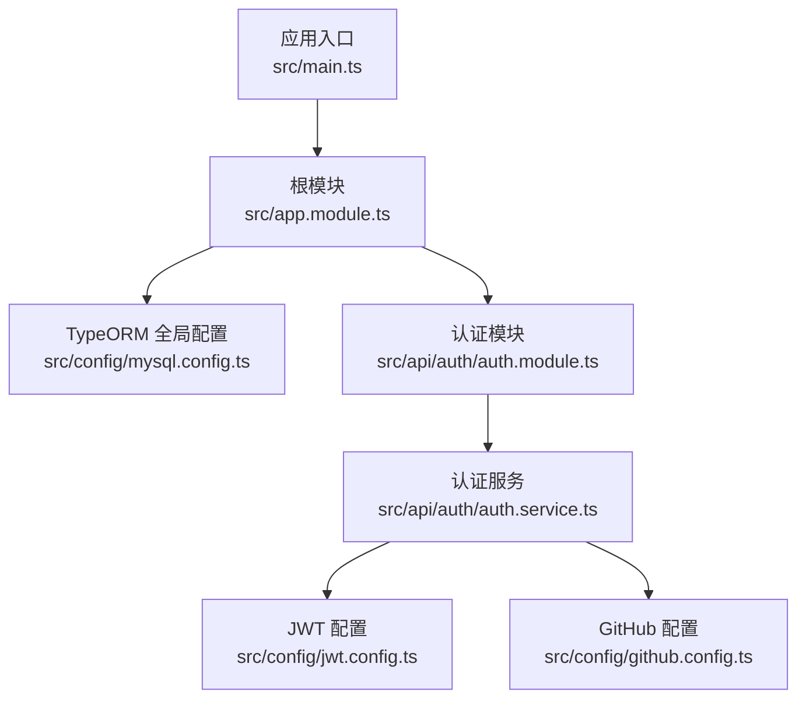
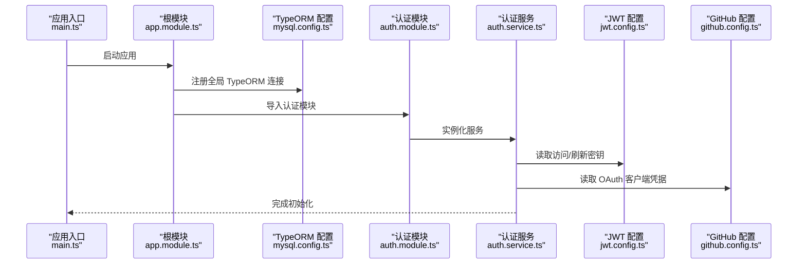
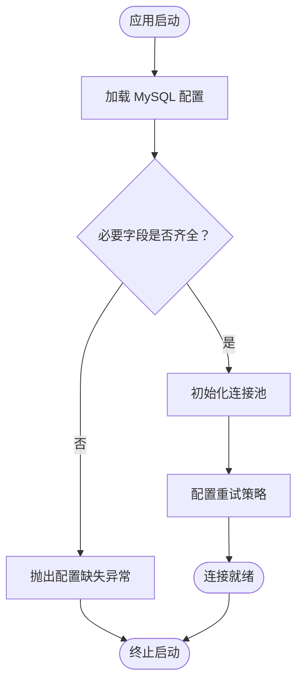
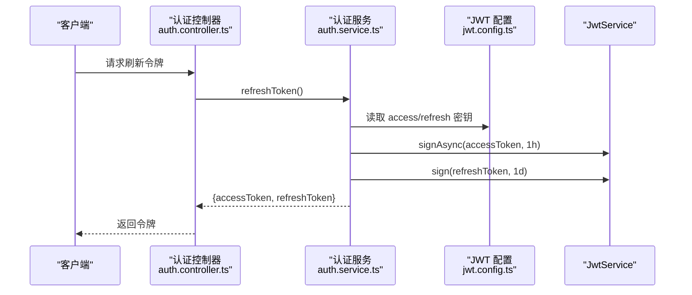
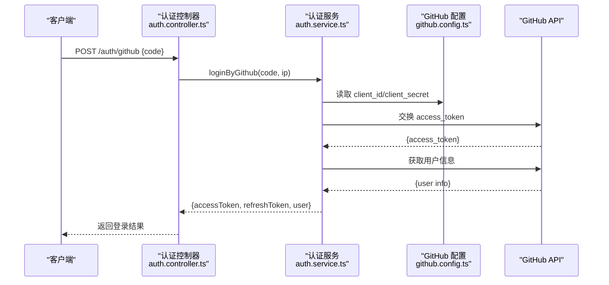
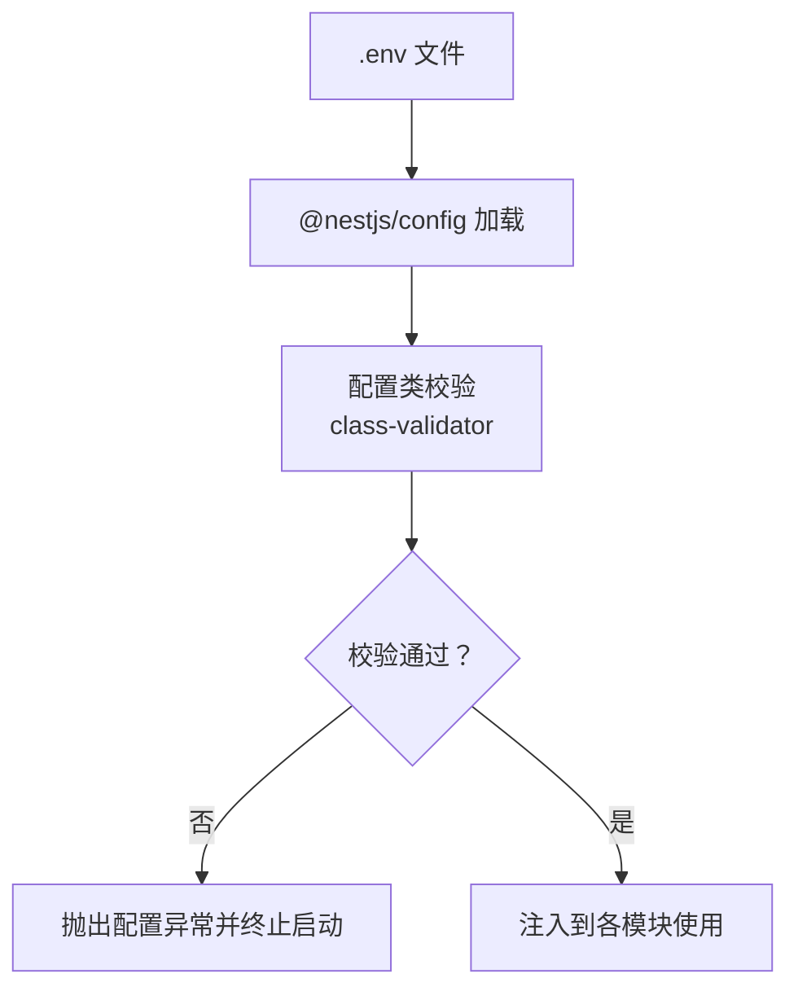
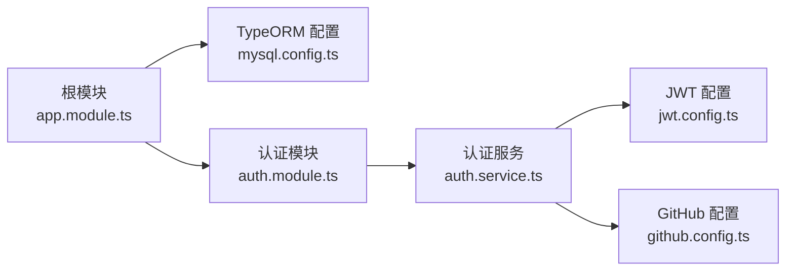

# 配置管理系统

<cite>
**本文引用的文件列表**
- [src/main.ts](file://src/main.ts)
- [src/app.module.ts](file://src/app.module.ts)
- [src/config/mysql.config.ts](file://src/config/mysql.config.ts)
- [src/config/jwt.config.ts](file://src/config/jwt.config.ts)
- [src/config/github.config.ts](file://src/config/github.config.ts)
- [src/api/auth/auth.module.ts](file://src/api/auth/auth.module.ts)
- [src/api/auth/auth.service.ts](file://src/api/auth/auth.service.ts)
- [src/api/auth/auth.controller.ts](file://src/api/auth/auth.controller.ts)
</cite>

## 目录
1. [简介](#简介)
2. [项目结构](#项目结构)
3. [核心组件](#核心组件)
4. [架构总览](#架构总览)
5. [详细组件分析](#详细组件分析)
6. [依赖关系分析](#依赖关系分析)
7. [性能与可靠性考虑](#性能与可靠性考虑)
8. [故障排查指南](#故障排查指南)
9. [结论](#结论)
10. [附录](#附录)

## 简介
本文件面向博客系统的“配置管理”主题，围绕以下目标展开：
- 解释当前代码中配置的组织方式、环境变量使用现状，并给出 NestJS ConfigModule 的集成方案与环境变量管理最佳实践。
- 说明数据库连接配置的实现与优化建议（MySQL 连接参数、连接池、重试机制）。
- 阐述 JWT 密钥管理机制（访问令牌与刷新令牌的配置与安全策略）。
- 说明第三方服务集成配置（GitHub OAuth 客户端 ID/Secret）的配置方式。
- 提供配置校验与默认值设置的最佳实践。
- 给出配置热重载与环境切换的实现方案。
- 提供配置文件模板与部署配置示例。

## 项目结构
当前仓库采用按功能域分层的组织方式，配置集中在 src/config 下，模块在 src/api 下，应用入口在 src/main.ts，根模块在 src/app.module.ts。

图示来源
- [src/main.ts:1-46](file://src/main.ts#L1-L46)
- [src/app.module.ts:1-35](file://src/app.module.ts#L1-L35)
- [src/config/mysql.config.ts:1-15](file://src/config/mysql.config.ts#L1-L15)
- [src/api/auth/auth.module.ts:1-13](file://src/api/auth/auth.module.ts#L1-L13)
- [src/api/auth/auth.service.ts:1-123](file://src/api/auth/auth.service.ts#L1-L123)
- [src/config/jwt.config.ts:1-5](file://src/config/jwt.config.ts#L1-L5)
- [src/config/github.config.ts:1-6](file://src/config/github.config.ts#L1-L6)

章节来源
- [src/main.ts:1-46](file://src/main.ts#L1-L46)
- [src/app.module.ts:1-35](file://src/app.module.ts#L1-L35)

## 核心组件
本节聚焦配置相关的关键点与现状，并给出改进方向。

- 环境变量使用现状
  - 仅应用端口通过环境变量注入，其余配置以硬编码形式存在于配置文件中。
  - 建议引入 @nestjs/config 统一读取 .env，并通过环境变量覆盖默认值。

- 数据库连接配置
  - 当前 TypeORM 配置位于独立文件，包含基础连接参数与实体自动加载开关。
  - 建议将敏感信息迁移至环境变量，并补充连接池与重试策略。

- JWT 密钥管理
  - 访问令牌与刷新令牌分别使用不同密钥，有效期分别为 1 小时和 1 天。
  - 建议从环境变量读取密钥，避免硬编码；并为刷新令牌增加存储与轮换策略。

- 第三方服务集成
  - GitHub OAuth 的 client_id 与 client_secret 集中存放于配置对象。
  - 建议从环境变量读取，并在错误处理时屏蔽敏感信息泄露。

- 配置验证与默认值
  - 当前未实现运行时配置校验。
  - 建议使用 class-validator + @nestjs/config 的 validateOrThrow 进行强校验，并提供合理默认值。

章节来源
- [src/main.ts:40-43](file://src/main.ts#L40-L43)
- [src/config/mysql.config.ts:1-15](file://src/config/mysql.config.ts#L1-L15)
- [src/config/jwt.config.ts:1-5](file://src/config/jwt.config.ts#L1-L5)
- [src/config/github.config.ts:1-6](file://src/config/github.config.ts#L1-L6)
- [src/api/auth/auth.service.ts:111-121](file://src/api/auth/auth.service.ts#L111-L121)
- [src/api/auth/auth.service.ts:23-109](file://src/api/auth/auth.service.ts#L23-L109)

## 架构总览
下图展示了配置在各模块中的消费路径与数据流向。

图示来源
- [src/main.ts:1-46](file://src/main.ts#L1-L46)
- [src/app.module.ts:1-35](file://src/app.module.ts#L1-L35)
- [src/config/mysql.config.ts:1-15](file://src/config/mysql.config.ts#L1-L15)
- [src/api/auth/auth.module.ts:1-13](file://src/api/auth/auth.module.ts#L1-L13)
- [src/api/auth/auth.service.ts:1-123](file://src/api/auth/auth.service.ts#L1-L123)
- [src/config/jwt.config.ts:1-5](file://src/config/jwt.config.ts#L1-L5)
- [src/config/github.config.ts:1-6](file://src/config/github.config.ts#L1-L6)

## 详细组件分析

### 数据库连接配置（MySQL）
- 现状
  - 连接类型、主机、端口、用户名、密码、数据库名、实体自动加载、日期字符串等参数集中定义。
  - 未显式配置连接池大小、超时、重连等高级选项。
- 建议
  - 将 host、port、username、password、database 等敏感信息迁移至环境变量。
  - 补充连接池配置项（如连接数、空闲超时、查询超时），以及失败重试与指数退避策略。
  - 在生产环境启用 SSL 与只读副本（如有）。
  - 为不同环境（开发/测试/生产）提供独立配置或基于环境变量的差异化配置。

图示来源
- [src/config/mysql.config.ts:1-15](file://src/config/mysql.config.ts#L1-L15)

章节来源
- [src/config/mysql.config.ts:1-15](file://src/config/mysql.config.ts#L1-L15)
- [src/app.module.ts:12-17](file://src/app.module.ts#L12-L17)

### JWT 密钥管理与令牌签发流程
- 现状
  - 访问令牌与刷新令牌使用不同的密钥，有效期分别为 1 小时与 1 天。
  - 密钥来源于独立的配置对象。
- 建议
  - 从环境变量读取密钥，禁止硬编码。
  - 对刷新令牌实施服务端存储与黑名单机制，支持主动失效。
  - 定期轮换密钥，并兼容旧令牌过渡期。
  - 限制令牌载荷最小化，避免携带敏感信息。

图示来源
- [src/api/auth/auth.controller.ts:14-28](file://src/api/auth/auth.controller.ts#L14-L28)
- [src/api/auth/auth.service.ts:18-21](file://src/api/auth/auth.service.ts#L18-L21)
- [src/api/auth/auth.service.ts:111-121](file://src/api/auth/auth.service.ts#L111-L121)
- [src/config/jwt.config.ts:1-5](file://src/config/jwt.config.ts#L1-L5)

章节来源
- [src/api/auth/auth.service.ts:111-121](file://src/api/auth/auth.service.ts#L111-L121)
- [src/config/jwt.config.ts:1-5](file://src/config/jwt.config.ts#L1-L5)
- [src/api/auth/auth.controller.ts:14-28](file://src/api/auth/auth.controller.ts#L14-L28)

### GitHub OAuth 集成配置
- 现状
  - 登录流程通过后端调用 GitHub API，client_id 与 client_secret 来自配置对象。
- 建议
  - 将 client_id 与 client_secret 迁移至环境变量。
  - 对网络请求增加超时与重试，并对错误响应做脱敏处理。
  - 记录必要的审计日志（不包含敏感信息）。

图示来源
- [src/api/auth/auth.controller.ts:23-28](file://src/api/auth/auth.controller.ts#L23-L28)
- [src/api/auth/auth.service.ts:23-109](file://src/api/auth/auth.service.ts#L23-L109)
- [src/config/github.config.ts:1-6](file://src/config/github.config.ts#L1-L6)

章节来源
- [src/api/auth/auth.service.ts:23-109](file://src/api/auth/auth.service.ts#L23-L109)
- [src/config/github.config.ts:1-6](file://src/config/github.config.ts#L1-L6)
- [src/api/auth/auth.controller.ts:23-28](file://src/api/auth/auth.controller.ts#L23-L28)

### 环境变量与多环境配置（NestJS ConfigModule 集成方案）
- 现状
  - 仅端口使用 process.env.PORT，其他配置未使用环境变量。
- 推荐方案
  - 安装并引入 @nestjs/config，在根模块中启用 loadEnvFile 与 validate。
  - 创建配置类并使用装饰器声明必填字段与默认值。
  - 通过环境变量覆盖默认值，实现 dev/test/prod 多环境差异。
  - 在应用启动阶段进行严格校验，缺失关键配置即快速失败。

[此图为概念性流程图，不直接映射具体源码文件]

章节来源
- [src/main.ts:40-43](file://src/main.ts#L40-L43)

### 配置热重载与环境切换（实现方案）
- 热重载思路
  - 监听 .env 或外部配置源变更事件，动态更新内存中的配置对象。
  - 对于数据库连接，建议在检测到关键参数变化后安全重建连接池。
  - 对于 JWT 密钥，需考虑新旧密钥共存期与令牌过渡策略。
- 环境切换思路
  - 通过环境变量 NODE_ENV 或自定义 APP_ENV 控制加载不同配置集。
  - 结合 CI/CD 在不同环境注入对应 .env 或平台级密钥管理服务。

[本节为通用方案说明，不直接分析具体源码文件]

## 依赖关系分析
- 模块耦合
  - 根模块负责全局 TypeORM 注册与全局守卫/拦截器/过滤器装配。
  - 认证模块依赖 JwtModule 与用户模块，服务层依赖 JWT 与 GitHub 配置。
- 外部依赖
  - TypeORM 用于数据库访问。
  - @nestjs/jwt 用于令牌签发与校验。
  - axios 用于 GitHub API 调用。

图示来源
- [src/app.module.ts:1-35](file://src/app.module.ts#L1-L35)
- [src/config/mysql.config.ts:1-15](file://src/config/mysql.config.ts#L1-L15)
- [src/api/auth/auth.module.ts:1-13](file://src/api/auth/auth.module.ts#L1-L13)
- [src/api/auth/auth.service.ts:1-123](file://src/api/auth/auth.service.ts#L1-L123)
- [src/config/jwt.config.ts:1-5](file://src/config/jwt.config.ts#L1-L5)
- [src/config/github.config.ts:1-6](file://src/config/github.config.ts#L1-L6)

章节来源
- [src/app.module.ts:1-35](file://src/app.module.ts#L1-L35)
- [src/api/auth/auth.module.ts:1-13](file://src/api/auth/auth.module.ts#L1-L13)

## 性能与可靠性考虑
- 数据库连接池
  - 根据并发量调整最大连接数与空闲超时，避免连接泄漏。
  - 开启慢查询日志与监控指标，定位瓶颈。
- 重试与熔断
  - 对外部 API（GitHub）调用增加超时、重试与熔断降级策略。
- 令牌生命周期
  - 短时效访问令牌配合长时效刷新令牌，减少频繁鉴权开销。
  - 刷新令牌服务端存储与黑名单，支持主动失效与审计。

[本节提供通用指导，不直接分析具体源码文件]

## 故障排查指南
- 常见配置问题
  - 环境变量缺失或未正确加载导致启动失败。
  - 数据库连接参数错误或网络不可达导致 TypeORM 初始化失败。
  - JWT 密钥不一致导致令牌校验失败。
  - GitHub OAuth 凭据错误导致授权码交换失败。
- 排查步骤
  - 检查 .env 是否存在且被正确加载。
  - 打印关键配置（脱敏）确认生效。
  - 查看 TypeORM 连接日志与错误堆栈。
  - 核对 GitHub 回调地址与凭据一致性。
  - 针对外部 API 调用增加超时与重试日志。

章节来源
- [src/main.ts:40-43](file://src/main.ts#L40-L43)
- [src/config/mysql.config.ts:1-15](file://src/config/mysql.config.ts#L1-L15)
- [src/config/jwt.config.ts:1-5](file://src/config/jwt.config.ts#L1-L5)
- [src/config/github.config.ts:1-6](file://src/config/github.config.ts#L1-L6)
- [src/api/auth/auth.service.ts:23-109](file://src/api/auth/auth.service.ts#L23-L109)

## 结论
当前项目在配置管理上已具备基本雏形：数据库、JWT、第三方服务配置均集中于独立文件，便于维护。为进一步提升安全性与可运维性，建议全面引入 @nestjs/config 进行环境变量管理，完善配置校验与默认值，补充连接池与重试策略，并建立密钥轮换与热重载机制。

## 附录

### 配置文件模板（建议）
- .env.development
  - 包含本地开发所需的数据库、JWT、GitHub 等配置项。
- .env.production
  - 包含生产环境的真实凭据与更高安全级别的参数。
- 配置类
  - 使用装饰器声明必填字段、类型与默认值，并在应用启动时进行校验。

[本节为模板建议，不直接分析具体源码文件]

### 部署配置示例（建议）
- Docker Compose
  - 通过环境变量注入 .env 内容，挂载配置文件。
- CI/CD
  - 在流水线中注入不同环境的密钥，生成对应 .env 文件。
- 容器编排
  - 使用平台级密钥管理服务（如 KMS、Vault）注入敏感配置。

[本节为部署建议，不直接分析具体源码文件]