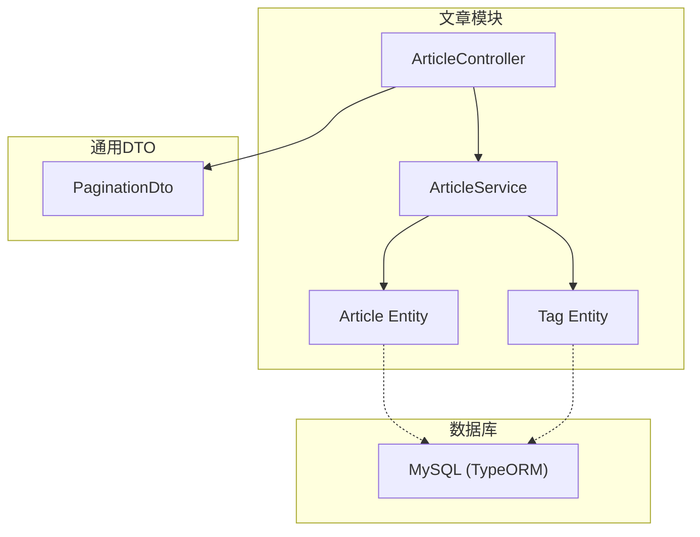
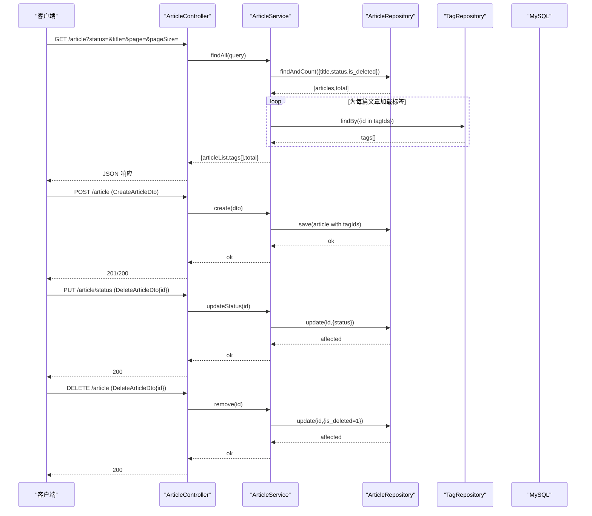
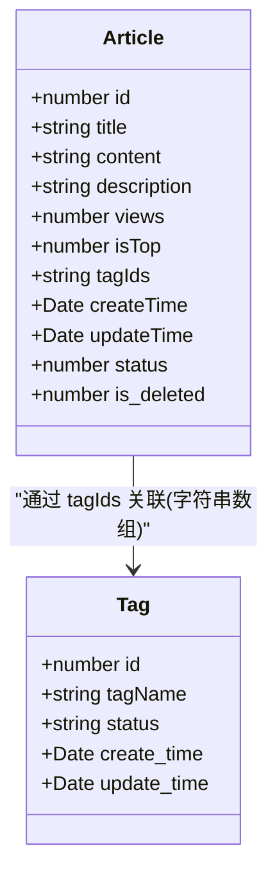
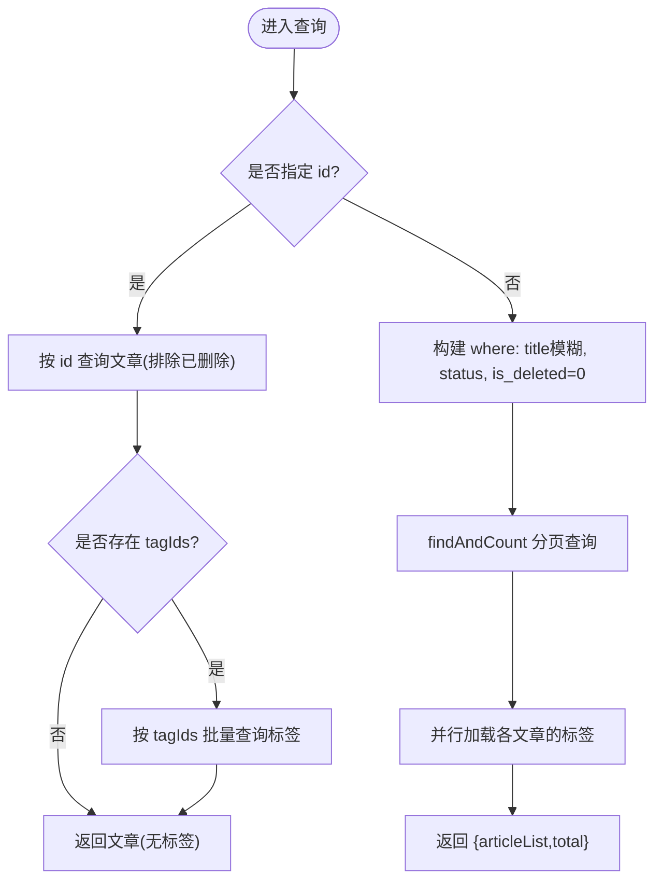
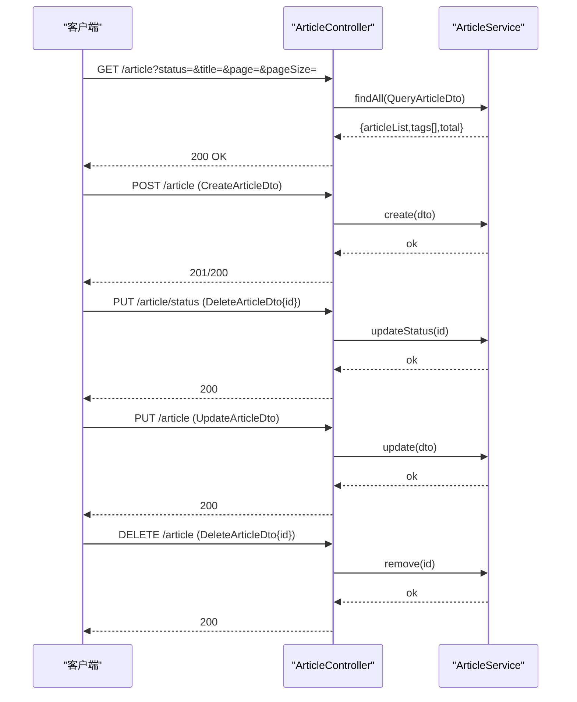
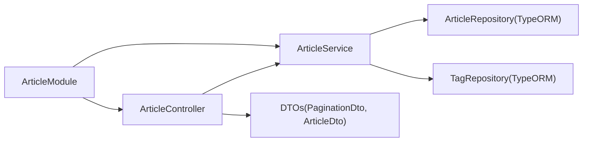

# 文章管理模块

<cite>
**本文引用的文件**
- [article.entity.ts](file://src/api/article/entities/article.entity.ts)
- [tag.entity.ts](file://src/api/article/entities/tag.entity.ts)
- [article.dto.ts](file://src/api/article/dto/article.dto.ts)
- [pagination.dto.ts](file://src/common/dto/pagination.dto.ts)
- [article.service.ts](file://src/api/article/article.service.ts)
- [article.controller.ts](file://src/api/article/article.controller.ts)
- [article.module.ts](file://src/api/article/article.module.ts)
- [init.sql](file://sql/init.sql)
</cite>

## 目录
1. [简介](#简介)
2. [项目结构](#项目结构)
3. [核心组件](#核心组件)
4. [架构总览](#架构总览)
5. [详细组件分析](#详细组件分析)
6. [依赖关系分析](#依赖关系分析)
7. [性能考虑](#性能考虑)
8. [故障排查指南](#故障排查指南)
9. [结论](#结论)
10. [附录](#附录)

## 简介
本设计文档聚焦于“文章管理模块”，围绕 ArticleModule 的内容管理架构展开，涵盖：
- 文章与标签的实体关系设计与数据模型
- 文章实体的数据结构（标题、内容、状态等）
- 标签实体的关联关系与多对多建模方案
- 文章服务的核心业务逻辑（CRUD、状态管理、标签关联）
- 文章控制器的 API 接口设计（分页查询、条件筛选、批量操作）
- 文章发布流程与标签管理的示例路径
- 软删除机制与数据完整性保证策略

## 项目结构
文章管理模块位于 src/api/article 下，采用典型的 NestJS 分层组织方式：
- entities：领域实体定义（Article、Tag）
- dto：请求/响应数据传输对象（创建、更新、查询、删除）
- service：业务逻辑实现（CRUD、状态切换、标签聚合）
- controller：HTTP 接口暴露（路由、参数校验、调用服务）
- module：模块装配与 TypeORM 仓储注入

图表来源
- [article.controller.ts:1-52](file://src/api/article/article.controller.ts#L1-L52)
- [article.service.ts:1-104](file://src/api/article/article.service.ts#L1-L104)
- [article.entity.ts:1-44](file://src/api/article/entities/article.entity.ts#L1-L44)
- [tag.entity.ts:1-26](file://src/api/article/entities/tag.entity.ts#L1-L26)
- [pagination.dto.ts:1-17](file://src/common/dto/pagination.dto.ts#L1-L17)

章节来源
- [article.module.ts:1-14](file://src/api/article/article.module.ts#L1-L14)
- [article.controller.ts:1-52](file://src/api/article/article.controller.ts#L1-L52)
- [article.service.ts:1-104](file://src/api/article/article.service.ts#L1-L104)
- [article.entity.ts:1-44](file://src/api/article/entities/article.entity.ts#L1-L44)
- [tag.entity.ts:1-26](file://src/api/article/entities/tag.entity.ts#L1-L26)
- [article.dto.ts:1-64](file://src/api/article/dto/article.dto.ts#L1-L64)
- [pagination.dto.ts:1-17](file://src/common/dto/pagination.dto.ts#L1-L17)

## 核心组件
- 控制器层：对外暴露 RESTful 接口，负责参数解析与校验，委托服务处理业务。
- 服务层：封装文章与标签的业务逻辑，包括分页查询、条件筛选、状态切换、软删除、标签聚合。
- 实体层：使用 TypeORM 注解映射数据库表结构，定义字段、索引与默认值。
- DTO 层：基于 class-validator/class-transformer 进行入参校验与类型转换，统一分页参数。

章节来源
- [article.controller.ts:1-52](file://src/api/article/article.controller.ts#L1-L52)
- [article.service.ts:1-104](file://src/api/article/article.service.ts#L1-L104)
- [article.entity.ts:1-44](file://src/api/article/entities/article.entity.ts#L1-L44)
- [tag.entity.ts:1-26](file://src/api/article/entities/tag.entity.ts#L1-L26)
- [article.dto.ts:1-64](file://src/api/article/dto/article.dto.ts#L1-L64)
- [pagination.dto.ts:1-17](file://src/common/dto/pagination.dto.ts#L1-L17)

## 架构总览
下图展示了从 HTTP 请求到数据库访问的完整链路，以及文章与标签的数据交互。

图表来源
- [article.controller.ts:1-52](file://src/api/article/article.controller.ts#L1-L52)
- [article.service.ts:1-104](file://src/api/article/article.service.ts#L1-L104)
- [article.entity.ts:1-44](file://src/api/article/entities/article.entity.ts#L1-L44)
- [tag.entity.ts:1-26](file://src/api/article/entities/tag.entity.ts#L1-L26)

## 详细组件分析

### 实体与数据模型
- 文章实体（Article）
  - 主键：自增 id
  - 基础信息：title、content、description
  - 展示与排序：views、isTop
  - 标签关联：tagIds（字符串形式存储多个标签ID）
  - 时间戳：createTime、updateTime
  - 状态与软删：status、is_deleted
- 标签实体（Tag）
  - 主键：自增 id
  - 名称：tagName
  - 状态：status
  - 时间戳：create_time、update_time

图表来源
- [article.entity.ts:1-44](file://src/api/article/entities/article.entity.ts#L1-L44)
- [tag.entity.ts:1-26](file://src/api/article/entities/tag.entity.ts#L1-L26)

章节来源
- [article.entity.ts:1-44](file://src/api/article/entities/article.entity.ts#L1-L44)
- [tag.entity.ts:1-26](file://src/api/article/entities/tag.entity.ts#L1-L26)
- [init.sql:55-108](file://sql/init.sql#L55-L108)

### 数据模型与 SQL 对齐说明
- 代码中的 article.tagIds 字段在数据库中对应 tag_ids，用于存储标签 ID 列表（以逗号分隔或 JSON 字符串）。
- 初始化脚本中 article 表包含 author_id、like_count、comment_count、share_count 等扩展字段，当前服务未直接使用这些字段，但可作为后续埋点与统计扩展点。
- 标签表 tag 提供唯一索引 uk_tag_name，便于后续维护标签一致性。

章节来源
- [init.sql:55-108](file://sql/init.sql#L55-L108)
- [article.entity.ts:1-44](file://src/api/article/entities/article.entity.ts#L1-L44)

### 标签关联与多对多建模
- 当前实现采用“扁平化”的多对多：文章表内以 tagIds 字符串保存多个标签 ID，查询时根据该列表反查标签详情并聚合返回。
- 优点：结构简单、读写路径清晰；缺点：无法利用外键约束与级联操作，需应用层保证数据一致性。
- 建议演进：若需要强一致性与复杂查询，可引入中间表 article_tag（article_id, tag_id），并在服务层维护双向关系。

章节来源
- [article.service.ts:21-58](file://src/api/article/article.service.ts#L21-L58)
- [article.entity.ts:26-31](file://src/api/article/entities/article.entity.ts#L26-L31)

### 文章服务（ArticleService）核心逻辑
- 查询（findAll）
  - 支持按 status、title 模糊匹配、id 精确查询
  - 支持分页（page、pageSize）
  - 单条查询时自动聚合标签列表
  - 列表查询时对每条记录并行加载标签，提升吞吐
- 创建（create）
  - 将传入的 tagIds 数组序列化为字符串后持久化
- 更新（update）
  - 先校验文章存在且未被软删
  - 更新基础信息与标签关联
- 状态切换（updateStatus）
  - 在 0/1 之间翻转状态
- 软删除（remove）
  - 将 is_deleted 置为 1，影响后续查询过滤

图表来源
- [article.service.ts:21-58](file://src/api/article/article.service.ts#L21-L58)

章节来源
- [article.service.ts:21-58](file://src/api/article/article.service.ts#L21-L58)
- [article.service.ts:60-102](file://src/api/article/article.service.ts#L60-L102)

### 文章控制器（ArticleController）API 设计
- GET /article
  - 作用：分页查询文章列表，支持 status、title、id 筛选
  - 认证：@Public() 公开接口
  - 参数：继承 PaginationDto（page、pageSize）
- POST /article
  - 作用：创建文章，接收 CreateArticleDto（含 tagIds 数组）
- PUT /article/status
  - 作用：切换文章状态（草稿/已发布）
- PUT /article
  - 作用：更新文章，接收 UpdateArticleDto（含 id 与 tagIds）
- DELETE /article
  - 作用：软删除文章，接收 DeleteArticleDto（id）

图表来源
- [article.controller.ts:1-52](file://src/api/article/article.controller.ts#L1-L52)
- [article.service.ts:1-104](file://src/api/article/article.service.ts#L1-L104)

章节来源
- [article.controller.ts:1-52](file://src/api/article/article.controller.ts#L1-L52)
- [article.dto.ts:1-64](file://src/api/article/dto/article.dto.ts#L1-L64)
- [pagination.dto.ts:1-17](file://src/common/dto/pagination.dto.ts#L1-L17)

### DTO 与参数校验
- CreateArticleDto：必填 title、description、content、tagIds（数组）、status；可选 isTop
- UpdateArticleDto：继承 CreateArticleDto，额外要求 id
- QueryArticleDto：继承 PaginationDto，增加 status、title、id 筛选
- DeleteArticleDto：仅包含 id
- 校验规则：非空、字符串长度、整数范围、数组类型等

章节来源
- [article.dto.ts:1-64](file://src/api/article/dto/article.dto.ts#L1-L64)
- [pagination.dto.ts:1-17](file://src/common/dto/pagination.dto.ts#L1-L17)

### 文章发布流程与标签管理示例路径
- 发布流程（草稿 -> 已发布）
  - 步骤一：POST /article 创建文章（status 初始可为 0）
  - 步骤二：PUT /article/status 切换状态至 1
  - 参考路径：[article.controller.ts:32-40](file://src/api/article/article.controller.ts#L32-L40)、[article.service.ts:84-94](file://src/api/article/article.service.ts#L84-L94)
- 标签管理
  - 创建文章时传入 tagIds 数组，服务将其拼接为字符串存储
  - 查询时根据 tagIds 反查标签详情并聚合返回
  - 参考路径：[article.service.ts:60-68](file://src/api/article/article.service.ts#L60-L68)、[article.service.ts:27-33](file://src/api/article/article.service.ts#L27-L33)

章节来源
- [article.controller.ts:32-40](file://src/api/article/article.controller.ts#L32-L40)
- [article.service.ts:60-68](file://src/api/article/article.service.ts#L60-L68)
- [article.service.ts:84-94](file://src/api/article/article.service.ts#L84-L94)
- [article.service.ts:27-33](file://src/api/article/article.service.ts#L27-L33)

### 软删除机制与数据完整性
- 软删除
  - 删除接口不物理移除记录，而是将 is_deleted 置为 1
  - 查询与更新均默认过滤 is_deleted=0 的记录
  - 参考路径：[article.service.ts:96-102](file://src/api/article/article.service.ts#L96-L102)、[article.service.ts:21-43](file://src/api/article/article.service.ts#L21-L43)
- 数据完整性
  - 当前未使用外键约束，标签有效性由应用层保证
  - 建议在后续版本引入 article_tag 中间表，并通过事务确保文章与标签的一致性
  - 参考路径：[article.service.ts:27-33](file://src/api/article/article.service.ts#L27-L33)

章节来源
- [article.service.ts:96-102](file://src/api/article/article.service.ts#L96-L102)
- [article.service.ts:21-43](file://src/api/article/article.service.ts#L21-L43)

## 依赖关系分析
- 模块装配
  - ArticleModule 导入 TypeOrmModule.forFeature([Article, Tag])，注册仓储供服务使用
- 控制器与服务
  - ArticleController 依赖 ArticleService，所有业务逻辑下沉至服务层
- 服务与仓储
  - ArticleService 同时依赖 ArticleRepository 与 TagRepository，完成文章与标签的读写与聚合
- DTO 与校验
  - 控制器方法参数使用 DTO，借助 class-validator 与 class-transformer 完成类型转换与校验

图表来源
- [article.module.ts:1-14](file://src/api/article/article.module.ts#L1-L14)
- [article.controller.ts:1-52](file://src/api/article/article.controller.ts#L1-L52)
- [article.service.ts:1-104](file://src/api/article/article.service.ts#L1-L104)
- [article.dto.ts:1-64](file://src/api/article/dto/article.dto.ts#L1-L64)
- [pagination.dto.ts:1-17](file://src/common/dto/pagination.dto.ts#L1-L17)

章节来源
- [article.module.ts:1-14](file://src/api/article/article.module.ts#L1-L14)
- [article.controller.ts:1-52](file://src/api/article/article.controller.ts#L1-L52)
- [article.service.ts:1-104](file://src/api/article/article.service.ts#L1-L104)

## 性能考虑
- 标签聚合优化
  - 列表查询中对每条文章并行加载标签（Promise.all），减少串行等待
  - 建议：当文章量较大时，可将 tagIds 预取并缓存，避免重复查询
- 查询条件与索引
  - 当前使用 LIKE 模糊匹配，建议在必要时为 title 建立前缀索引或使用全文检索
  - 状态与置顶字段已在 SQL 中建立索引，利于常见筛选场景
- 分页与总量
  - findAndCount 会执行两次查询（count 与数据），在高并发下可考虑异步计数或近似计数策略

章节来源
- [article.service.ts:45-55](file://src/api/article/article.service.ts#L45-L55)
- [init.sql:86-89](file://sql/init.sql#L86-L89)

## 故障排查指南
- 文章不存在
  - 更新与状态切换前会检查文章是否存在且未被软删，否则抛出错误
  - 参考路径：[article.service.ts:70-77](file://src/api/article/article.service.ts#L70-L77)、[article.service.ts:84-90](file://src/api/article/article.service.ts#L84-L90)
- 删除失败
  - 软删除时若受影响行数为 0，则视为删除失败
  - 参考路径：[article.service.ts:96-102](file://src/api/article/article.service.ts#L96-L102)
- 标签为空或异常
  - 若 tagIds 为空或非预期格式，可能导致标签聚合结果为空
  - 建议：在 DTO 层加强 tagIds 校验，或在入库前规范化处理
  - 参考路径：[article.service.ts:27-33](file://src/api/article/article.service.ts#L27-L33)

章节来源
- [article.service.ts:70-77](file://src/api/article/article.service.ts#L70-L77)
- [article.service.ts:84-90](file://src/api/article/article.service.ts#L84-L90)
- [article.service.ts:96-102](file://src/api/article/article.service.ts#L96-L102)
- [article.service.ts:27-33](file://src/api/article/article.service.ts#L27-L33)

## 结论
文章管理模块采用清晰的 NestJS 分层架构，结合 TypeORM 与 DTO 校验，实现了文章与标签的基础管理能力。当前通过 tagIds 字符串实现多对多关联，具备简单高效的特点；未来可通过中间表与事务进一步提升数据一致性与查询能力。软删除与状态机设计满足常见的内容生命周期管理需求。

## 附录

### API 清单与行为摘要
- GET /article
  - 功能：分页查询文章列表，支持 status、title、id 筛选
  - 认证：公开
  - 返回：{ articleList, total }
- POST /article
  - 功能：创建文章，接受 tagIds 数组
- PUT /article/status
  - 功能：切换文章状态（0/1）
- PUT /article
  - 功能：更新文章，接受 id 与 tagIds
- DELETE /article
  - 功能：软删除文章（is_deleted=1）

章节来源
- [article.controller.ts:1-52](file://src/api/article/article.controller.ts#L1-L52)
- [article.service.ts:1-104](file://src/api/article/article.service.ts#L1-L104)
- [article.dto.ts:1-64](file://src/api/article/dto/article.dto.ts#L1-L64)
- [pagination.dto.ts:1-17](file://src/common/dto/pagination.dto.ts#L1-L17)