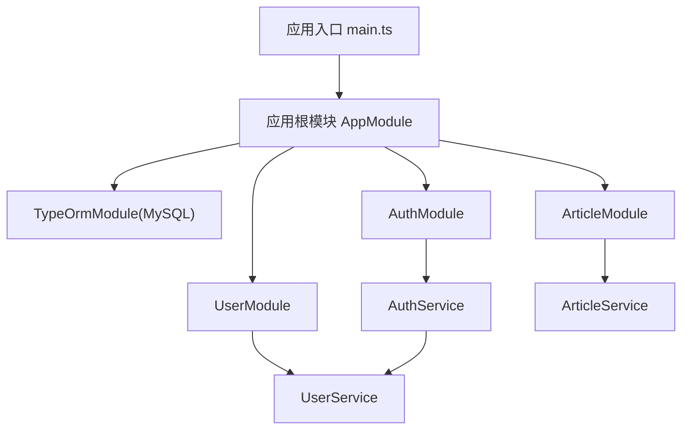
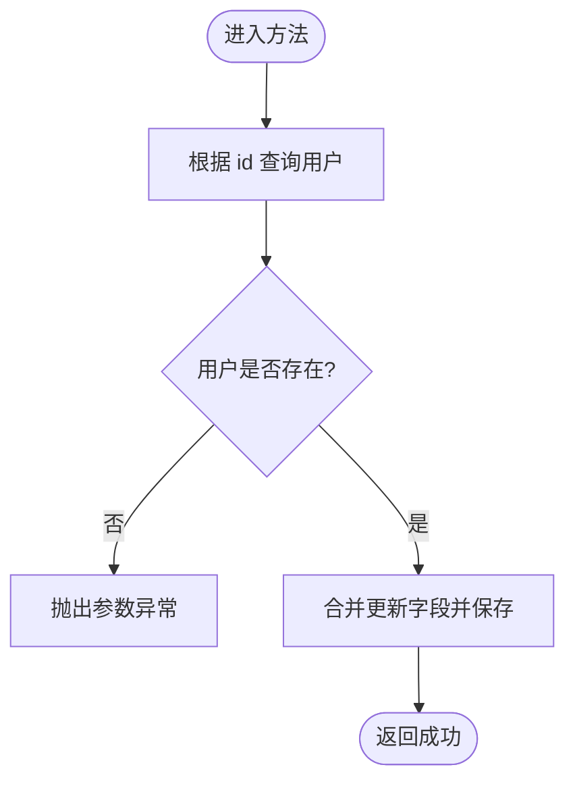
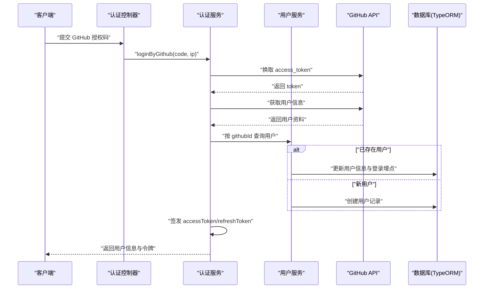
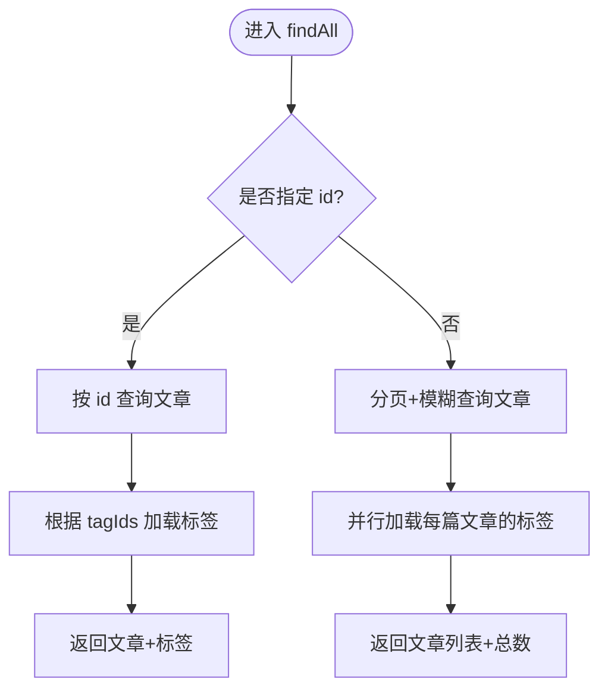
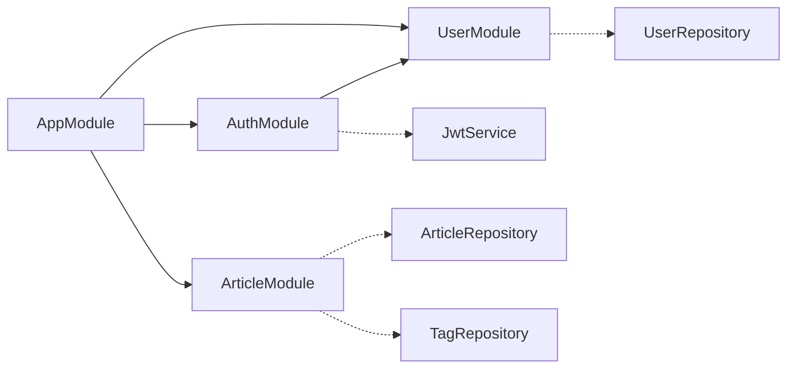

# 模块设计

<cite>
**本文引用的文件**   
- [src/app.module.ts](file://src/app.module.ts)
- [src/main.ts](file://src/main.ts)
- [package.json](file://package.json)
- [src/api/user/user.module.ts](file://src/api/user/user.module.ts)
- [src/api/user/user.service.ts](file://src/api/user/user.service.ts)
- [src/api/user/entities/user.entity.ts](file://src/api/user/entities/user.entity.ts)
- [src/api/auth/auth.module.ts](file://src/api/auth/auth.module.ts)
- [src/api/auth/auth.service.ts](file://src/api/auth/auth.service.ts)
- [src/api/article/article.module.ts](file://src/api/article/article.module.ts)
- [src/api/article/article.service.ts](file://src/api/article/article.service.ts)
- [src/api/article/entities/article.entity.ts](file://src/api/article/entities/article.entity.ts)
- [src/api/article/entities/tag.entity.ts](file://src/api/article/entities/tag.entity.ts)
- [src/config/jwt.config.ts](file://src/config/jwt.config.ts)
- [src/config/mysql.config.ts](file://src/config/mysql.config.ts)
</cite>

## 目录
1. [引言](#引言)
2. [项目结构](#项目结构)
3. [核心组件](#核心组件)
4. [架构总览](#架构总览)
5. [详细组件分析](#详细组件分析)
6. [依赖分析](#依赖分析)
7. [性能考虑](#性能考虑)
8. [故障排查指南](#故障排查指南)
9. [结论](#结论)
10. [附录](#附录)

## 引言
本设计文档围绕博客系统的 NestJS 模块化架构，系统阐述用户管理、认证授权、文章管理三大业务域模块的职责边界、依赖关系与通信机制。文档重点说明：
- 按业务域划分的模块化策略与职责边界原则
- 模块间导入导出、服务共享与跨模块调用方式
- 全局配置与环境适配（数据库、JWT、会话等）
- 模块依赖图与关键流程时序图
- 常见问题的定位与优化建议

## 项目结构
整体采用“应用根模块 + 业务域模块 + 公共基础设施”的分层组织方式：
- 应用根模块负责装配数据库连接、注册全局过滤器/拦截器/守卫，并聚合业务模块
- 业务域模块以 user、auth、article 划分，各自封装控制器、服务、实体与 DTO
- 配置集中在 config 目录，通过 TypeORM 自动加载实体
- 启动入口完成中间件、验证管道、Swagger 文档等初始化



图示来源
- [src/app.module.ts:1-35](file://src/app.module.ts#L1-L35)
- [src/main.ts:1-46](file://src/main.ts#L1-L46)
- [src/api/user/user.module.ts:1-14](file://src/api/user/user.module.ts#L1-L14)
- [src/api/auth/auth.module.ts:1-13](file://src/api/auth/auth.module.ts#L1-L13)
- [src/api/article/article.module.ts:1-14](file://src/api/article/article.module.ts#L1-L14)

章节来源
- [src/app.module.ts:1-35](file://src/app.module.ts#L1-L35)
- [src/main.ts:1-46](file://src/main.ts#L1-L46)
- [package.json:1-100](file://package.json#L1-L100)

## 核心组件
- 用户管理模块（UserModule）
  - 职责：用户基础信息维护、登录埋点更新、分页查询
  - 对外暴露：UserService（供 AuthModule 使用）
  - 数据访问：TypeORM Repository 注入 User 实体
- 认证授权模块（AuthModule）
  - 职责：GitHub 第三方登录、令牌签发与刷新、权限守卫集成
  - 依赖：JwtService、UserService
  - 配置：全局 JwtModule、JWT 密钥配置
- 文章管理模块（ArticleModule）
  - 职责：文章 CRUD、状态切换、软删除、标签关联查询
  - 数据访问：TypeORM Repository 注入 Article、Tag 实体

章节来源
- [src/api/user/user.module.ts:1-14](file://src/api/user/user.module.ts#L1-L14)
- [src/api/user/user.service.ts:1-66](file://src/api/user/user.service.ts#L1-L66)
- [src/api/auth/auth.module.ts:1-13](file://src/api/auth/auth.module.ts#L1-L13)
- [src/api/auth/auth.service.ts:1-123](file://src/api/auth/auth.service.ts#L1-L123)
- [src/api/article/article.module.ts:1-14](file://src/api/article/article.module.ts#L1-L14)
- [src/api/article/article.service.ts:1-104](file://src/api/article/article.service.ts#L1-L104)

## 架构总览
NestJS 模块化以“高内聚、低耦合”为目标，通过 Module 装饰器声明 imports/providers/controllers/exports，实现依赖注入与生命周期管理。本项目采用“按业务域划分”的模块化策略，将用户、认证、文章分别独立为模块，降低交叉影响，提升可测试性与可维护性。

```mermaid
classDiagram
class AppModule {
+imports : [TypeOrmModule, UserModule, AuthModule, ArticleModule]
+providers : [APP_FILTER, APP_INTERCEPTOR, APP_GUARD]
}
class UserModule {
+imports : [TypeOrmModule.forFeature([User])]
+controllers : [UserController]
+providers : [UserService]
+exports : [UserService]
}
class AuthModule {
+imports : [JwtModule.register({global : true}), UserModule]
+controllers : [AuthController]
+providers : [AuthService]
}
class ArticleModule {
+imports : [TypeOrmModule.forFeature([Article, Tag])]
+controllers : [ArticleController]
+providers : [ArticleService]
}
class UserService
class AuthService
class ArticleService
AppModule --> UserModule : "导入"
AppModule --> AuthModule : "导入"
AppModule --> ArticleModule : "导入"
AuthModule --> UserModule : "依赖"
AuthService --> UserService : "注入使用"
```

图示来源
- [src/app.module.ts:1-35](file://src/app.module.ts#L1-L35)
- [src/api/user/user.module.ts:1-14](file://src/api/user/user.module.ts#L1-L14)
- [src/api/auth/auth.module.ts:1-13](file://src/api/auth/auth.module.ts#L1-L13)
- [src/api/article/article.module.ts:1-14](file://src/api/article/article.module.ts#L1-L14)

## 详细组件分析

### 用户管理模块（UserModule）
- 模块职责
  - 提供用户信息查询、新增、更新、登录埋点更新能力
  - 通过 TypeORM 直接操作 user 表
- 关键实现要点
  - 使用 Repository 进行条件查询与分页统计
  - 更新用户时校验存在性，避免空对象覆盖
  - 登录埋点包含时间、IP、地址、次数累计
- 对外契约
  - 导出 UserService，供其他模块复用



图示来源
- [src/api/user/user.service.ts:39-48](file://src/api/user/user.service.ts#L39-L48)

章节来源
- [src/api/user/user.module.ts:1-14](file://src/api/user/user.module.ts#L1-L14)
- [src/api/user/user.service.ts:1-66](file://src/api/user/user.service.ts#L1-L66)
- [src/api/user/entities/user.entity.ts:1-57](file://src/api/user/entities/user.entity.ts#L1-L57)

### 认证授权模块（AuthModule）
- 模块职责
  - 处理 GitHub 第三方登录流程：换取 access_token、拉取用户信息、本地用户落库或更新、签发 JWT
  - 提供刷新令牌接口
  - 与全局守卫配合实现鉴权
- 关键实现要点
  - 使用 axios 调用 GitHub API，结合 IP 解析工具完善登录埋点
  - 生成 accessToken 与 refreshToken，分别设置不同过期时间与密钥
  - 通过 UserModule 导出的 UserService 完成用户数据的读写
- 对外契约
  - 提供认证相关控制器；内部依赖 JwtService 与 UserService



图示来源
- [src/api/auth/auth.service.ts:23-109](file://src/api/auth/auth.service.ts#L23-L109)
- [src/api/user/user.service.ts:34-64](file://src/api/user/user.service.ts#L34-L64)

章节来源
- [src/api/auth/auth.module.ts:1-13](file://src/api/auth/auth.module.ts#L1-L13)
- [src/api/auth/auth.service.ts:1-123](file://src/api/auth/auth.service.ts#L1-L123)
- [src/config/jwt.config.ts:1-5](file://src/config/jwt.config.ts#L1-L5)

### 文章管理模块（ArticleModule）
- 模块职责
  - 文章的增删改查、状态切换、软删除
  - 基于 tagIds 字符串字段关联标签集合，查询时动态加载标签详情
- 关键实现要点
  - 列表与详情均过滤 is_deleted=0
  - 批量映射文章与其标签，提升可读性
  - 更新前校验文章存在性，避免误写
- 对外契约
  - 提供文章相关控制器；内部依赖 Article 与 Tag 的 Repository



图示来源
- [src/api/article/article.service.ts:21-58](file://src/api/article/article.service.ts#L21-L58)

章节来源
- [src/api/article/article.module.ts:1-14](file://src/api/article/article.module.ts#L1-L14)
- [src/api/article/article.service.ts:1-104](file://src/api/article/article.service.ts#L1-L104)
- [src/api/article/entities/article.entity.ts:1-44](file://src/api/article/entities/article.entity.ts#L1-L44)
- [src/api/article/entities/tag.entity.ts:1-26](file://src/api/article/entities/tag.entity.ts#L1-L26)

### 概念总览（非代码映射）
- 模块职责边界原则
  - 单一职责：每个模块聚焦一个业务域，仅暴露必要服务
  - 最小暴露：通过 exports 控制对外可见范围，减少隐式耦合
  - 依赖方向：上层模块依赖下层领域模块，避免反向依赖
  - 配置外置：敏感配置与外部依赖通过配置文件集中管理
- 为什么按业务域划分
  - 便于团队分工与迭代演进
  - 降低变更扩散面，提高可测试性
  - 有利于后续拆分为微服务或子包

[本节为概念性内容，不直接分析具体文件，故无章节来源]

## 依赖分析
- 模块级依赖
  - AppModule 聚合三个业务模块与数据库连接
  - AuthModule 依赖 UserModule 提供的 UserService
  - ArticleModule 自包含，未依赖其他业务模块
- 服务级依赖
  - AuthService 依赖 JwtService 与 UserService
  - ArticleService 依赖 ArticleRepository 与 TagRepository
  - UserService 依赖 UserRepository
- 外部依赖
  - TypeORM 与 MySQL 驱动
  - JWT 签名与校验
  - Axios 调用 GitHub API
  - express-session 用于会话（当前项目已启用）



图示来源
- [src/app.module.ts:1-35](file://src/app.module.ts#L1-L35)
- [src/api/auth/auth.module.ts:1-13](file://src/api/auth/auth.module.ts#L1-L13)
- [src/api/user/user.module.ts:1-14](file://src/api/user/user.module.ts#L1-L14)
- [src/api/article/article.module.ts:1-14](file://src/api/article/article.module.ts#L1-L14)

章节来源
- [src/app.module.ts:1-35](file://src/app.module.ts#L1-L35)
- [src/api/auth/auth.module.ts:1-13](file://src/api/auth/auth.module.ts#L1-L13)
- [src/api/user/user.module.ts:1-14](file://src/api/user/user.module.ts#L1-L14)
- [src/api/article/article.module.ts:1-14](file://src/api/article/article.module.ts#L1-L14)

## 性能考虑
- 数据库查询
  - 分页查询使用 skip/take 与 count 组合，注意大数据量下的深度分页成本
  - 列表场景下对标签的 N+1 查询可通过 Promise.all 并发加载，但需关注并发上限与慢查询
- 缓存与索引
  - 高频查询字段（如 username、email、status、is_deleted）建议建立索引
  - 对标签查询结果可引入短期缓存以降低重复 IO
- 令牌与鉴权
  - JWT 体积适中即可，避免在 payload 中携带过多敏感信息
  - 刷新令牌策略应结合黑名单或短有效期以提升安全性
- 网络请求
  - 调用 GitHub API 时应增加超时与重试退避策略，避免雪崩

[本节为通用指导，不直接分析具体文件，故无章节来源]

## 故障排查指南
- 常见问题定位
  - 数据库连接失败：检查 mysql.config 中的 host、port、username、password、database 是否正确
  - JWT 签名失败：确认 jwt.config 中的密钥配置一致且未被篡改
  - 第三方登录失败：检查 GitHub client_id/client_secret 与回调地址配置
  - 会话无效：确认 main.ts 中 session 配置与前端 Cookie 域名/路径匹配
- 日志与调试
  - 利用全局异常过滤器统一捕获错误，结合 ValidationPipe 的错误提示快速定位入参问题
  - 开启 Swagger 文档，核对接口定义与实际行为一致性

章节来源
- [src/config/mysql.config.ts:1-15](file://src/config/mysql.config.ts#L1-L15)
- [src/config/jwt.config.ts:1-5](file://src/config/jwt.config.ts#L1-L5)
- [src/main.ts:1-46](file://src/main.ts#L1-L46)

## 结论
本项目采用按业务域划分的模块化策略，清晰划分用户、认证、文章三大模块职责，并通过 exports 与服务注入实现低耦合协作。全局配置集中于 config 目录，结合 TypeORM 自动加载实体，简化了环境适配。未来可在现有基础上引入事件总线、缓存层与更完善的监控告警，进一步提升可扩展性与稳定性。

[本节为总结性内容，不直接分析具体文件，故无章节来源]

## 附录
- 模块配置与环境适配
  - 数据库配置：mysql.config.ts 提供 TypeORM 连接选项，autoLoadEntities 开启后无需手动注册实体
  - JWT 配置：jwt.config.ts 提供 access/refresh 密钥，AuthService 据此签发令牌
  - 应用启动：main.ts 中启用 express-session、全局验证管道、Swagger 文档与监听端口

章节来源
- [src/config/mysql.config.ts:1-15](file://src/config/mysql.config.ts#L1-L15)
- [src/config/jwt.config.ts:1-5](file://src/config/jwt.config.ts#L1-L5)
- [src/main.ts:1-46](file://src/main.ts#L1-L46)