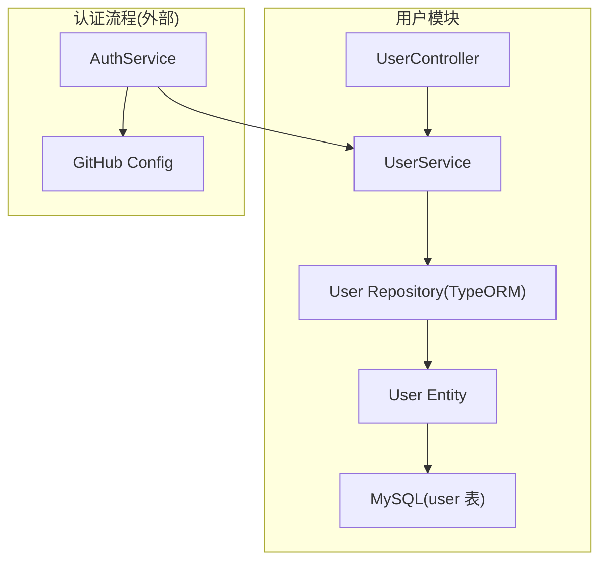
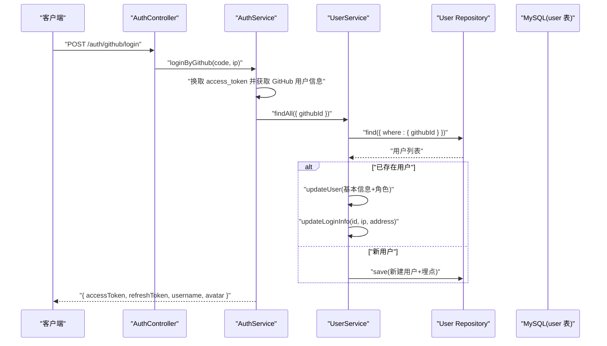
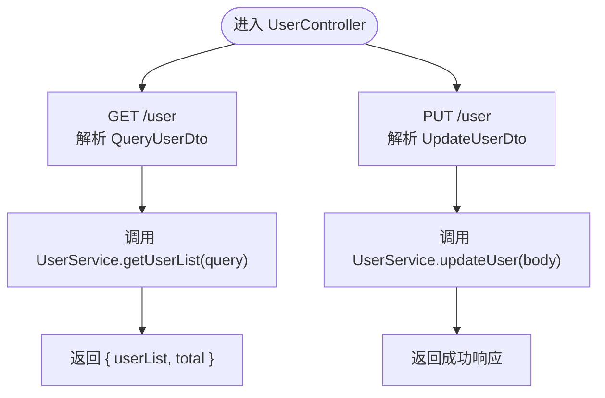
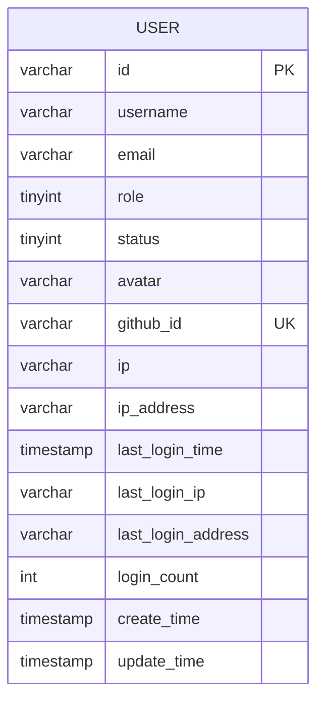
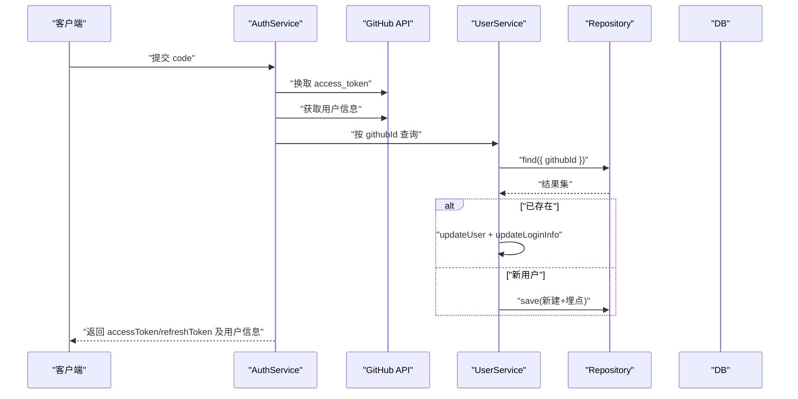
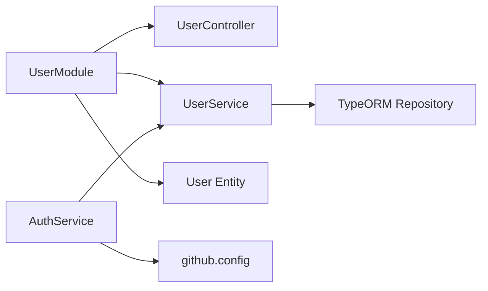

# 用户管理模块

<cite>
**本文引用的文件**   
- [user.module.ts](file://src/api/user/user.module.ts)
- [user.entity.ts](file://src/api/user/entities/user.entity.ts)
- [user.dto.ts](file://src/api/user/dto/user.dto.ts)
- [user.controller.ts](file://src/api/user/user.controller.ts)
- [user.service.ts](file://src/api/user/user.service.ts)
- [auth.service.ts](file://src/api/auth/auth.service.ts)
- [github.config.ts](file://src/config/github.config.ts)
- [pagination.dto.ts](file://src/common/dto/pagination.dto.ts)
- [init.sql](file://sql/init.sql)
</cite>

## 目录
1. [简介](#简介)
2. [项目结构](#项目结构)
3. [核心组件](#核心组件)
4. [架构总览](#架构总览)
5. [详细组件分析](#详细组件分析)
6. [依赖关系分析](#依赖关系分析)
7. [性能与扩展性](#性能与扩展性)
8. [故障排查指南](#故障排查指南)
9. [结论](#结论)
10. [附录：API 契约与使用示例](#附录api-契约与使用示例)

## 简介
本设计文档聚焦于“用户管理模块”，围绕 UserModule 的架构设计与实现进行系统化说明。内容涵盖控制器、服务、实体与 DTO 的职责划分；用户实体的数据结构、字段定义与业务规则；用户服务的核心逻辑（查询、更新、GitHub OAuth 登录注册）；控制器的 API 接口设计（HTTP 方法与请求响应处理）；TypeORM 实体与数据库表的映射关系、索引与约束；并提供可复用的代码片段路径与使用模式，帮助读者快速理解并扩展该模块。

## 项目结构
用户管理模块位于 src/api/user 下，采用 NestJS 模块化组织方式，包含以下关键文件：
- user.module.ts：模块装配，注入 TypeORM 仓库，暴露 UserService
- entities/user.entity.ts：TypeORM 实体，映射 user 表
- dto/user.dto.ts：输入校验与分页参数 DTO
- user.controller.ts：REST 控制器，提供用户列表与更新接口
- user.service.ts：用户领域服务，封装数据访问与业务逻辑



图表来源
- [user.module.ts:7-13](file://src/api/user/user.module.ts#L7-L13)
- [user.controller.ts:14-27](file://src/api/user/user.controller.ts#L14-L27)
- [user.service.ts:8-65](file://src/api/user/user.service.ts#L8-L65)
- [user.entity.ts:9-56](file://src/api/user/entities/user.entity.ts#L9-L56)
- [auth.service.ts:23-109](file://src/api/auth/auth.service.ts#L23-L109)
- [github.config.ts:1-6](file://src/config/github.config.ts#L1-L6)

章节来源
- [user.module.ts:1-14](file://src/api/user/user.module.ts#L1-L14)
- [user.controller.ts:1-28](file://src/api/user/user.controller.ts#L1-L28)
- [user.service.ts:1-66](file://src/api/user/user.service.ts#L1-L66)
- [user.entity.ts:1-57](file://src/api/user/entities/user.entity.ts#L1-L57)

## 核心组件
- 控制器（UserController）
  - 职责：接收 HTTP 请求，解析查询/请求体参数，调用服务层返回结果
  - 主要接口：GET /user（分页查询）、PUT /user（更新用户信息）
- 服务（UserService）
  - 职责：封装用户领域逻辑，包括分页查询、按条件查找、新增（第三方登录场景）、更新、登录埋点更新
  - 对外暴露方法：findAll、getUserList、addUserByGithub、updateUser、updateLoginInfo
- 实体（User）
  - 职责：描述用户域模型，映射到数据库 user 表，包含基础信息、角色、状态、IP 与登录埋点等
- DTO（user.dto.ts）
  - 职责：统一输入校验与类型转换，包含 AddUserDto、QueryUserDto、UpdateUserDto 以及内部 EmailDto
  - 复用 PaginationDto 提供 page/pageSize 默认值与校验

章节来源
- [user.controller.ts:14-27](file://src/api/user/user.controller.ts#L14-L27)
- [user.service.ts:14-65](file://src/api/user/user.service.ts#L14-L65)
- [user.entity.ts:9-56](file://src/api/user/entities/user.entity.ts#L9-L56)
- [user.dto.ts:12-75](file://src/api/user/dto/user.dto.ts#L12-L75)
- [pagination.dto.ts:4-16](file://src/common/dto/pagination.dto.ts#L4-L16)

## 架构总览
下图展示了用户模块在整体应用中的位置以及与认证模块的交互关系。认证服务在完成 GitHub OAuth 后，委托用户服务完成用户的新增或更新，并记录登录埋点。



图表来源
- [auth.service.ts:23-109](file://src/api/auth/auth.service.ts#L23-L109)
- [user.service.ts:34-64](file://src/api/user/user.service.ts#L34-L64)
- [user.entity.ts:9-56](file://src/api/user/entities/user.entity.ts#L9-L56)
- [init.sql:24-52](file://sql/init.sql#L24-L52)

## 详细组件分析

### 控制器（UserController）
- 路由前缀：/user
- 接口清单
  - GET /user
    - 功能：分页查询用户列表，支持按用户名和邮箱模糊匹配
    - 入参：QueryUserDto（继承 PaginationDto），含 page、pageSize、username、email
    - 出参：{ userList, total }
  - PUT /user
    - 功能：更新用户信息
    - 入参：UpdateUserDto（包含 id、username、role、avatar、ip、ipAddress、githubId 等）
    - 出参：无具体数据（成功即返回空体或通用响应）



图表来源
- [user.controller.ts:14-27](file://src/api/user/user.controller.ts#L14-L27)
- [user.service.ts:21-48](file://src/api/user/user.service.ts#L21-L48)

章节来源
- [user.controller.ts:14-27](file://src/api/user/user.controller.ts#L14-L27)
- [user.dto.ts:34-75](file://src/api/user/dto/user.dto.ts#L34-L75)
- [pagination.dto.ts:4-16](file://src/common/dto/pagination.dto.ts#L4-L16)

### 服务（UserService）
- 核心方法
  - findAll(query): 根据 email/id/githubId 精确查询用户
  - getUserList({ page, pageSize, username, email }): 分页查询，支持用户名/邮箱模糊匹配，按创建时间升序
  - addUserByGithub(userInfo): 保存第三方登录用户信息（用于首次注册）
  - updateUser(body): 根据 id 更新用户信息，若不存在则抛出异常
  - updateLoginInfo(id, ip, ipAddress): 更新最后登录时间、IP、地区与登录次数
- 业务规则
  - 更新操作需先校验用户是否存在
  - 登录埋点每次登录递增 loginCount，并刷新 lastLoginTime、lastLoginIp、lastLoginAddress
  - 分页查询默认按 create_time 升序排列

```mermaid
classDiagram
class UserService {
+findAll(query) Promise~User[]~
+getUserList(query) Promise~{userList, total}~
+addUserByGithub(userInfo) Promise~void~
+updateUser(body) Promise~void~
+updateLoginInfo(id, ip, ipAddress) Promise~void~
}
class UserRepository {
+find()
+findOne()
+findAndCount()
+save()
}
UserService --> UserRepository : "通过 @InjectRepository 注入"
```

图表来源
- [user.service.ts:8-65](file://src/api/user/user.service.ts#L8-L65)

章节来源
- [user.service.ts:14-65](file://src/api/user/user.service.ts#L14-L65)

### 实体（User）与数据库映射
- 表名：user
- 主键：id（VARCHAR，由 nanoid 生成）
- 关键字段
  - 基础信息：username、email、avatar
  - 权限与状态：role、status
  - 第三方关联：github_id（唯一索引）
  - IP 相关：ip、ip_address
  - 登录埋点：last_login_time、last_login_ip、last_login_address、login_count
  - 审计字段：create_time、update_time
- 索引与约束
  - 主键：id
  - 唯一索引：uk_github_id(github_id)
  - 普通索引：idx_email(email)、idx_create_time(create_time)



图表来源
- [user.entity.ts:9-56](file://src/api/user/entities/user.entity.ts#L9-L56)
- [init.sql:24-52](file://sql/init.sql#L24-L52)

章节来源
- [user.entity.ts:9-56](file://src/api/user/entities/user.entity.ts#L9-L56)
- [init.sql:24-52](file://sql/init.sql#L24-L52)

### DTO 与校验规则
- EmailDto：校验 email 必填、长度与格式
- AddUserDto：新增用户所需字段（username、avatar、githubId 等）
- QueryUserDto：查询条件（email、username）+ 分页（page、pageSize）
- UpdateUserDto：更新用户所需字段（id、username、role、avatar、ip、ipAddress、githubId 等）
- 分页参数默认值：page=1，pageSize=20，且最小值为 1

章节来源
- [user.dto.ts:12-75](file://src/api/user/dto/user.dto.ts#L12-L75)
- [pagination.dto.ts:4-16](file://src/common/dto/pagination.dto.ts#L4-L16)

### GitHub OAuth 登录注册流程
- 步骤概览
  1) 前端携带 code 调用认证接口
  2) 后端以 client_id/client_secret 换取 access_token
  3) 使用 token 拉取 GitHub 用户信息
  4) 根据 githubId 查询本地用户
     - 已存在：更新基本信息与登录埋点，签发 JWT
     - 不存在：生成 id 并写入用户记录，初始化埋点，签发 JWT
- 配置项
  - githubConfig.client_id、client_secret



图表来源
- [auth.service.ts:23-109](file://src/api/auth/auth.service.ts#L23-L109)
- [github.config.ts:1-6](file://src/config/github.config.ts#L1-L6)
- [user.service.ts:34-64](file://src/api/user/user.service.ts#L34-L64)

章节来源
- [auth.service.ts:23-109](file://src/api/auth/auth.service.ts#L23-L109)
- [github.config.ts:1-6](file://src/config/github.config.ts#L1-L6)

## 依赖关系分析
- 模块装配
  - UserModule 导入 TypeOrmModule.forFeature([User])，注册 User 实体仓库
  - 导出 UserService，供其他模块（如 AuthModule）使用
- 运行时依赖
  - UserController 依赖 UserService
  - UserService 依赖 TypeORM Repository<User>
  - AuthService 依赖 UserService 与 GitHub 配置
- 外部集成
  - GitHub OAuth：通过 axios 调用 GitHub 开放接口
  - IP 地址解析：通过工具函数获取 IP 与地区信息（在认证流程中使用）



图表来源
- [user.module.ts:7-13](file://src/api/user/user.module.ts#L7-L13)
- [user.controller.ts:14-27](file://src/api/user/user.controller.ts#L14-L27)
- [user.service.ts:8-12](file://src/api/user/user.service.ts#L8-L12)
- [auth.service.ts:11-16](file://src/api/auth/auth.service.ts#L11-L16)
- [github.config.ts:1-6](file://src/config/github.config.ts#L1-L6)

章节来源
- [user.module.ts:1-14](file://src/api/user/user.module.ts#L1-L14)
- [auth.service.ts:11-16](file://src/api/auth/auth.service.ts#L11-L16)

## 性能与扩展性
- 查询优化
  - 分页查询使用 findAndCount，避免全量加载
  - 模糊查询基于 LIKE，建议在高频查询字段上建立合适索引（当前已有 idx_email、idx_create_time）
- 并发与一致性
  - 更新用户信息与登录埋点为独立 save 操作，若需强一致可在后续引入事务
- 可扩展点
  - 增加更多筛选条件时，建议将动态查询构建抽象为查询构建器或专用查询对象
  - 对敏感字段（如 email）可增加脱敏输出策略
  - 登录埋点可考虑异步落库以降低主流程延迟

[本节为通用指导，不直接分析具体文件]

## 故障排查指南
- 常见错误
  - 用户不存在：更新或更新埋点时若未找到用户，会抛出“用户不存在”异常
  - GitHub 登录失败：code 为空或无法换取 access_token 时会抛出相应异常
- 定位建议
  - 检查 DTO 校验是否通过（如 email 格式、必填项）
  - 确认数据库中是否存在对应 githubId 的记录
  - 核对 GitHub 配置是否正确（client_id/client_secret）

章节来源
- [user.service.ts:39-64](file://src/api/user/user.service.ts#L39-L64)
- [auth.service.ts:23-109](file://src/api/auth/auth.service.ts#L23-L109)

## 结论
用户管理模块遵循清晰的层次划分：控制器负责协议适配，服务承载业务逻辑，实体映射数据模型，DTO 保障输入合法性。结合 TypeORM 与 MySQL 的索引设计，实现了高效的用户查询与更新能力。通过认证模块的协作，完成了 GitHub OAuth 的登录注册闭环，并记录了完整的登录埋点，便于后续分析与运营。

[本节为总结性内容，不直接分析具体文件]

## 附录：API 契约与使用示例

### 接口清单
- GET /user
  - 作用：分页查询用户列表
  - 查询参数：page、pageSize、username、email
  - 响应：{ userList, total }
- PUT /user
  - 作用：更新用户信息
  - 请求体：UpdateUserDto（包含 id、username、role、avatar、ip、ipAddress、githubId 等）
  - 响应：成功即返回通用成功响应

章节来源
- [user.controller.ts:18-26](file://src/api/user/user.controller.ts#L18-L26)
- [user.dto.ts:34-75](file://src/api/user/dto/user.dto.ts#L34-L75)

### 使用示例（代码片段路径）
- 分页查询用户
  - 参考路径：[user.service.ts:21-32](file://src/api/user/user.service.ts#L21-L32)
- 更新用户信息
  - 参考路径：[user.service.ts:39-48](file://src/api/user/user.service.ts#L39-L48)
- 新增用户（第三方登录）
  - 参考路径：[user.service.ts:34-37](file://src/api/user/user.service.ts#L34-L37)
- 更新登录埋点
  - 参考路径：[user.service.ts:53-64](file://src/api/user/user.service.ts#L53-L64)
- GitHub OAuth 登录注册
  - 参考路径：[auth.service.ts:23-109](file://src/api/auth/auth.service.ts#L23-L109)