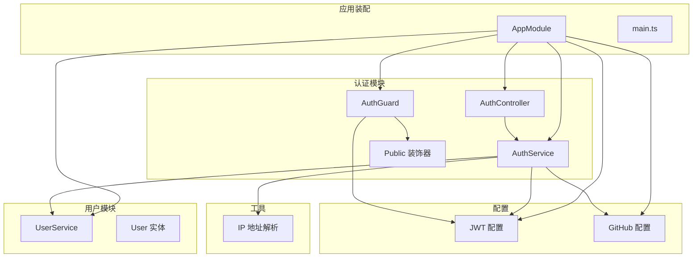
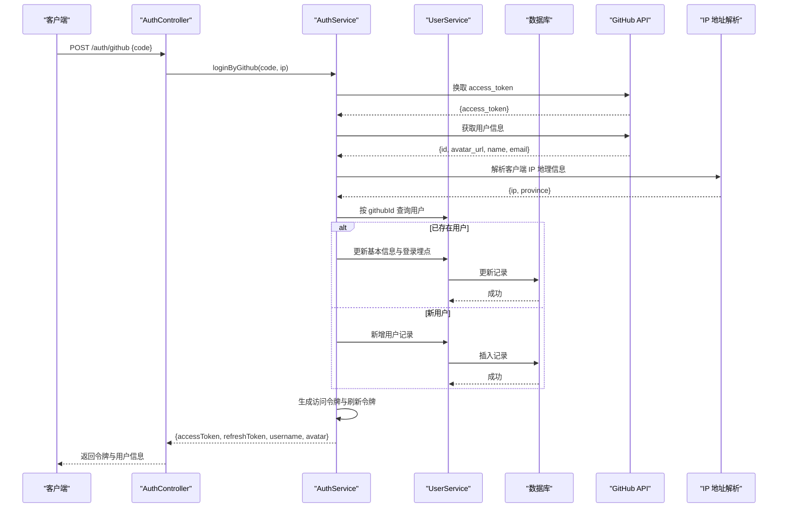
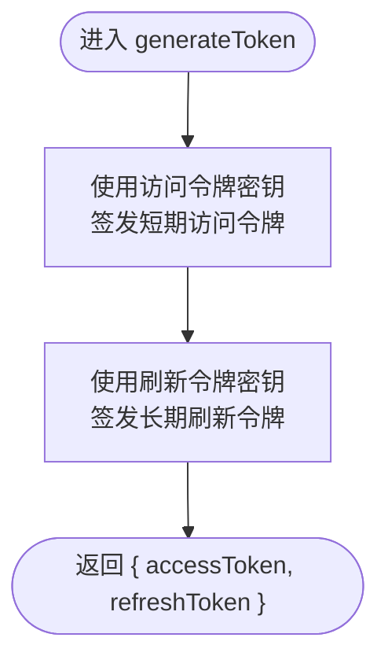
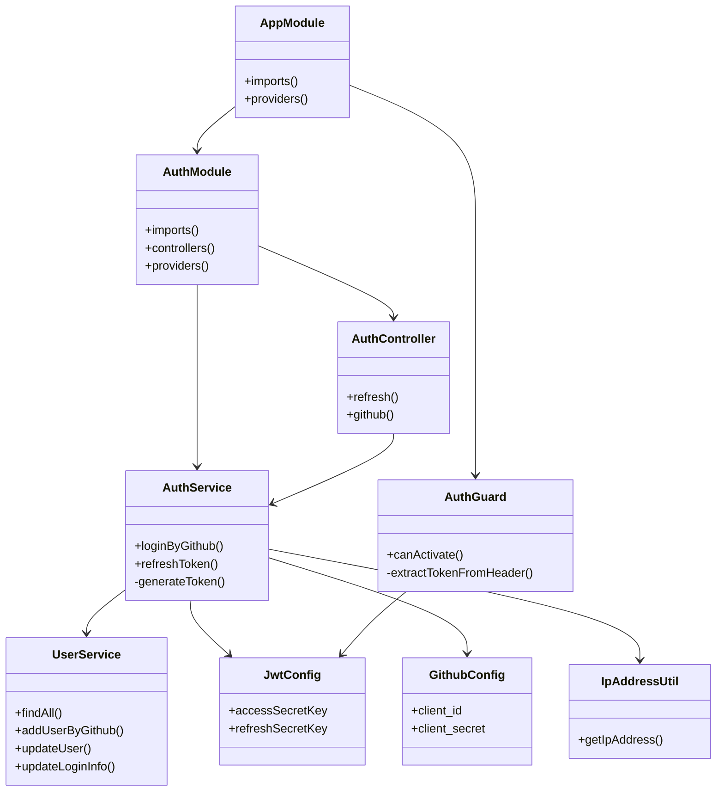

# 认证授权模块

<cite>
**本文引用的文件**   
- [auth.module.ts](file://src/api/auth/auth.module.ts)
- [auth.service.ts](file://src/api/auth/auth.service.ts)
- [auth.controller.ts](file://src/api/auth/auth.controller.ts)
- [auth.guard.ts](file://src/core/guard/auth.guard.ts)
- [public.decorator.ts](file://src/core/guard/public.decorator.ts)
- [jwt.config.ts](file://src/config/jwt.config.ts)
- [github.config.ts](file://src/config/github.config.ts)
- [user.service.ts](file://src/api/user/user.service.ts)
- [user.entity.ts](file://src/api/user/entities/user.entity.ts)
- [ip-address.ts](file://src/utils/ip-address.ts)
- [app.module.ts](file://src/app.module.ts)
- [main.ts](file://src/main.ts)
</cite>

## 目录
1. [简介](#简介)
2. [项目结构](#项目结构)
3. [核心组件](#核心组件)
4. [架构总览](#架构总览)
5. [详细组件分析](#详细组件分析)
6. [依赖关系分析](#依赖关系分析)
7. [性能与扩展性](#性能与扩展性)
8. [故障排查指南](#故障排查指南)
9. [结论](#结论)
10. [附录：API 定义与安全清单](#附录api-定义与安全清单)

## 简介
本设计文档聚焦于认证授权模块，围绕 AuthModule 的安全架构展开，涵盖以下要点：
- JWT 双令牌（访问令牌与刷新令牌）机制的设计与生命周期管理
- GitHub OAuth 第三方登录的完整流程与用户信息同步策略
- 认证守卫的工作机制与受保护路由的保护方式
- JWT 配置管理与 GitHub OAuth 配置设置
- 认证流程时序图与错误处理策略
- 安全最佳实践与常见安全问题防护建议

## 项目结构
认证相关代码主要分布在以下位置：
- API 层：认证控制器与服务、用户服务与实体
- 核心层：认证守卫与公共接口装饰器
- 配置层：JWT 密钥配置、GitHub OAuth 客户端配置
- 应用装配：全局守卫注册、数据库连接、中间件与管道

图表来源
- [app.module.ts:1-35](file://src/app.module.ts#L1-L35)
- [auth.controller.ts:1-29](file://src/api/auth/auth.controller.ts#L1-L29)
- [auth.service.ts:1-123](file://src/api/auth/auth.service.ts#L1-L123)
- [auth.guard.ts:1-53](file://src/core/guard/auth.guard.ts#L1-L53)
- [public.decorator.ts:1-5](file://src/core/guard/public.decorator.ts#L1-L5)
- [jwt.config.ts:1-5](file://src/config/jwt.config.ts#L1-L5)
- [github.config.ts:1-6](file://src/config/github.config.ts#L1-L6)
- [user.service.ts:1-66](file://src/api/user/user.service.ts#L1-L66)
- [user.entity.ts:1-57](file://src/api/user/entities/user.entity.ts#L1-L57)
- [ip-address.ts:1-39](file://src/utils/ip-address.ts#L1-L39)

章节来源
- [app.module.ts:1-35](file://src/app.module.ts#L1-L35)
- [main.ts:1-46](file://src/main.ts#L1-L46)

## 核心组件
- 认证控制器：提供刷新令牌与 GitHub 登录两个公开端点。
- 认证服务：封装令牌生成、GitHub OAuth 登录、用户信息同步与登录埋点更新。
- 认证守卫：全局生效，校验请求头中的 Bearer Token，区分访问令牌与刷新令牌路径。
- 公共接口装饰器：用于标记无需鉴权的公开接口。
- JWT 配置：分别维护访问令牌与刷新令牌的签名密钥。
- GitHub 配置：维护 OAuth 客户端 ID 与客户端密钥。
- 用户服务：负责用户查询、新增、更新以及登录埋点字段更新。
- 用户实体：映射用户表结构，包含基础信息与登录埋点字段。
- IP 地址工具：根据客户端 IP 调用外部服务解析地理位置信息。

章节来源
- [auth.controller.ts:1-29](file://src/api/auth/auth.controller.ts#L1-L29)
- [auth.service.ts:1-123](file://src/api/auth/auth.service.ts#L1-L123)
- [auth.guard.ts:1-53](file://src/core/guard/auth.guard.ts#L1-L53)
- [public.decorator.ts:1-5](file://src/core/guard/public.decorator.ts#L1-L5)
- [jwt.config.ts:1-5](file://src/config/jwt.config.ts#L1-L5)
- [github.config.ts:1-6](file://src/config/github.config.ts#L1-L6)
- [user.service.ts:1-66](file://src/api/user/user.service.ts#L1-L66)
- [user.entity.ts:1-57](file://src/api/user/entities/user.entity.ts#L1-L57)
- [ip-address.ts:1-39](file://src/utils/ip-address.ts#L1-L39)

## 架构总览
整体采用 NestJS 模块化架构，通过全局认证守卫统一拦截所有非公开路由，基于 JWT 进行身份校验；认证服务在登录成功后签发双令牌，并通过用户服务完成用户信息的创建或同步。

图表来源
- [auth.controller.ts:23-27](file://src/api/auth/auth.controller.ts#L23-L27)
- [auth.service.ts:23-109](file://src/api/auth/auth.service.ts#L23-L109)
- [user.service.ts:14-48](file://src/api/user/user.service.ts#L14-L48)
- [ip-address.ts:10-28](file://src/utils/ip-address.ts#L10-L28)

## 详细组件分析

### 认证控制器（AuthController）
职责：
- 暴露刷新令牌接口，要求携带有效的刷新令牌。
- 暴露 GitHub 登录接口，接收授权码并委托认证服务处理。

关键点：
- 刷新接口使用自定义类型标注以注入 user 上下文。
- GitHub 登录接口标记为公开，避免被全局守卫拦截。

章节来源
- [auth.controller.ts:1-29](file://src/api/auth/auth.controller.ts#L1-L29)

### 认证服务（AuthService）
职责：
- 实现 GitHub OAuth 登录流程：换取 access_token、拉取用户信息、解析 IP、查询/注册用户、更新登录埋点、签发双令牌。
- 提供刷新令牌逻辑，复用令牌生成方法。
- 封装令牌生成方法，分别使用访问令牌与刷新令牌的独立密钥与过期时间。

关键流程：
- 登录失败时抛出业务异常，由全局异常过滤器统一处理。
- 新用户注册时使用随机 ID 生成策略。
- 旧用户登录时同步头像、用户名、邮箱等基础信息，并更新最后登录时间与地址、登录次数等埋点。

章节来源
- [auth.service.ts:1-123](file://src/api/auth/auth.service.ts#L1-L123)

#### 令牌生成流程图

图表来源
- [auth.service.ts:111-121](file://src/api/auth/auth.service.ts#L111-L121)
- [jwt.config.ts:1-5](file://src/config/jwt.config.ts#L1-L5)

### 认证守卫（AuthGuard）
职责：
- 全局生效，对所有未标记为公开的接口进行鉴权。
- 从请求头提取 Bearer Token，并根据 URL 判断是否使用刷新令牌密钥进行验证。
- 将解析后的 payload 注入到请求上下文中供后续处理器使用。

工作机制：
- 若接口被 Public 装饰器标记，则跳过鉴权直接放行。
- 若未携带 Token 或 Token 无效，抛出未授权异常。
- 对 /auth/refresh 路径使用刷新令牌密钥验证，其他路径使用访问令牌密钥验证。

章节来源
- [auth.guard.ts:1-53](file://src/core/guard/auth.guard.ts#L1-L53)
- [public.decorator.ts:1-5](file://src/core/guard/public.decorator.ts#L1-L5)
- [app.module.ts:28-31](file://src/app.module.ts#L28-L31)

### 用户服务与实体（UserService & User）
职责：
- 提供用户查询、新增、更新能力。
- 提供登录埋点更新方法，记录最后登录时间、IP、地址与登录次数。
- 用户实体映射数据库表结构，包含基础信息与登录埋点字段。

章节来源
- [user.service.ts:1-66](file://src/api/user/user.service.ts#L1-L66)
- [user.entity.ts:1-57](file://src/api/user/entities/user.entity.ts#L1-L57)

### 配置管理（JWT 与 GitHub）
- JWT 配置：分别维护访问令牌与刷新令牌的签名密钥，便于独立轮换与管理。
- GitHub 配置：维护 OAuth 客户端 ID 与客户端密钥，建议通过环境变量注入。

章节来源
- [jwt.config.ts:1-5](file://src/config/jwt.config.ts#L1-L5)
- [github.config.ts:1-6](file://src/config/github.config.ts#L1-L6)

### 工具函数（IP 地址解析）
职责：
- 根据客户端 IP 调用外部服务解析国家、省份、城市等信息。
- 对非法或缺失的 IP 返回默认占位值，保证主流程不受影响。

章节来源
- [ip-address.ts:1-39](file://src/utils/ip-address.ts#L1-L39)

## 依赖关系分析
- 认证模块依赖用户模块与 JWT 模块，并在应用装配中作为全局守卫注册。
- 认证服务依赖用户服务、JWT 服务、IP 地址工具与外部 GitHub API。
- 认证守卫依赖反射器与 JWT 服务，读取公共接口元数据。

图表来源
- [app.module.ts:1-35](file://src/app.module.ts#L1-L35)
- [auth.module.ts:1-13](file://src/api/auth/auth.module.ts#L1-L13)
- [auth.controller.ts:1-29](file://src/api/auth/auth.controller.ts#L1-L29)
- [auth.service.ts:1-123](file://src/api/auth/auth.service.ts#L1-L123)
- [auth.guard.ts:1-53](file://src/core/guard/auth.guard.ts#L1-L53)
- [user.service.ts:1-66](file://src/api/user/user.service.ts#L1-L66)
- [jwt.config.ts:1-5](file://src/config/jwt.config.ts#L1-L5)
- [github.config.ts:1-6](file://src/config/github.config.ts#L1-L6)
- [ip-address.ts:1-39](file://src/utils/ip-address.ts#L1-L39)

章节来源
- [app.module.ts:1-35](file://src/app.module.ts#L1-L35)
- [auth.module.ts:1-13](file://src/api/auth/auth.module.ts#L1-L13)

## 性能与扩展性
- 令牌签发与验证均为轻量操作，但应关注外部网络调用（GitHub API、IP 解析）的超时与重试策略。
- 可引入缓存层减少重复的用户信息查询与 IP 解析开销。
- 建议将刷新令牌持久化至服务端存储，支持黑名单与撤销机制，提升安全性。
- 可通过并发控制与限流保护第三方登录与刷新接口，防止滥用。

[本节为通用指导，不直接分析具体文件]

## 故障排查指南
常见问题与定位思路：
- 未携带或携带错误的 Authorization 头：检查请求头格式是否为 Bearer Token，确认 Token 未被篡改或过期。
- 刷新令牌失效：确认刷新令牌是否仍在有效期内，必要时引导用户重新登录。
- GitHub 授权失败：检查授权码是否有效且一次性使用，核对客户端 ID 与密钥是否正确。
- 用户信息不同步：检查用户服务更新逻辑与数据库约束，确认字段映射正确。
- IP 解析失败：外部服务不可用或 IP 缺失时，降级为默认占位值，不影响主流程。

章节来源
- [auth.guard.ts:28-46](file://src/core/guard/auth.guard.ts#L28-L46)
- [auth.service.ts:23-109](file://src/api/auth/auth.service.ts#L23-L109)
- [user.service.ts:39-64](file://src/api/user/user.service.ts#L39-L64)
- [ip-address.ts:10-28](file://src/utils/ip-address.ts#L10-L28)

## 结论
该认证授权模块以 JWT 双令牌为核心，结合 GitHub OAuth 第三方登录，实现了简洁而可扩展的身份认证体系。通过全局认证守卫与公共接口装饰器，既保证了受保护路由的安全性，又保留了必要的开放入口。建议在后续迭代中完善刷新令牌的服务端管理、增加速率限制与审计日志，进一步提升系统的安全性与可观测性。

[本节为总结性内容，不直接分析具体文件]

## 附录：API 定义与安全清单

### 认证相关接口
- 刷新令牌
  - 路径：GET /auth/refresh
  - 鉴权：需要有效的刷新令牌（Bearer Token）
  - 响应：返回新的访问令牌与刷新令牌
- GitHub 登录
  - 路径：POST /auth/github
  - 鉴权：无需鉴权（Public）
  - 请求体：{ code: string }
  - 响应：返回访问令牌、刷新令牌及用户基本信息

章节来源
- [auth.controller.ts:18-27](file://src/api/auth/auth.controller.ts#L18-L27)

### 安全最佳实践与防护措施
- 密钥管理
  - 将 JWT 访问与刷新密钥、GitHub 客户端密钥放入环境变量，避免硬编码。
- 令牌策略
  - 访问令牌短时效，刷新令牌长时效；建议引入服务端刷新令牌存储与黑名单。
- 传输安全
  - 强制 HTTPS，确保 Cookie 与 Authorization 头不被窃听。
- 输入校验
  - 启用全局 ValidationPipe，严格校验请求参数与 DTO。
- 异常处理
  - 使用全局异常过滤器统一返回错误格式，避免泄露敏感信息。
- 防重放与限流
  - 对刷新与第三方登录接口实施速率限制，防止暴力破解与滥用。
- 审计与监控
  - 记录登录事件、失败原因与来源 IP，便于安全审计与问题追踪。

章节来源
- [main.ts:22-28](file://src/main.ts#L22-L28)
- [app.module.ts:20-31](file://src/app.module.ts#L20-L31)
- [jwt.config.ts:1-5](file://src/config/jwt.config.ts#L1-L5)
- [github.config.ts:1-6](file://src/config/github.config.ts#L1-L6)