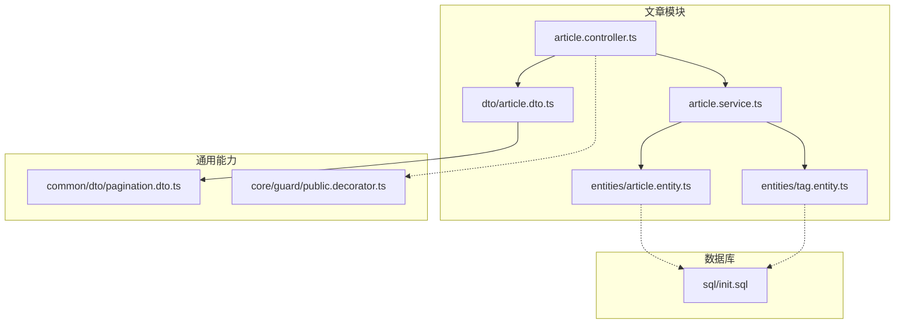
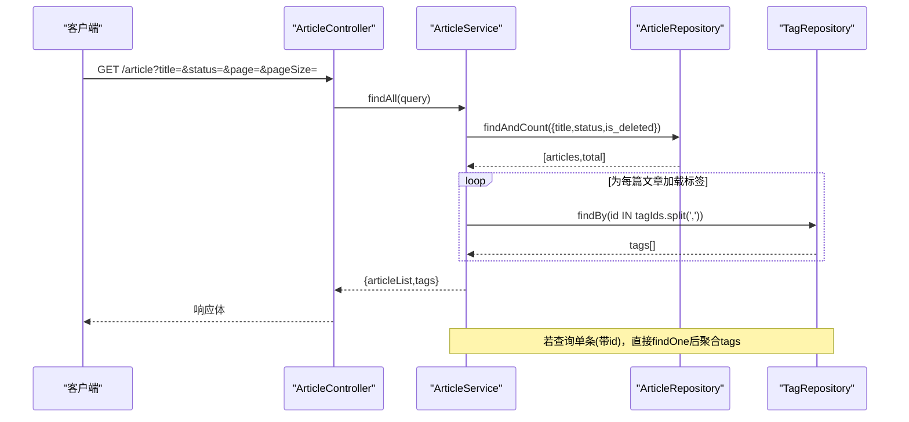
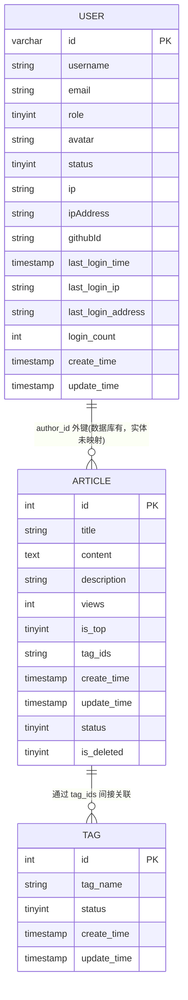
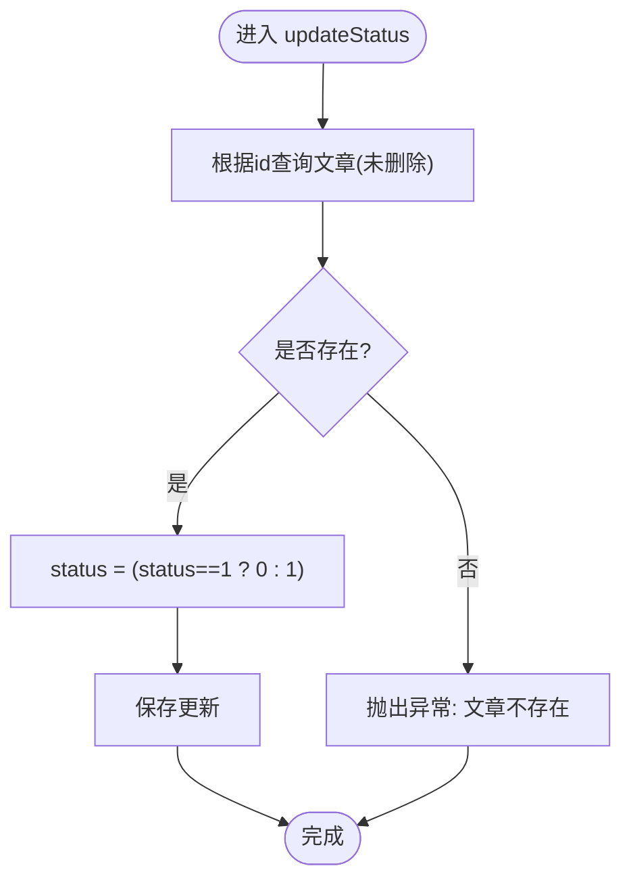
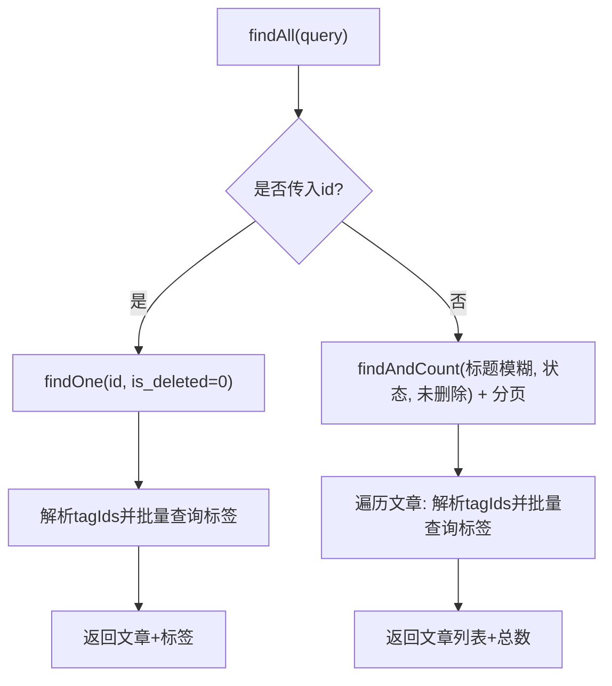
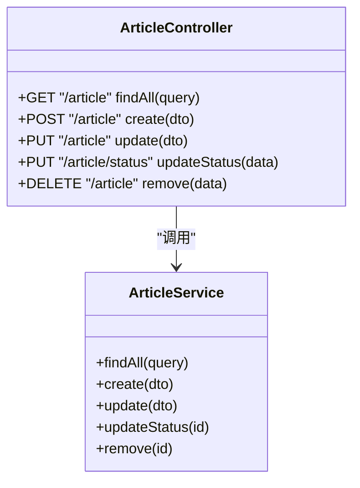
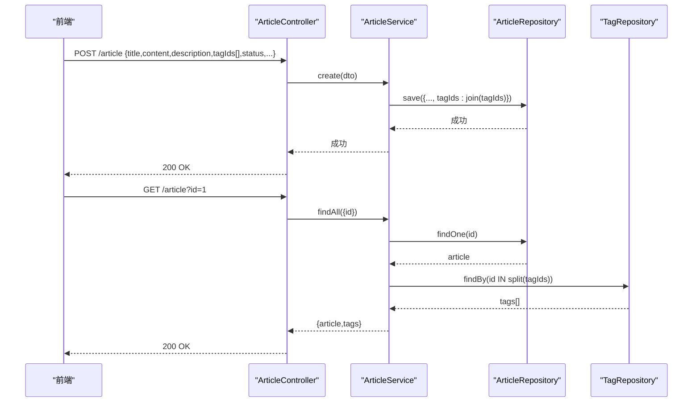
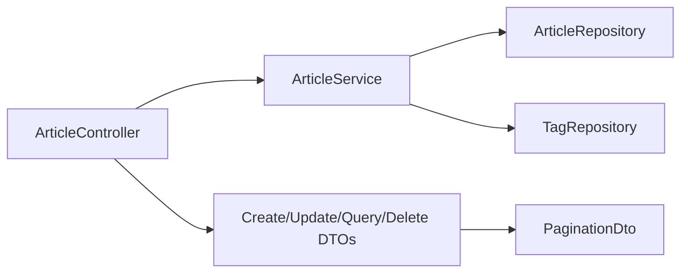

# 文章管理模块

<cite>
**本文引用的文件**
- [article.entity.ts](file://src/api/article/entities/article.entity.ts)
- [tag.entity.ts](file://src/api/article/entities/tag.entity.ts)
- [article.dto.ts](file://src/api/article/dto/article.dto.ts)
- [article.service.ts](file://src/api/article/article.service.ts)
- [article.controller.ts](file://src/api/article/article.controller.ts)
- [user.entity.ts](file://src/api/user/entities/user.entity.ts)
- [init.sql](file://sql/init.sql)
- [pagination.dto.ts](file://src/common/dto/pagination.dto.ts)
- [public.decorator.ts](file://src/core/guard/public.decorator.ts)
</cite>

## 目录
1. [简介](#简介)
2. [项目结构](#项目结构)
3. [核心组件](#核心组件)
4. [架构总览](#架构总览)
5. [详细组件分析](#详细组件分析)
6. [依赖关系分析](#依赖关系分析)
7. [性能考虑](#性能考虑)
8. [故障排查指南](#故障排查指南)
9. [结论](#结论)
10. [附录](#附录)

## 简介
本技术文档聚焦于“文章管理模块”，围绕 Article 与 Tag 实体设计、文章状态管理与软删除机制、文章服务核心业务（CRUD、标签关联、搜索与分页）、控制器 API 设计，以及与用户模块的关联和权限控制进行系统化说明。文档同时提供实体关系图、数据流转图和标签关联模型，并给出批量操作模式与性能优化策略建议，帮助读者快速理解并扩展该模块。

## 项目结构
文章管理模块位于 src/api/article 下，包含实体、DTO、服务与控制器；SQL 初始化脚本在 sql/init.sql；通用分页 DTO 在 common/dto；公共装饰器在 core/guard。

图表来源
- [article.controller.ts:1-52](file://src/api/article/article.controller.ts#L1-L52)
- [article.service.ts:1-104](file://src/api/article/article.service.ts#L1-L104)
- [article.entity.ts:1-44](file://src/api/article/entities/article.entity.ts#L1-L44)
- [tag.entity.ts:1-26](file://src/api/article/entities/tag.entity.ts#L1-L26)
- [article.dto.ts:1-64](file://src/api/article/dto/article.dto.ts#L1-L64)
- [pagination.dto.ts:1-17](file://src/common/dto/pagination.dto.ts#L1-L17)
- [public.decorator.ts:1-5](file://src/core/guard/public.decorator.ts#L1-L5)
- [init.sql:54-108](file://sql/init.sql#L54-L108)

章节来源
- [article.controller.ts:1-52](file://src/api/article/article.controller.ts#L1-L52)
- [article.service.ts:1-104](file://src/api/article/article.service.ts#L1-L104)
- [article.entity.ts:1-44](file://src/api/article/entities/article.entity.ts#L1-L44)
- [tag.entity.ts:1-26](file://src/api/article/entities/tag.entity.ts#L1-L26)
- [article.dto.ts:1-64](file://src/api/article/dto/article.dto.ts#L1-L64)
- [pagination.dto.ts:1-17](file://src/common/dto/pagination.dto.ts#L1-L17)
- [public.decorator.ts:1-5](file://src/core/guard/public.decorator.ts#L1-L5)
- [init.sql:54-108](file://sql/init.sql#L54-L108)

## 核心组件
- 实体层
  - Article：文章主实体，包含标题、内容、描述、浏览量、置顶标记、标签ID集合、创建/更新时间、状态、软删除标记等字段。
  - Tag：标签实体，包含标签名、状态与时间戳。
- 数据传输对象（DTO）
  - CreateArticleDto / UpdateArticleDto：用于创建与更新文章的入参校验。
  - QueryArticleDto：查询条件与分页参数组合，支持按标题模糊匹配、按状态过滤、按ID精确查询。
  - DeleteArticleDto：删除接口入参。
  - PaginationDto：通用分页参数 page/pageSize。
- 服务层
  - ArticleService：封装文章 CRUD、标签关联处理、状态切换、软删除、列表查询与详情聚合标签等业务逻辑。
- 控制器层
  - ArticleController：对外暴露 RESTful 接口，包括创建、更新、删除、状态切换、查询（公开）。

章节来源
- [article.entity.ts:1-44](file://src/api/article/entities/article.entity.ts#L1-L44)
- [tag.entity.ts:1-26](file://src/api/article/entities/tag.entity.ts#L1-L26)
- [article.dto.ts:1-64](file://src/api/article/dto/article.dto.ts#L1-L64)
- [pagination.dto.ts:1-17](file://src/common/dto/pagination.dto.ts#L1-L17)
- [article.service.ts:1-104](file://src/api/article/article.service.ts#L1-L104)
- [article.controller.ts:1-52](file://src/api/article/article.controller.ts#L1-L52)

## 架构总览
文章模块采用典型的 NestJS 分层架构：Controller 接收请求并委托 Service 执行业务，Service 通过 TypeORM Repository 访问数据库实体。标签关联以逗号分隔字符串形式存储在 article.tagIds 中，查询时再反查 tag 表聚合返回。

图表来源
- [article.controller.ts:22-30](file://src/api/article/article.controller.ts#L22-L30)
- [article.service.ts:21-58](file://src/api/article/article.service.ts#L21-L58)
- [article.entity.ts:1-44](file://src/api/article/entities/article.entity.ts#L1-L44)
- [tag.entity.ts:1-26](file://src/api/article/entities/tag.entity.ts#L1-L26)

## 详细组件分析

### 实体设计与多对多关联模型
- Article 实体
  - 关键字段：id、title、content、description、views、isTop、tagIds、createTime、updateTime、status、is_deleted。
  - 标签关联：使用 tagIds 存储多个标签 ID 的字符串（代码中以逗号分隔），并非 TypeORM ManyToMany 关联。
- Tag 实体
  - 关键字段：id、tagName、create_time、update_time、status。
- 数据库层面
  - init.sql 定义 article 表含 tag_ids 字段（注释为 JSON 数组字符串），但代码实现将 tagIds 作为逗号分隔字符串处理，存在不一致风险。
  - 作者关联 author_id 存在于数据库表中，但当前 Article 实体未映射该字段，导致文章与用户模块的关联未在 ORM 层体现。

图表来源
- [article.entity.ts:1-44](file://src/api/article/entities/article.entity.ts#L1-L44)
- [tag.entity.ts:1-26](file://src/api/article/entities/tag.entity.ts#L1-L26)
- [user.entity.ts:1-57](file://src/api/user/entities/user.entity.ts#L1-L57)
- [init.sql:54-108](file://sql/init.sql#L54-L108)

章节来源
- [article.entity.ts:1-44](file://src/api/article/entities/article.entity.ts#L1-L44)
- [tag.entity.ts:1-26](file://src/api/article/entities/tag.entity.ts#L1-L26)
- [user.entity.ts:1-57](file://src/api/user/entities/user.entity.ts#L1-L57)
- [init.sql:54-108](file://sql/init.sql#L54-L108)

### 文章状态管理与软删除
- 状态字段 status
  - 默认值 0，表示草稿；1 表示已发布；2 表示下架（见数据库注释）。
  - 服务层提供状态切换接口，将 1 与 0 之间翻转。
- 软删除 is_deleted
  - 默认 0，删除时将 is_deleted 置为 1，查询时过滤 is_deleted = 0。
- 注意
  - 状态切换仅支持 0/1 翻转，未覆盖 2（下架）场景，如需完整三态需扩展。

图表来源
- [article.service.ts:84-94](file://src/api/article/article.service.ts#L84-L94)

章节来源
- [article.service.ts:84-94](file://src/api/article/article.service.ts#L84-L94)
- [article.entity.ts:38-42](file://src/api/article/entities/article.entity.ts#L38-L42)
- [init.sql:73-76](file://sql/init.sql#L73-L76)

### 文章服务核心业务逻辑
- 创建文章
  - 将 tagIds 数组拼接为逗号分隔字符串后持久化。
- 更新文章
  - 先校验文章存在且未删除，再将 tagIds 拼接并合并更新。
- 删除文章
  - 软删除：将 is_deleted 置为 1，失败则抛错。
- 查询文章
  - 列表：支持按标题模糊匹配、按状态过滤、分页；每条记录聚合其标签。
  - 详情：当传入 id 时，直接查询单条并聚合标签。
- 标签关联
  - 基于 tagIds 字符串拆分后批量查询标签，再回填到结果集。

图表来源
- [article.service.ts:21-58](file://src/api/article/article.service.ts#L21-L58)

章节来源
- [article.service.ts:60-102](file://src/api/article/article.service.ts#L60-L102)
- [article.service.ts:21-58](file://src/api/article/article.service.ts#L21-L58)

### 控制器 API 接口设计
- 公开接口
  - GET /article：查询文章列表或详情（支持分页、标题模糊、状态过滤）。
- 受保护接口
  - POST /article：创建文章。
  - PUT /article：更新文章。
  - PUT /article/status：切换文章状态（草稿/发布）。
  - DELETE /article：软删除文章。
- 认证与授权
  - 查询接口使用 @Public() 装饰器标记为公开；其他接口默认受鉴权守卫保护（由全局守卫与装饰器配合）。

图表来源
- [article.controller.ts:22-51](file://src/api/article/article.controller.ts#L22-L51)
- [article.service.ts:13-103](file://src/api/article/article.service.ts#L13-L103)
- [public.decorator.ts:1-5](file://src/core/guard/public.decorator.ts#L1-L5)

章节来源
- [article.controller.ts:1-52](file://src/api/article/article.controller.ts#L1-L52)
- [public.decorator.ts:1-5](file://src/core/guard/public.decorator.ts#L1-L5)

### 数据流转与标签关联模型
- 写入流程
  - 前端提交 tagIds 数组 -> Controller 校验 -> Service 拼接为逗号分隔字符串 -> 持久化至 article.tagIds。
- 读取流程
  - 查询文章 -> 解析 tagIds -> 批量查询 tag 表 -> 回填 tags 字段。
- 标签模型
  - 当前为“扁平化”的多对多模拟：article.tagIds 存储多个标签 ID，非标准 ManyToMany 关联表。

图表来源
- [article.controller.ts:32-40](file://src/api/article/article.controller.ts#L32-L40)
- [article.service.ts:60-68](file://src/api/article/article.service.ts#L60-L68)
- [article.service.ts:21-34](file://src/api/article/article.service.ts#L21-L34)

章节来源
- [article.service.ts:60-68](file://src/api/article/article.service.ts#L60-L68)
- [article.service.ts:21-34](file://src/api/article/article.service.ts#L21-L34)

### 与用户模块的关联与权限控制
- 关联关系
  - 数据库 article 表包含 author_id 字段，用于关联 user.id；但 Article 实体未映射 author_id，因此 ORM 层尚未建立文章与用户的关联。
- 权限控制
  - 查询接口被标记为 Public，无需鉴权；写操作接口默认受鉴权守卫保护。
  - 建议在后续版本中：
    - 在 Article 实体补充 author_id 字段映射。
    - 在服务层增加作者校验（如对比当前登录用户与 author_id）。
    - 结合用户角色（role）实现更细粒度的权限控制（例如管理员可强制下架）。

章节来源
- [user.entity.ts:1-57](file://src/api/user/entities/user.entity.ts#L1-L57)
- [init.sql:71-72](file://sql/init.sql#L71-L72)
- [article.controller.ts:26-30](file://src/api/article/article.controller.ts#L26-L30)
- [public.decorator.ts:1-5](file://src/core/guard/public.decorator.ts#L1-L5)

## 依赖关系分析
- 模块内依赖
  - Controller 依赖 Service 与 DTO。
  - Service 依赖 Article/Tag 实体与 TypeORM Repository。
  - DTO 依赖通用分页 DTO 与校验库。
- 外部依赖
  - TypeORM 负责 ORM 映射与查询构建。
  - class-validator/class-transformer 负责入参校验与类型转换。
  - 全局鉴权装饰器用于控制接口可见性。

图表来源
- [article.controller.ts:1-52](file://src/api/article/article.controller.ts#L1-L52)
- [article.service.ts:1-104](file://src/api/article/article.service.ts#L1-L104)
- [article.dto.ts:1-64](file://src/api/article/dto/article.dto.ts#L1-L64)
- [pagination.dto.ts:1-17](file://src/common/dto/pagination.dto.ts#L1-L17)

章节来源
- [article.controller.ts:1-52](file://src/api/article/article.controller.ts#L1-L52)
- [article.service.ts:1-104](file://src/api/article/article.service.ts#L1-L104)
- [article.dto.ts:1-64](file://src/api/article/dto/article.dto.ts#L1-L64)
- [pagination.dto.ts:1-17](file://src/common/dto/pagination.dto.ts#L1-L17)

## 性能考虑
- 查询 N+1 问题
  - 当前实现会对每条文章单独解析 tagIds 并查询标签，存在 N+1 风险。建议改为一次性收集所有 tagIds 后批量查询，再按文章分组回填。
- 索引优化
  - 数据库脚本已为 status、is_top、create_time、author_id 建索引；建议为 tag_ids 添加全文索引或使用独立标签关联表以提升复杂查询性能。
- 分页与大数据量
  - 使用 skip/take 分页在大偏移量时可能变慢，可考虑游标分页或基于上次最大 ID 的分页。
- 标签存储格式一致性
  - 数据库注释标注 tag_ids 为 JSON 数组字符串，而代码使用逗号分隔字符串，建议统一格式并在应用层与数据库层保持一致，避免解析错误与额外开销。
- 只读字段与缓存
  - 对于高并发读场景，可对热门文章列表或标签字典引入缓存层（如 Redis），降低 DB 压力。

[本节为通用性能建议，不直接分析具体文件]

## 故障排查指南
- 常见错误
  - 文章不存在：更新或删除前未找到有效记录时会抛出异常。
  - 删除失败：软删除影响行数为 0 时抛出异常。
- 定位步骤
  - 检查入参校验：确认 DTO 校验规则是否符合预期（必填、类型、长度等）。
  - 检查状态与软删除：确保查询条件包含 is_deleted=0，避免读到已删除数据。
  - 检查标签关联：确认 tagIds 是否为空或格式不正确，导致标签无法正确聚合。
  - 检查权限：确认非公开接口是否携带有效凭证。

章节来源
- [article.service.ts:70-82](file://src/api/article/article.service.ts#L70-L82)
- [article.service.ts:96-102](file://src/api/article/article.service.ts#L96-L102)
- [article.dto.ts:12-64](file://src/api/article/dto/article.dto.ts#L12-L64)

## 结论
文章管理模块实现了基础的 CRUD、标签关联、状态切换与软删除，并通过 DTO 与装饰器提供了清晰的接口契约与访问控制。当前标签关联采用扁平化存储，虽简单高效，但在复杂查询与一致性方面存在改进空间。建议后续完善文章与用户的 ORM 关联、统一标签存储格式、优化 N+1 查询与分页策略，并增强权限控制与审计能力。

[本节为总结性内容，不直接分析具体文件]

## 附录

### API 参考（摘要）
- GET /article
  - 功能：查询文章列表或详情（公开）
  - 查询参数：page、pageSize、status、title、id
- POST /article
  - 功能：创建文章
  - 请求体：CreateArticleDto
- PUT /article
  - 功能：更新文章
  - 请求体：UpdateArticleDto
- PUT /article/status
  - 功能：切换文章状态（草稿/发布）
  - 请求体：DeleteArticleDto（仅含 id）
- DELETE /article
  - 功能：软删除文章
  - 请求体：DeleteArticleDto（仅含 id）

章节来源
- [article.controller.ts:22-51](file://src/api/article/article.controller.ts#L22-L51)
- [article.dto.ts:12-64](file://src/api/article/dto/article.dto.ts#L12-L64)

### 批量操作模式（建议）
- 批量创建
  - 使用事务包裹多条插入，减少往返次数。
- 批量更新
  - 使用批量更新语句或分批次更新，避免长事务锁表。
- 批量删除
  - 软删除批量更新 is_deleted，注意幂等性与回滚策略。
- 批量标签关联
  - 收集所有 tagIds，去重后一次性查询标签，再按文章回填，避免 N+1。

[本节为通用实践建议，不直接分析具体文件]