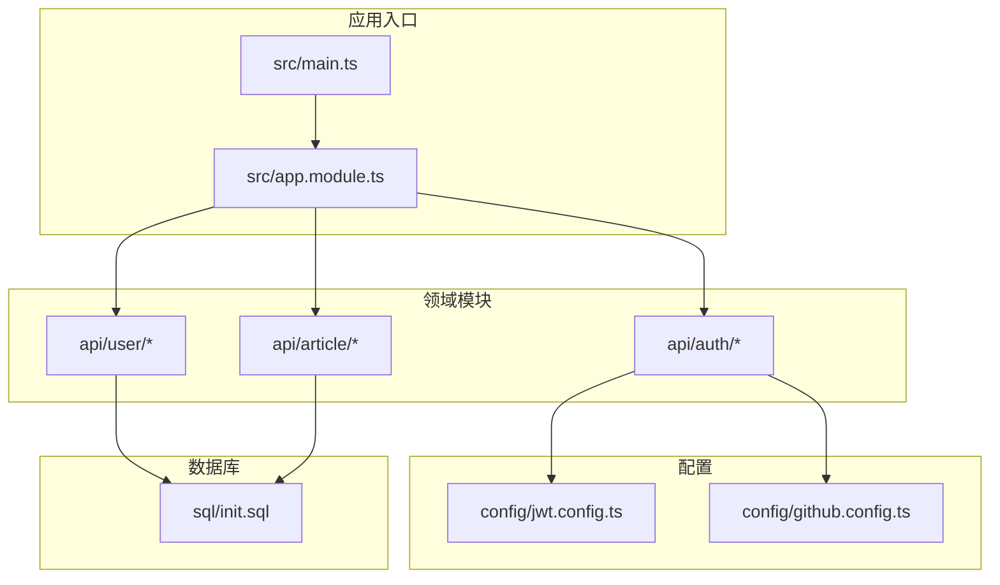
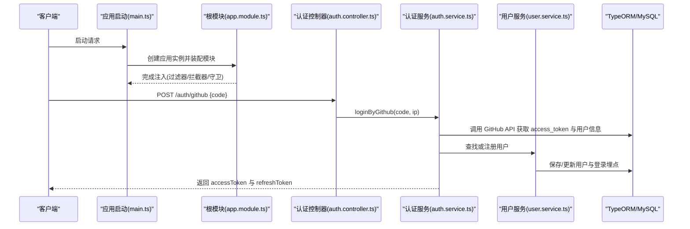
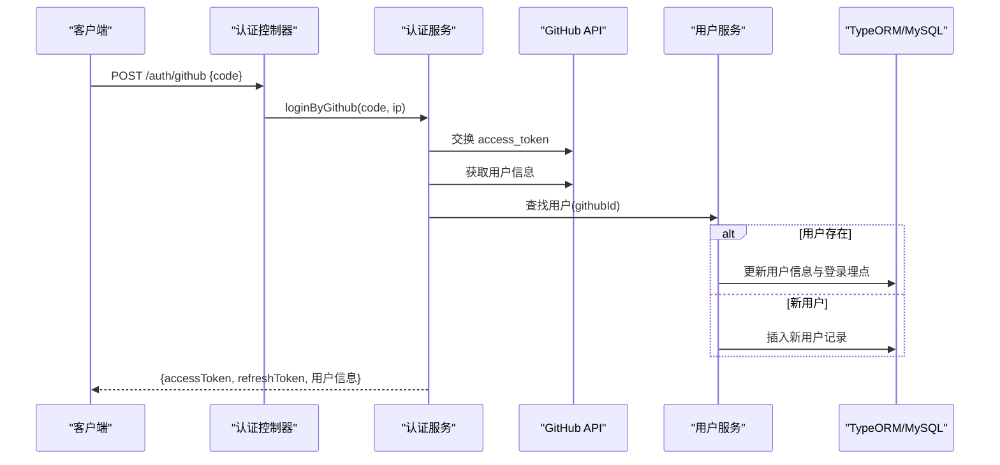
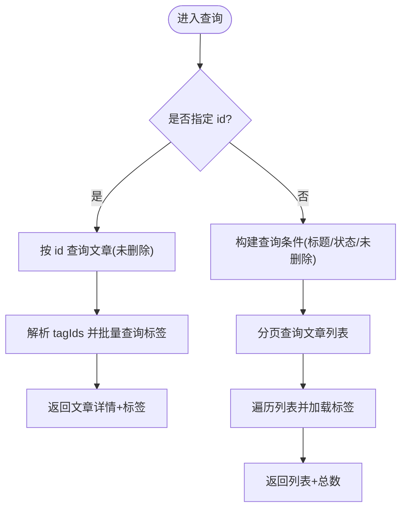
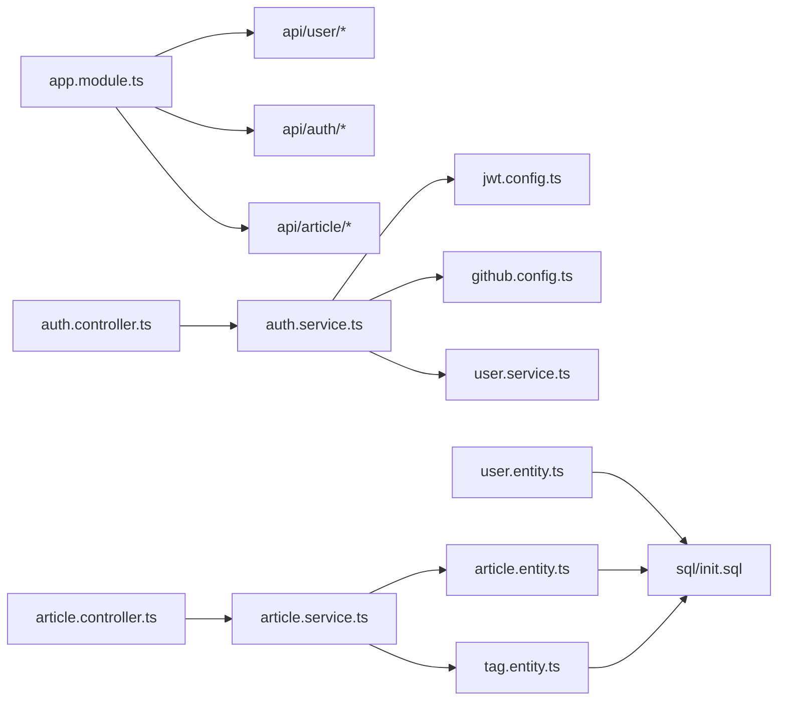
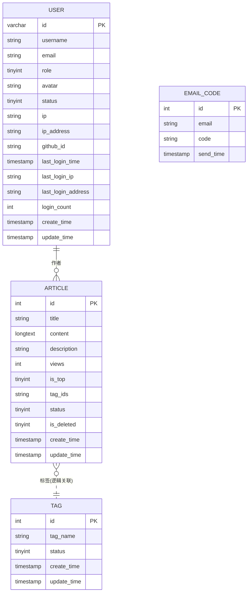

# 核心模块

<cite>
**本文引用的文件**   
- [README.md](file://README.md)
- [main.ts](file://src/main.ts)
- [app.module.ts](file://src/app.module.ts)
- [init.sql](file://sql/init.sql)
- [user.entity.ts](file://src/api/user/entities/user.entity.ts)
- [article.entity.ts](file://src/api/article/entities/article.entity.ts)
- [tag.entity.ts](file://src/api/article/entities/tag.entity.ts)
- [email-code.entity.ts](file://src/api/auth/entities/email-code.entity.ts)
- [user.controller.ts](file://src/api/user/user.controller.ts)
- [user.service.ts](file://src/api/user/user.service.ts)
- [article.controller.ts](file://src/api/article/article.controller.ts)
- [article.service.ts](file://src/api/article/article.service.ts)
- [auth.controller.ts](file://src/api/auth/auth.controller.ts)
- [auth.service.ts](file://src/api/auth/auth.service.ts)
- [jwt.config.ts](file://src/config/jwt.config.ts)
- [github.config.ts](file://src/config/github.config.ts)
</cite>

## 目录
1. [简介](#简介)
2. [项目结构](#项目结构)
3. [核心组件](#核心组件)
4. [架构总览](#架构总览)
5. [详细组件分析](#详细组件分析)
6. [依赖关系分析](#依赖关系分析)
7. [性能考虑](#性能考虑)
8. [故障排查指南](#故障排查指南)
9. [结论](#结论)
10. [附录](#附录)

## 简介
本技术文档围绕博客系统的三大核心业务模块进行系统化说明：用户管理、认证授权与文章管理。重点覆盖以下方面：
- 用户实体设计与 OAuth 登录集成（GitHub）
- JWT 双令牌机制、第三方登录流程与权限控制策略
- 文章 CRUD、标签关联与内容状态管理
- 每个模块的实体关系图、API 接口规范、业务流程图与错误处理策略
- 模块间依赖关系与数据交互方式
- 性能优化建议与最佳实践

## 项目结构
系统采用 NestJS 模块化组织，按领域划分 api 子模块，并通过 app.module 统一装配全局过滤器、拦截器与守卫；数据库通过 TypeORM 连接 MySQL，SQL 初始化脚本定义用户、文章、标签与邮箱验证码表结构。



图表来源
- [main.ts:1-46](file://src/main.ts#L1-L46)
- [app.module.ts:1-35](file://src/app.module.ts#L1-L35)
- [jwt.config.ts:1-5](file://src/config/jwt.config.ts#L1-L5)
- [github.config.ts:1-6](file://src/config/github.config.ts#L1-L6)
- [init.sql:1-138](file://sql/init.sql#L1-L138)

章节来源
- [main.ts:1-46](file://src/main.ts#L1-L46)
- [app.module.ts:1-35](file://src/app.module.ts#L1-L35)
- [init.sql:1-138](file://sql/init.sql#L1-L138)

## 核心组件
- 用户管理模块：提供用户查询、更新与 GitHub 登录后的信息同步与埋点更新能力。
- 认证授权模块：实现 GitHub OAuth 登录、JWT 双令牌签发与刷新、以及基于装饰器的公开接口豁免。
- 文章管理模块：提供文章的创建、更新、删除、状态切换与分页查询，并支持标签关联。

章节来源
- [user.controller.ts:1-28](file://src/api/user/user.controller.ts#L1-L28)
- [user.service.ts:1-66](file://src/api/user/user.service.ts#L1-L66)
- [auth.controller.ts:1-29](file://src/api/auth/auth.controller.ts#L1-L29)
- [auth.service.ts:1-123](file://src/api/auth/auth.service.ts#L1-L123)
- [article.controller.ts:1-52](file://src/api/article/article.controller.ts#L1-L52)
- [article.service.ts:1-104](file://src/api/article/article.service.ts#L1-L104)

## 架构总览
整体架构遵循“控制器 -> 服务 -> 仓储”的分层模式，结合全局异常过滤、参数校验管道、Swagger 文档与 Express Session 中间件。



图表来源
- [main.ts:1-46](file://src/main.ts#L1-L46)
- [app.module.ts:1-35](file://src/app.module.ts#L1-L35)
- [auth.controller.ts:1-29](file://src/api/auth/auth.controller.ts#L1-L29)
- [auth.service.ts:1-123](file://src/api/auth/auth.service.ts#L1-L123)
- [user.service.ts:1-66](file://src/api/user/user.service.ts#L1-L66)

## 详细组件分析

### 用户管理模块
- 实体设计
  - 用户实体包含基础信息、角色、状态、头像、IP 与登录埋点等字段，主键为字符串类型 ID。
  - 与文章存在逻辑关联（作者），与标签无直接外键约束。
- 关键能力
  - 分页查询用户列表（支持用户名、邮箱模糊匹配）
  - 根据条件查询用户（邮箱、ID、GitHub ID）
  - 更新用户基本信息
  - 更新登录埋点（最后登录时间、IP、地区、累计次数）
- 错误处理
  - 用户不存在时抛出业务异常
- 使用模式
  - 在认证流程中用于新用户注册与老用户信息同步
  - 在需要统计登录行为时调用埋点更新方法

```mermaid
classDiagram
class User {
+string id
+string username
+string email
+number role
+string avatar
+number status
+string ip
+string ipAddress
+string githubId
+Date lastLoginTime
+string lastLoginIp
+string lastLoginAddress
+number loginCount
+Date create_time
+Date update_time
}
class UserService {
+findAll(query) Promise~User[]~
+getUserList(dto) Promise~{userList,total}~
+addUserByGithub(userInfo) Promise~void~
+updateUser(body) Promise~void~
+updateLoginInfo(id,ip,address) Promise~void~
}
class UserController {
+findAll(query)
+update(body)
}
UserController --> UserService : "调用"
UserService --> User : "持久化"
```

图表来源
- [user.entity.ts:1-57](file://src/api/user/entities/user.entity.ts#L1-L57)
- [user.service.ts:1-66](file://src/api/user/user.service.ts#L1-L66)
- [user.controller.ts:1-28](file://src/api/user/user.controller.ts#L1-L28)

#### API 接口规范（用户）
- GET /user
  - 功能：分页查询用户列表
  - 查询参数：page, pageSize, username, email
  - 响应：{ userList, total }
- PUT /user
  - 功能：更新用户信息
  - 请求体：id, username, email, avatar, role, status, ip, ipAddress, githubId, lastLoginTime, lastLoginIp, lastLoginAddress, loginCount
  - 响应：成功/失败（异常由全局过滤器统一处理）

章节来源
- [user.controller.ts:1-28](file://src/api/user/user.controller.ts#L1-L28)
- [user.service.ts:1-66](file://src/api/user/user.service.ts#L1-L66)
- [user.entity.ts:1-57](file://src/api/user/entities/user.entity.ts#L1-L57)

### 认证授权模块
- JWT 双令牌机制
  - 访问令牌（accessToken）：短期有效，用于鉴权
  - 刷新令牌（refreshToken）：长期有效，用于续期
  - 生成方法封装于服务内部，分别使用不同密钥
- GitHub OAuth 第三方登录
  - 通过 code 换取 access_token，再拉取用户信息
  - 若用户已存在则更新基本信息与登录埋点；否则以 nanoid 生成用户 ID 并完成注册
  - 返回 accessToken 与 refreshToken
- 权限控制策略
  - 全局启用认证守卫
  - 通过 @Public() 装饰器将特定接口标记为公开（如文章列表）
  - 刷新令牌接口需携带当前用户上下文（从会话中读取）



图表来源
- [auth.controller.ts:1-29](file://src/api/auth/auth.controller.ts#L1-L29)
- [auth.service.ts:1-123](file://src/api/auth/auth.service.ts#L1-L123)
- [user.service.ts:1-66](file://src/api/user/user.service.ts#L1-L66)
- [jwt.config.ts:1-5](file://src/config/jwt.config.ts#L1-L5)
- [github.config.ts:1-6](file://src/config/github.config.ts#L1-L6)

#### API 接口规范（认证）
- POST /auth/github
  - 功能：GitHub 第三方登录
  - 请求体：{ code }
  - 响应：{ accessToken, refreshToken, username, avatar }
- GET /auth/refresh
  - 功能：刷新令牌
  - 前置条件：会话中包含当前用户上下文
  - 响应：新的 accessToken 与 refreshToken

章节来源
- [auth.controller.ts:1-29](file://src/api/auth/auth.controller.ts#L1-L29)
- [auth.service.ts:1-123](file://src/api/auth/auth.service.ts#L1-L123)
- [jwt.config.ts:1-5](file://src/config/jwt.config.ts#L1-L5)
- [github.config.ts:1-6](file://src/config/github.config.ts#L1-L6)

### 文章管理模块
- 实体设计
  - 文章实体包含标题、正文、摘要、浏览量、置顶标志、标签 ID 集合、状态、软删除标志与时间戳
  - 标签实体独立存储，文章通过 tagIds 字段（逗号分隔的字符串）与标签建立逻辑关联
- 关键能力
  - 创建文章：接收 tagIds 数组，转换为逗号分隔字符串后持久化
  - 更新文章：校验文章存在性后更新内容与标签
  - 删除文章：软删除（设置 is_deleted=1）
  - 状态切换：在草稿与已发布之间切换
  - 查询文章：支持按标题模糊匹配、状态筛选、分页；单条查询时自动加载标签详情
- 错误处理
  - 文章不存在或删除失败时抛出业务异常



图表来源
- [article.service.ts:1-104](file://src/api/article/article.service.ts#L1-L104)
- [article.entity.ts:1-44](file://src/api/article/entities/article.entity.ts#L1-L44)
- [tag.entity.ts:1-26](file://src/api/article/entities/tag.entity.ts#L1-L26)

#### API 接口规范（文章）
- GET /article
  - 功能：分页查询文章列表或按 id 查询详情
  - 查询参数：page, pageSize, title, status, id
  - 响应：{ articleList, total } 或 { ...article, tags }
- POST /article
  - 功能：创建文章
  - 请求体：title, content, description, views, isTop, tagIds[], status
  - 响应：成功/失败
- PUT /article/status
  - 功能：切换文章状态（草稿/已发布）
  - 请求体：{ id }
  - 响应：成功/失败
- PUT /article
  - 功能：更新文章
  - 请求体：id, title, content, description, views, isTop, tagIds[], status
  - 响应：成功/失败
- DELETE /article
  - 功能：软删除文章
  - 请求体：{ id }
  - 响应：成功/失败

章节来源
- [article.controller.ts:1-52](file://src/api/article/article.controller.ts#L1-L52)
- [article.service.ts:1-104](file://src/api/article/article.service.ts#L1-L104)
- [article.entity.ts:1-44](file://src/api/article/entities/article.entity.ts#L1-L44)
- [tag.entity.ts:1-26](file://src/api/article/entities/tag.entity.ts#L1-L26)

## 依赖关系分析
- 模块装配
  - 根模块导入用户、认证、文章三个领域模块，并注册全局异常过滤器、转换拦截器与认证守卫
- 外部依赖
  - TypeORM 连接 MySQL（配置文件位于 mysql.config.ts，未在本文列出）
  - Swagger 用于接口文档生成
  - express-session 用于会话维持（刷新令牌场景）
- 领域内依赖
  - 认证服务依赖用户服务与 JWT 服务
  - 文章服务依赖文章与标签仓储
  - 用户服务依赖用户仓储



图表来源
- [app.module.ts:1-35](file://src/app.module.ts#L1-L35)
- [auth.controller.ts:1-29](file://src/api/auth/auth.controller.ts#L1-L29)
- [auth.service.ts:1-123](file://src/api/auth/auth.service.ts#L1-L123)
- [user.service.ts:1-66](file://src/api/user/user.service.ts#L1-L66)
- [article.controller.ts:1-52](file://src/api/article/article.controller.ts#L1-L52)
- [article.service.ts:1-104](file://src/api/article/article.service.ts#L1-L104)
- [user.entity.ts:1-57](file://src/api/user/entities/user.entity.ts#L1-L57)
- [article.entity.ts:1-44](file://src/api/article/entities/article.entity.ts#L1-L44)
- [tag.entity.ts:1-26](file://src/api/article/entities/tag.entity.ts#L1-L26)
- [init.sql:1-138](file://sql/init.sql#L1-L138)

章节来源
- [app.module.ts:1-35](file://src/app.module.ts#L1-L35)
- [main.ts:1-46](file://src/main.ts#L1-L46)

## 性能考虑
- 查询优化
  - 文章列表查询避免 N+1 问题：对每条文章单独查询标签会引发多次 IO，建议使用批量查询与内存映射合并结果
  - 分页查询应确保 where 条件命中索引（status、create_time 等）
- 标签关联优化
  - 当前 tagIds 使用逗号分隔字符串，建议在入库前做去重与排序，减少冗余
  - 可考虑引入多对多关系表以提升扩展性与查询效率
- 缓存策略
  - 对高频只读数据（如标签列表、热门文章）引入缓存层（Redis）以降低数据库压力
- 并发与事务
  - 用户登录埋点更新属于轻量写操作，注意在高并发下避免重复计数，必要时使用原子递增或分布式锁
- 网络请求
  - 第三方 API 调用（GitHub）增加超时与重试策略，提升稳定性

[本节为通用指导，不直接分析具体文件]

## 故障排查指南
- 常见异常
  - 用户不存在：更新或埋点更新时若找不到用户，会抛出业务异常
  - 文章不存在：更新或删除文章时若未找到对应记录，会抛出业务异常
  - 删除失败：软删除影响行数为 0 时抛出异常
- 定位步骤
  - 检查请求参数是否符合 DTO 校验规则（全局 ValidationPipe）
  - 查看全局异常过滤器输出，确认错误码与消息
  - 核对数据库中是否存在对应记录（is_deleted 状态）
  - 对于第三方登录失败，检查 GitHub 回调 code 有效性与服务端日志

章节来源
- [user.service.ts:39-66](file://src/api/user/user.service.ts#L39-L66)
- [article.service.ts:70-104](file://src/api/article/article.service.ts#L70-L104)

## 结论
本系统围绕用户、认证与文章三大核心模块构建了清晰的分层架构与稳定的数据模型。通过 JWT 双令牌与 GitHub OAuth 实现了安全的第三方登录体验；文章模块提供了完整的 CRUD 与状态管理能力，并以标签关联增强内容组织。后续可在标签关系建模、查询性能与缓存策略上进一步优化，以提升可扩展性与运行效率。

[本节为总结性内容，不直接分析具体文件]

## 附录
- 实体关系图（ERD）



图表来源
- [init.sql:1-138](file://sql/init.sql#L1-L138)
- [user.entity.ts:1-57](file://src/api/user/entities/user.entity.ts#L1-L57)
- [article.entity.ts:1-44](file://src/api/article/entities/article.entity.ts#L1-L44)
- [tag.entity.ts:1-26](file://src/api/article/entities/tag.entity.ts#L1-L26)
- [email-code.entity.ts:1-22](file://src/api/auth/entities/email-code.entity.ts#L1-L22)