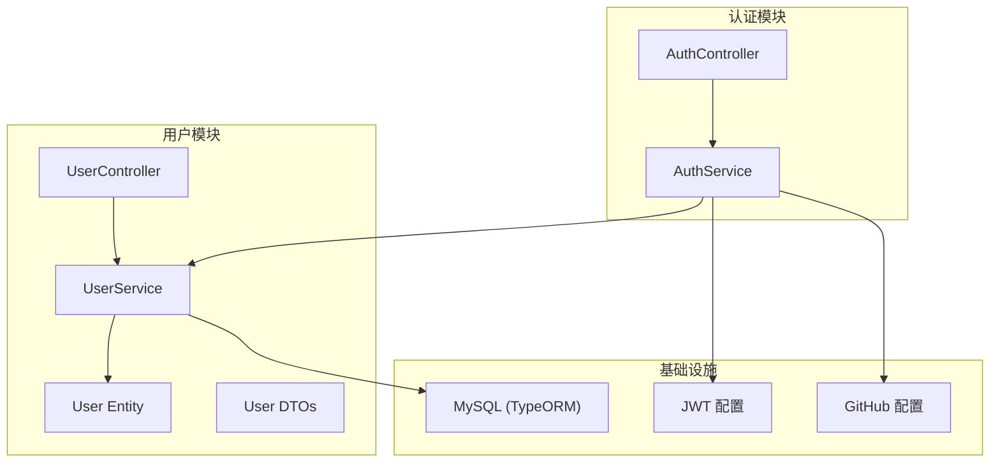
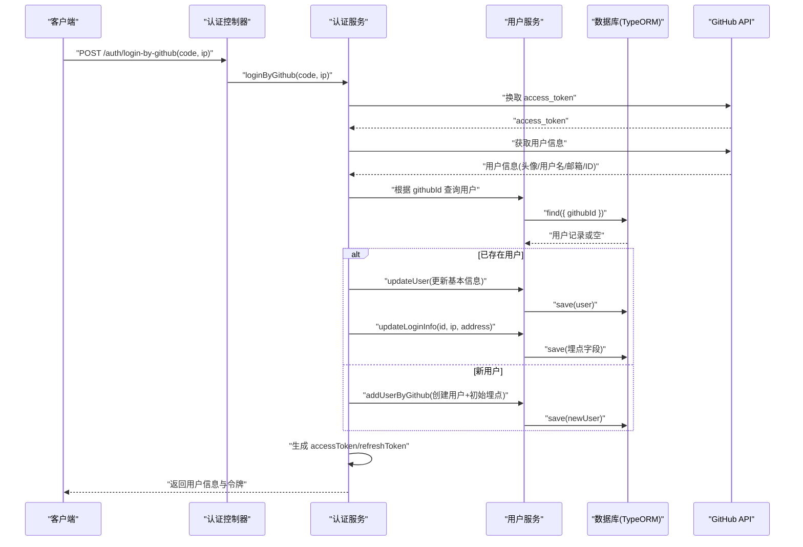
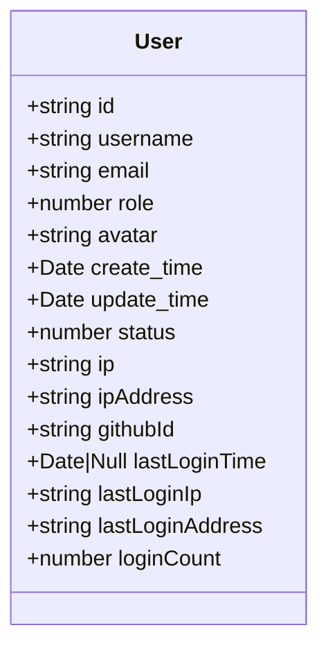
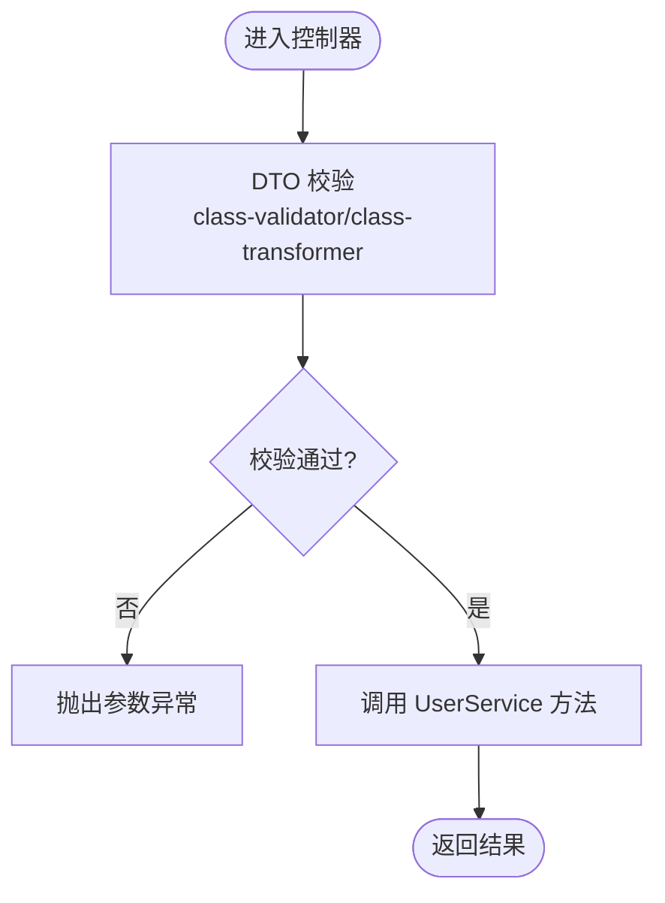
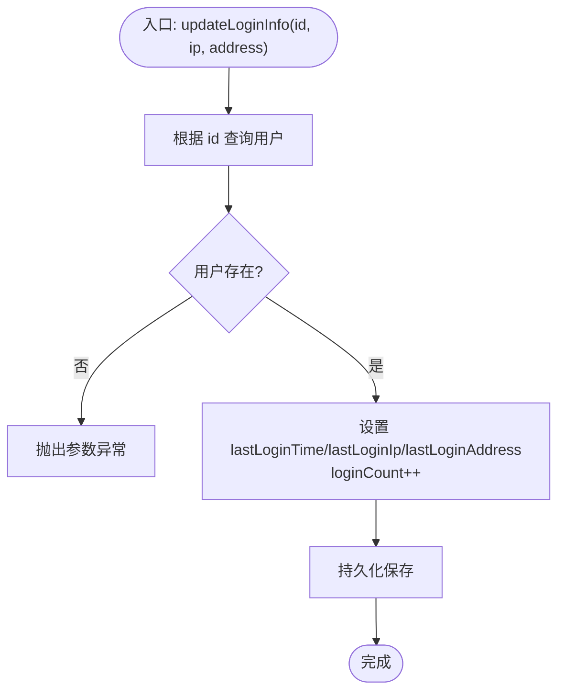
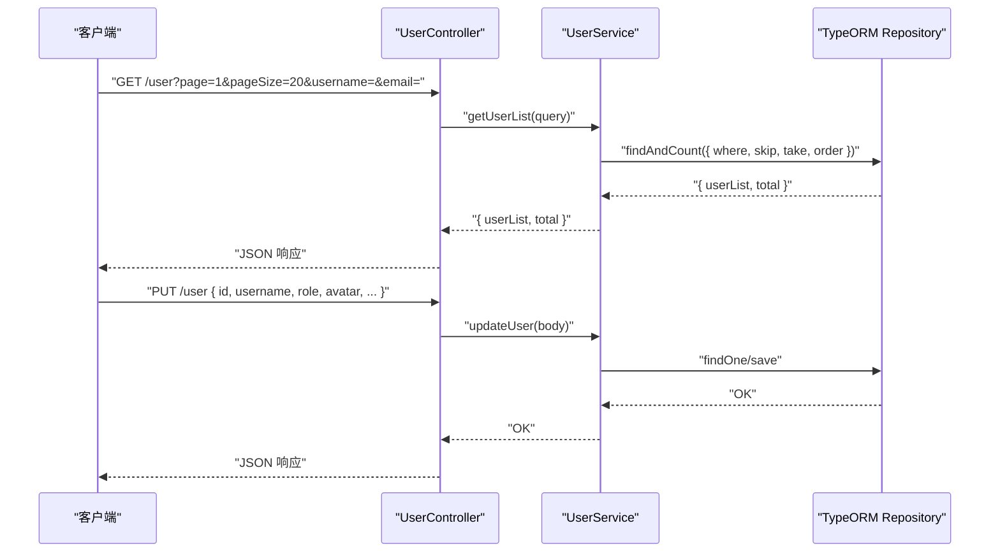
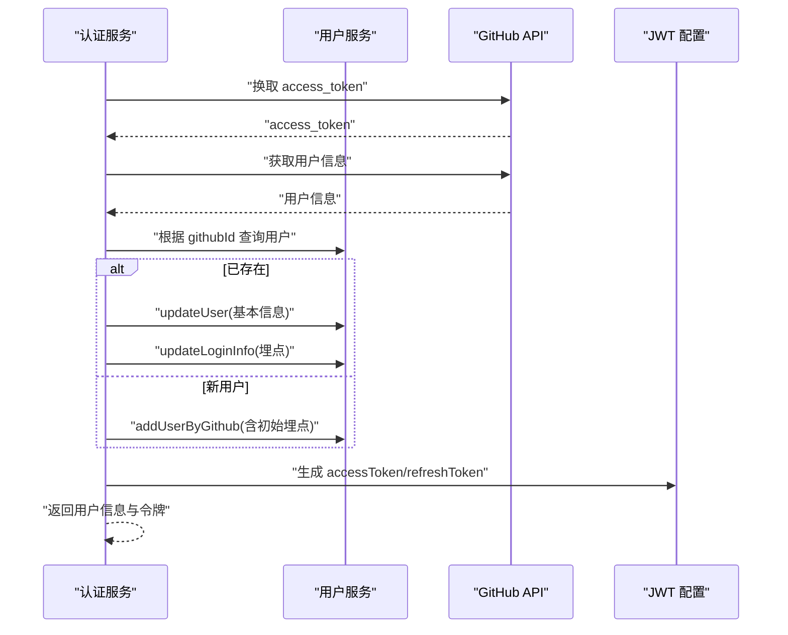
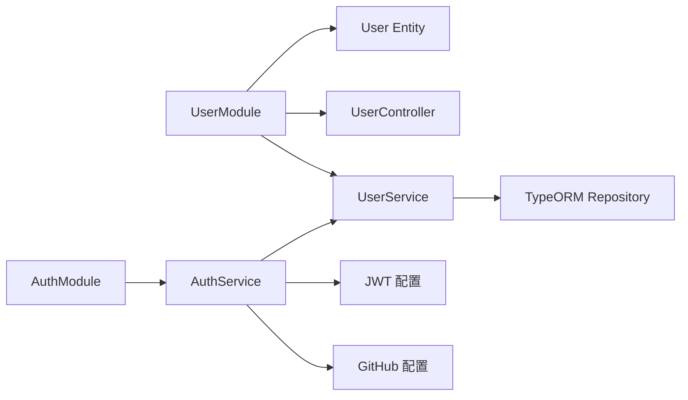
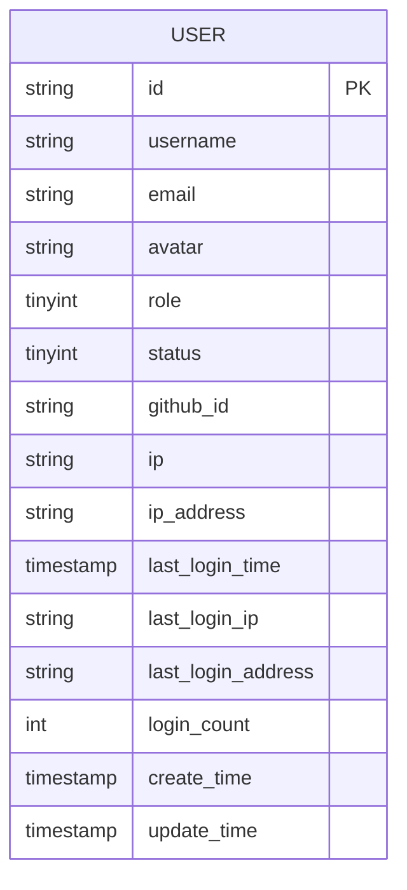

# 用户管理模块

<cite>
**本文引用的文件**   
- [user.entity.ts](file://src/api/user/entities/user.entity.ts)
- [user.dto.ts](file://src/api/user/dto/user.dto.ts)
- [user.service.ts](file://src/api/user/user.service.ts)
- [user.controller.ts](file://src/api/user/user.controller.ts)
- [auth.service.ts](file://src/api/auth/auth.service.ts)
- [pagination.dto.ts](file://src/common/dto/pagination.dto.ts)
- [init.sql](file://sql/init.sql)
- [jwt.config.ts](file://src/config/jwt.config.ts)
- [github.config.ts](file://src/config/github.config.ts)
</cite>

## 目录
1. [简介](#简介)
2. [项目结构](#项目结构)
3. [核心组件](#核心组件)
4. [架构总览](#架构总览)
5. [详细组件分析](#详细组件分析)
6. [依赖关系分析](#依赖关系分析)
7. [性能考虑](#性能考虑)
8. [故障排查指南](#故障排查指南)
9. [结论](#结论)
10. [附录](#附录)

## 简介
本技术文档聚焦于“用户管理模块”，围绕 User 实体字段设计、权限与状态、登录埋点、用户服务业务逻辑（查询、更新、分页）、控制器 API 设计，以及与认证模块的集成方式展开。文档同时提供实体关系图、数据流图、错误处理策略与性能优化建议，帮助读者快速理解并高效使用该模块。

## 项目结构
用户管理模块位于 src/api/user 下，包含实体、DTO、服务与控制器；认证模块位于 src/api/auth，负责第三方登录流程并与用户服务协作；通用分页 DTO 位于 common/dto；数据库初始化脚本位于 sql/init.sql。

图表来源
- [user.controller.ts:1-28](file://src/api/user/user.controller.ts#L1-L28)
- [user.service.ts:1-66](file://src/api/user/user.service.ts#L1-L66)
- [user.entity.ts:1-57](file://src/api/user/entities/user.entity.ts#L1-L57)
- [auth.service.ts:1-123](file://src/api/auth/auth.service.ts#L1-L123)
- [jwt.config.ts:1-5](file://src/config/jwt.config.ts#L1-L5)
- [github.config.ts:1-6](file://src/config/github.config.ts#L1-L6)

章节来源
- [user.controller.ts:1-28](file://src/api/user/user.controller.ts#L1-L28)
- [user.service.ts:1-66](file://src/api/user/user.service.ts#L1-L66)
- [user.entity.ts:1-57](file://src/api/user/entities/user.entity.ts#L1-L57)
- [auth.service.ts:1-123](file://src/api/auth/auth.service.ts#L1-L123)
- [pagination.dto.ts:1-17](file://src/common/dto/pagination.dto.ts#L1-L17)
- [init.sql:1-138](file://sql/init.sql#L1-L138)

## 核心组件
- 用户实体：定义用户基本信息、权限、状态、IP 与登录埋点等字段映射到数据库表。
- 用户 DTO：封装请求参数校验与分页参数默认值。
- 用户服务：实现用户查询、列表分页、新增（第三方登录场景）与更新，以及登录埋点更新。
- 用户控制器：暴露 GET/PUT 接口，接收查询与更新参数，调用服务层完成业务。
- 认证服务：第三方登录流程中调用用户服务进行用户查找/注册、信息更新与登录埋点写入，并签发令牌。

章节来源
- [user.entity.ts:1-57](file://src/api/user/entities/user.entity.ts#L1-L57)
- [user.dto.ts:1-75](file://src/api/user/dto/user.dto.ts#L1-L75)
- [user.service.ts:1-66](file://src/api/user/user.service.ts#L1-L66)
- [user.controller.ts:1-28](file://src/api/user/user.controller.ts#L1-L28)
- [auth.service.ts:1-123](file://src/api/auth/auth.service.ts#L1-L123)

## 架构总览
下图展示用户管理与认证模块之间的交互，包括第三方登录时用户信息的获取、落库与埋点更新，以及令牌签发过程。

图表来源
- [auth.service.ts:23-109](file://src/api/auth/auth.service.ts#L23-L109)
- [user.service.ts:34-64](file://src/api/user/user.service.ts#L34-L64)
- [user.entity.ts:1-57](file://src/api/user/entities/user.entity.ts#L1-L57)
- [init.sql:24-52](file://sql/init.sql#L24-L52)

## 详细组件分析

### 用户实体设计与字段说明
- 基本信息
  - id：主键，字符串类型，由外部生成（nanoid）。
  - username：用户名。
  - email：邮箱，默认占位符。
  - avatar：头像 URL。
- 权限与状态
  - role：角色标识（如普通用户/管理员），数值型。
  - status：账号状态（正常/禁用），数值型。
- IP 与第三方关联
  - ip/ipAddress：最近登录 IP 与地区。
  - githubId：第三方平台唯一 ID，用于 OAuth 关联。
- 登录埋点
  - lastLoginTime：最后登录时间。
  - lastLoginIp：最后登录 IP。
  - lastLoginAddress：最后登录地区。
  - loginCount：累计登录次数。
- 审计字段
  - create_time/update_time：自动维护的时间戳。

图表来源
- [user.entity.ts:1-57](file://src/api/user/entities/user.entity.ts#L1-L57)
- [init.sql:24-52](file://sql/init.sql#L24-L52)

章节来源
- [user.entity.ts:1-57](file://src/api/user/entities/user.entity.ts#L1-L57)
- [init.sql:24-52](file://sql/init.sql#L24-L52)

### 用户 DTO 与参数校验
- 基础邮箱 DTO：校验邮箱格式与长度。
- 新增用户 DTO：继承邮箱校验，增加用户名、头像、githubId 校验。
- 查询用户 DTO：继承分页 DTO，支持按用户名/邮箱模糊查询。
- 更新用户 DTO：包含 id、username、role、avatar、ip/ipAddress、githubId 等字段校验。
- 分页 DTO：page/pageSize 默认值与最小值约束，类型转换。

图表来源
- [user.dto.ts:1-75](file://src/api/user/dto/user.dto.ts#L1-L75)
- [pagination.dto.ts:1-17](file://src/common/dto/pagination.dto.ts#L1-L17)

章节来源
- [user.dto.ts:1-75](file://src/api/user/dto/user.dto.ts#L1-L75)
- [pagination.dto.ts:1-17](file://src/common/dto/pagination.dto.ts#L1-L17)

### 用户服务业务逻辑
- 多条件查询：支持按 email/id/githubId 精确查询。
- 分页列表：支持按用户名/邮箱模糊匹配，按创建时间升序排序，返回用户列表与总数。
- 新增用户：主要用于第三方登录首次注册，直接保存传入的用户信息。
- 更新用户：先校验用户是否存在，再合并更新字段并持久化。
- 登录埋点更新：更新最后登录时间/IP/地区，并自增登录次数。

图表来源
- [user.service.ts:53-64](file://src/api/user/user.service.ts#L53-L64)

章节来源
- [user.service.ts:14-64](file://src/api/user/user.service.ts#L14-L64)

### 用户控制器 API 设计
- GET /user
  - 功能：用户列表分页查询
  - 查询参数：page、pageSize、username、email
  - 响应：{ userList, total }
- PUT /user
  - 功能：更新用户信息
  - 请求体：id、username、role、avatar、ip、ipAddress、githubId
  - 响应：无具体负载（成功即完成）

图表来源
- [user.controller.ts:18-26](file://src/api/user/user.controller.ts#L18-L26)
- [user.service.ts:21-48](file://src/api/user/user.service.ts#L21-L48)

章节来源
- [user.controller.ts:14-27](file://src/api/user/user.controller.ts#L14-L27)
- [user.service.ts:21-48](file://src/api/user/user.service.ts#L21-L48)

### 与认证模块的集成
- 第三方登录流程：
  - 使用 code 向 GitHub 换取 access_token，拉取用户信息。
  - 根据 githubId 查询本地用户：
    - 若存在：更新基本信息（头像、用户名、邮箱等），更新登录埋点，签发令牌。
    - 若不存在：以 GitHub 信息创建新用户，初始化登录埋点，签发令牌。
- 令牌签发：
  - 使用 JWT 配置中的密钥分别签发短期访问令牌与长期刷新令牌。

图表来源
- [auth.service.ts:23-109](file://src/api/auth/auth.service.ts#L23-L109)
- [jwt.config.ts:1-5](file://src/config/jwt.config.ts#L1-L5)

章节来源
- [auth.service.ts:18-121](file://src/api/auth/auth.service.ts#L18-L121)
- [jwt.config.ts:1-5](file://src/config/jwt.config.ts#L1-L5)
- [github.config.ts:1-6](file://src/config/github.config.ts#L1-L6)

## 依赖关系分析
- 模块装配
  - 用户模块导入 TypeORM 实体，导出 UserService 供认证模块使用。
- 外部依赖
  - TypeORM：Repository 操作数据库。
  - class-validator/class-transformer：DTO 校验与类型转换。
  - JWT：令牌签发。
  - Axios：HTTP 请求 GitHub API。
  - nanoid：生成短 ID。
- 耦合与内聚
  - 用户服务仅依赖 TypeORM 与 DTO，职责单一。
  - 认证服务依赖用户服务与外部配置，承担跨域集成与编排职责。

图表来源
- [user.module.ts:1-14](file://src/api/user/user.module.ts#L1-L14)
- [auth.service.ts:1-17](file://src/api/auth/auth.service.ts#L1-L17)
- [jwt.config.ts:1-5](file://src/config/jwt.config.ts#L1-L5)
- [github.config.ts:1-6](file://src/config/github.config.ts#L1-L6)

章节来源
- [user.module.ts:1-14](file://src/api/user/user.module.ts#L1-L14)
- [auth.service.ts:1-17](file://src/api/auth/auth.service.ts#L1-L17)

## 性能考虑
- 分页查询
  - 使用 findAndCount 配合 skip/take 控制页大小，避免全量加载。
  - 对常用过滤字段建立索引（见 SQL 脚本中的 idx_email、idx_create_time）。
- 模糊查询
  - 使用 LIKE 前缀通配符会引发全表扫描，建议在大数据量场景下引入全文检索或搜索引擎。
- 更新埋点
  - 登录埋点更新为单条 save 操作，注意在高并发下可考虑批量聚合或异步任务降低热点写压力。
- 连接池与缓存
  - 合理配置 TypeORM 连接池；对频繁读取的用户信息可引入 Redis 缓存，减少数据库压力。
- 网络 I/O
  - 第三方登录涉及两次外部 HTTP 请求，应设置超时与重试策略，必要时做降级处理。

[本节为通用性能建议，不直接分析具体文件]

## 故障排查指南
- 参数校验失败
  - 现象：请求被拒绝，提示参数不合法。
  - 定位：检查 DTO 校验规则与传参类型（class-validator/class-transformer）。
- 用户不存在
  - 现象：更新或更新埋点时报错。
  - 定位：确认 id 是否正确，数据库中是否存在该用户。
- 第三方登录失败
  - 现象：无法获取 access_token 或用户信息。
  - 定位：检查 GitHub 配置（client_id/client_secret）、网络连通性与回调地址。
- 令牌问题
  - 现象：鉴权失败或过期。
  - 定位：检查 JWT 配置与有效期设置，确保服务端时钟同步。

章节来源
- [user.service.ts:39-64](file://src/api/user/user.service.ts#L39-L64)
- [auth.service.ts:23-109](file://src/api/auth/auth.service.ts#L23-L109)
- [jwt.config.ts:1-5](file://src/config/jwt.config.ts#L1-L5)

## 结论
用户管理模块以清晰的实体与 DTO 设计为基础，结合 TypeORM 与 NestJS 的分层架构，实现了用户信息查询、更新与分页能力，并通过认证模块完成第三方登录全流程。登录埋点字段为后续运营分析与风控提供了数据支撑。在生产环境中，建议关注索引优化、缓存策略与外部依赖稳定性，以提升整体性能与可用性。

[本节为总结性内容，不直接分析具体文件]

## 附录

### 数据库表结构与索引
- 用户表关键字段与索引
  - 主键：id
  - 唯一索引：github_id
  - 普通索引：email、create_time
  - 其他：status、role、ip/ip_address、last_login_*、login_count

图表来源
- [init.sql:24-52](file://sql/init.sql#L24-L52)

章节来源
- [init.sql:24-52](file://sql/init.sql#L24-L52)