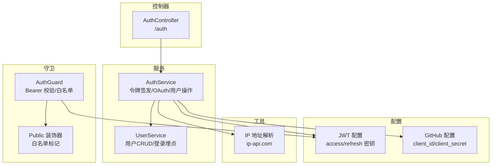
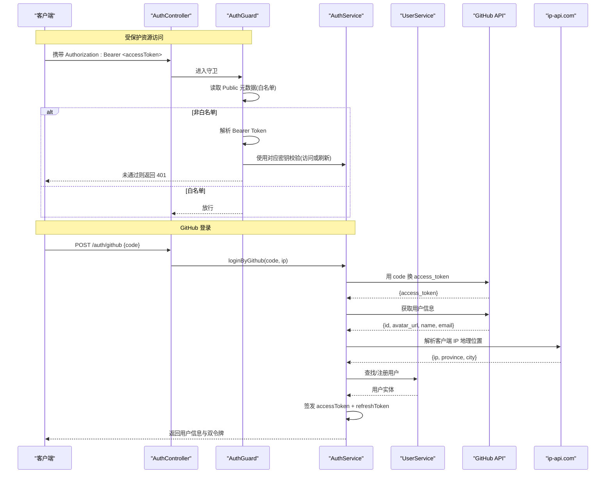
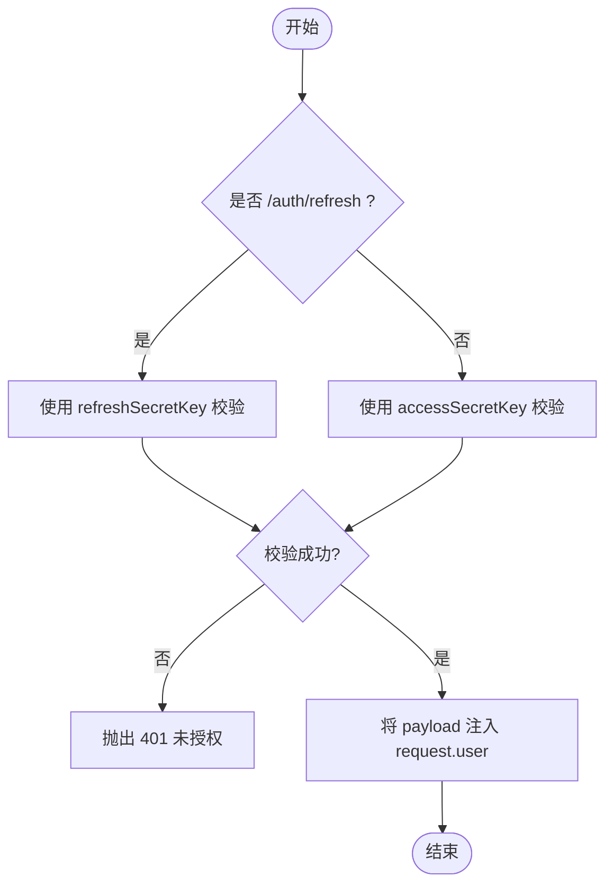
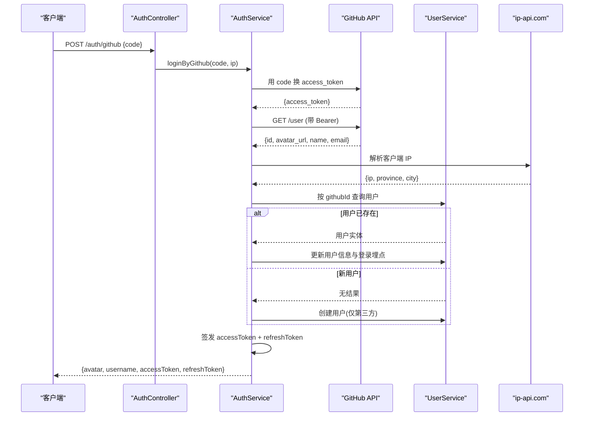
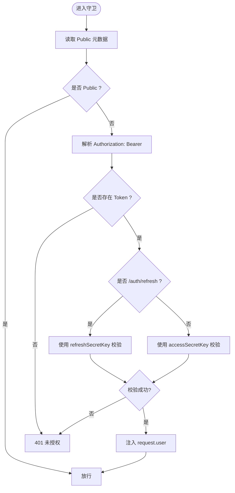
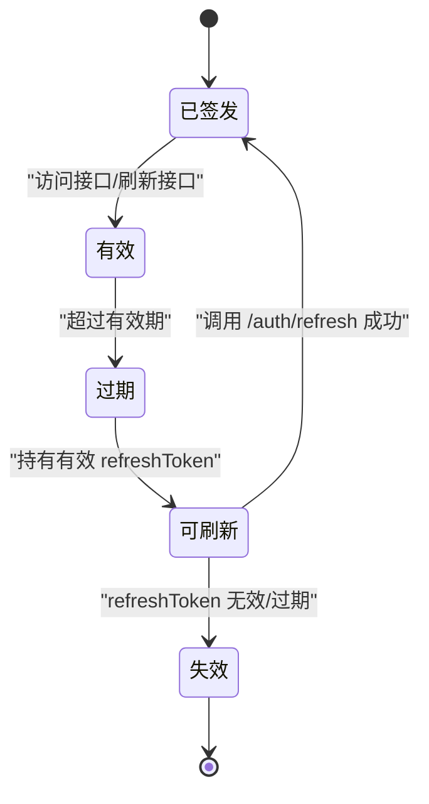
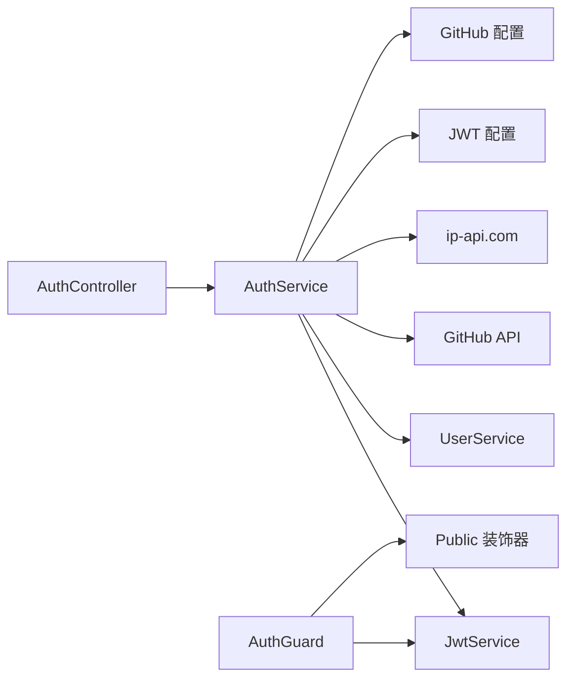

# 认证授权模块

<cite>
**本文引用的文件列表**
- [auth.controller.ts](file://src/api/auth/auth.controller.ts)
- [auth.service.ts](file://src/api/auth/auth.service.ts)
- [auth.guard.ts](file://src/core/guard/auth.guard.ts)
- [public.decorator.ts](file://src/core/guard/public.decorator.ts)
- [jwt.config.ts](file://src/config/jwt.config.ts)
- [github.config.ts](file://src/config/github.config.ts)
- [user.service.ts](file://src/api/user/user.service.ts)
- [ip-address.ts](file://src/utils/ip-address.ts)
</cite>

## 目录
1. [简介](#简介)
2. [项目结构](#项目结构)
3. [核心组件](#核心组件)
4. [架构总览](#架构总览)
5. [详细组件分析](#详细组件分析)
6. [依赖关系分析](#依赖关系分析)
7. [性能与安全考量](#性能与安全考量)
8. [故障排查指南](#故障排查指南)
9. [结论](#结论)
10. [附录：API 与配置参考](#附录api-与配置参考)

## 简介
本技术文档聚焦于认证授权模块，围绕以下目标展开：
- JWT 双令牌机制：访问令牌（access token）与刷新令牌（refresh token）的生成、验证与刷新流程。
- GitHub OAuth 第三方登录：从授权码到用户信息同步的全链路说明。
- AuthGuard 全局认证守卫：令牌解析、权限白名单路由处理。
- JWT 与 GitHub OAuth 的配置项说明。
- 提供流程图、生命周期图与错误处理策略，并给出 API 调用示例、安全最佳实践与常见问题解决方案。

## 项目结构
认证相关代码主要分布在以下位置：
- 控制器层：处理 HTTP 请求与响应
- 服务层：业务逻辑（OAuth 交互、令牌签发、用户数据操作）
- 守卫层：统一鉴权拦截
- 配置层：JWT 密钥与 GitHub OAuth 客户端配置
- 工具层：IP 地址解析

图表来源
- [auth.controller.ts:1-29](file://src/api/auth/auth.controller.ts#L1-L29)
- [auth.service.ts:1-123](file://src/api/auth/auth.service.ts#L1-L123)
- [auth.guard.ts:1-53](file://src/core/guard/auth.guard.ts#L1-L53)
- [public.decorator.ts:1-5](file://src/core/guard/public.decorator.ts#L1-L5)
- [jwt.config.ts:1-5](file://src/config/jwt.config.ts#L1-L5)
- [github.config.ts:1-6](file://src/config/github.config.ts#L1-L6)
- [user.service.ts:1-66](file://src/api/user/user.service.ts#L1-L66)
- [ip-address.ts:1-39](file://src/utils/ip-address.ts#L1-L39)

章节来源
- [auth.controller.ts:1-29](file://src/api/auth/auth.controller.ts#L1-L29)
- [auth.service.ts:1-123](file://src/api/auth/auth.service.ts#L1-L123)
- [auth.guard.ts:1-53](file://src/core/guard/auth.guard.ts#L1-L53)
- [public.decorator.ts:1-5](file://src/core/guard/public.decorator.ts#L1-L5)
- [jwt.config.ts:1-5](file://src/config/jwt.config.ts#L1-L5)
- [github.config.ts:1-6](file://src/config/github.config.ts#L1-L6)
- [user.service.ts:1-66](file://src/api/user/user.service.ts#L1-L66)
- [ip-address.ts:1-39](file://src/utils/ip-address.ts#L1-L39)

## 核心组件
- AuthController：暴露 /auth/refresh 与 /auth/github 两个端点，分别用于刷新令牌与 GitHub 第三方登录。
- AuthService：封装令牌签发、GitHub OAuth 授权码换取 access_token、拉取用户信息、本地用户注册/更新、以及登录埋点记录。
- AuthGuard：全局鉴权守卫，基于 Bearer Token 校验；支持 Public 装饰器的白名单跳过；对 /auth/refresh 使用 refreshSecretKey 校验。
- JWT 配置：提供 accessSecretKey 与 refreshSecretKey 两套密钥，分别用于签发和校验两类令牌。
- GitHub 配置：提供 client_id 与 client_secret，用于向 GitHub 交换 access_token。
- UserService：负责用户数据的查询、新增（仅第三方登录）、更新与登录埋点字段维护。
- IP 地址解析：通过 ip-api.com 将客户端 IP 解析为地区信息，用于登录埋点。

章节来源
- [auth.controller.ts:1-29](file://src/api/auth/auth.controller.ts#L1-L29)
- [auth.service.ts:1-123](file://src/api/auth/auth.service.ts#L1-L123)
- [auth.guard.ts:1-53](file://src/core/guard/auth.guard.ts#L1-L53)
- [jwt.config.ts:1-5](file://src/config/jwt.config.ts#L1-L5)
- [github.config.ts:1-6](file://src/config/github.config.ts#L1-L6)
- [user.service.ts:1-66](file://src/api/user/user.service.ts#L1-L66)
- [ip-address.ts:1-39](file://src/utils/ip-address.ts#L1-L39)

## 架构总览
下图展示了认证授权的整体交互：客户端通过控制器发起请求，守卫进行鉴权，服务层完成 OAuth 与令牌签发，必要时访问数据库与外部 IP 解析服务。

图表来源
- [auth.controller.ts:1-29](file://src/api/auth/auth.controller.ts#L1-L29)
- [auth.service.ts:1-123](file://src/api/auth/auth.service.ts#L1-L123)
- [auth.guard.ts:1-53](file://src/core/guard/auth.guard.ts#L1-L53)
- [public.decorator.ts:1-5](file://src/core/guard/public.decorator.ts#L1-L5)
- [user.service.ts:1-66](file://src/api/user/user.service.ts#L1-L66)
- [ip-address.ts:1-39](file://src/utils/ip-address.ts#L1-L39)

## 详细组件分析

### JWT 双令牌机制
- 令牌生成
  - 访问令牌：短时效（例如 1 小时），使用 accessSecretKey 签名，payload 包含用户标识与用户名等最小必要信息。
  - 刷新令牌：长时效（例如 1 天），使用 refreshSecretKey 签名，payload 结构与访问令牌一致。
- 令牌校验
  - 普通接口：从请求头 Authorization: Bearer 中解析 token，使用 accessSecretKey 校验。
  - 刷新接口：/auth/refresh 特殊处理，使用 refreshSecretKey 校验。
- 令牌刷新
  - 客户端在访问令牌过期后，使用有效的刷新令牌调用 /auth/refresh，服务端校验通过后签发新的双令牌。

图表来源
- [auth.guard.ts:1-53](file://src/core/guard/auth.guard.ts#L1-L53)
- [jwt.config.ts:1-5](file://src/config/jwt.config.ts#L1-L5)

章节来源
- [auth.service.ts:111-121](file://src/api/auth/auth.service.ts#L111-L121)
- [auth.guard.ts:20-46](file://src/core/guard/auth.guard.ts#L20-L46)
- [jwt.config.ts:1-5](file://src/config/jwt.config.ts#L1-L5)

### GitHub OAuth 第三方登录流程
- 客户端将前端收到的授权码 code 发送至后端 /auth/github。
- 后端以 client_id、client_secret 与 code 向 GitHub 换取 access_token。
- 使用 access_token 拉取当前用户信息（头像、昵称、邮箱、ID）。
- 根据 githubId 查询本地用户：
  - 已存在：更新基本信息与登录埋点（最近登录时间、IP、地区、登录次数）。
  - 不存在：自动注册新用户（仅第三方登录场景），初始化登录埋点。
- 签发双令牌并返回给客户端。

图表来源
- [auth.controller.ts:23-27](file://src/api/auth/auth.controller.ts#L23-L27)
- [auth.service.ts:23-109](file://src/api/auth/auth.service.ts#L23-L109)
- [user.service.ts:34-64](file://src/api/user/user.service.ts#L34-L64)
- [ip-address.ts:10-28](file://src/utils/ip-address.ts#L10-L28)

章节来源
- [auth.controller.ts:23-27](file://src/api/auth/auth.controller.ts#L23-L27)
- [auth.service.ts:23-109](file://src/api/auth/auth.service.ts#L23-L109)
- [user.service.ts:34-64](file://src/api/user/user.service.ts#L34-L64)
- [ip-address.ts:10-28](file://src/utils/ip-address.ts#L10-L28)

### AuthGuard 全局认证守卫
- 白名单处理：若路由或控制器被 Public 装饰器标记，直接放行。
- 令牌提取：从请求头 Authorization 中解析 Bearer Token。
- 令牌校验：
  - 对于 /auth/refresh，使用 refreshSecretKey 校验。
  - 其他接口，使用 accessSecretKey 校验。
- 校验失败：抛出 401 未授权异常。
- 校验成功：将 payload 注入 request.user，供后续控制器或服务使用。

图表来源
- [auth.guard.ts:14-52](file://src/core/guard/auth.guard.ts#L14-L52)
- [public.decorator.ts:1-5](file://src/core/guard/public.decorator.ts#L1-L5)
- [jwt.config.ts:1-5](file://src/config/jwt.config.ts#L1-L5)

章节来源
- [auth.guard.ts:14-52](file://src/core/guard/auth.guard.ts#L14-L52)
- [public.decorator.ts:1-5](file://src/core/guard/public.decorator.ts#L1-L5)
- [jwt.config.ts:1-5](file://src/config/jwt.config.ts#L1-L5)

### 令牌生命周期图

[此图为概念性图示，不直接映射具体源码文件]

## 依赖关系分析
- 控制器与服务：AuthController 依赖 AuthService 实现业务逻辑。
- 服务与外部系统：AuthService 依赖 JwtService、UserService、GitHub API、ip-api.com。
- 守卫与配置：AuthGuard 依赖 Reflector（读取 Public 元数据）、JwtService 与 JWT 配置。
- 工具与数据：UserService 依赖 TypeORM Repository 操作用户表；IP 解析依赖外部 HTTP 服务。

图表来源
- [auth.controller.ts:1-29](file://src/api/auth/auth.controller.ts#L1-L29)
- [auth.service.ts:1-123](file://src/api/auth/auth.service.ts#L1-L123)
- [auth.guard.ts:1-53](file://src/core/guard/auth.guard.ts#L1-L53)
- [public.decorator.ts:1-5](file://src/core/guard/public.decorator.ts#L1-L5)
- [jwt.config.ts:1-5](file://src/config/jwt.config.ts#L1-L5)
- [github.config.ts:1-6](file://src/config/github.config.ts#L1-L6)
- [user.service.ts:1-66](file://src/api/user/user.service.ts#L1-L66)
- [ip-address.ts:1-39](file://src/utils/ip-address.ts#L1-L39)

章节来源
- [auth.controller.ts:1-29](file://src/api/auth/auth.controller.ts#L1-L29)
- [auth.service.ts:1-123](file://src/api/auth/auth.service.ts#L1-L123)
- [auth.guard.ts:1-53](file://src/core/guard/auth.guard.ts#L1-L53)
- [public.decorator.ts:1-5](file://src/core/guard/public.decorator.ts#L1-L5)
- [jwt.config.ts:1-5](file://src/config/jwt.config.ts#L1-L5)
- [github.config.ts:1-6](file://src/config/github.config.ts#L1-L6)
- [user.service.ts:1-66](file://src/api/user/user.service.ts#L1-L66)
- [ip-address.ts:1-39](file://src/utils/ip-address.ts#L1-L39)

## 性能与安全考量
- 令牌体积与载荷
  - 建议仅在 payload 中包含最小必要字段（如 id、username），避免敏感信息入参。
- 密钥管理
  - 生产环境务必使用强随机密钥，并通过环境变量注入，禁止硬编码。
- 刷新令牌安全
  - 建议引入刷新令牌的黑名单或短期滚动策略，防止重放攻击。
- 速率限制
  - 对 /auth/github 与 /auth/refresh 增加限流，防止暴力破解与滥用。
- HTTPS 与传输安全
  - 所有认证相关接口必须走 HTTPS，避免中间人窃听。
- 跨域与 Cookie
  - 如需使用 HttpOnly Cookie 存储刷新令牌，需正确配置 SameSite 与 Secure。
- 日志脱敏
  - 记录登录日志时，避免输出完整令牌或敏感个人信息。

[本节为通用指导，无需源码引用]

## 故障排查指南
- 401 未授权
  - 检查请求头是否正确携带 Authorization: Bearer <token>。
  - 确认是否为 /auth/refresh 且使用了正确的刷新令牌。
  - 核对 JWT 密钥是否与签发时一致。
- GitHub 登录失败
  - 检查 code 是否有效且未被重复使用。
  - 确认 client_id 与 client_secret 配置正确。
  - 查看 GitHub API 返回的错误信息，定位网络或权限问题。
- 用户信息不同步
  - 确认 GitHub 返回的用户字段是否齐全（id、avatar_url、name、email）。
  - 检查本地用户是否存在，是否需要执行更新或注册逻辑。
- IP 解析异常
  - 检查客户端真实 IP 是否可达，ip-api.com 是否可用。
  - 当 IP 为空或格式异常时，降级为占位值，不影响主流程。

章节来源
- [auth.guard.ts:28-46](file://src/core/guard/auth.guard.ts#L28-L46)
- [auth.service.ts:23-109](file://src/api/auth/auth.service.ts#L23-L109)
- [ip-address.ts:10-28](file://src/utils/ip-address.ts#L10-L28)

## 结论
该认证授权模块采用 JWT 双令牌机制与 GitHub OAuth 第三方登录，结合全局 AuthGuard 实现了统一的鉴权入口与白名单控制。整体流程清晰、职责分离明确，具备较好的可扩展性与安全性基础。建议在后续迭代中完善刷新令牌的安全策略、密钥管理与监控告警能力。

[本节为总结性内容，无需源码引用]

## 附录：API 与配置参考

### API 定义
- 刷新令牌
  - 路径：GET /auth/refresh
  - 鉴权：需要有效的刷新令牌（Authorization: Bearer <refreshToken>）
  - 返回：新的 accessToken 与 refreshToken
- GitHub 登录
  - 路径：POST /auth/github
  - 请求体：{ code: string }
  - 返回：用户基本信息与双令牌

章节来源
- [auth.controller.ts:18-27](file://src/api/auth/auth.controller.ts#L18-L27)
- [auth.service.ts:18-21](file://src/api/auth/auth.service.ts#L18-L21)
- [auth.service.ts:23-109](file://src/api/auth/auth.service.ts#L23-L109)

### 配置选项
- JWT 配置
  - accessSecretKey：访问令牌签名密钥
  - refreshSecretKey：刷新令牌签名密钥
- GitHub 配置
  - client_id：GitHub OAuth 应用客户端 ID
  - client_secret：GitHub OAuth 应用客户端密钥

章节来源
- [jwt.config.ts:1-5](file://src/config/jwt.config.ts#L1-L5)
- [github.config.ts:1-6](file://src/config/github.config.ts#L1-L6)

### 安全最佳实践清单
- 使用强随机密钥并环境变量注入
- 仅保留最小必要 payload 字段
- 启用 HTTPS 与严格 CORS 策略
- 对敏感接口实施限流与风控
- 定期轮换密钥与审计日志
- 刷新令牌采用短期滚动或黑名单策略

[本节为通用指导，无需源码引用]