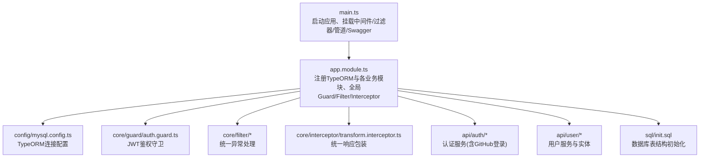
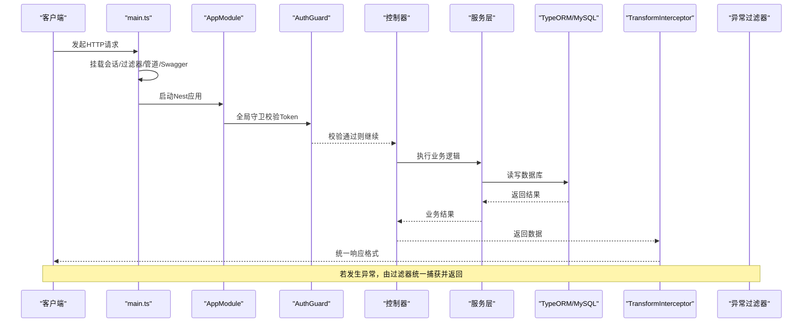
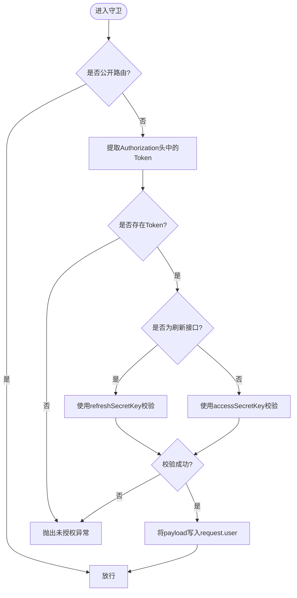
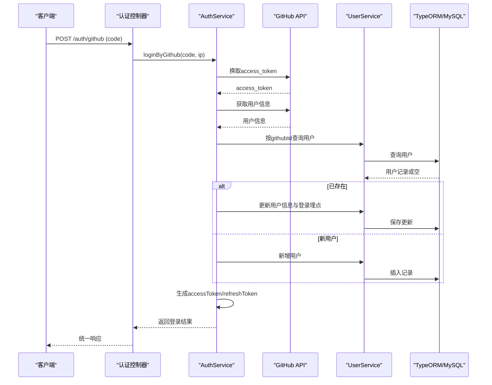
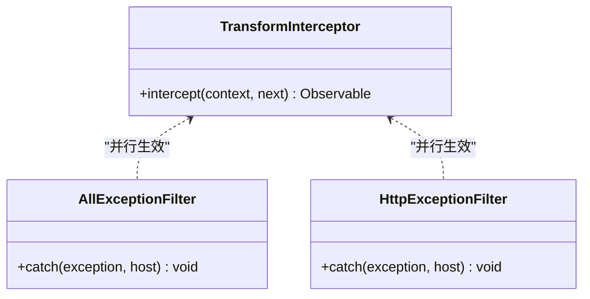
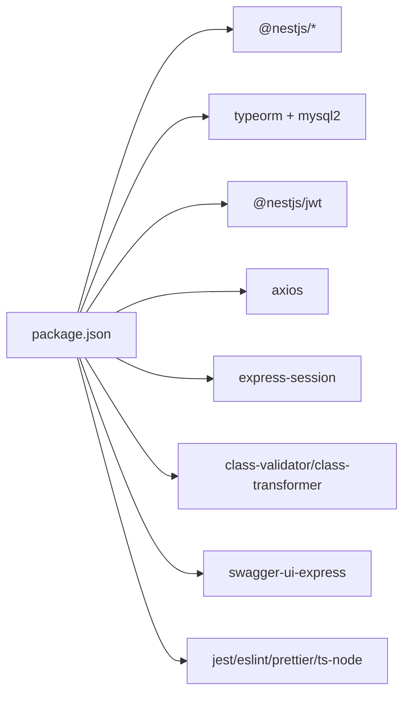

# 故障排查

<cite>
**本文引用的文件**   
- [package.json](file://package.json)
- [README.md](file://README.md)
- [src/main.ts](file://src/main.ts)
- [src/app.module.ts](file://src/app.module.ts)
- [src/config/mysql.config.ts](file://src/config/mysql.config.ts)
- [src/config/jwt.config.ts](file://src/config/jwt.config.ts)
- [src/config/github.config.ts](file://src/config/github.config.ts)
- [src/core/filter/all-exception.filter.ts](file://src/core/filter/all-exception.filter.ts)
- [src/core/filter/http-exception.filter.ts](file://src/core/filter/http-exception.filter.ts)
- [src/core/guard/auth.guard.ts](file://src/core/guard/auth.guard.ts)
- [src/core/interceptor/transform.interceptor.ts](file://src/core/interceptor/transform.interceptor.ts)
- [src/api/auth/auth.service.ts](file://src/api/auth/auth.service.ts)
- [src/api/user/user.service.ts](file://src/api/user/user.service.ts)
- [src/utils/ip-address.ts](file://src/utils/ip-address.ts)
- [sql/init.sql](file://sql/init.sql)
</cite>

## 目录
1. [简介](#简介)
2. [项目结构](#项目结构)
3. [核心组件](#核心组件)
4. [架构总览](#架构总览)
5. [详细组件分析](#详细组件分析)
6. [依赖分析](#依赖分析)
7. [性能考虑](#性能考虑)
8. [故障排查指南](#故障排查指南)
9. [结论](#结论)
10. [附录](#附录)

## 简介
本指南面向博客系统的运维与开发人员，聚焦于常见问题的诊断与解决，包括数据库连接问题、认证失败、API 响应异常等典型场景；并提供性能问题分析方法（内存泄漏检测、CPU 使用率分析、数据库查询优化）、调试工具与技巧（Node.js 调试器、日志分析、性能剖析）、系统健康检查接口设计与实现建议，以及自动化监控告警配置策略。文档内容基于仓库现有代码与配置进行梳理，确保可落地执行。

## 项目结构
本项目采用 NestJS 模块化架构，入口在 main.ts，应用模块在 app.module.ts 中注册全局过滤器、拦截器与守卫，并通过 TypeORM 连接 MySQL。认证流程通过 JWT 守卫校验请求令牌，第三方登录集成 GitHub OAuth。数据模型定义在 entities 中，SQL 初始化脚本位于 sql/init.sql。

图表来源
- [src/main.ts:1-46](file://src/main.ts#L1-L46)
- [src/app.module.ts:1-35](file://src/app.module.ts#L1-L35)
- [src/config/mysql.config.ts:1-15](file://src/config/mysql.config.ts#L1-L15)
- [src/core/guard/auth.guard.ts:1-53](file://src/core/guard/auth.guard.ts#L1-L53)
- [src/core/filter/all-exception.filter.ts:1-43](file://src/core/filter/all-exception.filter.ts#L1-L43)
- [src/core/filter/http-exception.filter.ts:1-37](file://src/core/filter/http-exception.filter.ts#L1-L37)
- [src/core/interceptor/transform.interceptor.ts:1-24](file://src/core/interceptor/transform.interceptor.ts#L1-L24)
- [src/api/auth/auth.service.ts:1-123](file://src/api/auth/auth.service.ts#L1-L123)
- [src/api/user/user.service.ts:1-66](file://src/api/user/user.service.ts#L1-L66)
- [sql/init.sql:1-138](file://sql/init.sql#L1-L138)

章节来源
- [src/main.ts:1-46](file://src/main.ts#L1-L46)
- [src/app.module.ts:1-35](file://src/app.module.ts#L1-L35)
- [package.json:1-100](file://package.json#L1-L100)
- [README.md:1-100](file://README.md#L1-L100)

## 核心组件
- 应用启动与全局配置：main.ts 负责创建 Nest 应用、启用信任代理、挂载会话中间件、全局异常过滤器、验证管道，并初始化 Swagger 文档。
- 应用模块装配：app.module.ts 注册 TypeORM 连接、各功能模块，并注入全局 Guard、Filter、Interceptor。
- 认证与授权：auth.guard.ts 从请求头提取 Bearer Token，根据路由是否公开决定是否放行；对 refresh 与 access token 使用不同密钥校验。
- 统一异常处理：http-exception.filter.ts 与 all-exception.filter.ts 分别捕获 HTTP 异常与所有异常，输出包含请求上下文的错误体。
- 统一响应包装：transform.interceptor.ts 将成功响应包装为统一格式。
- 认证服务：auth.service.ts 提供刷新令牌与 GitHub 第三方登录流程，调用用户服务完成用户查找/注册与登录埋点更新。
- 用户服务：user.service.ts 封装用户查询、分页列表、新增与更新、登录信息埋点更新等逻辑。
- 外部依赖：github.config.ts 提供 GitHub OAuth 客户端凭据；mysql.config.ts 提供数据库连接参数；ip-address.ts 解析 IP 地理位置。

章节来源
- [src/main.ts:1-46](file://src/main.ts#L1-L46)
- [src/app.module.ts:1-35](file://src/app.module.ts#L1-L35)
- [src/core/guard/auth.guard.ts:1-53](file://src/core/guard/auth.guard.ts#L1-L53)
- [src/core/filter/all-exception.filter.ts:1-43](file://src/core/filter/all-exception.filter.ts#L1-L43)
- [src/core/filter/http-exception.filter.ts:1-37](file://src/core/filter/http-exception.filter.ts#L1-L37)
- [src/core/interceptor/transform.interceptor.ts:1-24](file://src/core/interceptor/transform.interceptor.ts#L1-L24)
- [src/api/auth/auth.service.ts:1-123](file://src/api/auth/auth.service.ts#L1-L123)
- [src/api/user/user.service.ts:1-66](file://src/api/user/user.service.ts#L1-L66)
- [src/config/github.config.ts:1-6](file://src/config/github.config.ts#L1-L6)
- [src/config/mysql.config.ts:1-15](file://src/config/mysql.config.ts#L1-L15)
- [src/utils/ip-address.ts:1-39](file://src/utils/ip-address.ts#L1-L39)

## 架构总览
下图展示了请求进入后的关键处理链路：中间件与会话 -> 全局过滤器/管道 -> 守卫鉴权 -> 控制器 -> 服务层 -> 数据访问层（TypeORM + MySQL），以及统一响应包装与异常处理。

图表来源
- [src/main.ts:1-46](file://src/main.ts#L1-L46)
- [src/app.module.ts:1-35](file://src/app.module.ts#L1-L35)
- [src/core/guard/auth.guard.ts:1-53](file://src/core/guard/auth.guard.ts#L1-L53)
- [src/core/interceptor/transform.interceptor.ts:1-24](file://src/core/interceptor/transform.interceptor.ts#L1-L24)
- [src/core/filter/all-exception.filter.ts:1-43](file://src/core/filter/all-exception.filter.ts#L1-L43)
- [src/core/filter/http-exception.filter.ts:1-37](file://src/core/filter/http-exception.filter.ts#L1-L37)

## 详细组件分析

### 认证与授权流程
- 守卫从请求头 Authorization 中提取 Bearer Token，若路由标记为公开则直接放行；否则校验 Token。
- 针对 /auth/refresh 路径使用 refreshSecretKey，其他路径使用 accessSecretKey。
- 校验失败抛出未授权异常，被全局异常过滤器捕获后返回统一错误体。

图表来源
- [src/core/guard/auth.guard.ts:1-53](file://src/core/guard/auth.guard.ts#L1-L53)
- [src/config/jwt.config.ts:1-5](file://src/config/jwt.config.ts#L1-L5)

章节来源
- [src/core/guard/auth.guard.ts:1-53](file://src/core/guard/auth.guard.ts#L1-L53)
- [src/config/jwt.config.ts:1-5](file://src/config/jwt.config.ts#L1-L5)

### GitHub 第三方登录流程
- 接收 code 后向 GitHub 换取 access_token，再获取用户信息。
- 根据 githubId 查询本地用户：存在则更新基本信息与登录埋点；不存在则自动注册用户。
- 生成 accessToken 与 refreshToken 并返回。

图表来源
- [src/api/auth/auth.service.ts:1-123](file://src/api/auth/auth.service.ts#L1-L123)
- [src/api/user/user.service.ts:1-66](file://src/api/user/user.service.ts#L1-L66)
- [src/config/github.config.ts:1-6](file://src/config/github.config.ts#L1-L6)

章节来源
- [src/api/auth/auth.service.ts:1-123](file://src/api/auth/auth.service.ts#L1-L123)
- [src/api/user/user.service.ts:1-66](file://src/api/user/user.service.ts#L1-L66)
- [src/config/github.config.ts:1-6](file://src/config/github.config.ts#L1-L6)

### 统一响应与异常处理
- TransformInterceptor 将成功响应包装为 {code: 200, data, message: 'success'}。
- HttpExceptionFilter 捕获 HTTP 异常，规范化 message 并附带请求上下文。
- AllExceptionFilter 捕获所有异常，返回包含请求上下文的错误体，状态码默认 500。

图表来源
- [src/core/interceptor/transform.interceptor.ts:1-24](file://src/core/interceptor/transform.interceptor.ts#L1-L24)
- [src/core/filter/http-exception.filter.ts:1-37](file://src/core/filter/http-exception.filter.ts#L1-L37)
- [src/core/filter/all-exception.filter.ts:1-43](file://src/core/filter/all-exception.filter.ts#L1-L43)

章节来源
- [src/core/interceptor/transform.interceptor.ts:1-24](file://src/core/interceptor/transform.interceptor.ts#L1-L24)
- [src/core/filter/http-exception.filter.ts:1-37](file://src/core/filter/http-exception.filter.ts#L1-L37)
- [src/core/filter/all-exception.filter.ts:1-43](file://src/core/filter/all-exception.filter.ts#L1-L43)

## 依赖分析
- 运行时依赖：@nestjs/*、typeorm、mysql2、@nestjs/jwt、axios、express-session、class-validator/class-transformer、swagger-ui-express 等。
- 开发依赖：jest、eslint、prettier、ts-node/ts-jest、supertest 等。
- 脚本命令：start、start:dev、start:debug、start:prod、test、test:e2e、test:cov 等。

图表来源
- [package.json:1-100](file://package.json#L1-L100)

章节来源
- [package.json:1-100](file://package.json#L1-L100)

## 性能考虑
- 数据库连接池：TypeORM 默认使用 mysql2 连接池，需关注最大连接数、空闲超时与重连策略，避免在高并发下耗尽连接。
- 查询优化：对用户列表分页查询使用 skip/take 与 LIKE 模糊匹配，注意索引覆盖与全表扫描风险；必要时增加复合索引。
- 外部依赖超时：GitHub OAuth 与 IP 地址解析均为外部 HTTP 调用，应设置合理的超时与重试策略，避免阻塞主线程。
- 序列化开销：统一响应包装会增加一次对象转换，建议在高频接口评估是否必要。
- 进程级监控：结合 Node.js 内置指标与进程管理器（如 PM2）监控内存与 CPU。

[本节为通用指导，不直接分析具体文件]

## 故障排查指南

### 一、数据库连接问题
常见问题
- 无法连接数据库：主机名、端口、用户名、密码、数据库名配置错误或网络不可达。
- 字符集/排序规则不一致导致中文乱码或比较异常。
- 连接池耗尽导致请求超时。

定位步骤
- 核对 TypeORM 配置项（类型、主机、端口、用户名、密码、数据库名）。
- 确认数据库实例可达（端口连通性、防火墙策略）。
- 检查数据库初始化脚本是否执行，表结构与字段是否与实体一致。
- 观察应用启动日志与异常过滤器输出的错误体，定位具体错误消息。

参考位置
- [src/config/mysql.config.ts:1-15](file://src/config/mysql.config.ts#L1-L15)
- [sql/init.sql:1-138](file://sql/init.sql#L1-L138)
- [src/core/filter/all-exception.filter.ts:1-43](file://src/core/filter/all-exception.filter.ts#L1-L43)

章节来源
- [src/config/mysql.config.ts:1-15](file://src/config/mysql.config.ts#L1-L15)
- [sql/init.sql:1-138](file://sql/init.sql#L1-L138)
- [src/core/filter/all-exception.filter.ts:1-43](file://src/core/filter/all-exception.filter.ts#L1-L43)

### 二、认证失败
常见问题
- 请求头缺少 Authorization 或 Bearer 前缀不正确。
- Token 过期或签名密钥不一致。
- 刷新接口与其他接口使用了不同的密钥导致校验失败。

定位步骤
- 检查请求头 Authorization 是否携带正确的 Bearer Token。
- 核对 JWT 密钥配置（accessSecretKey 与 refreshSecretKey）是否与签发时一致。
- 区分刷新接口与其他接口的校验逻辑，确认 URL 与密钥选择是否正确。
- 查看全局异常过滤器返回的错误体，确认是否抛出未授权异常。

参考位置
- [src/core/guard/auth.guard.ts:1-53](file://src/core/guard/auth.guard.ts#L1-L53)
- [src/config/jwt.config.ts:1-5](file://src/config/jwt.config.ts#L1-L5)
- [src/core/filter/http-exception.filter.ts:1-37](file://src/core/filter/http-exception.filter.ts#L1-L37)

章节来源
- [src/core/guard/auth.guard.ts:1-53](file://src/core/guard/auth.guard.ts#L1-L53)
- [src/config/jwt.config.ts:1-5](file://src/config/jwt.config.ts#L1-L5)
- [src/core/filter/http-exception.filter.ts:1-37](file://src/core/filter/http-exception.filter.ts#L1-L37)

### 三、API 响应异常
常见问题
- 业务逻辑抛出 BadRequestException 或其他 HTTP 异常。
- 全局异常过滤器与统一响应包装同时生效，导致响应体结构变化。
- 验证管道拒绝非法输入，返回验证错误。

定位步骤
- 检查控制器与服务层抛出的异常类型与消息。
- 确认统一响应包装是否将成功响应包裹为 {code: 200, data, message}。
- 查看异常过滤器返回的 data 字段，包含 query/body/params/method/url，辅助复现问题。
- 核对 ValidationPipe 的配置（transform、whitelist、stopAtFirstError）是否符合预期。

参考位置
- [src/core/filter/http-exception.filter.ts:1-37](file://src/core/filter/http-exception.filter.ts#L1-L37)
- [src/core/filter/all-exception.filter.ts:1-43](file://src/core/filter/all-exception.filter.ts#L1-L43)
- [src/core/interceptor/transform.interceptor.ts:1-24](file://src/core/interceptor/transform.interceptor.ts#L1-L24)
- [src/main.ts:22-28](file://src/main.ts#L22-L28)

章节来源
- [src/core/filter/http-exception.filter.ts:1-37](file://src/core/filter/http-exception.filter.ts#L1-L37)
- [src/core/filter/all-exception.filter.ts:1-43](file://src/core/filter/all-exception.filter.ts#L1-L43)
- [src/core/interceptor/transform.interceptor.ts:1-24](file://src/core/interceptor/transform.interceptor.ts#L1-L24)
- [src/main.ts:22-28](file://src/main.ts#L22-L28)

### 四、GitHub 第三方登录失败
常见问题
- GitHub OAuth 客户端凭据配置错误。
- 网络不可达或 GitHub API 限流/超时。
- 用户不存在时的自动注册逻辑异常。

定位步骤
- 核对 github.config.ts 中的 client_id 与 client_secret。
- 检查 axios 调用 GitHub API 的响应状态与错误信息。
- 确认用户服务在新增或更新用户时的数据完整性与约束。
- 查看异常过滤器返回的错误体，定位具体失败阶段。

参考位置
- [src/config/github.config.ts:1-6](file://src/config/github.config.ts#L1-L6)
- [src/api/auth/auth.service.ts:1-123](file://src/api/auth/auth.service.ts#L1-L123)
- [src/api/user/user.service.ts:1-66](file://src/api/user/user.service.ts#L1-L66)
- [src/core/filter/all-exception.filter.ts:1-43](file://src/core/filter/all-exception.filter.ts#L1-L43)

章节来源
- [src/config/github.config.ts:1-6](file://src/config/github.config.ts#L1-L6)
- [src/api/auth/auth.service.ts:1-123](file://src/api/auth/auth.service.ts#L1-L123)
- [src/api/user/user.service.ts:1-66](file://src/api/user/user.service.ts#L1-L66)
- [src/core/filter/all-exception.filter.ts:1-43](file://src/core/filter/all-exception.filter.ts#L1-L43)

### 五、IP 地址解析失败
常见问题
- 上游 IP 地址为空或格式不正确。
- 外部 IP 解析服务不可用或返回非 success 状态。

定位步骤
- 检查 getIpAddress 的输入合法性与前置处理。
- 观察外部 HTTP 调用的响应状态与数据结构。
- 确认异常未被吞掉，且能反映到上层错误体中。

参考位置
- [src/utils/ip-address.ts:1-39](file://src/utils/ip-address.ts#L1-L39)

章节来源
- [src/utils/ip-address.ts:1-39](file://src/utils/ip-address.ts#L1-L39)

### 六、性能问题分析方法
- 内存泄漏检测
  - 使用 Node.js 堆快照对比（heap snapshot diff）定位持续增长的对象引用。
  - 结合进程管理器（如 PM2）监控 RSS 与堆大小趋势。
- CPU 使用率分析
  - 使用 --prof 生成 v8 性能日志，配合 flamegraph 可视化热点函数。
  - 关注长时间运行的异步任务与外部 HTTP 调用。
- 数据库查询性能优化
  - 使用 EXPLAIN 分析慢查询，补充合适索引。
  - 减少不必要的 LIKE 模糊匹配范围，必要时引入全文检索或搜索引擎。
  - 控制分页深度，避免超大 offset 带来的性能退化。

[本节为通用指导，不直接分析具体文件]

### 七、调试工具与技巧
- Node.js 调试器
  - 使用 start:debug 脚本以调试模式启动，IDE 中附加调试器进行断点调试。
- 日志分析
  - 利用全局异常过滤器返回的请求上下文（query/body/params/method/url）快速复现场景。
  - 在生产环境集中收集日志，关联 traceId 进行链路追踪。
- 性能剖析工具
  - 使用 --inspect-brk 启动测试用例，便于单测阶段的性能与行为验证。
  - 结合浏览器开发者工具与接口文档（Swagger）进行端到端验证。

参考位置
- [package.json:13-19](file://package.json#L13-L19)
- [src/core/filter/all-exception.filter.ts:1-43](file://src/core/filter/all-exception.filter.ts#L1-L43)
- [src/main.ts:29-39](file://src/main.ts#L29-L39)

章节来源
- [package.json:13-19](file://package.json#L13-L19)
- [src/core/filter/all-exception.filter.ts:1-43](file://src/core/filter/all-exception.filter.ts#L1-L43)
- [src/main.ts:29-39](file://src/main.ts#L29-L39)

### 八、系统健康检查接口的设计与实现建议
设计要点
- 提供 /health 与 /ready 两个端点：
  - /health：返回进程基本状态（版本、运行时长、负载）。
  - /ready：检查关键依赖（数据库、外部服务）可用性。
- 返回标准 JSON 结构，包含 status、checks、timestamp。
- 对外暴露最小权限，限制内网访问或添加鉴权。

实现建议（概念性）
- 在 AppModule 中注册一个 HealthController，提供 GET /health 与 GET /ready。
- /ready 中调用 TypeORM 的连接状态或执行简单 SQL（如 SELECT 1）验证数据库连通性。
- 对于外部依赖（GitHub API、IP 解析服务），可通过轻量探测判断可用性。
- 将健康检查结果纳入监控平台，配置阈值与告警。

[本节为概念性设计，不直接分析具体文件]

### 九、自动化监控告警配置策略
- 指标采集
  - 进程指标：CPU、内存、事件循环延迟、GC 次数。
  - 应用指标：QPS、P95/P99 延迟、错误率、外部依赖成功率。
  - 数据库指标：连接池使用率、慢查询数量、锁等待。
- 告警规则
  - 错误率超过阈值持续 N 分钟触发告警。
  - 数据库连接池使用率超过 80% 持续一段时间触发扩容或限流。
  - 外部依赖失败率升高触发降级或熔断。
- 工具链
  - 使用 Prometheus + Grafana 进行指标展示与告警。
  - 使用 ELK/ Loki 进行日志聚合与分析。
  - 使用 PM2 或容器编排平台进行进程管理与自愈。

[本节为通用指导，不直接分析具体文件]

## 结论
通过对应用启动、认证授权、异常处理、响应包装与外部依赖的分析，本文提供了从数据库连接、认证失败到 API 响应异常的完整排查路径，并结合性能分析与调试工具给出可操作的优化建议。建议在生产环境完善健康检查与监控告警体系，提升系统的可观测性与稳定性。

## 附录
- 启动与运行
  - 开发模式：pnpm run start:dev
  - 调试模式：pnpm run start:debug
  - 生产模式：pnpm run start:prod
- 测试
  - 单元测试：pnpm run test
  - 端到端测试：pnpm run test:e2e
  - 覆盖率：pnpm run test:cov

章节来源
- [package.json:8-21](file://package.json#L8-L21)
- [README.md:35-59](file://README.md#L35-L59)