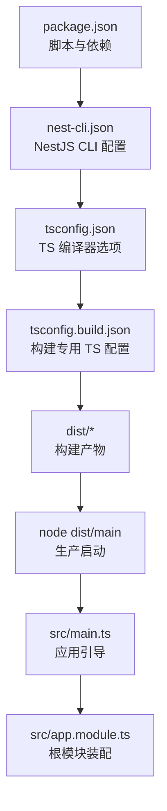
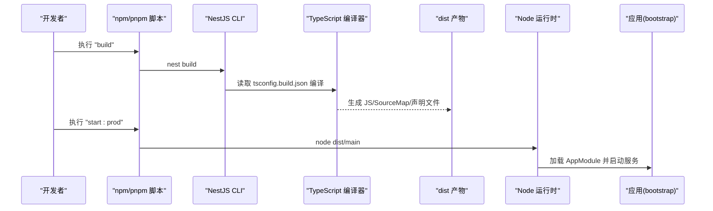
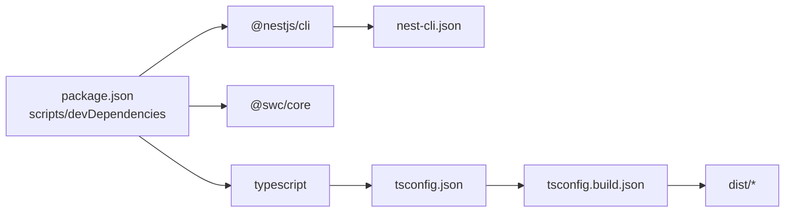

# 构建配置

<cite>
**本文引用的文件**
- [package.json](file://package.json)
- [nest-cli.json](file://nest-cli.json)
- [tsconfig.json](file://tsconfig.json)
- [tsconfig.build.json](file://tsconfig.build.json)
- [src/main.ts](file://src/main.ts)
- [src/app.module.ts](file://src/app.module.ts)
</cite>

## 目录
1. [简介](#简介)
2. [项目结构](#项目结构)
3. [核心组件](#核心组件)
4. [架构总览](#架构总览)
5. [详细组件分析](#详细组件分析)
6. [依赖分析](#依赖分析)
7. [性能考虑](#性能考虑)
8. [故障排查指南](#故障排查指南)
9. [结论](#结论)
10. [附录](#附录)

## 简介
本文件面向博客系统的构建与打包，聚焦于 NestJS CLI 的构建流程、TypeScript 编译配置、代码分割与树摇优化策略、开发/生产环境脚本差异、SWC 加速编译方法以及多环境配置管理。文档同时给出产物分析与体积优化的最佳实践建议，帮助团队在本地开发与 CI/CD 中稳定高效地产出可部署产物。

## 项目结构
本项目采用典型的 NestJS 工程结构：源码位于 src，构建输出到 dist；NestJS CLI 通过 nest-cli.json 控制构建行为；TypeScript 编译由 tsconfig.json 与 tsconfig.build.json 共同驱动；运行入口为 src/main.ts，应用模块为 src/app.module.ts。

图表来源
- [package.json:8-21](file://package.json#L8-L21)
- [nest-cli.json:1-8](file://nest-cli.json#L1-L8)
- [tsconfig.json:1-24](file://tsconfig.json#L1-L24)
- [tsconfig.build.json:1-4](file://tsconfig.build.json#L1-L4)
- [src/main.ts:1-46](file://src/main.ts#L1-L46)
- [src/app.module.ts:1-35](file://src/app.module.ts#L1-L35)

章节来源
- [package.json:8-21](file://package.json#L8-L21)
- [nest-cli.json:1-8](file://nest-cli.json#L1-L8)
- [tsconfig.json:1-24](file://tsconfig.json#L1-L24)
- [tsconfig.build.json:1-4](file://tsconfig.build.json#L1-L4)
- [src/main.ts:1-46](file://src/main.ts#L1-L46)
- [src/app.module.ts:1-35](file://src/app.module.ts#L1-L35)

## 核心组件
本节从“构建脚本”、“NestJS CLI 配置”、“TypeScript 编译配置”三个维度解析构建体系。

- 构建脚本（package.json）
  - build：调用 NestJS CLI 执行构建，默认使用 tsconfig.build.json 作为构建 TS 配置。
  - start:dev/start:debug：开发热重载与调试模式，便于快速迭代。
  - start:prod：以 Node 直接运行 dist/main，即生产运行方式。
  - test/test:cov/test:e2e：测试相关脚本，覆盖单元测试、覆盖率与端到端测试。

- NestJS CLI 配置（nest-cli.json）
  - sourceRoot：指定源码根目录为 src。
  - compilerOptions.deleteOutDir：构建前清理 dist 目录，保证产物干净。

- TypeScript 编译配置（tsconfig.json 与 tsconfig.build.json）
  - module/target：CommonJS + ES2021，适配 Node.js 运行时。
  - declaration/removeComments/sourceMap/outDir：生成声明文件、移除注释、生成 Source Map、输出至 dist。
  - paths：启用路径别名 @/* 指向 src/*，提升可读性与引用稳定性。
  - incremental/skipLibCheck：增量编译与跳过类型库检查，提升构建速度。
  - strictNullChecks/strictBindCallApply/noFallthroughCasesInSwitch：严格性开关组合，兼顾质量与效率。
  - tsconfig.build.json：继承 tsconfig.json，并排除 node_modules、test、dist 与 spec 文件，确保构建产物仅包含业务代码。

章节来源
- [package.json:8-21](file://package.json#L8-L21)
- [nest-cli.json:1-8](file://nest-cli.json#L1-L8)
- [tsconfig.json:1-24](file://tsconfig.json#L1-L24)
- [tsconfig.build.json:1-4](file://tsconfig.build.json#L1-L4)

## 架构总览
下图展示从脚本到产物的完整构建链路，以及生产运行的关键节点。

图表来源
- [package.json:8-21](file://package.json#L8-L21)
- [nest-cli.json:1-8](file://nest-cli.json#L1-L8)
- [tsconfig.build.json:1-4](file://tsconfig.build.json#L1-L4)
- [src/main.ts:1-46](file://src/main.ts#L1-L46)
- [src/app.module.ts:1-35](file://src/app.module.ts#L1-L35)

## 详细组件分析

### NestJS CLI 构建流程与优化项
- 构建入口
  - 通过 package.json 的 build 脚本触发 NestJS CLI。
  - CLI 会读取 nest-cli.json 中的 compilerOptions 与 sourceRoot，并结合 tsconfig.build.json 进行编译。
- 输出目录与清理
  - nest-cli.json 的 deleteOutDir 会在每次构建前清空 dist，避免历史残留影响。
- 产物内容
  - 基于 tsconfig.json 的 outDir、declaration、sourceMap、removeComments 等选项，最终在 dist 下生成可执行的 CommonJS 代码、声明文件与 Source Map。
- 环境变量注入
  - 应用启动时通过 process.env 读取端口等配置，便于在不同环境切换。

章节来源
- [package.json:8-21](file://package.json#L8-L21)
- [nest-cli.json:1-8](file://nest-cli.json#L1-L8)
- [tsconfig.json:1-24](file://tsconfig.json#L1-L24)
- [src/main.ts:41-43](file://src/main.ts#L41-L43)

### TypeScript 编译配置详解
- 模块与目标
  - module: commonjs 与 target: ES2021 的组合，确保与 Node.js 生态兼容且充分利用现代语法能力。
- 元数据与装饰器
  - emitDecoratorMetadata 与 experimentalDecorators 开启，满足 NestJS 对反射与装饰器的需求。
- 路径别名
  - baseUrl 与 paths 定义 @/* 映射到 src/*，统一内部模块引用风格。
- 构建性能
  - incremental 开启增量编译；skipLibCheck 跳过第三方库类型检查，缩短构建时间。
- 构建产物
  - declaration 生成 .d.ts；sourceMap 生成 Source Map；removeComments 去除注释减小体积；outDir 指定 dist。
- 构建范围
  - tsconfig.build.json 通过 exclude 排除测试与无关目录，减少不必要的编译开销。

章节来源
- [tsconfig.json:1-24](file://tsconfig.json#L1-L24)
- [tsconfig.build.json:1-4](file://tsconfig.build.json#L1-L4)

### 代码分割与树摇优化策略
- 当前状态
  - 本项目未显式引入 Webpack/Vite 等前端打包器，也未配置 NestJS 的自定义打包器或插件。因此，默认的 NestJS CLI 构建主要完成 TypeScript 编译与基础资源处理，不主动进行前端侧的代码分割与 Tree Shaking。
- 后端包体积优化要点
  - 保持 module: commonjs 与 target: ES2021，利于 Node 运行时与工具链优化。
  - 利用 removeComments 与 skipLibCheck 降低编译与产物体积。
  - 谨慎引入大型依赖，按需导入以减少运行时内存占用。
- 若需更细粒度的打包优化
  - 可通过 NestJS 的自定义打包器扩展点接入 Webpack 或 esbuild，实现更复杂的代码分割与压缩策略（本项目当前未启用）。

章节来源
- [tsconfig.json:1-24](file://tsconfig.json#L1-L24)
- [nest-cli.json:1-8](file://nest-cli.json#L1-L8)

### SWC 加速编译的配置方法
- 现状
  - 项目中已安装 @swc/core 与 @swc/cli，但未见针对 NestJS 构建的 SWC 集成配置（例如在 nest-cli.json 中启用 swc 或自定义打包器）。
- 建议方案（概念性说明）
  - 在 nest-cli.json 的 compilerOptions 中启用 swc 编译后端，可将 TypeScript 编译交由 SWC 执行，显著提升构建速度。
  - 或在自定义打包器中通过 @swc/core 替换 ts-loader/ts-jest 等慢速环节。
- 注意事项
  - 启用 SWC 后需确认与现有严格 TS 选项的兼容性，必要时调整 tsconfig 规则。
  - 建议在 CI 中进行基准对比，评估速度与正确性收益。

章节来源
- [nest-cli.json:1-8](file://nest-cli.json#L1-L8)
- [package.json:46-75](file://package.json#L46-L75)

### 多环境配置文件的管理策略
- 现状
  - 应用通过 process.env 读取 PORT 等变量，但未在仓库中发现 .env 文件。
- 推荐做法（概念性说明）
  - 使用 .env.development/.env.production 等文件区分不同环境的配置，并在启动脚本中根据 NODE_ENV 或自定义参数加载对应文件。
  - 将敏感信息（如数据库连接、密钥）放入 .env.local 并通过 .gitignore 忽略，避免泄露。
  - 在容器化部署时，通过环境变量注入或配置中心统一管理。

章节来源
- [src/main.ts:41-43](file://src/main.ts#L41-L43)

### 构建产物分析与依赖优化
- 产物分析
  - 可在 CI 中统计 dist 目录大小与文件数量，结合日志记录关键模块体积变化，辅助回归分析。
- 依赖优化
  - 定期审计 dependencies 与 devDependencies，移除不再使用的包。
  - 优先选择轻量替代或按需导入，减少运行时内存与启动开销。
- 打包体积优化
  - 保持 removeComments 与 skipLibCheck 开启。
  - 避免在运行时动态 require 大体积模块，尽量静态导入。
  - 对于 Swagger 等可选功能，可按环境条件启用，减少生产包体。

章节来源
- [tsconfig.json:1-24](file://tsconfig.json#L1-L24)
- [package.json:22-75](file://package.json#L22-L75)

## 依赖分析
下图展示与构建相关的核心依赖关系。

图表来源
- [package.json:46-75](file://package.json#L46-L75)
- [nest-cli.json:1-8](file://nest-cli.json#L1-L8)
- [tsconfig.json:1-24](file://tsconfig.json#L1-L24)
- [tsconfig.build.json:1-4](file://tsconfig.build.json#L1-L4)

章节来源
- [package.json:46-75](file://package.json#L46-L75)
- [nest-cli.json:1-8](file://nest-cli.json#L1-L8)
- [tsconfig.json:1-24](file://tsconfig.json#L1-L24)
- [tsconfig.build.json:1-4](file://tsconfig.build.json#L1-L4)

## 性能考虑
- 构建速度
  - 使用 tsconfig.json 的 incremental 与 skipLibCheck 提升增量构建速度。
  - 在 nest-cli.json 中启用删除输出目录，避免脏构建导致的重复工作。
- 运行性能
  - 通过 ValidationPipe 的 transform/whitelist/stopAtFirstError 减少无效数据处理。
  - 合理设置 Session Cookie 过期时间与信任代理，避免额外开销。
- 体积与内存
  - 关闭不必要的特性（如开发期 Source Map），在生产环境保留最小必要产物。
  - 按需引入第三方库，避免全量加载。

章节来源
- [tsconfig.json:1-24](file://tsconfig.json#L1-L24)
- [nest-cli.json:1-8](file://nest-cli.json#L1-L8)
- [src/main.ts:22-28](file://src/main.ts#L22-L28)

## 故障排查指南
- 构建失败
  - 检查 tsconfig.build.json 是否正确继承 tsconfig.json，并确保 exclude 列表不包含需要编译的业务文件。
  - 确认 nest-cli.json 的 sourceRoot 与实际目录一致。
- 运行异常
  - 确认 dist/main 存在且可执行；检查环境变量是否按预期注入（如 PORT）。
  - 若出现模块路径错误，核对 @/* 路径别名与 baseUrl 配置。
- 性能问题
  - 若构建过慢，尝试启用 SWC 加速或进一步调优 TS 严格规则。
  - 若运行内存偏高，审查依赖与动态导入情况。

章节来源
- [tsconfig.build.json:1-4](file://tsconfig.build.json#L1-L4)
- [tsconfig.json:1-24](file://tsconfig.json#L1-L24)
- [nest-cli.json:1-8](file://nest-cli.json#L1-L8)
- [src/main.ts:41-43](file://src/main.ts#L41-L43)

## 结论
本项目采用标准的 NestJS 构建体系：通过 package.json 脚本驱动 NestJS CLI，结合 nest-cli.json 与 tsconfig.build.json 完成 TypeScript 编译与产物输出。当前未启用 SWC 加速与高级打包优化，但具备良好扩展基础。建议后续逐步引入 SWC 加速、完善多环境配置管理与构建产物分析，以获得更快的构建与更小的生产包体。

## 附录
- 常用命令参考
  - 构建：pnpm run build
  - 开发：pnpm run start:dev
  - 调试：pnpm run start:debug
  - 生产运行：pnpm run start:prod
  - 测试：pnpm run test / pnpm run test:cov / pnpm run test:e2e

章节来源
- [package.json:8-21](file://package.json#L8-L21)