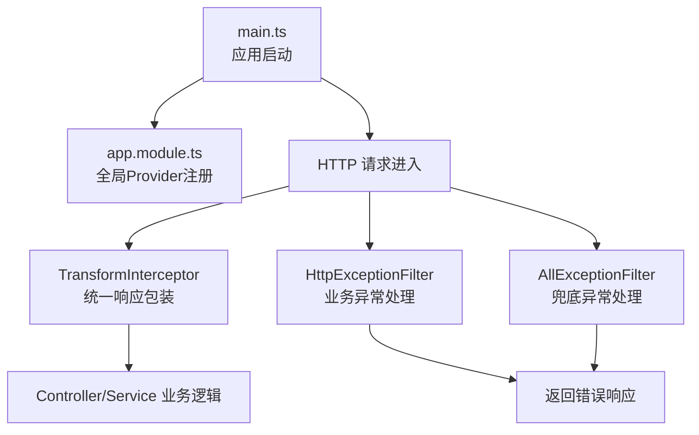
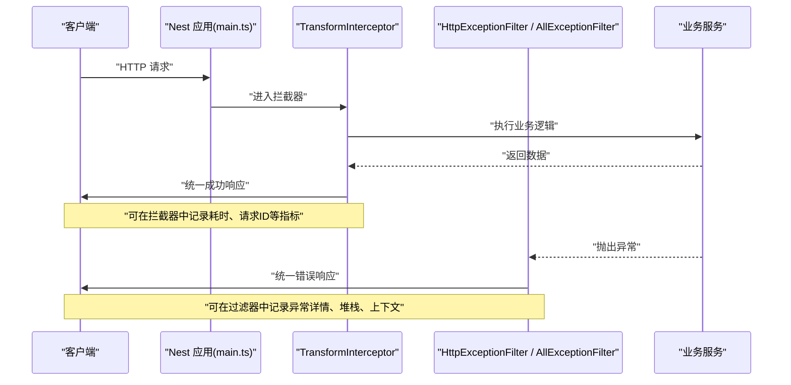
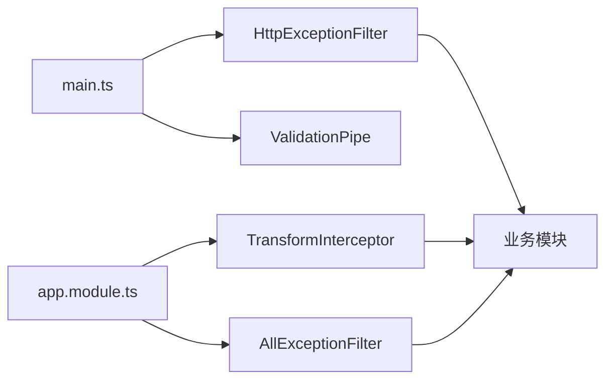

# 监控日志

<cite>
**本文引用的文件**   
- [src/main.ts](file://src/main.ts)
- [src/app.module.ts](file://src/app.module.ts)
- [src/core/filter/http-exception.filter.ts](file://src/core/filter/http-exception.filter.ts)
- [src/core/filter/all-exception.filter.ts](file://src/core/filter/all-exception.filter.ts)
- [src/core/interceptor/transform.interceptor.ts](file://src/core/interceptor/transform.interceptor.ts)
- [package.json](file://package.json)
</cite>

## 目录
1. [简介](#简介)
2. [项目结构](#项目结构)
3. [核心组件](#核心组件)
4. [架构总览](#架构总览)
5. [详细组件分析](#详细组件分析)
6. [依赖分析](#依赖分析)
7. [性能考虑](#性能考虑)
8. [故障排查指南](#故障排查指南)
9. [结论](#结论)
10. [附录](#附录)

## 简介
本文件为博客系统的“监控与日志收集”配置文档，聚焦以下目标：
- 应用性能监控（APM）：Agent 集成、关键指标采集、性能瓶颈识别方法。
- 结构化日志：日志级别划分、格式标准化、敏感信息脱敏策略。
- 错误追踪：异常捕获、堆栈跟踪、用户行为关联分析。
- 日志聚合与分析平台：ELK Stack、Splunk、云日志服务的集成方案。

当前仓库未内置 APM Agent 或第三方日志库，本文基于现有代码的拦截器、过滤器与启动入口，给出最小侵入式的落地方案与最佳实践。

## 项目结构
本项目采用 NestJS 模块化组织，监控与日志相关的关键位置如下：
- 应用启动与全局中间件/管道/过滤器注册：src/main.ts
- 全局 Provider 注册（全局过滤器、拦截器、守卫）：src/app.module.ts
- HTTP 异常统一处理：src/core/filter/http-exception.filter.ts
- 兜底异常统一处理：src/core/filter/all-exception.filter.ts
- 响应体统一包装：src/core/interceptor/transform.interceptor.ts

图表来源
- [src/main.ts:1-45](file://src/main.ts#L1-L45)
- [src/app.module.ts:1-35](file://src/app.module.ts#L1-L35)
- [src/core/interceptor/transform.interceptor.ts:1-24](file://src/core/interceptor/transform.interceptor.ts#L1-L24)
- [src/core/filter/http-exception.filter.ts:1-37](file://src/core/filter/http-exception.filter.ts#L1-L37)
- [src/core/filter/all-exception.filter.ts:1-43](file://src/core/filter/all-exception.filter.ts#L1-L43)

章节来源
- [src/main.ts:1-45](file://src/main.ts#L1-L45)
- [src/app.module.ts:1-35](file://src/app.module.ts#L1-L35)

## 核心组件
- 全局异常过滤器
  - HttpExceptionFilter：捕获并格式化业务层抛出的 HTTP 异常，统一返回结构与状态码。
  - AllExceptionFilter：兜底捕获所有未处理异常，确保系统稳定性与可观测性。
- 全局响应拦截器
  - TransformInterceptor：对成功响应进行统一包装，便于前端一致消费与后端统一埋点。
- 应用启动
  - main.ts：注册会话、信任代理、全局验证管道、Swagger 文档与监听端口。

章节来源
- [src/core/filter/http-exception.filter.ts:1-37](file://src/core/filter/http-exception.filter.ts#L1-L37)
- [src/core/filter/all-exception.filter.ts:1-43](file://src/core/filter/all-exception.filter.ts#L1-L43)
- [src/core/interceptor/transform.interceptor.ts:1-24](file://src/core/interceptor/transform.interceptor.ts#L1-L24)
- [src/main.ts:1-45](file://src/main.ts#L1-L45)

## 架构总览
下图展示一次典型请求在 NestJS 中的生命周期，以及监控与日志落点：

图表来源
- [src/main.ts:1-45](file://src/main.ts#L1-L45)
- [src/core/interceptor/transform.interceptor.ts:1-24](file://src/core/interceptor/transform.interceptor.ts#L1-L24)
- [src/core/filter/http-exception.filter.ts:1-37](file://src/core/filter/http-exception.filter.ts#L1-L37)
- [src/core/filter/all-exception.filter.ts:1-43](file://src/core/filter/all-exception.filter.ts#L1-L43)

## 详细组件分析

### 应用启动与全局配置（main.ts）
- 作用
  - 创建 Nest 应用实例，启用会话、信任代理、全局验证管道与 Swagger。
  - 注册全局异常过滤器（此处为 HttpExceptionFilter）。
- 监控建议
  - 在启动阶段注入 APM Agent 初始化逻辑（例如通过环境变量控制开关）。
  - 将进程健康检查端点暴露给外部监控系统（如 liveness/readiness）。
- 日志建议
  - 使用结构化日志输出启动信息（包含版本、环境、端口等），避免直接打印敏感值。

章节来源
- [src/main.ts:1-45](file://src/main.ts#L1-L45)

### 全局 Provider 注册（app.module.ts）
- 作用
  - 以 APP_FILTER、APP_INTERCEPTOR、APP_GUARD 形式注册全局过滤器、拦截器与守卫。
- 监控建议
  - 在全局拦截器中增加请求链路 ID（traceId/spanId）生成与透传，便于跨模块追踪。
  - 在拦截器中统计请求耗时、成功率、P95/P99 延迟等指标。
- 日志建议
  - 在拦截器中输出结构化访问日志（入参摘要、出参摘要、耗时、状态码、traceId）。

章节来源
- [src/app.module.ts:1-35](file://src/app.module.ts#L1-L35)

### 响应包装拦截器（TransformInterceptor）
- 作用
  - 将成功响应统一包装为标准结构，便于前端一致消费。
- 监控建议
  - 在 map 前后记录时间戳，计算接口耗时；按路由维度上报耗时分布。
  - 结合 traceId 将耗时与链路上下文一起写入日志。
- 日志建议
  - 仅记录必要字段（如路由、耗时、状态码、traceId），避免记录大体积响应体。

章节来源
- [src/core/interceptor/transform.interceptor.ts:1-24](file://src/core/interceptor/transform.interceptor.ts#L1-L24)

### HTTP 异常过滤器（HttpExceptionFilter）
- 作用
  - 捕获业务层抛出的 HTTP 异常，规范化消息与状态码，返回统一错误结构。
- 监控建议
  - 记录异常类型、消息、请求上下文（URL、方法、参数摘要）、traceId。
  - 针对高频异常建立告警规则（如 4xx 突增、特定错误码阈值）。
- 日志建议
  - 过滤敏感字段（密码、令牌、身份证号等），仅保留诊断所需的最小集合。

章节来源
- [src/core/filter/http-exception.filter.ts:1-37](file://src/core/filter/http-exception.filter.ts#L1-L37)

### 兜底异常过滤器（AllExceptionFilter）
- 作用
  - 捕获所有未被处理的异常，保证系统稳定并返回统一错误结构。
- 监控建议
  - 作为“最后防线”，必须记录完整堆栈与上下文，用于快速定位未知问题。
  - 将严重异常（5xx）实时推送至告警通道（短信/邮件/IM）。
- 日志建议
  - 区分内部错误与外部错误，附带调用链信息与资源标识（主机名、实例ID、区域）。

章节来源
- [src/core/filter/all-exception.filter.ts:1-43](file://src/core/filter/all-exception.filter.ts#L1-L43)

### 依赖与包管理（package.json）
- 现状
  - 当前未引入 APM Agent 或专用日志库（如 Winston、Bunyan、Pino）。
- 建议
  - 按需引入 APM SDK（如 @opentelemetry/* 生态）与日志库，并通过环境变量控制开关与采样率。
  - 在脚本命令中支持调试模式（如 --inspect）以便配合 APM 调试。

章节来源
- [package.json:1-100](file://package.json#L1-L100)

## 依赖分析
- 组件耦合
  - main.ts 负责装配全局过滤器与管道；app.module.ts 通过 Provider 注入全局拦截器与守卫。
  - 拦截器与过滤器均面向 HTTP 层，职责清晰、耦合度低，易于扩展监控与日志能力。
- 潜在风险
  - 若过滤器/拦截器执行顺序不当，可能导致重复包装或丢失上下文。
  - 未显式设置全局 Provider 时，main.ts 中单独注册的全局过滤器可能与 app.module.ts 中的 Provider 产生覆盖关系，需明确优先级。

图表来源
- [src/main.ts:1-45](file://src/main.ts#L1-L45)
- [src/app.module.ts:1-35](file://src/app.module.ts#L1-L35)
- [src/core/interceptor/transform.interceptor.ts:1-24](file://src/core/interceptor/transform.interceptor.ts#L1-L24)
- [src/core/filter/http-exception.filter.ts:1-37](file://src/core/filter/http-exception.filter.ts#L1-L37)
- [src/core/filter/all-exception.filter.ts:1-43](file://src/core/filter/all-exception.filter.ts#L1-L43)

## 性能考虑
- 指标采集
  - 在拦截器中统计请求耗时、QPS、错误率、P95/P99 延迟，并按路由与操作维度聚合。
  - 数据库与外部调用（如 MySQL、第三方 API）应纳入链路追踪，识别慢查询与超时。
- 采样与降级
  - 高流量场景下开启采样（如 1%~10%），避免全量上报造成额外开销。
  - 当下游不可用时，快速失败并记录降级路径，避免雪崩。
- 资源限制
  - 避免在日志中输出大对象（如完整请求/响应体），必要时仅记录摘要或哈希。
  - 合理设置缓冲与批量化上报，降低 I/O 压力。

## 故障排查指南
- 常见问题定位
  - 4xx 错误集中出现：检查输入校验与权限控制逻辑，关注 HttpExceptionFilter 的记录。
  - 5xx 错误突增：查看 AllExceptionFilter 的堆栈与上下文，确认是否为依赖异常或资源不足。
  - 接口耗时飙升：结合拦截器记录的耗时与链路 ID，定位慢点（DB、缓存、外部服务）。
- 建议步骤
  - 通过 traceId 串联请求链路，检索同一链路下的所有日志与指标。
  - 对比不同环境（开发/预发/生产）的行为差异，缩小问题范围。
  - 对高频错误建立告警与自动恢复策略（熔断、限流、重试）。

## 结论
通过在拦截器与过滤器中嵌入结构化日志与指标采集，并以 APM 工具实现端到端链路追踪，可以在不侵入业务代码的前提下，获得稳定的可观测性与高效的排障能力。建议在上线前完成以下工作：
- 接入 APM Agent，开启关键指标与链路追踪。
- 统一日志格式与级别，实施敏感信息脱敏。
- 配置日志聚合平台（ELK/Splunk/云服务）与告警规则。

## 附录

### APM 集成建议（概念性）
- 选择 OpenTelemetry 生态或厂商 APM SDK，通过环境变量控制开关、采样率与上报地址。
- 在启动阶段初始化 APM，并在拦截器中注入 traceId/spanId，贯穿整个请求链路。
- 采集关键指标：请求数、延迟分布、错误率、资源使用率（CPU/内存/GC）、数据库与外部调用耗时。

[本节为概念性内容，无需源码引用]

### 结构化日志规范（概念性）
- 字段建议：timestamp、level、service、version、env、instance、traceId、spanId、method、url、statusCode、durationMs、message、context。
- 级别划分：DEBUG（开发）、INFO（常规）、WARN（潜在风险）、ERROR（错误）、FATAL（致命）。
- 脱敏策略：对密码、令牌、身份证、手机号、邮箱等进行掩码或哈希处理。

[本节为概念性内容，无需源码引用]

### 错误追踪与用户行为关联（概念性）
- 在认证成功后将 userId 注入上下文，贯穿后续请求。
- 在关键业务节点记录事件日志（如登录、下单、支付），并与 traceId 关联。
- 将错误日志与用户行为日志在同一索引中关联检索，提升排障效率。

[本节为概念性内容，无需源码引用]

### 日志聚合与分析平台集成（概念性）
- ELK Stack：Filebeat/Fluent Bit 采集容器 stdout 或本地日志文件，Elasticsearch 存储，Kibana 可视化。
- Splunk：Universal Forwarder 或 HTTP Event Collector 接收日志，构建仪表盘与告警。
- 云服务日志服务：阿里云 SLS、腾讯云 CLS、AWS CloudWatch Logs 等，按环境分桶/索引，设置保留策略与告警。

[本节为概念性内容，无需源码引用]