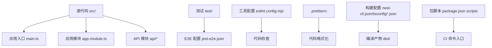
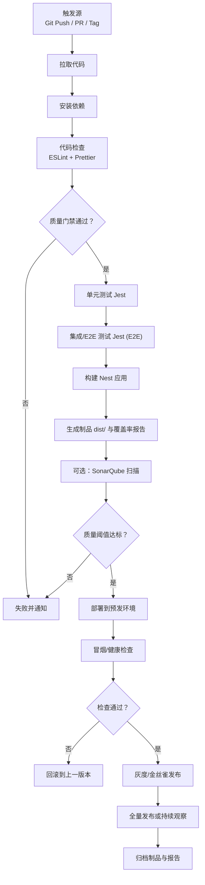
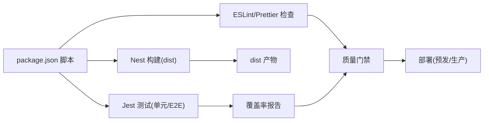

# CI/CD 流水线

<cite>
**本文引用的文件列表**
- [package.json](file://package.json)
- [README.md](file://README.md)
- [eslint.config.mjs](file://eslint.config.mjs)
- [.prettierrc](file://.prettierrc)
- [nest-cli.json](file://nest-cli.json)
- [tsconfig.json](file://tsconfig.json)
- [tsconfig.build.json](file://tsconfig.build.json)
- [test/jest-e2e.json](file://test/jest-e2e.json)
- [src/main.ts](file://src/main.ts)
- [src/app.module.ts](file://src/app.module.ts)
</cite>

## 目录
1. [简介](#简介)
2. [项目结构](#项目结构)
3. [核心组件](#核心组件)
4. [架构总览](#架构总览)
5. [详细组件分析](#详细组件分析)
6. [依赖关系分析](#依赖关系分析)
7. [性能考虑](#性能考虑)
8. [故障排查指南](#故障排查指南)
9. [结论](#结论)
10. [附录](#附录)

## 简介
本方案为博客系统提供端到端的 CI/CD 流水线配置，覆盖代码检查、单元测试、集成测试、构建与部署。包含：
- GitHub Actions 工作流：自动化 lint、格式化、单测、E2E、构建产物生成与发布。
- Jenkins Pipeline：多分支策略、并行执行、质量门禁（ESLint、Prettier、SonarQube）、蓝绿/金丝雀发布与回滚。
- 自动化测试策略：单元、集成、端到端分层执行与覆盖率收集。
- 部署策略：蓝绿、金丝雀与一键回滚，结合环境变量与容器化最佳实践。

## 项目结构
仓库采用 NestJS 标准结构，包含 API 模块、通用过滤器/守卫/拦截器、Jest 测试配置以及 ESLint/Prettier 规则。CI/CD 将基于现有脚本与配置进行编排。

图示来源
- [src/main.ts:1-46](file://src/main.ts#L1-L46)
- [src/app.module.ts:1-35](file://src/app.module.ts#L1-L35)
- [test/jest-e2e.json:1-10](file://test/jest-e2e.json#L1-L10)
- [eslint.config.mjs:1-68](file://eslint.config.mjs#L1-L68)
- [.prettierrc:1-5](file://.prettierrc#L1-L5)
- [nest-cli.json:1-9](file://nest-cli.json#L1-L9)
- [tsconfig.json:1-25](file://tsconfig.json#L1-L25)
- [tsconfig.build.json:1-5](file://tsconfig.build.json#L1-L5)
- [package.json:1-100](file://package.json#L1-L100)

章节来源
- [package.json:1-100](file://package.json#L1-L100)
- [README.md:1-100](file://README.md#L1-L100)

## 核心组件
- 构建与运行脚本：通过包管理器的脚本命令统一入口，便于在 CI 中复用。
- 代码质量：ESLint + Prettier 规则集中配置，支持自动修复与提交前钩子。
- 测试框架：Jest 用于单元与 E2E 测试，分别使用不同配置文件。
- 应用启动：Nest 应用入口启用会话、全局异常过滤、校验管道与 Swagger 文档。

章节来源
- [package.json:8-21](file://package.json#L8-L21)
- [eslint.config.mjs:1-68](file://eslint.config.mjs#L1-L68)
- [.prettierrc:1-5](file://.prettierrc#L1-L5)
- [test/jest-e2e.json:1-10](file://test/jest-e2e.json#L1-L10)
- [src/main.ts:1-46](file://src/main.ts#L1-L46)

## 架构总览
下图展示从代码提交到生产发布的完整流水线阶段与数据流向。

[此图为概念性流程图，不直接映射具体源码文件]

## 详细组件分析

### GitHub Actions 工作流设计
目标：在每次 push 与 pull_request 时执行 lint、格式化、单测、E2E、构建与制品归档；在打 tag 时触发发布流程。

建议的工作流要点（以步骤说明为主）：
- 触发条件：push、pull_request、release/tag。
- 矩阵策略：Node.js 版本矩阵（如 LTS 与最新稳定版）。
- 缓存：pnpm 依赖缓存与构建缓存。
- 阶段划分：
  - 准备：检出代码、设置 Node、恢复缓存、安装依赖。
  - 代码质量：lint、format 检查。
  - 单元测试：运行 Jest 单测并收集覆盖率。
  - E2E 测试：启动数据库等外部依赖（如有），运行 E2E 用例。
  - 构建：执行 Nest 构建，输出 dist。
  - 制品：上传 dist 与覆盖率报告。
  - 可选：SonarQube 扫描与质量门。
  - 部署：在 tag 或特定分支上触发预发/生产部署。

关键命令参考路径
- 安装依赖与缓存：见 [package.json:1-100](file://package.json#L1-L100)
- 代码检查与格式化：见 [package.json:8-21](file://package.json#L8-L21)、[eslint.config.mjs:1-68](file://eslint.config.mjs#L1-L68)、[.prettierrc:1-5](file://.prettierrc#L1-L5)
- 单元测试与覆盖率：见 [package.json:8-21](file://package.json#L8-L21)
- E2E 测试：见 [package.json:8-21](file://package.json#L8-L21)、[test/jest-e2e.json:1-10](file://test/jest-e2e.json#L1-L10)
- 构建与产物：见 [package.json:8-21](file://package.json#L8-L21)、[nest-cli.json:1-9](file://nest-cli.json#L1-L9)、[tsconfig.build.json:1-5](file://tsconfig.build.json#L1-L5)

章节来源
- [package.json:8-21](file://package.json#L8-L21)
- [eslint.config.mjs:1-68](file://eslint.config.mjs#L1-L68)
- [.prettierrc:1-5](file://.prettierrc#L1-L5)
- [test/jest-e2e.json:1-10](file://test/jest-e2e.json#L1-L10)
- [nest-cli.json:1-9](file://nest-cli.json#L1-L9)
- [tsconfig.build.json:1-5](file://tsconfig.build.json#L1-L5)

### Jenkins Pipeline 设计
目标：支持多分支策略、并行执行、质量门禁与多种部署模式（蓝绿、金丝雀、回滚）。

建议的 Pipeline 阶段（以步骤说明为主）：
- 参数化与分支策略：
  - 支持分支变量（如 develop、feature/*、release/*、main）。
  - 根据分支选择构建矩阵与部署目标。
- 并行阶段：
  - 并行执行 lint/format、单元测试、E2E、构建。
- 质量门禁：
  - 集成 SonarQube 扫描，设置质量阈值（覆盖率、重复率、漏洞等）。
- 制品与缓存：
  - 缓存 pnpm 依赖与构建产物。
  - 归档 dist 与覆盖率报告。
- 部署策略：
  - 预发环境：自动部署并执行健康检查。
  - 生产环境：按标签或审批后触发。
  - 蓝绿部署：双实例切换流量，快速回滚。
  - 金丝雀发布：小流量验证后逐步放量。
  - 回滚机制：保留最近 N 个版本，一键回滚。

关键命令参考路径
- 构建与运行：见 [package.json:8-21](file://package.json#L8-L21)
- 测试配置：见 [test/jest-e2e.json:1-10](file://test/jest-e2e.json#L1-L10)
- 应用启动与环境：见 [src/main.ts:1-46](file://src/main.ts#L1-L46)

章节来源
- [package.json:8-21](file://package.json#L8-L21)
- [test/jest-e2e.json:1-10](file://test/jest-e2e.json#L1-L10)
- [src/main.ts:1-46](file://src/main.ts#L1-L46)

### 自动化测试集成策略
分层测试与执行策略：
- 单元测试：
  - 使用 Jest 运行所有 *.spec.ts 用例。
  - 开启覆盖率收集，输出至 coverage 目录。
- 集成/E2E 测试：
  - 使用独立 Jest 配置（test/jest-e2e.json），匹配 .e2e-spec.ts。
  - 建议在 CI 中启动必要的外部服务（如数据库），或使用内存/临时实例。
- 并行与隔离：
  - 大工程可拆分任务并行执行，确保测试隔离与结果稳定。
- 失败处理：
  - 任一阶段失败即阻断后续流程，并产出日志与报告供定位。

章节来源
- [package.json:8-21](file://package.json#L8-L21)
- [test/jest-e2e.json:1-10](file://test/jest-e2e.json#L1-L10)

### 代码质量门禁配置
- ESLint：
  - 使用 TypeScript 解析器与推荐规则集，结合 import/order、padding-line-between-statements 等规则提升一致性。
  - 在 CI 中以只读模式运行，禁止自动修复，保证门禁严格。
- Prettier：
  - 统一代码风格（单引号、尾随逗号等），在提交前与 CI 双重保障。
- SonarQube：
  - 在构建后执行扫描，设置质量阈值（覆盖率、重复率、安全漏洞等），未达标则阻断发布。

章节来源
- [eslint.config.mjs:1-68](file://eslint.config.mjs#L1-L68)
- [.prettierrc:1-5](file://.prettierrc#L1-L5)

### 部署策略配置
- 蓝绿部署：
  - 同时维护两套相同环境，新流量切到新实例，旧实例保留以便快速回滚。
- 金丝雀发布：
  - 先向少量用户开放新版本，监控指标（错误率、延迟、资源占用）后再逐步放量。
- 回滚机制：
  - 保留最近若干版本制品，出现问题时立即切换至上一稳定版本。
- 健康检查与冒烟测试：
  - 部署后对关键接口与健康端点进行检查，失败则自动回滚。

[本节为策略性说明，不直接引用具体源码文件]

## 依赖关系分析
- 构建与运行依赖：
  - Nest CLI 与 SWC 加速构建。
  - TypeORM 与 MySQL 驱动用于数据访问。
  - JWT、bcrypt、class-validator 等用于认证与校验。
- 开发工具链：
  - ESLint、Prettier、husky、lint-staged 保障代码质量与提交规范。
  - Jest、Supertest 支撑单元与 E2E 测试。
- 类型与运行时：
  - TypeScript 编译配置与路径别名 @/*。
  - Nest 应用入口启用会话、全局过滤器、校验管道与 Swagger。

图示来源
- [package.json:8-21](file://package.json#L8-L21)
- [eslint.config.mjs:1-68](file://eslint.config.mjs#L1-L68)
- [.prettierrc:1-5](file://.prettierrc#L1-L5)
- [test/jest-e2e.json:1-10](file://test/jest-e2e.json#L1-L10)
- [nest-cli.json:1-9](file://nest-cli.json#L1-L9)
- [tsconfig.json:1-25](file://tsconfig.json#L1-L25)
- [tsconfig.build.json:1-5](file://tsconfig.build.json#L1-L5)

章节来源
- [package.json:1-100](file://package.json#L1-L100)
- [tsconfig.json:1-25](file://tsconfig.json#L1-L25)
- [tsconfig.build.json:1-5](file://tsconfig.build.json#L1-L5)
- [nest-cli.json:1-9](file://nest-cli.json#L1-L9)

## 性能考虑
- 构建优化：
  - 使用 SWC 加速编译，减少构建时间。
  - 利用 pnpm 缓存与增量构建，缩短冷启动。
- 测试优化：
  - 并行执行测试套件，合理拆分 E2E 用例。
  - 使用内存数据库或轻量级外部服务加速 E2E。
- 部署优化：
  - 蓝绿/金丝雀降低风险与停机时间。
  - 健康检查与快速回滚缩短故障影响面。

[本节为通用指导，不直接引用具体源码文件]

## 故障排查指南
- 构建失败：
  - 检查 TypeScript 配置与路径别名是否正确。
  - 确认依赖安装与缓存命中情况。
- 测试失败：
  - 查看 Jest 输出与覆盖率报告，定位失败用例。
  - E2E 需确认外部服务可用性与网络连通性。
- 质量门禁失败：
  - 根据 ESLint/Prettier 提示修复代码风格问题。
  - 调整 SonarQube 阈值或修复缺陷。
- 部署失败：
  - 检查环境变量与端口绑定。
  - 查看健康检查与日志，必要时回滚。

章节来源
- [src/main.ts:1-46](file://src/main.ts#L1-L46)
- [src/app.module.ts:1-35](file://src/app.module.ts#L1-L35)
- [package.json:8-21](file://package.json#L8-L21)

## 结论
本方案围绕现有 NestJS 项目结构与工具链，提供了完整的 CI/CD 流水线设计与落地指引。通过 GitHub Actions 与 Jenkins Pipeline 的组合，实现从代码质量到部署的全链路自动化，并支持蓝绿、金丝雀与回滚等高级发布策略，确保交付质量与稳定性。

## 附录
- 常用命令参考路径：
  - 构建：见 [package.json:8-21](file://package.json#L8-L21)
  - 格式化：见 [package.json:8-21](file://package.json#L8-L21)、[.prettierrc:1-5](file://.prettierrc#L1-L5)
  - 代码检查：见 [package.json:8-21](file://package.json#L8-L21)、[eslint.config.mjs:1-68](file://eslint.config.mjs#L1-L68)
  - 单元测试：见 [package.json:8-21](file://package.json#L8-L21)
  - E2E 测试：见 [package.json:8-21](file://package.json#L8-L21)、[test/jest-e2e.json:1-10](file://test/jest-e2e.json#L1-L10)
  - 应用启动：见 [src/main.ts:1-46](file://src/main.ts#L1-L46)