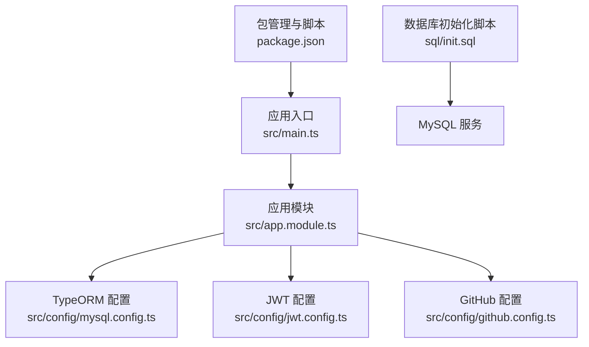
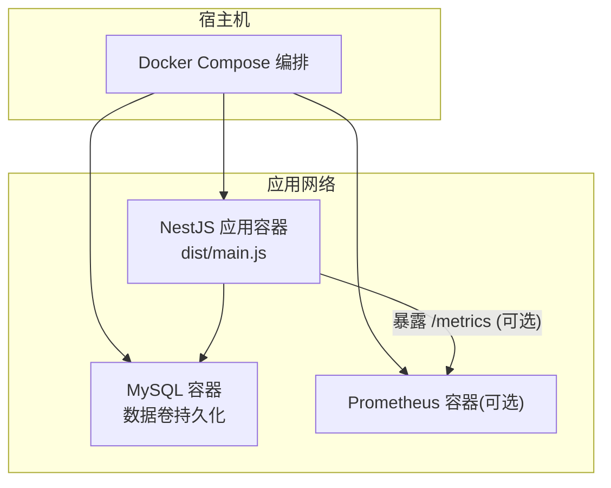
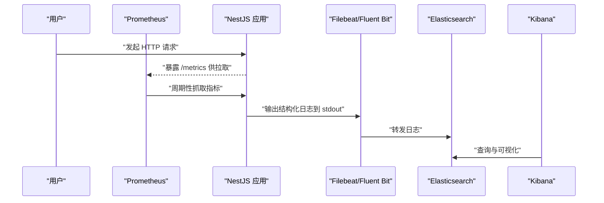
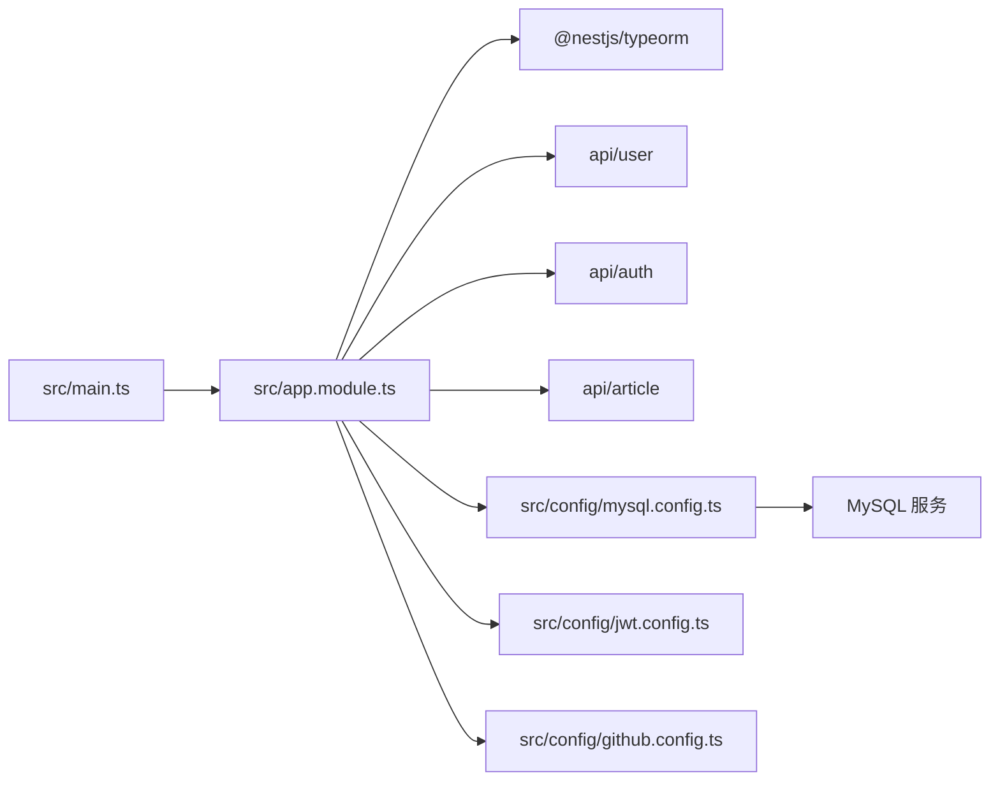

# Docker 容器化部署

<cite>
**本文引用的文件**   
- [README.md](file://README.md)
- [package.json](file://package.json)
- [src/main.ts](file://src/main.ts)
- [src/app.module.ts](file://src/app.module.ts)
- [src/config/mysql.config.ts](file://src/config/mysql.config.ts)
- [src/config/jwt.config.ts](file://src/config/jwt.config.ts)
- [src/config/github.config.ts](file://src/config/github.config.ts)
- [sql/init.sql](file://sql/init.sql)
</cite>

## 目录
1. [简介](#简介)
2. [项目结构](#项目结构)
3. [核心组件](#核心组件)
4. [架构总览](#架构总览)
5. [详细组件分析](#详细组件分析)
6. [依赖关系分析](#依赖关系分析)
7. [性能与镜像优化](#性能与镜像优化)
8. [故障排查指南](#故障排查指南)
9. [结论](#结论)
10. [附录](#附录)

## 简介
本方案面向该 NestJS 博客系统，提供完整的 Docker 容器化部署指南。内容涵盖：
- 多阶段 Dockerfile 编写（构建阶段优化、运行时镜像精简）
- 环境变量配置管理（支持不同环境切换）
- Docker Compose 编排（应用服务与 MySQL 协同部署）
- 镜像优化最佳实践（层缓存、体积优化、安全扫描）
- 容器监控与日志收集（Prometheus 指标采集、ELK/EFK 日志链路）

## 项目结构
仓库为 NestJS 后端工程，包含 API 模块、TypeORM 配置、全局过滤器/拦截器/守卫、以及数据库初始化脚本。生产运行入口通过 dist/main.js 启动，端口默认 3001，可通过环境变量覆盖。

**图表来源**
- [src/main.ts:1-46](file://src/main.ts#L1-L46)
- [src/app.module.ts:1-35](file://src/app.module.ts#L1-L35)
- [src/config/mysql.config.ts:1-15](file://src/config/mysql.config.ts#L1-L15)
- [src/config/jwt.config.ts:1-5](file://src/config/jwt.config.ts#L1-L5)
- [src/config/github.config.ts:1-6](file://src/config/github.config.ts#L1-L6)
- [sql/init.sql:1-138](file://sql/init.sql#L1-L138)
- [package.json:1-100](file://package.json#L1-L100)

**章节来源**
- [README.md:25-72](file://README.md#L25-L72)
- [package.json:8-21](file://package.json#L8-L21)
- [src/main.ts:40-46](file://src/main.ts#L40-L46)
- [src/app.module.ts:11-17](file://src/app.module.ts#L11-L17)
- [src/config/mysql.config.ts:3-12](file://src/config/mysql.config.ts#L3-L12)
- [sql/init.sql:1-138](file://sql/init.sql#L1-L138)

## 核心组件
- 应用入口与中间件
  - 使用 NestFactory 创建 Express 应用，启用信任代理、全局异常过滤器、验证管道，并挂载 Swagger 文档。
  - 监听端口优先读取环境变量，否则回退到 3001。
- 应用模块与依赖注入
  - 注册 TypeORM 连接、业务模块、全局过滤器/拦截器/守卫。
- 配置项
  - TypeORM 连接参数（host/port/username/password/database）。
  - JWT 密钥、GitHub OAuth 客户端凭据等。
- 数据库初始化
  - 提供建库、建表、索引与初始标签数据脚本。

**章节来源**
- [src/main.ts:9-46](file://src/main.ts#L9-L46)
- [src/app.module.ts:11-33](file://src/app.module.ts#L11-L33)
- [src/config/mysql.config.ts:3-12](file://src/config/mysql.config.ts#L3-L12)
- [src/config/jwt.config.ts:1-5](file://src/config/jwt.config.ts#L1-L5)
- [src/config/github.config.ts:1-6](file://src/config/github.config.ts#L1-L6)
- [sql/init.sql:1-138](file://sql/init.sql#L1-L138)

## 架构总览
下图展示容器化后的整体部署形态：NestJS 应用容器通过环境变量连接外部 MySQL 容器；日志输出至标准输出，便于集中收集；可选接入 Prometheus 抓取 Node 指标。

[此图为概念性架构图，不直接映射具体源码文件]

## 详细组件分析

### 多阶段 Dockerfile 编写指南
目标：在构建阶段完成依赖安装与编译，在运行时仅保留产物与最小基础镜像。

建议的分阶段设计要点：
- 构建阶段
  - 基于包含 pnpm 的 Node 镜像，复制 package.json 与锁文件，执行依赖安装与类型检查。
  - 执行 nest build 生成 dist 产物。
- 运行时阶段
  - 基于精简 Node 镜像，仅复制 dist 与必要资源。
  - 设置非 root 用户运行，暴露端口，指定启动命令。
- 层缓存优化
  - 先复制依赖清单再安装依赖，利用层缓存加速重复构建。
  - 将 .env 或配置文件放在最后复制，避免变更配置触发全量重建。
- 安全与体积
  - 使用 --prod 模式安装依赖，剔除 devDependencies。
  - 清理构建缓存，移除不必要的工具链。
- 健康检查与信号处理
  - 配置 HEALTHCHECK 探测端点。
  - 确保进程能优雅关闭（SIGTERM/SIGINT）。

参考路径（用于对照实现细节）：
- [package.json:8-21](file://package.json#L8-L21)
- [src/main.ts:40-46](file://src/main.ts#L40-L46)

**章节来源**
- [package.json:8-21](file://package.json#L8-L21)
- [src/main.ts:40-46](file://src/main.ts#L40-L46)

### 环境变量配置管理（多环境切换）
原则：
- 所有敏感信息与差异配置通过环境变量注入，禁止硬编码。
- 应用启动时从环境变量读取关键参数，如端口、数据库连接、第三方服务凭据。

需要支持的环境变量（示例）：
- 应用
  - PORT：服务监听端口（默认 3001）
  - NODE_ENV：运行环境（development/production）
- 数据库
  - DB_HOST、DB_PORT、DB_USERNAME、DB_PASSWORD、DB_DATABASE
- 认证与第三方
  - JWT_ACCESS_SECRET、JWT_REFRESH_SECRET
  - GITHUB_CLIENT_ID、GITHUB_CLIENT_SECRET
- 其他
  - TZ：时区
  - LOG_LEVEL：日志级别

配置落地方式：
- 在 src/config/*.ts 中读取环境变量，并提供默认值。
- 在 docker-compose.yml 中按环境注入不同的 .env 文件。

参考路径：
- [src/main.ts:40-46](file://src/main.ts#L40-L46)
- [src/config/mysql.config.ts:3-12](file://src/config/mysql.config.ts#L3-L12)
- [src/config/jwt.config.ts:1-5](file://src/config/jwt.config.ts#L1-L5)
- [src/config/github.config.ts:1-6](file://src/config/github.config.ts#L1-L6)

**章节来源**
- [src/main.ts:40-46](file://src/main.ts#L40-L46)
- [src/config/mysql.config.ts:3-12](file://src/config/mysql.config.ts#L3-L12)
- [src/config/jwt.config.ts:1-5](file://src/config/jwt.config.ts#L1-L5)
- [src/config/github.config.ts:1-6](file://src/config/github.config.ts#L1-L6)

### Docker Compose 编排（应用 + 数据库）
目标：一键拉起应用与数据库，支持数据持久化与环境隔离。

建议的服务定义要点：
- 应用服务
  - 镜像：由多阶段构建产出
  - 端口映射：宿主端口 -> 容器端口
  - 环境变量：引用 .env 文件
  - 依赖：depends_on 数据库服务
  - 健康检查：HTTP 探针
- 数据库服务
  - 镜像：官方 MySQL
  - 数据卷：持久化 /var/lib/mysql
  - 初始化：挂载 sql/init.sql 到容器初始化目录
  - 环境变量：ROOT_PASSWORD、MYSQL_DATABASE、MYSQL_USER、MYSQL_PASSWORD

参考路径：
- [sql/init.sql:1-138](file://sql/init.sql#L1-L138)
- [src/config/mysql.config.ts:3-12](file://src/config/mysql.config.ts#L3-L12)

**章节来源**
- [sql/init.sql:1-138](file://sql/init.sql#L1-L138)
- [src/config/mysql.config.ts:3-12](file://src/config/mysql.config.ts#L3-L12)

### 镜像优化最佳实践
- 层缓存利用
  - 先复制依赖清单与锁文件，再安装依赖，最后复制源码与构建产物。
  - 将易变文件（如 .env、配置文件）置于最后复制。
- 镜像体积优化
  - 构建阶段使用完整 Node 镜像，运行阶段使用 slim/alpine 变体。
  - 仅复制 dist 与必要静态资源，删除构建缓存与临时文件。
  - 使用多阶段构建，避免将开发依赖带入运行镜像。
- 安全扫描
  - 集成 Trivy 或 Snyk 在 CI 中对镜像进行漏洞扫描。
  - 定期更新基础镜像版本，修复已知漏洞。
- 可观测性与健壮性
  - 暴露健康检查端点，配置 HEALTHCHECK。
  - 合理设置内存限制与 CPU 配额，避免 OOM。

参考路径：
- [package.json:8-21](file://package.json#L8-L21)
- [src/main.ts:40-46](file://src/main.ts#L40-L46)

**章节来源**
- [package.json:8-21](file://package.json#L8-L21)
- [src/main.ts:40-46](file://src/main.ts#L40-L46)

### 容器监控与日志收集方案
- 指标采集（Prometheus）
  - 在应用中引入 Node 指标采集中间件，暴露 /metrics 端点。
  - 在 Prometheus 中配置 scrape_configs 抓取应用指标。
  - Grafana 可视化关键指标（QPS、延迟、错误率、JVM/Node 运行时指标）。
- 日志收集（ELK/EFK）
  - 应用统一输出结构化 JSON 日志到 stdout/stderr。
  - Filebeat/Fluent Bit 采集容器日志，转发至 Elasticsearch。
  - Kibana 进行检索、告警与可视化。
- 链路追踪（可选）
  - 集成 OpenTelemetry，统一埋点，关联请求链路。

[此图为概念性流程图，不直接映射具体源码文件]

## 依赖关系分析
- 应用入口依赖应用模块，应用模块依赖 TypeORM 与各业务模块。
- TypeORM 依赖外部 MySQL 服务。
- 第三方配置（JWT、GitHub）作为独立配置模块被应用加载。

**图表来源**
- [src/main.ts:1-10](file://src/main.ts#L1-L10)
- [src/app.module.ts:1-17](file://src/app.module.ts#L1-L17)
- [src/config/mysql.config.ts:1-12](file://src/config/mysql.config.ts#L1-L12)
- [src/config/jwt.config.ts:1-5](file://src/config/jwt.config.ts#L1-L5)
- [src/config/github.config.ts:1-6](file://src/config/github.config.ts#L1-L6)

**章节来源**
- [src/main.ts:1-10](file://src/main.ts#L1-L10)
- [src/app.module.ts:1-17](file://src/app.module.ts#L1-L17)
- [src/config/mysql.config.ts:1-12](file://src/config/mysql.config.ts#L1-L12)
- [src/config/jwt.config.ts:1-5](file://src/config/jwt.config.ts#L1-L5)
- [src/config/github.config.ts:1-6](file://src/config/github.config.ts#L1-L6)

## 性能与镜像优化
- 构建期
  - 使用 pnpm 锁定依赖版本，减少解析时间。
  - 并行安装依赖（若工具链支持），开启构建缓存。
- 运行期
  - 调整 Node 堆大小与线程池大小，匹配容器资源限制。
  - 启用 gzip/brotli 压缩（反向代理层）。
  - 数据库连接池参数根据 QPS 调优。
- 镜像
  - 选择合适的基础镜像版本，避免过大。
  - 合并 RUN 指令，减少层数。
  - 使用 .dockerignore 排除无关文件。

[本节为通用指导，不直接分析具体文件]

## 故障排查指南
- 启动失败
  - 检查环境变量是否注入正确（端口、数据库连接、密钥）。
  - 查看容器日志定位异常堆栈。
- 数据库连接失败
  - 确认数据库服务已就绪，账号密码与库名一致。
  - 检查防火墙与安全组策略。
- 权限问题
  - 确保以非 root 用户运行应用容器。
  - 数据卷权限与 SELinux/AppArmor 策略。
- 性能瓶颈
  - 观察 CPU/内存使用率，调整资源限制。
  - 分析慢查询与连接池耗尽情况。

**章节来源**
- [src/main.ts:40-46](file://src/main.ts#L40-L46)
- [src/config/mysql.config.ts:3-12](file://src/config/mysql.config.ts#L3-L12)

## 结论
通过多阶段构建、环境变量驱动的配置管理、Compose 编排与完善的监控日志体系，可将该 NestJS 博客系统稳定地部署到生产环境。配合镜像优化与安全扫描，可在保证安全性的同时获得更小的镜像体积与更快的冷启动速度。

## 附录
- 常用命令（概念性说明）
  - 构建镜像：在仓库根目录执行构建流程，产出应用镜像。
  - 启动服务：使用 Compose 拉起应用与数据库。
  - 查看日志：实时查看应用与数据库日志。
  - 健康检查：访问健康端点验证服务状态。
- 参考路径
  - [package.json:8-21](file://package.json#L8-L21)
  - [src/main.ts:40-46](file://src/main.ts#L40-L46)
  - [sql/init.sql:1-138](file://sql/init.sql#L1-L138)