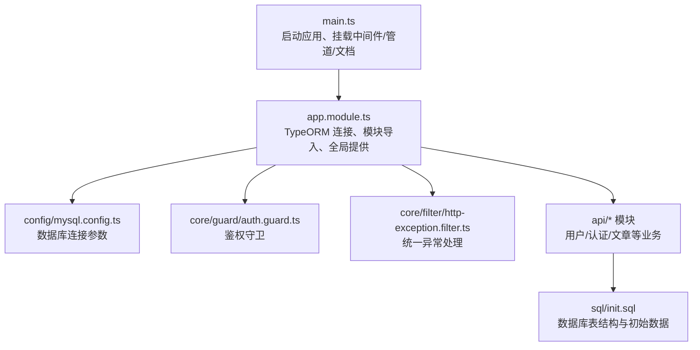
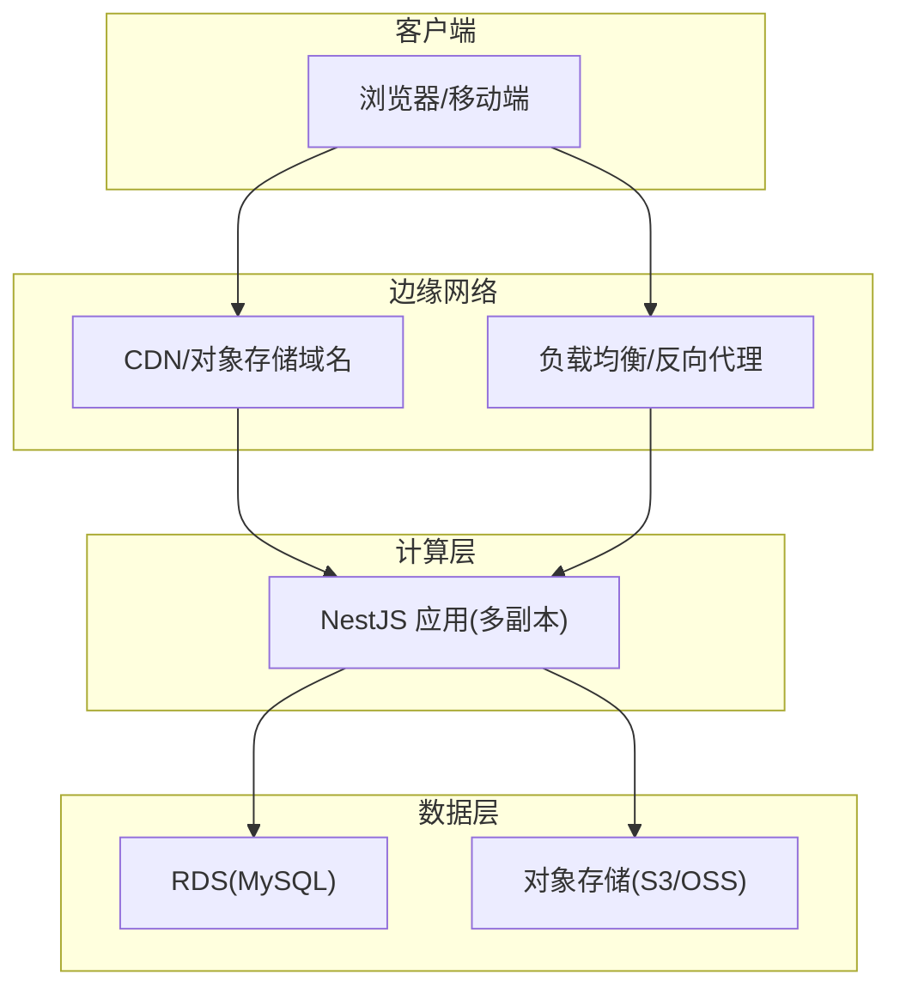
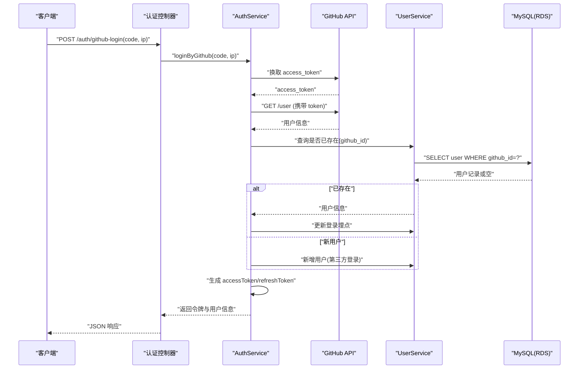
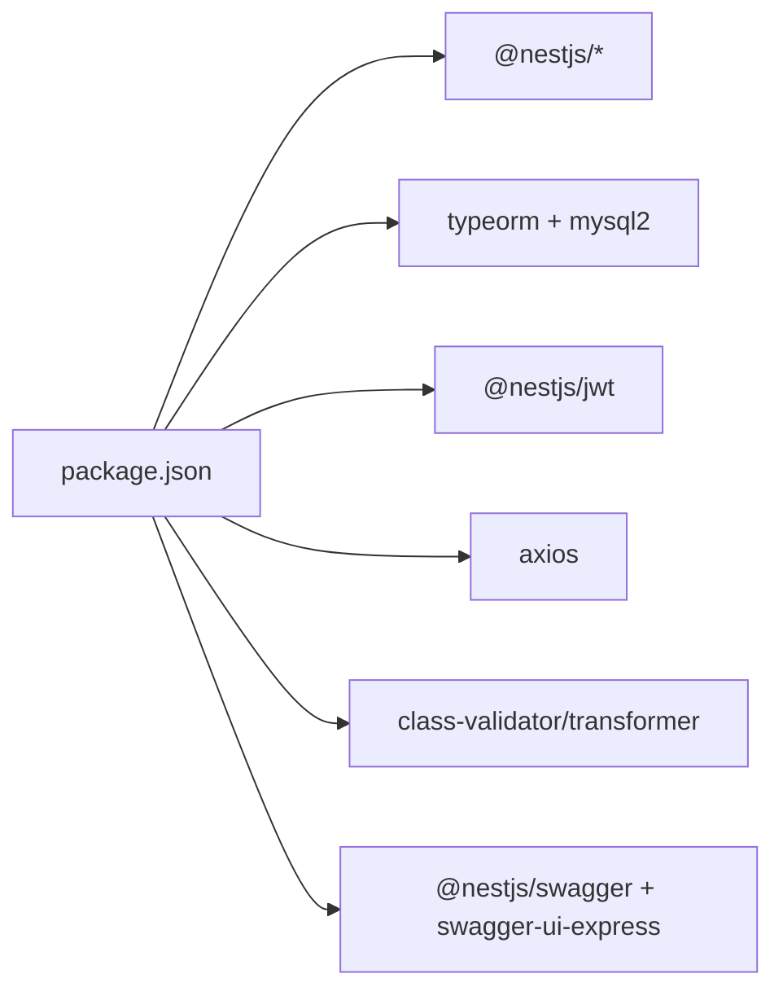

# 云平台部署

<cite>
**本文引用的文件列表**
- [package.json](file://package.json)
- [README.md](file://README.md)
- [nest-cli.json](file://nest-cli.json)
- [src/main.ts](file://src/main.ts)
- [src/app.module.ts](file://src/app.module.ts)
- [src/config/mysql.config.ts](file://src/config/mysql.config.ts)
- [src/config/jwt.config.ts](file://src/config/jwt.config.ts)
- [src/config/github.config.ts](file://src/config/github.config.ts)
- [sql/init.sql](file://sql/init.sql)
- [src/api/auth/auth.service.ts](file://src/api/auth/auth.service.ts)
- [src/core/guard/auth.guard.ts](file://src/core/guard/auth.guard.ts)
- [src/core/filter/http-exception.filter.ts](file://src/core/filter/http-exception.filter.ts)
</cite>

## 目录
1. [简介](#简介)
2. [项目结构](#项目结构)
3. [核心组件](#核心组件)
4. [架构总览](#架构总览)
5. [详细组件分析](#详细组件分析)
6. [依赖分析](#依赖分析)
7. [性能考虑](#性能考虑)
8. [故障排查指南](#故障排查指南)
9. [结论](#结论)
10. [附录：云平台部署方案](#附录云平台部署方案)

## 简介
本指南面向博客系统（基于 NestJS + TypeORM + MySQL）在主流云平台的部署与运维。内容覆盖：
- AWS 部署：EC2 实例、RDS 数据库、S3 静态资源托管
- 阿里云部署：ECS 服务器、RDS 数据库管理、CDN 加速配置
- Kubernetes 集群部署：Pod、Service、Ingress 配置
- 云原生最佳实践：弹性伸缩、健康检查、故障转移
- 成本优化建议与监控告警配置

## 项目结构
本项目采用 NestJS 模块化架构，入口为 main.ts，应用模块 app.module.ts 中注册全局过滤器、拦截器、守卫以及数据库连接；业务按用户、认证、文章等模块划分；数据库初始化脚本位于 sql/init.sql。

图表来源
- [src/main.ts:1-46](file://src/main.ts#L1-L46)
- [src/app.module.ts:1-35](file://src/app.module.ts#L1-L35)
- [src/config/mysql.config.ts:1-15](file://src/config/mysql.config.ts#L1-L15)
- [src/core/guard/auth.guard.ts:1-53](file://src/core/guard/auth.guard.ts#L1-L53)
- [src/core/filter/http-exception.filter.ts:1-37](file://src/core/filter/http-exception.filter.ts#L1-L37)
- [sql/init.sql:1-138](file://sql/init.sql#L1-L138)

章节来源
- [package.json:1-100](file://package.json#L1-L100)
- [README.md:1-100](file://README.md#L1-L100)
- [nest-cli.json:1-9](file://nest-cli.json#L1-L9)
- [src/main.ts:1-46](file://src/main.ts#L1-L46)
- [src/app.module.ts:1-35](file://src/app.module.ts#L1-L35)
- [src/config/mysql.config.ts:1-15](file://src/config/mysql.config.ts#L1-L15)
- [sql/init.sql:1-138](file://sql/init.sql#L1-L138)

## 核心组件
- 应用入口与中间件
  - 启动监听端口来自环境变量或默认值，启用信任代理、全局异常过滤器、全局校验管道，并挂载 Swagger 文档。
- 数据库连接
  - 通过 TypeORM 以 mysql 类型连接，使用自动加载实体与日期字符串模式。
- 安全与鉴权
  - 全局 AuthGuard 对请求进行 JWT 校验，支持刷新令牌路径的特殊处理。
- 异常处理
  - 统一捕获 HttpException，返回标准化响应体，便于前端与网关层解析。

章节来源
- [src/main.ts:1-46](file://src/main.ts#L1-L46)
- [src/app.module.ts:1-35](file://src/app.module.ts#L1-L35)
- [src/config/mysql.config.ts:1-15](file://src/config/mysql.config.ts#L1-L15)
- [src/core/guard/auth.guard.ts:1-53](file://src/core/guard/auth.guard.ts#L1-L53)
- [src/core/filter/http-exception.filter.ts:1-37](file://src/core/filter/http-exception.filter.ts#L1-L37)

## 架构总览
下图展示生产环境典型部署拓扑：客户端经 CDN/负载均衡访问 API 服务，API 服务连接 RDS 数据库，静态资源可托管至对象存储并通过域名分发。

[此图为概念性架构图，不直接映射具体源码文件]

## 详细组件分析

### 认证流程（GitHub OAuth + JWT）
该流程包含获取 GitHub access_token、拉取用户信息、本地用户匹配或注册、签发 JWT 令牌。

图表来源
- [src/api/auth/auth.service.ts:1-123](file://src/api/auth/auth.service.ts#L1-L123)
- [src/config/github.config.ts:1-6](file://src/config/github.config.ts#L1-L6)
- [src/config/jwt.config.ts:1-5](file://src/config/jwt.config.ts#L1-L5)
- [src/core/guard/auth.guard.ts:1-53](file://src/core/guard/auth.guard.ts#L1-L53)

章节来源
- [src/api/auth/auth.service.ts:1-123](file://src/api/auth/auth.service.ts#L1-L123)
- [src/config/github.config.ts:1-6](file://src/config/github.config.ts#L1-L6)
- [src/config/jwt.config.ts:1-5](file://src/config/jwt.config.ts#L1-L5)
- [src/core/guard/auth.guard.ts:1-53](file://src/core/guard/auth.guard.ts#L1-L53)

### 鉴权守卫与公共接口
- 全局守卫从 Authorization 头提取 Bearer Token，根据路由标记判断是否为公开接口。
- 刷新令牌路径使用 refreshSecretKey 验证，其他路径使用 accessSecretKey。

章节来源
- [src/core/guard/auth.guard.ts:1-53](file://src/core/guard/auth.guard.ts#L1-L53)
- [src/config/jwt.config.ts:1-5](file://src/config/jwt.config.ts#L1-L5)

### 统一异常处理
- 捕获所有 HttpException，将状态码与消息规范化输出，便于网关与前端统一处理。

章节来源
- [src/core/filter/http-exception.filter.ts:1-37](file://src/core/filter/http-exception.filter.ts#L1-L37)

### 数据库模型与初始化
- 用户表、文章表、标签表、邮箱验证码表均已定义，并提供索引与默认值策略。
- 初始化脚本创建数据库与基础标签数据，供首次部署执行。

章节来源
- [sql/init.sql:1-138](file://sql/init.sql#L1-L138)

## 依赖分析
- 运行时依赖
  - @nestjs/* 系列框架与平台
  - typeorm + mysql2 作为 ORM 与驱动
  - @nestjs/jwt 用于令牌签发与校验
  - axios 用于外部 HTTP 调用（如 GitHub API）
  - express-session 用于会话（当前未广泛使用）
  - class-validator/class-transformer 用于请求校验与转换
  - swagger-ui-express 与 @nestjs/swagger 用于接口文档
- 构建与开发工具
  - nest-cli、ts-node、ts-jest、eslint、prettier 等

图表来源
- [package.json:1-100](file://package.json#L1-L100)

章节来源
- [package.json:1-100](file://package.json#L1-L100)

## 性能考虑
- 进程与并发
  - 在生产环境建议使用 PM2 或容器编排运行多个 Node.js 实例，充分利用多核 CPU。
- 数据库连接池
  - 合理设置 TypeORM 连接池大小，避免连接耗尽与频繁握手开销。
- 缓存与静态资源
  - 将图片、附件等静态资源迁移到对象存储，配合 CDN 缓存提升读取性能。
- 反向代理与压缩
  - 在负载均衡/反向代理层开启 gzip/brotli 压缩与 HTTP/2。
- 日志与追踪
  - 集中化日志采集，结合链路追踪定位慢请求与热点接口。

[本节为通用指导，不直接分析具体文件]

## 故障排查指南
- 常见错误
  - 鉴权失败：检查 Authorization 头格式、JWT 密钥配置与过期时间。
  - 数据库连接失败：核对 host/port/username/password/database 及网络白名单。
  - 第三方登录失败：确认 GitHub client_id/client_secret 与回调域配置。
- 快速定位
  - 查看应用日志与统一异常响应体中的请求详情（URL、方法、参数）。
  - 使用 Swagger 文档验证接口连通性与入参校验规则。

章节来源
- [src/core/filter/http-exception.filter.ts:1-37](file://src/core/filter/http-exception.filter.ts#L1-L37)
- [src/config/mysql.config.ts:1-15](file://src/config/mysql.config.ts#L1-L15)
- [src/config/jwt.config.ts:1-5](file://src/config/jwt.config.ts#L1-L5)
- [src/config/github.config.ts:1-6](file://src/config/github.config.ts#L1-L6)

## 结论
本指南围绕代码实际实现，给出跨云平台的部署要点与云原生最佳实践。通过合理的网络拓扑、弹性扩缩容、健康检查与监控告警，可在保证可用性的同时控制成本。

[本节为总结性内容，不直接分析具体文件]

## 附录：云平台部署方案

### AWS 部署方案
- EC2 实例配置
  - 选择合适实例规格与操作系统镜像，安装 Node.js LTS 与 pnpm/yarn。
  - 使用 systemd 或 PM2 管理进程，确保开机自启与崩溃重启。
  - 开放必要安全组端口（如 80/443 由反向代理转发，应用端口仅内网访问）。
- RDS 数据库设置
  - 创建 MySQL 实例，配置 VPC 子网与安全组，允许 EC2 所在安全组访问。
  - 执行 sql/init.sql 完成库表与初始数据初始化。
  - 将数据库连接参数通过环境变量注入应用。
- S3 静态资源托管
  - 创建 S3 Bucket，上传头像、文章图片等静态资源。
  - 配置 Bucket 策略与 CORS，必要时通过 CloudFront 分发并绑定自定义域名。
  - 应用侧将文件上传目标改为 S3，并在返回结果中使用 CDN 域名链接。
- 反向代理与 HTTPS
  - 使用 Nginx/Caddy 或 ALB 做反向代理，配置 SSL 证书与 HTTP 强制跳转。
- 弹性伸缩与高可用
  - 使用 Auto Scaling Group 与 Application Load Balancer，基于 CPU/内存或自定义指标扩缩容。
  - 多可用区部署，结合 RDS Multi-AZ 提升可用性。
- 监控告警
  - 使用 CloudWatch 收集应用日志与系统指标，配置告警阈值（CPU、内存、磁盘、连接数）。
  - 针对关键接口与错误率设置 SNS 通知。

[本节为通用指导，不直接分析具体文件]

### 阿里云部署方案
- ECS 服务器配置
  - 选择合适实例规格与镜像，安装 Node.js LTS 与包管理器。
  - 使用 systemd 或 PM2 管理进程，配置开机自启与日志轮转。
  - 安全组放行 80/443，应用端口仅内网访问。
- RDS 数据库管理
  - 创建 MySQL 实例，配置白名单允许 ECS 访问。
  - 执行 sql/init.sql 初始化库表与基础数据。
  - 通过环境变量注入数据库连接参数。
- CDN 加速配置
  - 将静态资源上传至 OSS，开启 CDN 加速并绑定域名。
  - 配置回源地址与缓存策略，结合 HTTPS 证书。
- 负载均衡与高可用
  - 使用 SLB 将流量分发到多台 ECS，结合弹性伸缩组实现自动扩缩容。
  - RDS 可选多可用区部署，保障高可用。
- 监控告警
  - 使用云监控采集主机与应用指标，配置告警规则与短信/邮件通知。
  - 结合日志服务 SLS 进行日志采集与分析。

[本节为通用指导，不直接分析具体文件]

### Kubernetes 集群部署
- 容器化
  - 编写 Dockerfile，基于 Node.js 官方镜像，安装依赖并构建产物。
  - 将敏感配置（数据库、JWT、第三方密钥）放入 Secret。
- Pod 配置
  - 定义 Deployment，设置副本数、资源限制与探针（liveness/readiness）。
  - 通过 ConfigMap/Secret 注入环境变量。
- Service 暴露
  - 使用 ClusterIP Service 暴露内部服务，或通过 NodePort/LoadBalancer 对外暴露（测试环境）。
- Ingress 路由
  - 配置 Ingress 资源，绑定域名与 TLS 证书，将流量转发至 Service。
- 弹性伸缩与健康检查
  - 配置 HPA，基于 CPU/内存或自定义指标自动扩缩容。
  - 配置 readinessProbe 与 livenessProbe，确保滚动更新与故障自愈。
- 持久化与对象存储
  - 静态资源建议存放于对象存储（S3/OSS），无需持久卷。
  - 如需本地缓存，可使用 PVC 或外部缓存服务。
- 监控与日志
  - 使用 Prometheus/Grafana 采集指标，ELK/Loki 收集日志。
  - 配置告警规则与通知渠道。

[本节为通用指导，不直接分析具体文件]

### 云原生最佳实践
- 弹性伸缩
  - 基于 QPS、CPU、内存、队列长度等多维度指标触发扩缩容。
- 健康检查
  - 实现 /health 或 /ready 端点，返回服务就绪状态与依赖健康情况。
- 故障转移机制
  - 多副本部署，结合负载均衡与健康检查实现自动故障转移。
  - 数据库主备切换与只读副本分离读写。
- 灰度发布与回滚
  - 使用蓝绿或金丝雀发布策略，降低变更风险。
- 安全加固
  - 最小权限原则，密钥与证书使用 Secret 管理，定期轮换。
  - 启用 WAF 与速率限制，防护恶意请求。

[本节为通用指导，不直接分析具体文件]

### 成本优化建议
- 实例与数据库
  - 选择合适的实例族与存储类型，利用预留实例/节省计划降低成本。
  - 数据库按需扩容，关闭不必要的功能与备份保留周期。
- 网络与存储
  - 合理使用 CDN 与对象存储生命周期策略，归档冷数据。
  - 内网通信优先，减少公网带宽消耗。
- 观测与治理
  - 精细化监控与告警，避免过度告警导致无效扩容。
  - 定期清理无用资源与镜像，释放空间与费用。

[本节为通用指导，不直接分析具体文件]

### 监控告警配置要点
- 指标采集
  - 应用指标：QPS、延迟分布、错误率、JVM/Node 运行时指标。
  - 基础设施：CPU、内存、磁盘、网络、连接数。
- 日志采集
  - 结构化日志，统一字段规范，便于检索与分析。
- 告警规则
  - 基于阈值与趋势变化设置告警，区分严重级别与通知渠道。
- 可视化
  - 仪表盘展示关键业务与技术指标，辅助排障与容量规划。

[本节为通用指导，不直接分析具体文件]