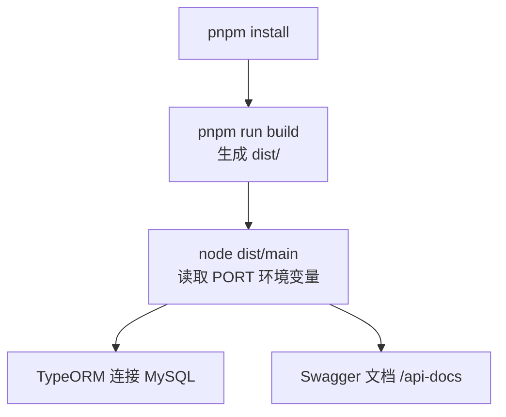
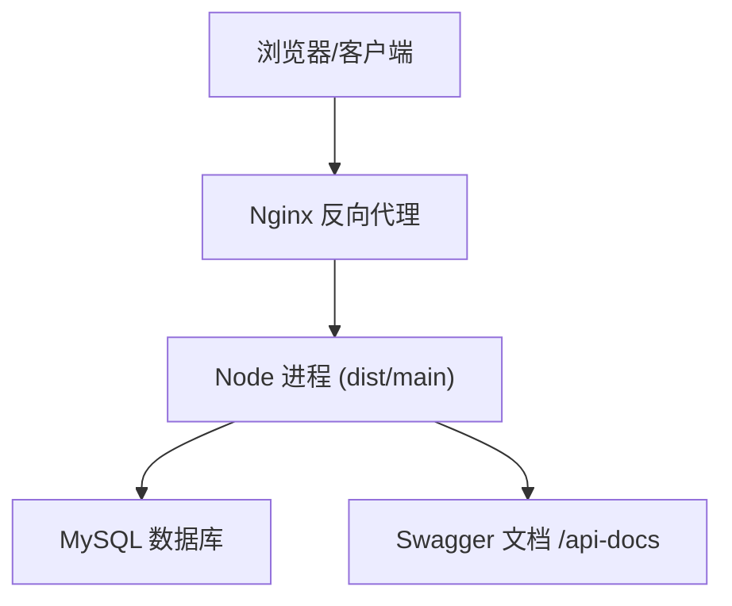
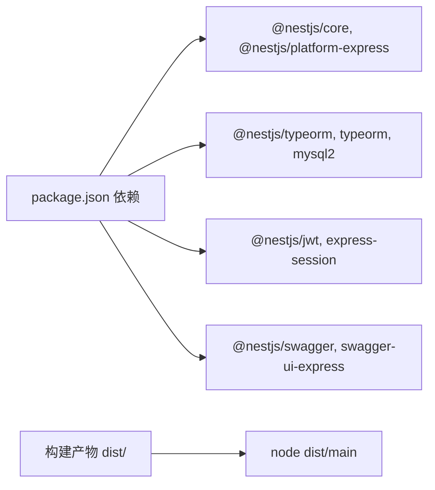

# 传统服务器部署

<cite>
**本文引用的文件**   
- [README.md](file://README.md)
- [package.json](file://package.json)
- [src/main.ts](file://src/main.ts)
- [nest-cli.json](file://nest-cli.json)
- [tsconfig.build.json](file://tsconfig.build.json)
- [src/config/mysql.config.ts](file://src/config/mysql.config.ts)
- [src/config/jwt.config.ts](file://src/config/jwt.config.ts)
- [sql/init.sql](file://sql/init.sql)
</cite>

## 目录
1. [简介](#简介)
2. [项目结构](#项目结构)
3. [核心组件](#核心组件)
4. [架构总览](#架构总览)
5. [详细组件分析](#详细组件分析)
6. [依赖分析](#依赖分析)
7. [性能考虑](#性能考虑)
8. [故障排查指南](#故障排查指南)
9. [结论](#结论)
10. [附录](#附录)

## 简介
本指南面向在传统 Linux 服务器上部署该 NestJS 博客系统，覆盖 Node.js 环境准备、依赖管理、PM2 进程守护与日志、服务自启动（systemd/cron）、Nginx 反向代理与 SSL、以及生产环境优化（内存限制、集群模式、性能参数）等关键步骤。文档中的配置项均基于仓库现有代码与脚本进行说明，确保可落地执行。

## 项目结构
- 应用入口与运行方式：通过 npm/pnpm 脚本构建并运行，生产模式直接执行编译产物。
- 端口与环境变量：应用监听环境变量 PORT，未设置时回退到默认端口。
- 数据库与密钥：提供 MySQL 初始化脚本与 TypeORM 配置示例；JWT 密钥以配置文件形式存在。
- 构建输出：使用 Nest CLI 将 TypeScript 编译至 dist 目录，生产启动命令指向 dist/main。

图表来源
- [package.json:8-21](file://package.json#L8-L21)
- [src/main.ts:40-43](file://src/main.ts#L40-L43)
- [src/config/mysql.config.ts:1-15](file://src/config/mysql.config.ts#L1-L15)
- [nest-cli.json:1-9](file://nest-cli.json#L1-L9)

章节来源
- [README.md:29-46](file://README.md#L29-L46)
- [package.json:8-21](file://package.json#L8-L21)
- [src/main.ts:40-43](file://src/main.ts#L40-L43)
- [nest-cli.json:1-9](file://nest-cli.json#L1-L9)
- [tsconfig.build.json:1-4](file://tsconfig.build.json#L1-L4)

## 核心组件
- 应用入口与中间件
  - 启用信任代理（用于 Nginx 反代场景下的真实 IP 获取）。
  - 全局异常过滤器与校验管道。
  - Swagger 文档挂载在 /api-docs。
  - 监听端口来自环境变量 PORT，未设置则使用默认值。
- 数据库与认证配置
  - TypeORM 使用 mysql 驱动，提供主机、端口、用户名、密码、库名等基础配置项。
  - JWT 访问令牌与刷新令牌的密钥以配置对象形式存在。
- 构建与运行
  - 开发/调试/生产三种运行脚本，生产模式直接执行 dist/main。
  - 构建产物由 nest-cli 控制，默认删除 dist 目录后重新生成。

章节来源
- [src/main.ts:10-43](file://src/main.ts#L10-L43)
- [src/config/mysql.config.ts:1-15](file://src/config/mysql.config.ts#L1-L15)
- [src/config/jwt.config.ts:1-5](file://src/config/jwt.config.ts#L1-L5)
- [package.json:8-21](file://package.json#L8-L21)
- [nest-cli.json:1-9](file://nest-cli.json#L1-L9)

## 架构总览
下图展示传统服务器上的典型部署拓扑：客户端经 Nginx 反向代理转发到后端 Node 进程，数据库为 MySQL，应用通过 TypeORM 连接。

图表来源
- [src/main.ts:40-43](file://src/main.ts#L40-L43)
- [src/config/mysql.config.ts:1-15](file://src/config/mysql.config.ts#L1-L15)

## 详细组件分析

### Node.js 环境与依赖管理
- Node.js 版本要求
  - 仓库锁文件中部分依赖声明了最低 Node 版本，建议采用 LTS 版本（如 18.x 或 20.x），以确保兼容性与稳定性。
- 包管理器
  - 项目使用 pnpm 管理依赖，安装与构建命令见 README 与 package.json。
- 构建与运行
  - 构建：pnpm run build
  - 生产运行：pnpm run start:prod（等价于 node dist/main）
- 环境变量
  - 应用监听端口由环境变量 PORT 决定，未设置时使用默认端口。

章节来源
- [pnpm-lock.yaml:925-931](file://pnpm-lock.yaml#L925-L931)
- [pnpm-lock.yaml:3229-3231](file://pnpm-lock.yaml#L3229-L3231)
- [README.md:29-46](file://README.md#L29-L46)
- [package.json:8-21](file://package.json#L8-L21)
- [src/main.ts:40-43](file://src/main.ts#L40-L43)

### PM2 进程管理
- 进程守护与自动重启
  - 使用 PM2 启动编译后的应用，实现崩溃自动重启与进程监控。
- 日志管理
  - 建议开启 PM2 的日志轮转与集中输出，便于问题定位。
- 集群模式
  - 结合 CPU 核心数启动多实例，提升吞吐能力。
- 环境变量注入
  - 通过 PM2 的环境配置注入 PORT、NODE_ENV 等变量。
- 常用操作
  - 启动、查看状态、查看日志、优雅停止、重载配置等。

章节来源
- [package.json:8-21](file://package.json#L8-L21)
- [src/main.ts:40-43](file://src/main.ts#L40-L43)

### 服务自启动（systemd 与 cron）
- systemd 方式（推荐）
  - 创建服务单元文件，指定工作目录、用户、环境变量、启动命令（node dist/main）、重启策略与日志路径。
  - 启用并启动服务，设置开机自启。
- cron 方式（备选）
  - 通过 crontab 的 @reboot 任务拉起应用进程，适合简单场景。
- 注意事项
  - 确保 PATH 包含 node 与 pm2 所在目录。
  - 正确设置工作目录与日志目录权限。

章节来源
- [package.json:8-21](file://package.json#L8-L21)
- [src/main.ts:40-43](file://src/main.ts#L40-L43)

### Nginx 反向代理与负载均衡
- 基本反代
  - 将 HTTP 请求转发到本地 Node 进程端口，设置 Host、X-Real-IP、X-Forwarded-For 等头，以便应用正确识别客户端信息。
- 负载均衡
  - 定义 upstream 组，将多个 Node 实例纳入均衡池。
- SSL 证书管理
  - 使用 Let’s Encrypt 申请证书，并在 Nginx 中配置 HTTPS 与证书路径。
- 静态资源与缓存
  - 对静态资源启用缓存与压缩，减少带宽占用。

章节来源
- [src/main.ts:18-19](file://src/main.ts#L18-L19)

### 生产环境优化配置
- 内存限制
  - 根据服务器规格设置 Node 进程的内存上限，避免 OOM。
- 集群模式
  - 使用 PM2 的 cluster 模式按 CPU 核数启动多实例，提高并发处理能力。
- 性能调优参数
  - 调整 Node 事件循环与 GC 相关参数，结合业务负载进行压测验证。
- 数据库连接池
  - 根据 TypeORM 与 mysql2 的连接池参数，合理设置最大连接数与超时时间。
- 安全加固
  - 关闭不必要的调试接口，严格 CORS 策略，仅暴露必要路由。

章节来源
- [src/config/mysql.config.ts:1-15](file://src/config/mysql.config.ts#L1-L15)
- [package.json:8-21](file://package.json#L8-L21)

## 依赖分析
- 运行时依赖
  - NestJS 核心与 Express 平台、TypeORM 与 mysql2、JWT、Session、Swagger 等。
- 开发与工具链
  - ESLint、Prettier、Jest、TS 编译与测试工具。
- 构建产物
  - 生产环境仅依赖 dist 目录与 node_modules，无需源码与开发依赖。

图表来源
- [package.json:22-45](file://package.json#L22-L45)
- [package.json:8-21](file://package.json#L8-L21)

章节来源
- [package.json:22-45](file://package.json#L22-L45)

## 性能考虑
- 单实例 vs 多实例
  - 小流量可用单实例；高并发建议使用 PM2 集群模式，按 CPU 核数扩展。
- 内存与 GC
  - 针对长驻进程，适当调整堆大小与 GC 策略，结合压测观察指标。
- 数据库连接
  - 合理设置连接池大小与超时，避免连接耗尽导致请求阻塞。
- 反向代理
  - 启用 gzip 压缩、HTTP/2、Keep-Alive，降低延迟与带宽消耗。
- 监控与告警
  - 结合 PM2 监控、系统指标与错误日志，建立健康检查与告警机制。

[本节为通用指导，不直接分析具体文件]

## 故障排查指南
- 无法启动或端口冲突
  - 检查环境变量 PORT 是否被占用，确认防火墙与安全组放行。
- 数据库连接失败
  - 核对 TypeORM 配置的主机、端口、用户名、密码与库名，确认网络可达与账号权限。
- 反向代理后 IP 不正确
  - 确认应用已启用信任代理，Nginx 正确传递 X-Real-IP/X-Forwarded-For。
- 日志缺失或过大
  - 检查 PM2 日志路径与轮转策略，必要时清理历史日志。
- 启动失败或崩溃
  - 查看 PM2 日志与应用标准输出，定位异常堆栈与根因。

章节来源
- [src/main.ts:18-19](file://src/main.ts#L18-L19)
- [src/config/mysql.config.ts:1-15](file://src/config/mysql.config.ts#L1-L15)
- [package.json:8-21](file://package.json#L8-L21)

## 结论
通过本指南，可在传统服务器上完成从环境准备、依赖管理、进程守护、自启动、反向代理到性能优化的完整部署流程。建议在生产环境中结合监控与告警体系，持续评估与优化系统稳定性与性能表现。

[本节为总结性内容，不直接分析具体文件]

## 附录

### 数据库初始化
- 提供 MySQL 初始化脚本，包含建库与表结构，可直接在目标数据库执行。

章节来源
- [sql/init.sql:1-34](file://sql/init.sql#L1-L34)

### 环境变量清单（建议）
- PORT：应用监听端口
- NODE_ENV：运行环境（production）
- DB_HOST、DB_PORT、DB_USER、DB_PASSWORD、DB_NAME：数据库连接参数
- JWT_ACCESS_SECRET、JWT_REFRESH_SECRET：JWT 密钥
- SESSION_SECRET：会话密钥

章节来源
- [src/main.ts:40-43](file://src/main.ts#L40-L43)
- [src/config/mysql.config.ts:1-15](file://src/config/mysql.config.ts#L1-L15)
- [src/config/jwt.config.ts:1-5](file://src/config/jwt.config.ts#L1-L5)