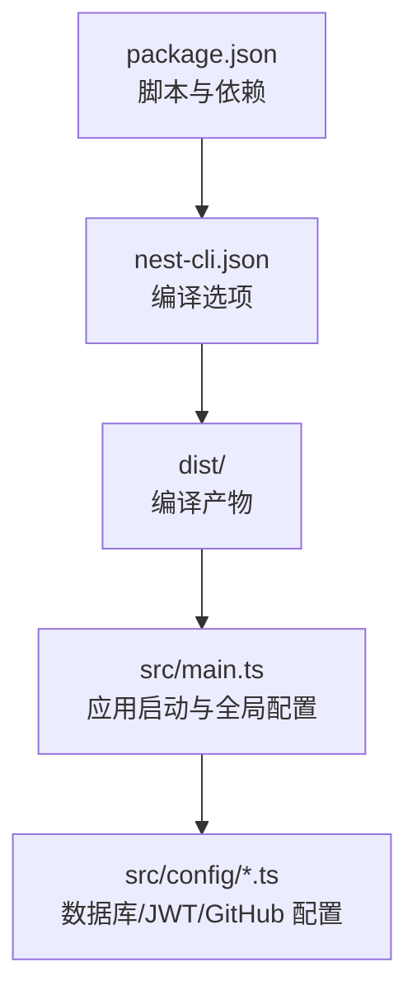
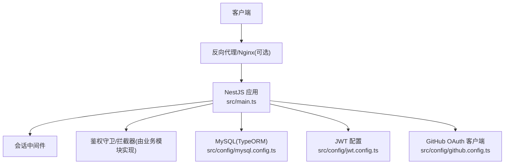
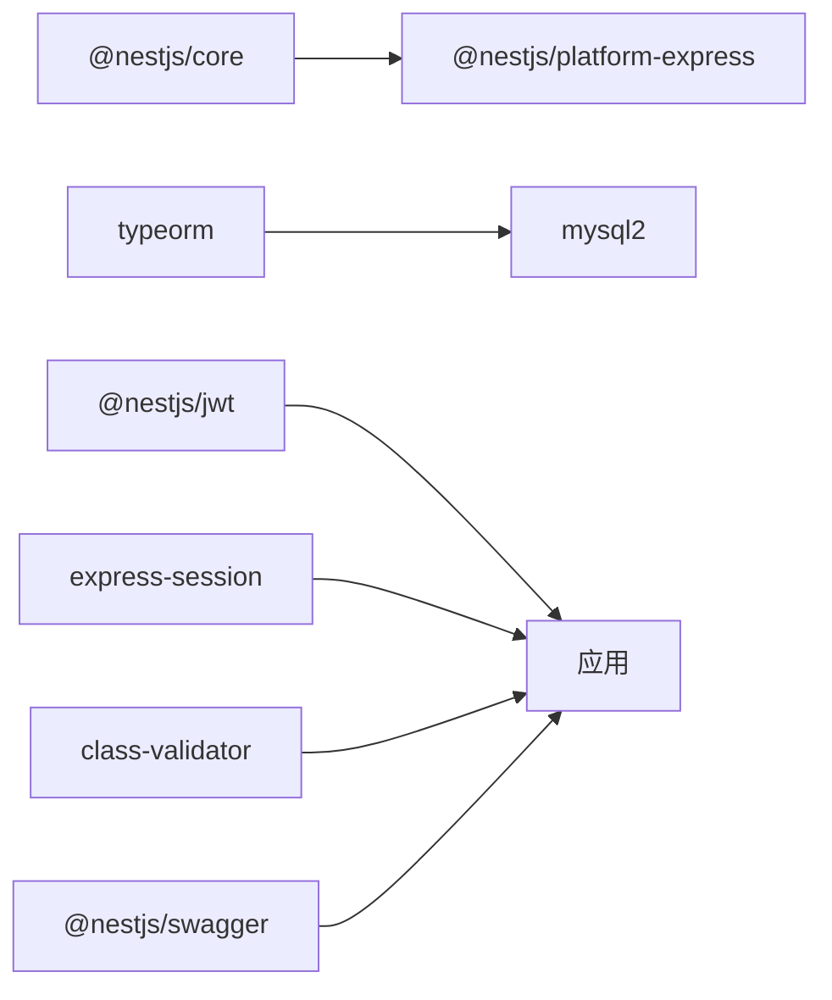

# 部署方案

<cite>
**本文引用的文件**   
- [README.md](file://README.md)
- [package.json](file://package.json)
- [nest-cli.json](file://nest-cli.json)
- [src/main.ts](file://src/main.ts)
- [src/config/mysql.config.ts](file://src/config/mysql.config.ts)
- [src/config/jwt.config.ts](file://src/config/jwt.config.ts)
- [src/config/github.config.ts](file://src/config/github.config.ts)
</cite>

## 目录
1. [简介](#简介)
2. [项目结构](#项目结构)
3. [核心组件](#核心组件)
4. [架构总览](#架构总览)
5. [详细组件分析](#详细组件分析)
6. [依赖分析](#依赖分析)
7. [性能考虑](#性能考虑)
8. [故障排查指南](#故障排查指南)
9. [结论](#结论)
10. [附录](#附录)

## 简介
本部署方案面向博客系统后端（基于 NestJS），覆盖以下目标：
- 传统服务器部署：Node.js 环境、PM2 进程管理、服务自启动
- Docker 容器化部署：Dockerfile 编写、镜像优化与多阶段构建策略
- 云平台部署：AWS、阿里云等主流云服务商的部署流程与最佳实践
- CI/CD 流水线：自动化测试、构建与部署

本方案严格依据仓库现有配置与代码进行说明，并提供可操作的步骤指引。

## 项目结构
本项目为 NestJS 应用，采用模块化组织方式，入口在 src/main.ts，构建产物输出到 dist 目录，生产运行命令通过脚本 start:prod 执行。

图表来源
- [package.json:8-21](file://package.json#L8-L21)
- [nest-cli.json:1-9](file://nest-cli.json#L1-L9)
- [src/main.ts:1-46](file://src/main.ts#L1-L46)

章节来源
- [README.md:29-46](file://README.md#L29-L46)
- [package.json:8-21](file://package.json#L8-L21)
- [nest-cli.json:1-9](file://nest-cli.json#L1-L9)
- [src/main.ts:1-46](file://src/main.ts#L1-L46)

## 核心组件
- 应用入口与全局中间件
  - 会话中间件、信任代理、全局异常过滤器、全局校验管道、Swagger 文档挂载、端口监听
- 配置模块
  - MySQL(TypeORM)、JWT、GitHub OAuth 客户端配置
- 构建与运行脚本
  - 开发、调试、生产模式；单元测试、E2E 测试与覆盖率

章节来源
- [src/main.ts:9-46](file://src/main.ts#L9-L46)
- [src/config/mysql.config.ts:1-15](file://src/config/mysql.config.ts#L1-L15)
- [src/config/jwt.config.ts:1-5](file://src/config/jwt.config.ts#L1-L5)
- [src/config/github.config.ts:1-6](file://src/config/github.config.ts#L1-L6)
- [package.json:8-21](file://package.json#L8-L21)

## 架构总览
下图展示从请求进入应用到外部依赖的整体交互关系，包括会话、鉴权、数据库与第三方集成。

图表来源
- [src/main.ts:9-46](file://src/main.ts#L9-L46)
- [src/config/mysql.config.ts:1-15](file://src/config/mysql.config.ts#L1-L15)
- [src/config/jwt.config.ts:1-5](file://src/config/jwt.config.ts#L1-L5)
- [src/config/github.config.ts:1-6](file://src/config/github.config.ts#L1-L6)

## 详细组件分析

### 传统服务器部署（Node.js + PM2）
- 前置条件
  - Node.js 版本需满足依赖要求（参考 package.json 中的依赖与类型定义）
  - pnpm 包管理器
  - 已安装并初始化 MySQL 数据库，准备连接参数
- 安装与构建
  - 使用 pnpm install 安装依赖
  - 使用 nest build 或 npm/pnpm run build 生成 dist 产物
- 环境变量与配置
  - 设置 PORT 环境变量以控制监听端口（默认 3001）
  - 将数据库、JWT、GitHub 相关敏感信息通过环境变量注入，避免硬编码
- 进程管理与自启动
  - 使用 PM2 启动 dist/main 进程
  - 配置 PM2 开机自启与日志轮转
- 反向代理与安全
  - 建议在前端放置 Nginx/Caddy 作为反向代理，启用 HTTPS、Gzip/Brotli、缓存策略
  - 开启 trust proxy 以便正确获取客户端 IP（已在应用中启用）

章节来源
- [package.json:8-21](file://package.json#L8-L21)
- [src/main.ts:19-43](file://src/main.ts#L19-L43)

### Docker 容器化部署（含多阶段构建与镜像优化）
- 多阶段构建策略
  - 构建阶段：安装依赖、执行 lint/test/build，产出 dist 与必要资源
  - 运行阶段：仅包含运行时依赖与 dist，减小镜像体积
- 关键优化点
  - 使用 .dockerignore 排除 node_modules、dist、测试与本地配置
  - 合理分层缓存依赖安装与源码变更
  - 使用非 root 用户运行应用，提升安全性
  - 设置健康检查与健康探针
- 运行参数与环境变量
  - 通过环境变量注入数据库、JWT、GitHub 等配置
  - 暴露端口与资源限制（CPU/内存）

章节来源
- [package.json:8-21](file://package.json#L8-L21)
- [src/main.ts:41-43](file://src/main.ts#L41-L43)

### 云平台部署（AWS、阿里云）
- AWS
  - ECS Fargate：容器镜像推送至 ECR，创建任务定义与服务，配置 ALB 与自动扩缩容
  - Elastic Beanstalk：上传构建产物或容器镜像，配置环境变量与实例规格
  - EC2：传统部署，配合 PM2 与 Nginx
- 阿里云
  - 容器服务 ACK：镜像仓库（ACR）+ 集群 + 服务 + Ingress
  - 云服务器 ECS：传统部署，结合 PM2 与 Nginx
  - 函数计算 FC：按需运行轻量任务（如定时任务、批处理）
- 通用最佳实践
  - 使用密钥管理服务（KMS/Secrets Manager）管理敏感配置
  - 启用监控与告警（CloudWatch/ARMS/SLS）
  - 灰度发布与回滚策略

章节来源
- [README.md:61-72](file://README.md#L61-L72)

### CI/CD 流水线（自动化测试、构建与部署）
- 推荐阶段
  - 安装依赖与缓存
  - 代码质量检查（lint/format）
  - 单元测试与覆盖率阈值
  - E2E 测试（需要数据库与外部服务 Mock）
  - 构建产物（dist）
  - 打包镜像（可选）
  - 部署到目标环境（Staging/Production）
- 关键要点
  - 并行执行测试与构建以提升速度
  - 使用环境变量与密钥注入
  - 失败快速停止与通知机制

章节来源
- [package.json:16-20](file://package.json#L16-L20)

## 依赖分析
- 运行时依赖
  - @nestjs/core、@nestjs/platform-express：框架核心与 Express 适配器
  - typeorm、mysql2：数据持久化
  - @nestjs/jwt：令牌签发与校验
  - express-session：会话支持
  - class-validator、class-transformer：请求体校验与转换
  - swagger-ui-express、@nestjs/swagger：接口文档
- 开发依赖
  - jest、supertest：测试框架与 HTTP 断言
  - ts-jest、ts-node、typescript：TypeScript 与测试桥接
  - eslint、prettier：代码规范与格式化

图表来源
- [package.json:22-75](file://package.json#L22-L75)

章节来源
- [package.json:22-75](file://package.json#L22-L75)

## 性能考虑
- 应用层
  - 启用压缩与静态资源缓存（反向代理层）
  - 合理设置连接池大小与超时（数据库）
  - 减少不必要的序列化与反序列化
- 运行时
  - 使用 PM2 集群模式或多副本水平扩展
  - 容器资源限制与 HPA（弹性伸缩）
- 网络与安全
  - 启用 HTTPS、HSTS、安全头
  - 限流与防刷策略（WAF/网关层）

[本节为通用指导，不直接分析具体文件]

## 故障排查指南
- 常见启动问题
  - 端口冲突：确认 PORT 环境变量未被占用
  - 数据库连接失败：核对 host/port/username/password/database
  - 会话与鉴权异常：检查 secret 与 cookie 配置
- 日志与诊断
  - 查看 PM2 日志与应用标准输出
  - 使用 Swagger 文档验证接口连通性
- 性能瓶颈定位
  - 数据库慢查询与索引优化
  - 接口耗时分析与热点路径优化

章节来源
- [src/main.ts:11-28](file://src/main.ts#L11-L28)
- [src/config/mysql.config.ts:3-12](file://src/config/mysql.config.ts#L3-L12)
- [src/config/jwt.config.ts:1-5](file://src/config/jwt.config.ts#L1-L5)

## 结论
本方案围绕现有 NestJS 项目的结构与配置，提供了从传统服务器到容器化与云平台的完整部署路径，并给出 CI/CD 流水线的关键环节与最佳实践。建议在上线前完成安全加固、监控告警与容量规划，确保系统稳定与可扩展。

[本节为总结性内容，不直接分析具体文件]

## 附录
- 环境变量清单（示例）
  - PORT：应用监听端口
  - DB_HOST、DB_PORT、DB_USERNAME、DB_PASSWORD、DB_DATABASE：数据库连接
  - JWT_ACCESS_SECRET、JWT_REFRESH_SECRET：JWT 密钥
  - GITHUB_CLIENT_ID、GITHUB_CLIENT_SECRET：GitHub OAuth 客户端凭据
- 常用命令
  - 安装依赖：pnpm install
  - 构建：pnpm run build
  - 开发：pnpm run start:dev
  - 生产：pnpm run start:prod
  - 测试：pnpm run test / pnpm run test:e2e / pnpm run test:cov

章节来源
- [package.json:8-21](file://package.json#L8-L21)
- [src/config/mysql.config.ts:3-12](file://src/config/mysql.config.ts#L3-L12)
- [src/config/jwt.config.ts:1-5](file://src/config/jwt.config.ts#L1-L5)
- [src/config/github.config.ts:1-6](file://src/config/github.config.ts#L1-L6)