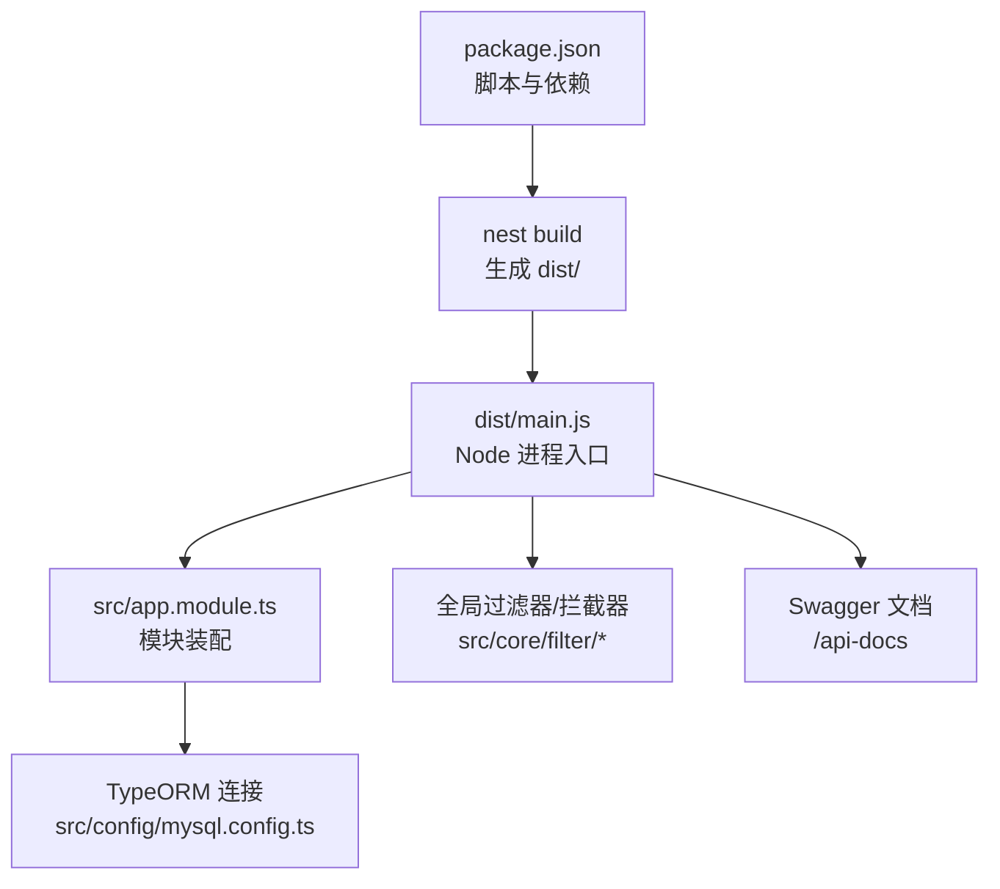
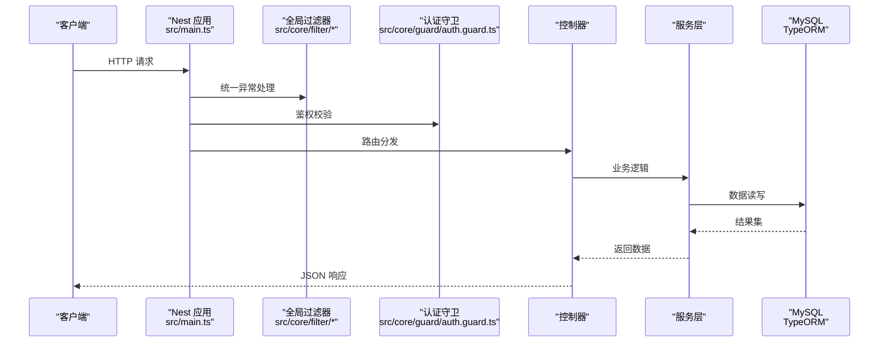
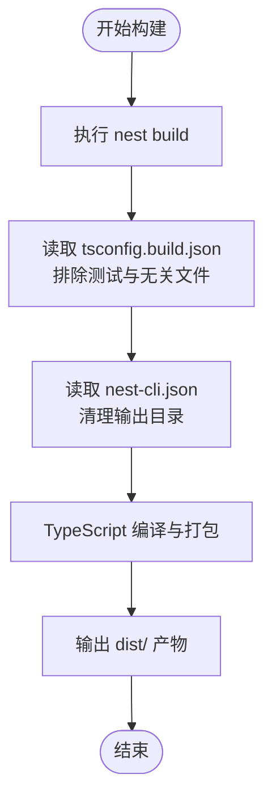
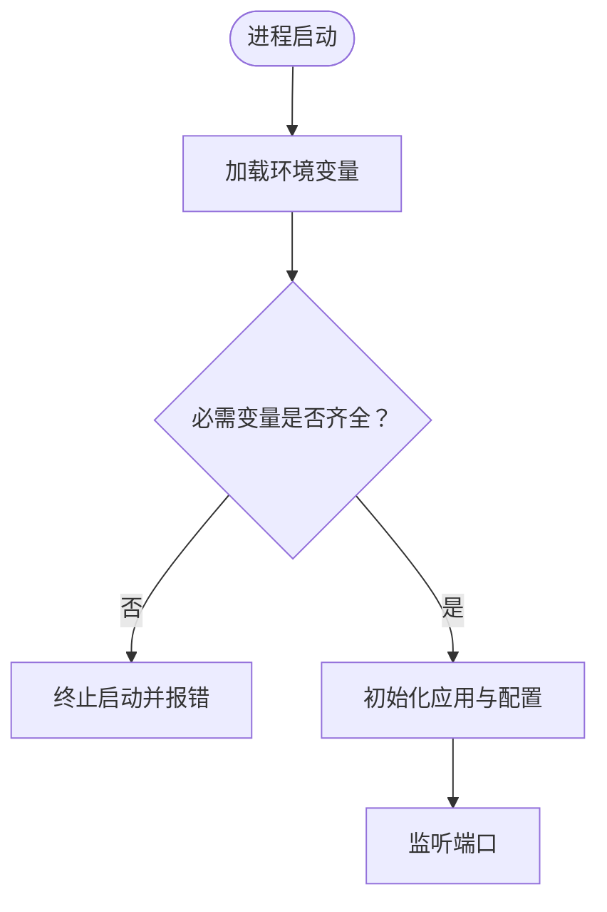
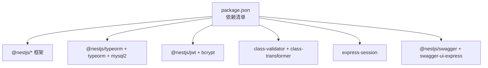

# 部署运维

<cite>
**本文引用的文件**   
- [README.md](file://README.md)
- [package.json](file://package.json)
- [tsconfig.build.json](file://tsconfig.build.json)
- [nest-cli.json](file://nest-cli.json)
- [src/main.ts](file://src/main.ts)
- [src/app.module.ts](file://src/app.module.ts)
- [src/config/mysql.config.ts](file://src/config/mysql.config.ts)
- [src/config/jwt.config.ts](file://src/config/jwt.config.ts)
- [src/config/github.config.ts](file://src/config/github.config.ts)
- [src/core/filter/http-exception.filter.ts](file://src/core/filter/http-exception.filter.ts)
- [src/core/filter/all-exception.filter.ts](file://src/core/filter/all-exception.filter.ts)
- [sql/init.sql](file://sql/init.sql)
</cite>

## 目录
1. [简介](#简介)
2. [项目结构](#项目结构)
3. [核心组件](#核心组件)
4. [架构总览](#架构总览)
5. [详细组件分析](#详细组件分析)
6. [依赖分析](#依赖分析)
7. [性能考虑](#性能考虑)
8. [故障排查指南](#故障排查指南)
9. [结论](#结论)
10. [附录](#附录)

## 简介
本文件面向生产环境的构建、打包与部署，覆盖传统服务器、容器化（Docker）与云平台（AWS、阿里云等）方案；同时给出环境变量管理、敏感信息保护、监控与日志收集、备份恢复与灾难恢复策略，以及常见问题的诊断与排障方法。

## 项目结构
本项目基于 NestJS + TypeORM + MySQL，使用 pnpm 进行包管理，通过 nest build 输出到 dist 目录，生产环境以 node dist/main 启动。关键配置包括：
- 构建脚本与运行脚本位于 package.json
- TypeScript 构建排除规则在 tsconfig.build.json
- Nest CLI 编译选项在 nest-cli.json
- 应用入口在 src/main.ts，模块装配在 src/app.module.ts
- 数据库连接配置在 src/config/mysql.config.ts
- JWT 与第三方登录相关配置在 src/config/jwt.config.ts 与 src/config/github.config.ts
- 全局异常处理在 src/core/filter/*.filter.ts
- 数据库初始化脚本在 sql/init.sql

**图示来源** 
- [package.json:8-21](file://package.json#L8-L21)
- [nest-cli.json:1-9](file://nest-cli.json#L1-L9)
- [tsconfig.build.json:1-5](file://tsconfig.build.json#L1-L5)
- [src/main.ts:1-46](file://src/main.ts#L1-L46)
- [src/app.module.ts:1-35](file://src/app.module.ts#L1-L35)
- [src/config/mysql.config.ts:1-15](file://src/config/mysql.config.ts#L1-L15)
- [src/core/filter/http-exception.filter.ts:1-36](file://src/core/filter/http-exception.filter.ts#L1-L36)
- [src/core/filter/all-exception.filter.ts:1-42](file://src/core/filter/all-exception.filter.ts#L1-L42)

**章节来源**
- [README.md:29-46](file://README.md#L29-L46)
- [package.json:8-21](file://package.json#L8-L21)
- [tsconfig.build.json:1-5](file://tsconfig.build.json#L1-L5)
- [nest-cli.json:1-9](file://nest-cli.json#L1-L9)
- [src/main.ts:1-46](file://src/main.ts#L1-L46)
- [src/app.module.ts:1-35](file://src/app.module.ts#L1-L35)
- [src/config/mysql.config.ts:1-15](file://src/config/mysql.config.ts#L1-L15)
- [src/config/jwt.config.ts:1-5](file://src/config/jwt.config.ts#L1-L5)
- [src/config/github.config.ts:1-5](file://src/config/github.config.ts#L1-L5)
- [src/core/filter/http-exception.filter.ts:1-36](file://src/core/filter/http-exception.filter.ts#L1-L36)
- [src/core/filter/all-exception.filter.ts:1-42](file://src/core/filter/all-exception.filter.ts#L1-L42)
- [sql/init.sql:1-34](file://sql/init.sql#L1-L34)

## 核心组件
- 应用入口与中间件
  - 会话中间件、信任代理、全局验证管道、全局异常过滤器、Swagger 文档均在入口中启用。
  - 端口监听通过环境变量 PORT 或默认值。
- 模块装配
  - 通过 TypeOrmModule.forRoot 注入数据库配置，并注册业务模块与全局过滤器/拦截器/守卫。
- 配置项
  - 数据库连接、JWT 密钥、第三方登录客户端信息均以配置文件形式提供。

**章节来源**
- [src/main.ts:10-46](file://src/main.ts#L10-L46)
- [src/app.module.ts:11-34](file://src/app.module.ts#L11-L34)
- [src/config/mysql.config.ts:3-12](file://src/config/mysql.config.ts#L3-L12)
- [src/config/jwt.config.ts:1-5](file://src/config/jwt.config.ts#L1-L5)
- [src/config/github.config.ts:1-5](file://src/config/github.config.ts#L1-L5)

## 架构总览
下图展示了从请求进入、经过中间件与过滤器、路由到控制器与服务层、访问数据库的完整链路，以及 Swagger 文档的挂载点。

**图示来源** 
- [src/main.ts:10-46](file://src/main.ts#L10-L46)
- [src/app.module.ts:11-34](file://src/app.module.ts#L11-L34)
- [src/core/filter/http-exception.filter.ts:1-36](file://src/core/filter/http-exception.filter.ts#L1-L36)
- [src/core/filter/all-exception.filter.ts:1-42](file://src/core/filter/all-exception.filter.ts#L1-L42)
- [src/config/mysql.config.ts:1-15](file://src/config/mysql.config.ts#L1-L15)

## 详细组件分析

### 构建与打包配置（TypeScript 优化与树摇）
- 构建命令
  - 使用 nest build 将源码编译至 dist 目录，生产运行命令为 node dist/main。
- TypeScript 构建排除
  - tsconfig.build.json 排除了测试与开发无关文件，减少产物体积。
- Nest CLI 编译选项
  - nest-cli.json 启用了删除输出目录，确保每次构建干净。
- 依赖与工具链
  - 使用 @nestjs/cli、typescript、@swc/core 等工具提升构建与运行效率。
- 树摇与优化建议
  - 保持仅引入必要模块，避免在运行时动态 require 大库。
  - 在生产构建时开启 source-map-support 以便定位线上问题。
  - 对热路径代码尽量使用静态导入，利于编译器优化。

**图示来源** 
- [package.json:8-14](file://package.json#L8-L14)
- [tsconfig.build.json:1-5](file://tsconfig.build.json#L1-L5)
- [nest-cli.json:1-9](file://nest-cli.json#L1-L9)

**章节来源**
- [package.json:8-21](file://package.json#L8-L21)
- [tsconfig.build.json:1-5](file://tsconfig.build.json#L1-L5)
- [nest-cli.json:1-9](file://nest-cli.json#L1-L9)

### 环境变量管理与敏感信息保护
- 环境变量
  - 应用监听端口通过环境变量 PORT 控制，未设置时使用默认值。
- 敏感信息现状
  - 当前数据库连接、JWT 密钥、GitHub OAuth 客户端信息以硬编码方式存在于配置文件中，存在安全风险。
- 最佳实践
  - 将数据库连接参数、JWT 密钥、第三方客户端 ID/Secret 迁移至环境变量或平台密钥管理服务。
  - 在应用启动阶段加载环境变量并校验必填项，缺失则拒绝启动。
  - 禁止将 .env 提交到版本库，使用 CI/CD 注入或平台托管。
  - 对会话 secret 也建议使用环境变量。

**图示来源** 
- [src/main.ts:40-46](file://src/main.ts#L40-L46)
- [src/config/mysql.config.ts:3-12](file://src/config/mysql.config.ts#L3-L12)
- [src/config/jwt.config.ts:1-5](file://src/config/jwt.config.ts#L1-L5)
- [src/config/github.config.ts:1-5](file://src/config/github.config.ts#L1-L5)

**章节来源**
- [src/main.ts:40-46](file://src/main.ts#L40-L46)
- [src/config/mysql.config.ts:3-12](file://src/config/mysql.config.ts#L3-L12)
- [src/config/jwt.config.ts:1-5](file://src/config/jwt.config.ts#L1-L5)
- [src/config/github.config.ts:1-5](file://src/config/github.config.ts#L1-L5)

### 传统服务器部署（Linux）
- 前置条件
  - Node.js 运行环境与 pnpm 已安装。
- 构建与运行
  - 执行构建命令生成 dist 目录。
  - 使用生产运行命令启动应用。
- 进程守护
  - 使用 systemd 或 pm2 进行进程管理与自动重启。
- 反向代理
  - 使用 Nginx 作为反向代理，转发 HTTPS 流量至本地端口。
- 安全加固
  - 限制端口暴露，启用防火墙白名单。
  - 定期更新系统与安全补丁。

**章节来源**
- [package.json:8-14](file://package.json#L8-L14)
- [src/main.ts:40-46](file://src/main.ts#L40-L46)

### 容器化部署（Docker）
- 镜像构建
  - 使用多阶段构建，先安装依赖并构建产物，再仅拷贝 dist 与必要运行时依赖，减小镜像体积。
- 环境变量注入
  - 通过 docker run -e 或编排文件注入 PORT、数据库连接、JWT 密钥等。
- 健康检查
  - 在 Dockerfile 中定义健康检查，指向 /api-docs 或自定义健康端点。
- 资源限制
  - 为容器设置 CPU 与内存上限，避免单实例占用过多资源。
- 日志采集
  - 使用 stdout/stderr 输出结构化日志，由宿主机或编排平台收集。

**章节来源**
- [package.json:8-14](file://package.json#L8-L14)
- [src/main.ts:40-46](file://src/main.ts#L40-L46)

### 云平台部署（AWS、阿里云等）
- AWS
  - 可使用官方 Mau 工具一键部署，或通过 ECS/EKS 运行容器镜像。
  - 结合 RDS 作为数据库，使用 Secrets Manager 管理敏感信息。
- 阿里云
  - 使用容器服务 ACK 或轻量应用服务器部署。
  - 使用云数据库 RDS 与密钥管理服务 KMS 管理敏感信息。
- 通用要点
  - 使用平台提供的负载均衡与健康检查。
  - 利用平台的日志服务与告警能力。

**章节来源**
- [README.md:61-72](file://README.md#L61-L72)

### 监控与日志收集
- 应用性能监控（APM）
  - 集成 APM 探针（如 New Relic、Sentry、OpenTelemetry），采集请求耗时、错误率与调用链。
- 错误追踪
  - 使用 Sentry 捕获未处理异常与用户态错误，关联上下文信息。
- 日志聚合
  - 输出结构化 JSON 日志至 stdout，由 Fluent Bit/Filebeat 收集至 Elasticsearch/CloudWatch/Log Service。
- 指标与告警
  - 暴露 Prometheus 指标或使用平台内置指标，配置阈值告警。

**章节来源**
- [src/core/filter/http-exception.filter.ts:1-36](file://src/core/filter/http-exception.filter.ts#L1-L36)
- [src/core/filter/all-exception.filter.ts:1-42](file://src/core/filter/all-exception.filter.ts#L1-L42)

### 备份恢复策略与灾难恢复计划
- 数据库备份
  - 使用 mysqldump 或云厂商快照定时备份，保留多份历史副本。
- 恢复演练
  - 定期进行恢复演练，验证备份可用性与恢复时间目标（RTO）。
- 异地容灾
  - 跨可用区或多地域复制数据库，确保单点故障不影响可用性。
- 变更回滚
  - 发布前进行灰度与回滚预案，确保快速恢复。

**章节来源**
- [sql/init.sql:1-34](file://sql/init.sql#L1-L34)

## 依赖分析
- 运行时依赖
  - NestJS 核心与 Express 适配器、TypeORM 与 mysql2、JWT、验证与转换库、邮件发送、会话管理等。
- 开发与构建依赖
  - Nest CLI、TypeScript、SWC、ESLint、Prettier、Jest 等。
- 外部集成
  - 数据库 MySQL、第三方登录 GitHub、API 文档 Swagger。

**图示来源** 
- [package.json:22-45](file://package.json#L22-L45)

**章节来源**
- [package.json:22-75](file://package.json#L22-L75)

## 性能考虑
- 构建优化
  - 使用 SWC 加速编译，合理排除测试与无关文件，减少产物体积。
- 运行优化
  - 启用 trust proxy 以正确解析客户端 IP。
  - 使用全局验证管道减少重复校验逻辑。
  - 合理设置会话过期时间与滚动策略。
- 资源与扩展
  - 根据负载水平横向扩展多个实例，配合负载均衡。
  - 对热点接口增加缓存层（Redis）以降低数据库压力。
- 数据库优化
  - 调整连接池大小、索引与查询语句，避免慢查询。

[本节为通用指导，不直接分析具体文件]

## 故障排查指南
- 常见问题
  - 端口冲突：检查 PORT 环境变量与系统端口占用。
  - 数据库连接失败：核对 host、port、username、password、database 等配置。
  - 会话异常：确认 secret 与 cookie 配置，检查浏览器 Cookie 策略。
  - 鉴权失败：检查 JWT 密钥与令牌有效期。
- 错误追踪
  - 全局异常过滤器会记录请求详情（query/body/params/method/url），便于定位问题。
- 性能瓶颈
  - 使用 APM 定位慢接口，结合数据库慢查询日志分析。
- 内存泄漏检测
  - 使用 --inspect 与 Chrome DevTools 分析堆快照，关注事件循环与定时器。

**章节来源**
- [src/main.ts:10-46](file://src/main.ts#L10-L46)
- [src/core/filter/http-exception.filter.ts:1-36](file://src/core/filter/http-exception.filter.ts#L1-L36)
- [src/core/filter/all-exception.filter.ts:1-42](file://src/core/filter/all-exception.filter.ts#L1-L42)
- [src/config/mysql.config.ts:3-12](file://src/config/mysql.config.ts#L3-L12)
- [src/config/jwt.config.ts:1-5](file://src/config/jwt.config.ts#L1-L5)

## 结论
通过对构建与打包配置的优化、严格的环境变量与敏感信息管理、完善的监控与日志体系、可靠的备份与灾难恢复策略，可显著提升系统的稳定性与可维护性。建议在 CI/CD 中固化构建与部署流程，并在生产环境持续观测与迭代优化。

[本节为总结性内容，不直接分析具体文件]

## 附录
- 数据库初始化
  - 参考 sql/init.sql 中的建库与建表脚本，确保生产环境数据库结构与字段一致。
- 文档访问
  - 应用启动后，可通过 /api-docs 访问接口文档，便于联调与交付。

**章节来源**
- [sql/init.sql:1-34](file://sql/init.sql#L1-L34)
- [src/main.ts:29-39](file://src/main.ts#L29-L39)