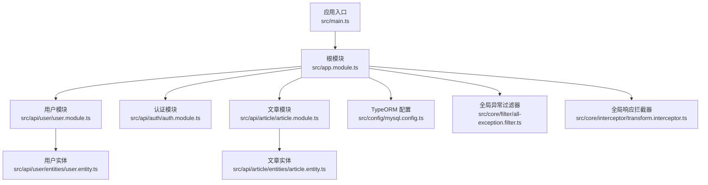
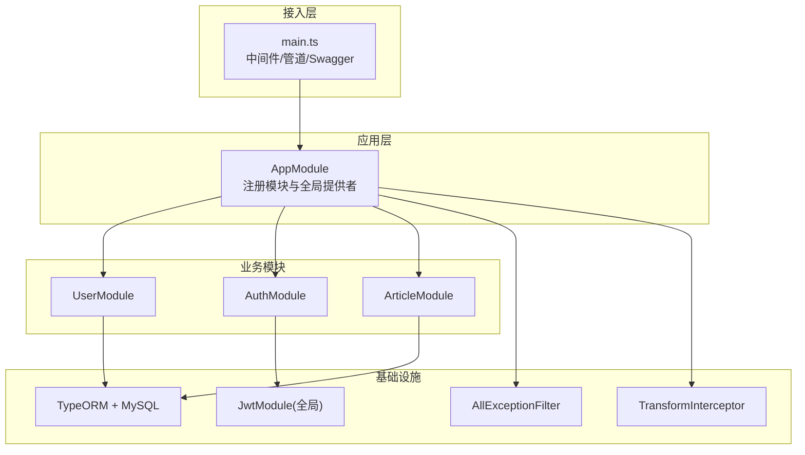
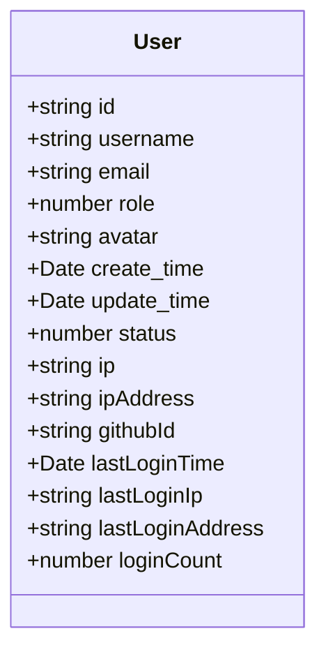
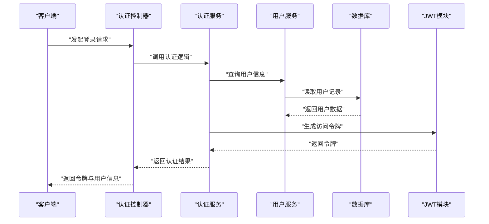
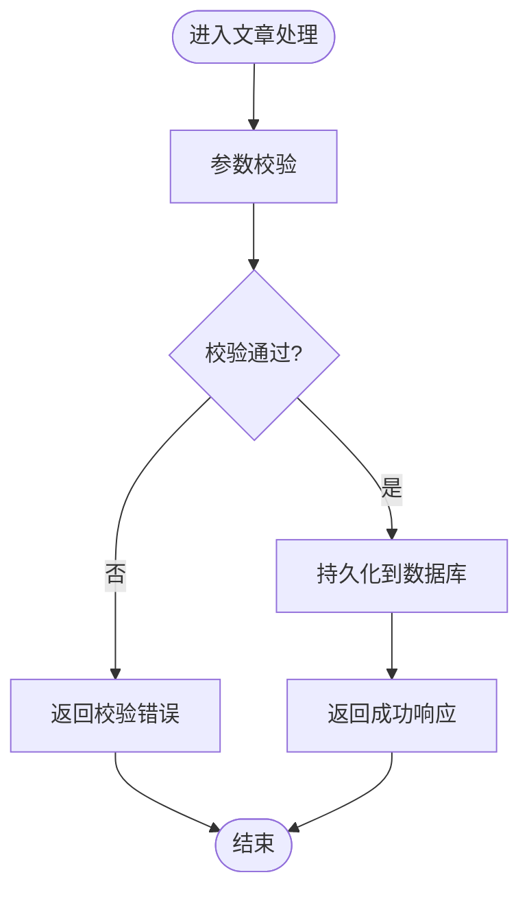
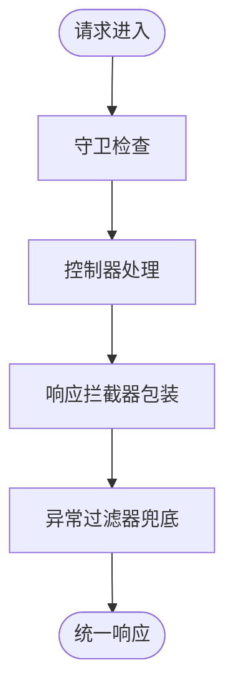
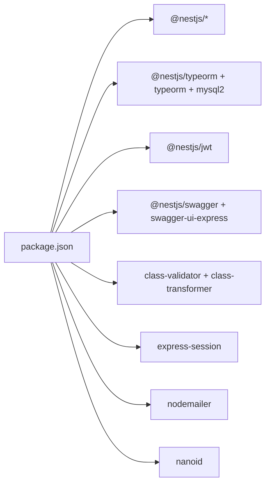

# 项目概述

<cite>
**本文引用的文件**   
- [README.md](file://README.md)
- [package.json](file://package.json)
- [src/main.ts](file://src/main.ts)
- [src/app.module.ts](file://src/app.module.ts)
- [sql/init.sql](file://sql/init.sql)
- [src/config/mysql.config.ts](file://src/config/mysql.config.ts)
- [src/config/jwt.config.ts](file://src/config/jwt.config.ts)
- [src/config/github.config.ts](file://src/config/github.config.ts)
- [src/api/user/entities/user.entity.ts](file://src/api/user/entities/user.entity.ts)
- [src/api/article/entities/article.entity.ts](file://src/api/article/entities/article.entity.ts)
- [src/api/user/user.module.ts](file://src/api/user/user.module.ts)
- [src/api/auth/auth.module.ts](file://src/api/auth/auth.module.ts)
- [src/api/article/article.module.ts](file://src/api/article/article.module.ts)
- [src/core/filter/all-exception.filter.ts](file://src/core/filter/all-exception.filter.ts)
- [src/core/interceptor/transform.interceptor.ts](file://src/core/interceptor/transform.interceptor.ts)
</cite>

## 目录
1. [简介](#简介)
2. [项目结构](#项目结构)
3. [核心组件](#核心组件)
4. [架构总览](#架构总览)
5. [详细组件分析](#详细组件分析)
6. [依赖分析](#依赖分析)
7. [性能考虑](#性能考虑)
8. [故障排查指南](#故障排查指南)
9. [结论](#结论)
10. [附录：快速开始](#附录快速开始)

## 简介
本项目是一个基于 NestJS v11 的博客系统后端服务，采用模块化设计，围绕用户管理、认证授权与文章管理等核心能力构建。技术栈包括 TypeORM + MySQL 作为数据持久化方案，JWT 用于令牌签发与校验，Swagger 提供接口文档，同时集成全局异常过滤、响应体统一转换等基础设施能力。整体目标是为前端或第三方客户端提供稳定、可扩展的 RESTful API，并支持第三方登录（如 GitHub）与基础的用户与文章管理能力。

## 项目结构
项目遵循典型的 NestJS 分层与模块化组织方式：
- api：业务模块（user、auth、article），每个模块包含 controller、service、entity、dto 等
- core：通用横切能力（过滤器、守卫、拦截器）
- config：配置项（MySQL、JWT、GitHub）
- sql：数据库初始化脚本
- src/main.ts：应用启动入口，负责中间件、管道、Swagger 等全局装配
- src/app.module.ts：根模块，注册数据库连接、业务模块与全局提供者

图表来源
- [src/main.ts:1-46](file://src/main.ts#L1-L46)
- [src/app.module.ts:1-35](file://src/app.module.ts#L1-L35)
- [src/config/mysql.config.ts:1-15](file://src/config/mysql.config.ts#L1-L15)
- [src/api/user/user.module.ts:1-14](file://src/api/user/user.module.ts#L1-L14)
- [src/api/auth/auth.module.ts:1-13](file://src/api/auth/auth.module.ts#L1-L13)
- [src/api/article/article.module.ts:1-14](file://src/api/article/article.module.ts#L1-L14)
- [src/api/user/entities/user.entity.ts:1-57](file://src/api/user/entities/user.entity.ts#L1-L57)
- [src/api/article/entities/article.entity.ts:1-44](file://src/api/article/entities/article.entity.ts#L1-L44)
- [src/core/filter/all-exception.filter.ts:1-43](file://src/core/filter/all-exception.filter.ts#L1-L43)
- [src/core/interceptor/transform.interceptor.ts:1-24](file://src/core/interceptor/transform.interceptor.ts#L1-L24)

章节来源
- [src/main.ts:1-46](file://src/main.ts#L1-L46)
- [src/app.module.ts:1-35](file://src/app.module.ts#L1-L35)

## 核心组件
- 应用启动与全局装配
  - 在启动入口中启用会话中间件、信任代理、全局验证管道、全局异常过滤器，并挂载 Swagger 文档。
  - 参考路径：[src/main.ts:1-46](file://src/main.ts#L1-L46)
- 根模块与模块装配
  - 根模块导入 TypeORM 连接、三大业务模块，并通过 APP_FILTER、APP_INTERCEPTOR、APP_GUARD 注入全局能力。
  - 参考路径：[src/app.module.ts:1-35](file://src/app.module.ts#L1-L35)
- 配置中心
  - MySQL 连接配置、JWT 密钥配置、GitHub 第三方登录配置分别独立维护，便于环境切换。
  - 参考路径：
    - [src/config/mysql.config.ts:1-15](file://src/config/mysql.config.ts#L1-L15)
    - [src/config/jwt.config.ts:1-5](file://src/config/jwt.config.ts#L1-L5)
    - [src/config/github.config.ts:1-6](file://src/config/github.config.ts#L1-L6)
- 数据模型
  - 用户实体与文章实体定义字段、默认值与时间戳列，支撑用户管理与文章 CRUD。
  - 参考路径：
    - [src/api/user/entities/user.entity.ts:1-57](file://src/api/user/entities/user.entity.ts#L1-L57)
    - [src/api/article/entities/article.entity.ts:1-44](file://src/api/article/entities/article.entity.ts#L1-L44)
- 基础设施层
  - 全局异常过滤器统一错误响应；全局响应拦截器将成功响应包装为统一格式。
  - 参考路径：
    - [src/core/filter/all-exception.filter.ts:1-43](file://src/core/filter/all-exception.filter.ts#L1-L43)
    - [src/core/interceptor/transform.interceptor.ts:1-24](file://src/core/interceptor/transform.interceptor.ts#L1-L24)

章节来源
- [src/main.ts:1-46](file://src/main.ts#L1-L46)
- [src/app.module.ts:1-35](file://src/app.module.ts#L1-L35)
- [src/config/mysql.config.ts:1-15](file://src/config/mysql.config.ts#L1-L15)
- [src/config/jwt.config.ts:1-5](file://src/config/jwt.config.ts#L1-L5)
- [src/config/github.config.ts:1-6](file://src/config/github.config.ts#L1-L6)
- [src/api/user/entities/user.entity.ts:1-57](file://src/api/user/entities/user.entity.ts#L1-L57)
- [src/api/article/entities/article.entity.ts:1-44](file://src/api/article/entities/article.entity.ts#L1-L44)
- [src/core/filter/all-exception.filter.ts:1-43](file://src/core/filter/all-exception.filter.ts#L1-L43)
- [src/core/interceptor/transform.interceptor.ts:1-24](file://src/core/interceptor/transform.interceptor.ts#L1-L24)

## 架构总览
系统采用“入口装配 -> 根模块 -> 业务模块 -> 数据访问”的分层架构，配合全局过滤器、拦截器与守卫实现横切关注点。

图表来源
- [src/main.ts:1-46](file://src/main.ts#L1-L46)
- [src/app.module.ts:1-35](file://src/app.module.ts#L1-L35)
- [src/api/user/user.module.ts:1-14](file://src/api/user/user.module.ts#L1-L14)
- [src/api/auth/auth.module.ts:1-13](file://src/api/auth/auth.module.ts#L1-L13)
- [src/api/article/article.module.ts:1-14](file://src/api/article/article.module.ts#L1-L14)
- [src/config/mysql.config.ts:1-15](file://src/config/mysql.config.ts#L1-L15)
- [src/core/filter/all-exception.filter.ts:1-43](file://src/core/filter/all-exception.filter.ts#L1-L43)
- [src/core/interceptor/transform.interceptor.ts:1-24](file://src/core/interceptor/transform.interceptor.ts#L1-L24)

## 详细组件分析

### 用户模块（User）
- 职责
  - 提供用户信息查询、更新等能力，承载用户基本信息与登录埋点字段。
- 关键实体
  - 用户实体包含用户名、邮箱、头像、角色、状态、IP 信息、第三方 ID、最后登录信息等。
  - 参考路径：[src/api/user/entities/user.entity.ts:1-57](file://src/api/user/entities/user.entity.ts#L1-L57)
- 模块装配
  - 通过 TypeOrmModule.forFeature 注册 User 实体，暴露 UserService 供其他模块使用。
  - 参考路径：[src/api/user/user.module.ts:1-14](file://src/api/user/user.module.ts#L1-L14)

图表来源
- [src/api/user/entities/user.entity.ts:1-57](file://src/api/user/entities/user.entity.ts#L1-L57)

章节来源
- [src/api/user/entities/user.entity.ts:1-57](file://src/api/user/entities/user.entity.ts#L1-L57)
- [src/api/user/user.module.ts:1-14](file://src/api/user/user.module.ts#L1-L14)

### 认证模块（Auth）
- 职责
  - 处理认证流程，集成 JWT 模块以签发与校验令牌，并与用户模块协作完成用户识别。
- 模块装配
  - 全局注册 JwtModule，并引入 UserModule 以复用用户数据访问。
  - 参考路径：[src/api/auth/auth.module.ts:1-13](file://src/api/auth/auth.module.ts#L1-L13)
- 配置
  - JWT 密钥配置位于独立配置文件，便于不同环境隔离。
  - 参考路径：[src/config/jwt.config.ts:1-5](file://src/config/jwt.config.ts#L1-L5)

图表来源
- [src/api/auth/auth.module.ts:1-13](file://src/api/auth/auth.module.ts#L1-L13)
- [src/config/jwt.config.ts:1-5](file://src/config/jwt.config.ts#L1-L5)

章节来源
- [src/api/auth/auth.module.ts:1-13](file://src/api/auth/auth.module.ts#L1-L13)
- [src/config/jwt.config.ts:1-5](file://src/config/jwt.config.ts#L1-L5)

### 文章模块（Article）
- 职责
  - 提供文章的创建、查询、更新、删除等能力，并支持标签关联与统计字段。
- 关键实体
  - 文章实体包含标题、内容、摘要、浏览量、置顶标记、标签ID数组、状态、软删除标记等。
  - 参考路径：[src/api/article/entities/article.entity.ts:1-44](file://src/api/article/entities/article.entity.ts#L1-L44)
- 模块装配
  - 通过 TypeOrmModule.forFeature 注册 Article 与 Tag 实体。
  - 参考路径：[src/api/article/article.module.ts:1-14](file://src/api/article/article.module.ts#L1-L14)

图表来源
- [src/api/article/entities/article.entity.ts:1-44](file://src/api/article/entities/article.entity.ts#L1-L44)
- [src/api/article/article.module.ts:1-14](file://src/api/article/article.module.ts#L1-L14)

章节来源
- [src/api/article/entities/article.entity.ts:1-44](file://src/api/article/entities/article.entity.ts#L1-L44)
- [src/api/article/article.module.ts:1-14](file://src/api/article/article.module.ts#L1-L14)

### 基础设施层
- 全局异常过滤器
  - 捕获所有未处理异常，统一返回包含状态码、消息与请求上下文的响应体。
  - 参考路径：[src/core/filter/all-exception.filter.ts:1-43](file://src/core/filter/all-exception.filter.ts#L1-L43)
- 全局响应拦截器
  - 将正常响应包装为统一的 code/data/message 结构，提升前后端交互一致性。
  - 参考路径：[src/core/interceptor/transform.interceptor.ts:1-24](file://src/core/interceptor/transform.interceptor.ts#L1-L24)

图表来源
- [src/core/filter/all-exception.filter.ts:1-43](file://src/core/filter/all-exception.filter.ts#L1-L43)
- [src/core/interceptor/transform.interceptor.ts:1-24](file://src/core/interceptor/transform.interceptor.ts#L1-L24)

章节来源
- [src/core/filter/all-exception.filter.ts:1-43](file://src/core/filter/all-exception.filter.ts#L1-L43)
- [src/core/interceptor/transform.interceptor.ts:1-24](file://src/core/interceptor/transform.interceptor.ts#L1-L24)

## 依赖分析
- 运行时依赖
  - @nestjs/* 系列框架包、@nestjs/jwt、@nestjs/swagger、@nestjs/typeorm、mysql2、typeorm、class-validator、class-transformer、express-session、nodemailer、nanoid 等。
  - 参考路径：[package.json:22-45](file://package.json#L22-L45)
- 开发依赖
  - TypeScript、Jest、ESLint、Prettier、SWC、ts-node 等开发与测试工具链。
  - 参考路径：[package.json:46-75](file://package.json#L46-L75)
- 脚本命令
  - start/start:dev/start:prod/test/e2e/cov 等常用命令。
  - 参考路径：[package.json:8-21](file://package.json#L8-L21)

图表来源
- [package.json:1-100](file://package.json#L1-L100)

章节来源
- [package.json:1-100](file://package.json#L1-L100)

## 性能考虑
- 数据库连接池
  - 建议根据并发量调整 TypeORM 连接池大小，避免连接耗尽导致请求阻塞。
- 索引优化
  - 依据 SQL 初始化脚本中的索引策略（如按作者、状态、置顶、创建时间等）进行查询优化。
  - 参考路径：[sql/init.sql:86-92](file://sql/init.sql#L86-L92)
- 缓存策略
  - 对热点数据（如首页文章列表、标签集合）可引入内存缓存或外部缓存（Redis）以降低数据库压力。
- 序列化与验证
  - 合理使用 class-transformer 与 class-validator，减少不必要的字段传输与重复校验开销。
- 日志与监控
  - 结合全局拦截器与过滤器输出结构化日志，配合 APM 工具定位瓶颈。

## 故障排查指南
- 启动失败
  - 检查环境变量与配置文件（MySQL、JWT、GitHub）是否已正确填写。
  - 参考路径：
    - [src/config/mysql.config.ts:1-15](file://src/config/mysql.config.ts#L1-L15)
    - [src/config/jwt.config.ts:1-5](file://src/config/jwt.config.ts#L1-L5)
    - [src/config/github.config.ts:1-6](file://src/config/github.config.ts#L1-L6)
- 数据库连接问题
  - 确认数据库实例、账号密码、端口与库名是否正确，确保 init.sql 已执行。
  - 参考路径：[sql/init.sql:1-138](file://sql/init.sql#L1-L138)
- 接口文档不可用
  - 检查 Swagger 挂载路径与路由前缀，确认启动入口中已启用文档。
  - 参考路径：[src/main.ts:29-39](file://src/main.ts#L29-L39)
- 统一响应格式异常
  - 确认全局响应拦截器已注册且未被覆盖。
  - 参考路径：[src/app.module.ts:24-27](file://src/app.module.ts#L24-L27)
- 全局异常未捕获
  - 确认全局异常过滤器已注册，且未在局部控制器中屏蔽。
  - 参考路径：[src/app.module.ts:20-23](file://src/app.module.ts#L20-L23)

章节来源
- [src/config/mysql.config.ts:1-15](file://src/config/mysql.config.ts#L1-L15)
- [src/config/jwt.config.ts:1-5](file://src/config/jwt.config.ts#L1-L5)
- [src/config/github.config.ts:1-6](file://src/config/github.config.ts#L1-L6)
- [sql/init.sql:1-138](file://sql/init.sql#L1-L138)
- [src/main.ts:29-39](file://src/main.ts#L29-L39)
- [src/app.module.ts:20-27](file://src/app.module.ts#L20-L27)

## 结论
本项目以 NestJS 为核心，结合 TypeORM、JWT、MySQL 与 Swagger 构建了清晰、可扩展的博客后端骨架。通过模块化拆分与基础设施层的统一封装，实现了用户管理、认证授权与文章管理的核心能力，并为后续功能扩展提供了良好的工程基础。建议在真实环境中完善配置管理、增强安全策略与完善监控告警，以提升系统的稳定性与可观测性。

## 附录：快速开始
- 环境要求
  - Node.js 与 pnpm 包管理器
  - MySQL 数据库实例
- 安装依赖
  - 参考路径：[README.md:29-33](file://README.md#L29-L33)
- 运行项目
  - 开发模式、监听模式、生产模式命令
  - 参考路径：[README.md:35-46](file://README.md#L35-L46)
- 运行测试
  - 单元测试、端到端测试、覆盖率
  - 参考路径：[README.md:48-59](file://README.md#L48-L59)
- 部署
  - 官方部署文档与 Mau 平台一键部署说明
  - 参考路径：[README.md:61-72](file://README.md#L61-L72)

章节来源
- [README.md:29-72](file://README.md#L29-L72)